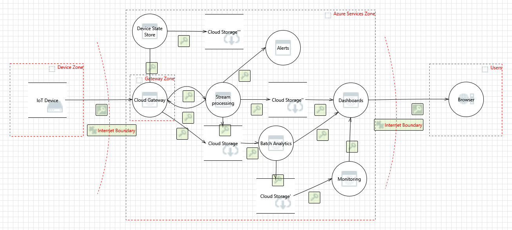

# Security

This chapter looks at security in the example Drone Delivery IoT application. It describes the threat model that our team performed and the mitigations that we identified. For an overview of using threat modeling in an IoT architecture, see [Internet of Things security architecture](https://docs.microsoft.com/en-us/azure/iot-fundamentals/iot-security-architecture).

Threat modeling is a process to identify potential security threats against a system and correct design-level security problems. There are many ways to perform a threat model. We recommend using the [Microsoft Threat Modeling Tool](https://docs.microsoft.com/en-us/azure/security/azure-security-threat-modeling-tool). This tool is based on the [STRIDE](https://docs.microsoft.com/en-us/azure/security/azure-security-threat-modeling-tool-threats) approach. STRIDE is a mnemonic device for six categoies of threat:  Spoofing, Tampering, Repudiation, Information discosure, Denial of service, and Elecvation of privilege.

## Data flow diageram

Start by decomposing a system into components. Then create a data flow diagram that shows data flows, data stores, processes, interactors (people or entities that interact with the system), and trust boundaries. A trust boundary is a boundary around subsystems that trust one another. Data coming from outisde of the boundary is not trusted unless it has been validated or authenticated. For example, in an IoT solution, there is a trust boundary between devices and the cloud gateway. The cloud gateway shouldn't trust data from a device that is not authenticated, and vice versa. 

The following image shows the data flow diagram for the Drone Delivery application:

## Threat model

The following tables summarize the threat model for the Drone Delivery application. 

### Processing (Compute)

| Zone | Component / interaction | Threat | Risk | Mitigation |
|------|-----------------------|--------|------|------------|
| Things | IoT devices to IoT Hub | S | Unauthorized device connects to IoT Hub | Device identity and authentication |
| Hot path, warm path, cold path | Message processing | E | SQL injection attacks and other code execution attacks. | Validate input. |

### Communication

| Zone | Component / interaction | Threat | Risk | Mitigation |
|------|-----------------------|--------|------|------------|
| Cold path | IoT Hub to Storage | S | Attacker spoofs the cloud gateway and routes data to another endpoint | IoT Hub uses security tokens, which are verified against shared access policies. Grant devices and services the minimum permissions needed. |
| &nbsp; | &nbsp; | T | Attacker tampers with data being written to storage. | Require [secure transfer](https://docs.microsoft.com/en-us/azure/storage/common/storage-require-secure-transfer) in Azure Storage. |
| &nbsp; | &nbsp; | R | Attacker alters or deletes raw device data. | Use [Azure logging and auditing](https://docs.microsoft.com/en-us/azure/security/azure-log-audit) to audit storage account usage. |
| &nbsp; | HDInsight to Storage | S | Attacker spoofs HDInsight credentials. | Join the HDInsight cluster to an [Active Directory domain](https://docs.microsoft.com/en-us/azure/hdinsight/domain-joined/apache-domain-joined-introduction). Follow principle of least privilege for authorization. |
| &nbsp; | &nbsp; | D | External agent interrupts data flow between storage and the HDInsight cluster. | Deploy the HDInsight cluster to a [virtual network](https://docs.microsoft.com/en-us/azure/hdinsight/hdinsight-extend-hadoop-virtual-network) (VNet) and use VNet [service endpoints](https://docs.microsoft.com/en-us/azure/virtual-network/virtual-network-service-endpoints-overview) to secure the storage account to the VNet. For more infornmation, see [Configure Azure Storage Firewalls and Virtual Networks](https://docs.microsoft.com/en-us/azure/storage/common/storage-network-security). |
| Warm path | Function to Cosmos DB | R | Attacker sends invalid position data to the Function app, which writes the data to Cosmos DB | Log all messages received so there is an audit trail. |
| &nbsp; | &nbsp; | D | External agent interrupts data flow between the Function app and Cosmos DB. | Deploy the Function app to an [App Service Environment](https://docs.microsoft.com/en-us/azure/app-service/environment/intro) (ASE). Use [service endpoints](https://docs.microsoft.com/en-us/azure/virtual-network/virtual-network-service-endpoints-overview) to secure Cosmos DB to the ASE virtual network. |
| &nbsp; | Storage | T | Attacker tampers with data being written to storage. | Require secure transfer in Azure Storage. Use a VNet service endpoint to secure the Storage account to the ASE virtual network. (Note: The Event Hub trigger in Azure Functions uses Storage for checkpointing.) |
| Hot path | Stream Analytics | R | Attacker sends invalid data to Stream Analytics to spoof a sensor anomaly. | Enable diagnostic logs. |
| &nbsp; | Stream Analytics to Cosmos DB  | D | External agent interrupts the flow of data between Stream Analytics and Cosmos DB | Configure Cosmos DB to deny connections from outside the Azure datacenters. See [Azure Cosmos DB firewall support](https://docs.microsoft.com/en-us/azure/cosmos-db/firewall-support#connections-from-global-azure-datacenters-or-azure-paas-services).

### Storage

