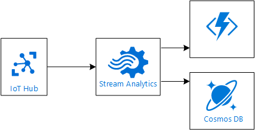
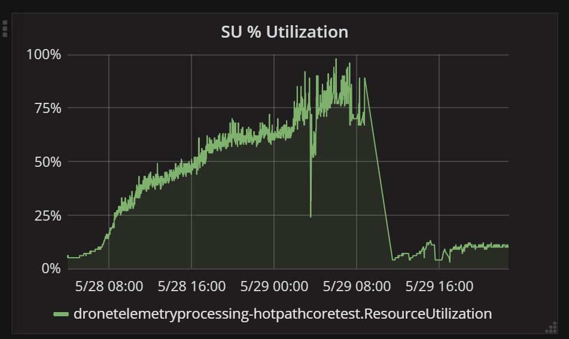

# Stream processing for IoT using Azure Stream Analytics

This chapter describes using Azure Stream Analytics to perform hot-path processing in an IoT solution. 



As described in the [Introduction](./index.md) to this series, the Drone Delivery application has the following functional requirements for hot-path processing:

- Analyze aggregations of telemetry over time windows.
- Use the analysis to trigger alerts.
- Write the output to a data store.

Non-functional requirements include:

- Low latency.
- Ability to scale with the number of devices.

Azure Stream Analytics is an event-processing engine that allows you to examine high volumes of data streaming from devices. It supports queries that operate over time windows, and has built-in integration with IoT Hubs.

## Stream Analytics query

Stream Analytics uses a SQL-like query language to define stream processing operations. Here is the query for the Drone Application hot path:

```sql
WITH
AvgTumblingWindows AS 
(
SELECT 'hotTemperature' AS message,
          partitionid,
           deliveryid,
           deviceid,
           AVG(temperature) AS [avgtemperature],
           MAX(TRY_CAST(eventenqueuedutctime AS DATETIME)) AS lastenqueuedutctime ,
           MAX(TRY_CAST(occurrenceutctime AS DATETIME)) AS lastoccurrenceutctime,
           MAX(TRY_CAST(eventprocessedutcTime AS DATETIME)) AS lastprocessedutctime
    FROM droneTelemetry
    TIMESTAMP BY occurrenceutctime OVER deviceid,partitionid
    PARTITION BY PartitionId
    WHERE  sensortype='drone-state-sensor;v1'
    GROUP BY TumblingWindow(second, 180),
             deviceid,
             deliveryid,
             partitionid
    HAVING   
        [avgtemperature] >= 75

)
SELECT * 
INTO hotTelemetry
FROM AvgTumblingWindows
PARTITION BY PartitionId

SELECT *
INTO alertHotTelemetry
FROM AvgTumblingWindows
PARTITION BY PartitionId
WHERE 
ISFIRST(mi, 5) OVER (PARTITION BY deviceid,partitionid) = 1
```

This query looks for drones that are running unusually hot. 

- The first SELECT statement looks at a 3-minute tumbling window, to find any devices where the avarage temperature reading exceeds 75 degrees over that time window. 
- The second SELECT statement sends the complete set of "hot" readings to an output. This output gets written to Cosmos DB, so there is a record of all the hot sensor readings.
- The third SELECT statement filters out everything except for the first "hot" reading per device, within a 5-minute window. These events are sent to an Azure Function, which triggers an alert. 

## Parallelization

Stream Analytics jobs scale best if they are parallel at all points in the Stream Analytics pipeline, from input to query to output. A fully parallel jobs allows Stream Analytics to split the work across multiple compute nodes. Otherwise, Stream Analytics has to combine all of the stream data into one place.

The basic idea is to partition the input stream, and then use the same partitioning scheme throughout the rest of the pipeline (query and output)

IoT Hub automatically partitions device messages based on the device ID. All of the messages from a particular device will always arrive on the same partition, but a single partition will have messages from multiple devices. Therefore, the unit of parallelization is the partition ID, which is exposed in the Stream Analytics job as the `PartitionId` property. 

To ensure the query is parallel, do the following:

- Use `PARTITION BY PartitionId` in all steps of the query.
- If you use a `GROUP BY` clause, include the partition ID as part of the grouping. Note that `GROUP BY` is required for queries that use time windowing.

For the output, partitioning depends on the type of output. In the Drone Delivery application, the hot path has two outputs: Azure Functions for alerts, and Cosmos DB to store the output results. 

Azure Functions are inherently parallel. Each partition will be assigned a Function instance. For Cosmos DB, explicitly specify the partition key when you create the collection. The partition key ensures that documents will be distributed across the physical partitions. 

Even if your query requires a non-parallel step, sometimes you can break a query into steps, in such as way that step 1 is partitioned, and step 2 groups the result of step 1. For an example of this approach, see [Scale an Azure Stream Analytics job to increase throughput](https://docs.microsoft.com/en-us/azure/stream-analytics/stream-analytics-scale-jobs). 

For more information about parallelism in Azure Stream Analytics, see [Leverage query parallelization in Azure Stream Analytics](https://docs.microsoft.com/en-us/azure/stream-analytics/stream-analytics-parallelization).

## Working with timestamps

An event coming into Stream Analytics always has a timestamp, which is exposed as the System.Timestamp field.

```sql
SELECT System.Timestamp t 
```

By default, Stream Analytics sets the timestamp equal to the event's arrival time &mdash; that is, the time when the event reached IoT Hub. This value is exposed as a message property called `EventEnqueuedUtcTime`, so by default, `System.Timestamp` equals `EventEnqueuedUtcTime`.

Many IoT devices provide a timestamp as part of the message payload. The device timestamp can diverge from the arrival time, depending on factos such network latency, how often the device sends telemetry data, and clock skew between the device clock and the cloud. For occasionally connected devices, the difference can be significant, due to late arrival of messages.

In some scenarios, it might be important to process based on device timestamp, rather than arrival time. You can tell Stream Analytics to use the device's timestamp as the value of `System.Timestamp`. You do this by including the `TIMESTAMP BY` clause in the query. This clause specifies which field in the message payload contains the timestamp. 

> [!NOTE]
> In the Stream Analytics documentation, the `TIMESTAMP BY` clause is called *application time*. For IoT scenarios, that generally means the device clock, or possibly a clock on the field gateway. 

Whether to use `TIMESTAMP BY` depends on your scenario. For example, if you are looking for general trends in the data over time, the difference beteeen the device's timestamp and the arrival time might not matter. In other scenarios, you might need to correlate events to the actual time when the event was recorded by the sensor in the device, rather than the arrival time. 

## Clock skew and out-of-order events

Often, devices have their own clocks that are not synchronized. As a result, there can be a lot of clock skew between two devices. Two devices could take a sensor reading at exactly the same time, yet produce very different time stamps. 

If you are processing the data from each device independently, this clock skew shouldn't matter. However, it becomes a big challenge if your processing tries to correlate readings from multiple devices. If there is significant clock skew, the events from two devices can appear to be wildly out of order. 

Stream Analytics can handle events arriving out of order, up to a certain window of tolerance, which is configurable. Within this tolerance, Stream Analytics will buffer incoming events and re-order any events that arrive out of order. 

If an event arrives out-of-order past the tolerance window, Stream Analytics does one of two things, based on a policy setting:

- Drops the event 
- Adjusts the timestamp so that it falls within the tolerance

The first option can result in losing telemetry data. The second option means you won't lose the data, but you may lose timestamp fidelity.

Ideally, all events would arrive within the tolerance window. However, the window adds latency to the output stream, because Stream Analytics has to wait and buffer events, so that it can perform any re-ordering that's needed. 

If all device clocks were perfectly synchronized, then you would expect events to arrive mostly in order, with some variance due to unpredicatable network latencies. But in the real world, device clocks aren't always synchronized. And then the discrepancy is likely to exceed any practical tolerance window. 

By including the `OVER` keyword in a `TIMESTAMP BY` clause, you tell Stream Analytics to treat every device as a separate timeline for purpose of event ordering. Using this approach, the out-of-order tolerance is applied within a single device's event stream. If you expect all of the events from a single device to arrive in order (with respect to each other), you can use the `OVER` clause and set the out-of-order tolerance to zero.

However, there a caveat: You can't query across devices if you use `TIMESTAMP BY ... OVER` with device ID. Also, the `OVER` clause adds to the SU consumption of the query, so make sure to profile your queries.

If you find that using the `OVER` clause isn't practical for your scenario, consider using the arrival time instead of the the device clock. Alernatively, use device clock and set a reasonable out-of-order tolerance (say, two minutes). Then set the out-of-order policy to "Adjust", instead of "Drop", to avoid losing data from devices with late clocks.

Here is a Stream Analytics query that measures the difference between device timestamp and arrival time:

```sql
SELECT DATEDIFF(second, CAST(deviceTimestamp AS DATETIME), CAST(eventenqueuedutctime AS DATETIME))
```

This can be a useful metric to understand why events are being dropped or adjusted. Also monitor the Late Input Events and Out of Order Events metrics in Azure Monitor.

## Late and early messages

When using device timestamps, messages can arrive late relative to the arrival time. 

Example: At 12:00, IoT Hub receives an event with a timestamp of 11:55. The message is 5 minutes late. This could be caused by clock skew (the device clock is slow) or because the message is really 5 minutes old. Unfortunately there's no way tell just by looking at the timestamp.

Messages can also arrive early, meaning they appear to come from the future!

Example: At 12:00, IoT Hub receives an event with a timestamp of 12:05. This represents a device with a clock that is running fast. 

For late messages, Stream Analytics applies a lateness policy:

-	Within a specified tolerance window, Stream Analytics will wait for late messages before processing output. A large window can increase latency. 
-	If a message arrives later than the maximum tolerance, Stream Analytics adjusts the timestamp so that it appears to be within the tolerance, and processes the message. 

For early message, Stream Analytics has a 5-minute tolerance. If an event is more than 5 minutes early, Stream Analytics uses the out-of-order policy and either drops the event or adjusts the time stamp.

## Scaling considerations

Assuming a Stream Analytics job is fully parallel, you can allocate 6 SUs for each partition per query step, up to a hard limit of 120 SUs per job. There is also a soft limit on the number of SUs per subscription per region, but this limit can be raised by opening a support ticket. For more information, see [Azure limits](https://docs.microsoft.com/en-us/azure/azure-subscription-service-limits).

In our testing, the hot path could handle about 6K telemetry messages per second. Of course, performance depends on a lot of factors, including the complexity of the queries and the number of partitions. 

When you monitor a Stream Analytics job, look for the following warning signals:

- High SU utilization. 
- The number of input/output events drops to zero. This can be a sign that the job stopped processing, which might be caused by resource exhaustion.
- The input events backlog. This metric is available through the [job diagram](https://docs.microsoft.com/en-us/azure/stream-analytics/stream-analytics-job-diagram-with-metrics).

The following graph shows a Stream Analytics job that approaches 100% SU utilization. You should aim to have the SU metric below 80% to account for occasional spikes. For more information, see [Understand and adjust Streaming Units](https://docs.microsoft.com/en-us/azure/stream-analytics/stream-analytics-streaming-unit-consumption).



