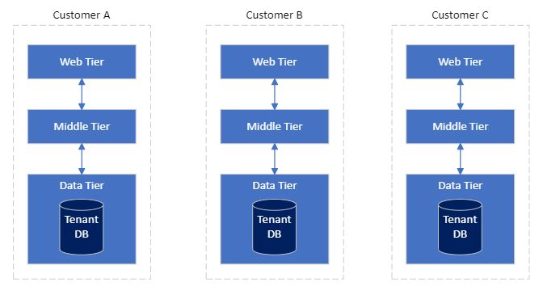
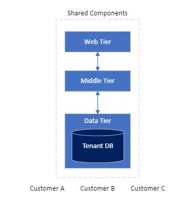

In a Software as a Service (SaaS) model, each of your customers are a tenant of your application. Each tenant pays for access to the SaaS application by paying a subscription fee. This article describes the application tenancy models available to SaaS application builders.

When designing a SaaS application, you must choose the application tenancy model that best fits the needs of your customers and your business. In general, the application tenancy model doesn't impact the functionality of an application. But it likely impacts other aspects of the overall solution including scale, tenant isolation, cost per tenant and operation complexity.

## What are application tenancy models

The sections below explore the concepts of single, mixed, and multi-tenant application models.

### Single tenant

In the single tenant model, a single dedicated instance of an application is deployed for each customer. For example, with a N-tier architecture style application, all customers get a new dedicated instance of the web, middle, and data tiers. These tiers are not shared between these customers.

### Mixed tenant

In this model, one or more parts of an application are deployed as dedicated for each customer, and the rest is shared between all customers. For example, with a N-tier architecture style application the web and middle tiers are shared between all customers. However, a dedicated data tier and database is provisioned for each customer.

### Multitenant

In this model, a single instance of the application is deployed for all customers and shared amongst them. For example, with a N-tier architecture style application, the web, middle and data tiers are shared between all customers.

A combination of these models can be provided for customers with different needs. For example, your basic tier of service would run on a shared multitenant instance of your application. As a baseline, your customers can access your app with lower performance or limited functionality for a lower cost. On top of this baseline, a dedicate service tier could run on a single tenant model. For customers that need higher performance or additional functionality, you can provide an isolated instance of your application for a higher cost.

See our detailed guidance:
- [Architectural approaches for storage and data in multitenant solutions](/azure/architecture/guide/multitenant/approaches/storage-data)
- [Multitenancy and Azure SQL Database](/azure/architecture/guide/multitenant/service/sql-database)
- [Multitenancy and Azure Storage](/azure/architecture/guide/multitenant/service/storage)

## Compare application tenancy models

In general, the tenancy model doesn't impact the functionality of an application, but it likely impacts other aspects of the overall solution. The following table summarizes the differences between the application tenancy models:

Measurement | Single Tenant | Mixed | Multitenant
| ------------ | ------------ | ------------- | ------------
Scale | Medium | High | Very High
Tenant isolation | Very High | High | Low
Cost per tenant | High | Medium | Low
Operational complexity | *Low-High* - Individually simple, complex at scale. | *Low-Medium* - Need to address complexity at scale. | *Low-High* - Individual tenant management is complex.

The measurement terms are as detailed below:

**Scale:** The number of concurrent customers (or tenants) your application can service.

**Tenant isolation:** The degree in which customers' data and performance is separated from other customers.

**Cost per tenant:** The relative amount it costs to run a single customer's tenant.

**Operational complexity:**  How complex it is to achieve operational tasks like automation, security, monitoring, maintenance, metering, application deployments, disaster recovery/BCP.

In general, the single tenancy application model and a small number of tenants, are simpler to manage. With a large number of tenants, it can become highly complex without strong operational excellence practices. Conversely, in the multitenancy application model, it is easier to manage the system as a whole, but highly complex when you want to manage an individual customer tenant by itself, without strong operational excellence practices.

## Additional considerations

Once you know the customer's needs and business goals, start asking these questions:

- Do I operate in a highly regulated industry that requires customers data to be isolated from other customers?
- Am I looking to rapidly scale my application to many thousands of clients?
- Am I concerned about how much it costs to run each tenant/customer instance?

The answers to these questions will help you refine your tenancy requirement.

## Contributors

*This article is maintained by Microsoft. It was originally written by the following contributors.*

Principal author:

 - [Michael Friedrich](https://www.linkedin.com/in/1michaelfriedrich/) | Senior Partner Tech Manager

*To see non-public LinkedIn profiles, sign in to LinkedIn.*

## Next steps

Read more about application tenancy patterns in [Multi-tenant SaaS database tenancy patterns](/azure/azure-sql/database/saas-tenancy-app-design-patterns).

## Related resources

See our architectural guidance for multitenant solutions:

- [Architect multitenant solutions on Azure](/azure/architecture/guide/multitenant/overview)
- [Tenancy models to consider for a multitenant solution](/azure/architecture/guide/multitenant/considerations/tenancy-models)
- [Architectural approaches for storage and data in multitenant solutions](/azure/architecture/guide/multitenant/approaches/storage-data)
- [Multitenancy and Azure SQL Database](/azure/architecture/guide/multitenant/service/sql-database)
- [Multitenancy and Azure Storage](/azure/architecture/guide/multitenant/service/storage)
