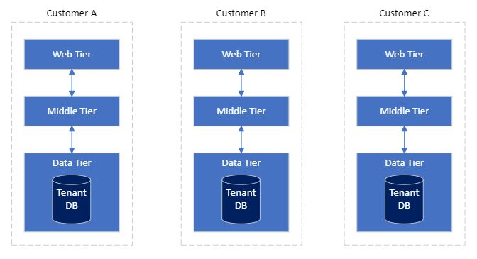

This article describes the application tenancy models available to Software as a Service (SaaS) application builders.

When designing a SaaS application, you must choose the application tenancy model that best fits the needs of your customers and your business. In general, the application tenancy model doesn't impact the functionality of an application. But it likely impacts other aspects of the overall solution including Scale, Tenant Isolation, Cost per tenant and operation complexity.

## Application tenancy models explained ##

Below we further explore the concepts of Single, Mixed and Multi tenant application models;

### Single Tenant ###

You deploy a single dedicate instance of your application for each customer. For example, with a N-tier architecture style application, all customers get a new dedicate instance of the Web, Middle and Data tiers. They don't share tiers with any other customer.

### Mixed Tenant ###

You deploy one or more parts of your application that is dedicated for each customer and the rest is shared between all of your customers. For example, with a N-tier architecture style application the Web and Middle tiers are shared between all customers. But you provision a new dedicated data tier (and database) for each customer.

### Multi Tenant ###

You deploy a single instance of your application that all of your customers share with each other. For example, with a N-tier architecture style application, the Web, Middle and Data tiers are shared between all customers.

But you don’t need to feel that you are locked into a single application tenancy model. You might provide a combination of these models for your customers with different needs. For example, your basic tier of service would run on a shared Multi-Tenant instance of your application. So you can provide your customers' access to your app which lower performance characteristics or limited functionality for a lower cost. But your dedicate service tier would run on a Single Tenant model. So you can provide you customers an isolated instance of your application that has higher performance characteristics or additional functionality for a higher cost.

## Application tenancy models compared ##

In general the tenancy model doesn't impact the function of an application, but it likely impacts other aspects of the overall solution. The following table summarizes the differences between the Application tenancy models;

x | Single Tenant | Mixed | Multi-Tenant
| ------------ | ------------ | ------------- | ------------
Scale | Medium | High | Very High
Tenant Isolation | Very High | High | Low
Cost per Tenant | High | Medium | Low
Operational Complexity | *Low-High* - Individually simple, complex at scale. | *Low-Medium* - Need to address complexity at scale. | *Low-High* - Individual tenant management is complex.

**Scale:** The number of concurrent customers (tenants) your application can service.

**Tenant Isolation:** The degree in which customers data and performance is separated from other customers.

**Cost per Tenant:** The relative amount it costs to run a single customer's tenant.

**Operational complexity:**  How complex it is to achieve operational tasks like; automation, security, monitoring, maintenance, metering, application deployments, disaster recovery/BCP.

With the Single Tenancy application model and a small number of tenants, in general it's less complex to manage. But with a large number of tenants it can become highly complex without strong operational excellence practices. Conversely, with the multi-tenancy application model it is less complex to manage the system as a whole. But highly complex when you want to manage an individual customer tenant by itself without strong operational excellence practices.

## Additional Considerations ##

So if we take into consideration our customer needs and business goals, we can start to ask ourselves these questions;

- Do I operate in a highly regulated industry that requires customers data to be isolated from other customers?
- Am I looking to rapidly scale my application to many thousands of clients?
- Am I concerned about how much it’s costs to run each tenant/customer instance?
