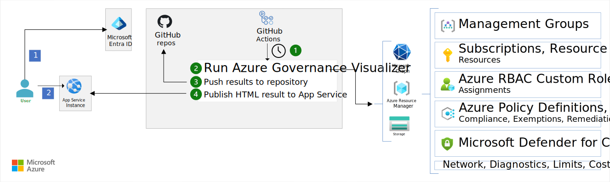

This article describes how to deploy the Azure Governance Visualizer. Organizations can use the Azure Governance Visualizer to capture pertinent governance information about their Azure tenants. The tool captures:

- Management group hierarchy.
- Policy information, such as custom policy definitions, orphaned custom policy definitions, and policy assignments.
- Azure role-based access control (Azure RBAC) information, such as custom role definitions, orphaned custom role definitions, and role assignments.
- Azure security and best practice analysis.
- Microsoft Entra ID insights.

The Azure Governance Visualizer should be automated through GitHub workflows. The visualizer outputs the summary as HTML, MD, and CSV files. Ideally, the generated HTML report is made easily accessible to authorized users in the organization. This article shows you how to automate running the Azure Governance Visualizer and host the reporting output securely and cost effectively on the Web Apps feature of Azure App Service.

An example implementation is available on GitHub at [Azure Governance Visualizer implementation](https://github.com/Azure/Azure-Governance-Visualizer-Accelerator).

## Architecture

*Download a [Visio file](https://arch-center.azureedge.net/azure-governance-visualizer-accelerator.vsdx) of this architecture.*

## Data flow

The solution architecture implements the following workflow:

1. A timer triggers the GitHub Actions flow.
1. The flow makes an OpenID Connect connection to Azure. It then runs the Azure Governance Visualizer tool. The tool collects the required insights in the form of HTML, MD, and CSV reports.
1. The reports are pushed to the GitHub repository.
1. The HTML output of the Azure Governance Visualizer tool is published to App Service.

### User flow

This flow explains how a user can use the tool:

1. The user browses to the App Service URL to access the HTML report of the visualizer. The user is required to authenticate through Microsoft Entra ID authorization.
1. The user can review the insights provided by the visualizer.

## Components

The automation presented in this scenario consists of the following components:

- [Microsoft Entra ID](/entra/fundamentals/whatis) is an enterprise identity service that provides single sign-on, multifactor authentication, and other identity services to protect against cybersecurity threats. In this architecture, it's used to provide secure authentication and authorization to the Azure Governance Visualizer's web app to a specific Entra ID group.

- [Azure App Service](/azure/well-architected/service-guides/app-service-web-apps) is a fully managed platform for creating and deploying cloud applications. It lets you define a set of compute resources for a web app to run, deploy web apps, and configure deployment slots. In this architecture, it's used to host the output of the Azure Governance Visualizer to provide secure and smooth access across the organization.

- [GitHub](https://docs.github.com/) is a popular SaaS offering from Microsoft that is frequently used by developers to build, ship, and maintain their software projects. In this architecture, it's used to host the infrastructure-as-code for the solution and the GitHub actions used to deploy and maintain it.

- [GitHub Actions](/azure/developer/github/github-actions) is a continuous integration and continuous delivery (CI/CD) platform that allows you to automate your build, test, and deployment pipeline. In this architecture, it provides continuous integration and continuous deployment capabilities to deploy and update the Azure Governance Visualizer.

## Alternatives

The Azure Governance Visualizer is a PowerShell script, which can be run directly on a local machine. The visualizer can be configured to run as part of GitHub Actions to receive up-to-date information about your environment. The visualizer produces a wiki as an output that can be published in GitHub or Azure DevOps.

## Scenario details

Azure Governance Visualizer is a PowerShell-based script that iterates your Azure Tenant´s Management Group hierarchy down to subscription level. It captures most relevant Azure governance capabilities, such as Azure Policy, Azure RBAC, Microsoft Entra ID, and Blueprints. From the collected data, Azure Governance Visualizer visualizes all of this information in an easy to navigate HTML report.

## Considerations

These considerations implement the pillars of the Azure Well-Architected Framework, which is a set of guiding tenets that can be used to improve the quality of a workload. For more information, see [Microsoft Azure Well-Architected Framework](/azure/well-architected/).

### Security

Security provides assurances against deliberate attacks and the abuse of your valuable data and systems. For more information, see [Overview of the security pillar](/azure/architecture/framework/security/overview).

Restricting the reporting HTML to only those users authorized to view this data is important. This data is a gold mine for both insider and external threats, as it exposes your Azure landscape, including security controls.

- Use Microsoft Entra authentication to restrict access to authorized individuals. Consider using Web Apps authentication to provide this service. The deployment code in GitHub configures Web Apps and actively verifies that authentication is enabled before deploying.

- Consider applying network security controls to expose the site to your team only over a [private endpoint](/azure/private-link/private-endpoint-overview). And to restrict traffic, consider using the IP restrictions of Web Apps.

- Enable access logging on the Azure web app to be able to audit access. Configure the Azure web app to send those logs to a Log Analytics workspace.

- Ensure secure communication is enabled on the Azure web app. Only HTTPS and FTPS are allowed, and the minimum version of TLS is configured as 1.2.

- Consider using [Microsoft Defender for Cloud's Microsoft Defender for App Service](/azure/defender-for-cloud/defender-for-app-service-introduction).

- Use the [latest versions of the runtime stack](/azure/app-service/language-support-policy?tabs=windows) of the Azure web app.

- Make sure to rotate the secret of this service principal regularly and monitor its activity. To gather all the required information, the visualizer deployed depends on a service principal with Microsoft Entra ID permissions.

For more information about security controls, see [Azure security baseline for App Service](/security/benchmark/azure/baselines/app-service-security-baseline).

### Cost optimization

Cost optimization is about looking at ways to reduce unnecessary expenses and improve operational efficiencies. For more information, see [Overview of the cost optimization pillar](/azure/architecture/framework/cost/overview).

- The B1 (Basic) tier is used for the deployed Azure web app in App Service. App Service hosts the HTML output of the Azure Governance Visualizer tool so it's lightweight. The visualizer can also be hosted on any other hosting platform that is secure and also cost-effective.

- Use the Azure pricing calculator to see a [pricing estimate for this solution](https://azure.microsoft.com/pricing/calculator/?shared-estimate=61029210b61b4cce8602cb905d7c0dda).

- The sample in GitHub only deploys one instance of App Service, but you can choose to deploy more if needed.

### Operational excellence

Operational excellence covers the operations processes that deploy an application and keep it running in production. For more information, see [Overview of the operational excellence pillar](/azure/architecture/framework/devops/overview).

- The solution consists mainly of an Azure web app that hosts the HTML output of the visualizer tool. We recommend you enable the diagnostic settings of the web app to monitor traffic, access audit logs, metrics, and more.

- It's important to monitor the performance of the web app. Doing so helps to identify if you need to scale up or scale out depending on the amount of visualizer usage.

- It's also important to always run the [latest versions of the runtime stack](/azure/app-service/language-support-policy?tabs=windows) of the Azure web app.

- The Azure Governance Visualizer updates versions regularly with new features, bug fixes, or improvements. In the GitHub repository, a dedicated GitHub workflow handles the update process. There's a configurable option to update the visualizer's code automatically or manually by just opening a pull request with changes you can review and merge.

- The accelerate code might get updated with new settings on the App Service bicep code or with new instructions for the visualizer prerequisites. In the GitHub repository, a dedicated GitHub workflow handles this update process. There's a configurable option to update the visualizer's code automatically or manually by just opening a pull request with changes you can review and merge.

## Deploy this scenario

To deploy this scenario, see the [Azure Governance Visualizer deployment GitHub repository](https://github.com/Azure/Azure-Governance-Visualizer-Accelerator).

## Contributors

*This article is maintained by Microsoft. It was originally written by the following contributors.*

Principal authors:

- [Seif Bassem](https://www.linkedin.com/in/seif-bassem) | Cloud Solution Architect

*To see nonpublic LinkedIn profiles, sign in to LinkedIn.*

## Next steps

- [Azure Governance Visualizer deployment GitHub repository](https://github.com/Azure/Azure-Governance-Visualizer-Accelerator)
- [Azure Governance Visualizer Open Source project](https://github.com/Azure/Azure-Governance-Visualizer)

## Related resources

- [Azure landing zone overview](/azure/cloud-adoption-framework/ready/landing-zone/)
