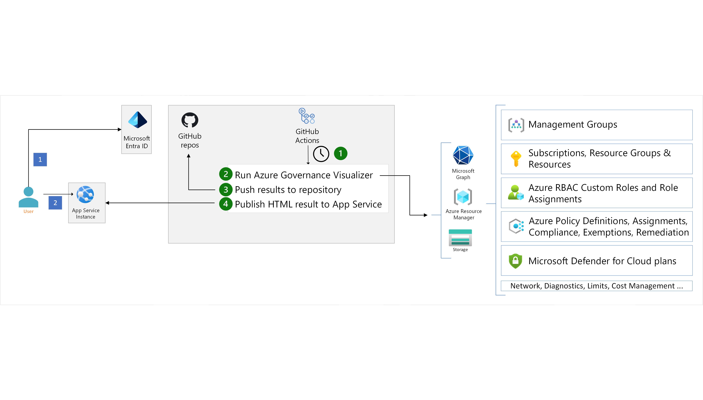

This article provides implementation guidance for the [Azure Governance Visualizer accelerator](https://github.com/Azure/Azure-Governance-Visualizer-Accelerator) (AzGovViz). [Azure Governance Visualizer](https://github.com/azure/azure-governance-visualizer) is a PowerShell based script that iterates your Azure Tenant´s Management Group hierarchy down to Subscription level and resources within each. It captures most relevant Azure governance capabilities such as Azure Policy, RBAC and Blueprints and a lot more. From the data collected Azure Governance Visualizer provides visibility on your HierarchyMap, creates a TenantSummary, creates DefinitionInsights and builds granular ScopeInsights on Management Groups and Subscriptions.

This accelerator speeds up the adoption of AzGovViz into your environment by providing:

- Automation to configure the prerequisites for AzGovViz
- An easy and fast deployment process using GitHub actions
- Automation to deploy and publish AzGovViz to an Azure App Service in your subscription

## Architecture

*Figure 1. Azure Governance Visualizer accelerator architecture.*

## Components

The accelerator is based on a GitHub template repository that consists of the following:

- Guidance on how to prepare and configure the needed prerequisites to deploy the accelerator.
- PowerShell scripts to automate the configuration of your environment.
- GitHub actions to deploy and update the Azure Governance Visualizer tool.
- GitHub actions to deploy and update the accelerator's resources like the Azure Web App hosting the Azure Governance Visualizer output.

## prerequisites

The accelerator requires some prerequisites to be configured before deploying:

- **Service principals:** Multiple service principals are required to run the Azure Governance Visualizer tool with the necessary permissions and to configure Microsoft Entra ID authentication for the Azure App Service to access the tool output securely.
- **Private GitHub repository:** Azure Governance Visualizer requires the creation of a private GitHub repository to host the output of the tool. Multiple GitHub actions secrets and variables are required to properly and securely configure continuous deployment to your Azure environment via OpenID Connect.
- **Azure requirements:** Azure resource group creation to host the Azure App Service and the needed least-privilege Azure role-based access controls.

## Deployment

The deployment of the accelerator is implemented through four GitHub actions. The GitHub acitons use the secrets and variables defined in the prerequisites stage to:

- Deploy an App Service Plan and an Azure Web app to a resource group.
- Configure Microsoft Entra ID authentication on the Azure Web app
- Deploy the Azure Governance Visualizer PowerShell script with the needed configuration
- Publish the output of the tool to the Azure Web app so it's securely accessed.
- Schedule a recurring GitHub Action to check and sync newer versions of Azure Governance Visualizer.
- Schedule a recurring GitHub Action to check and sync newer versions of Azure Governance Visualizer accelerator.

## Next steps

From the collected data AzGovViz provides visibility on your **HierarchyMap**, creates a **TenantSummary** on Management Groups and Subscriptions. Some of the information exposed by the tool:

- Azure Policy
- Role-Based Access Control (RBAC)
- Blueprints
- Hierarchy of Management Groups
- Subscriptions, Resources & Defender
- Networking
- Diagnostics
- Limits
- Microsoft Microsoft Entra ID
- Consumption
- Change tracking

For more information, see:

- [Azure Governance Visualizer accelerator](https://github.com/Azure/Azure-Governance-Visualizer-Accelerator)
- [Azure Governance Visualizer](https://github.com/JulianHayward/Azure-MG-Sub-Governance-Reporting)
