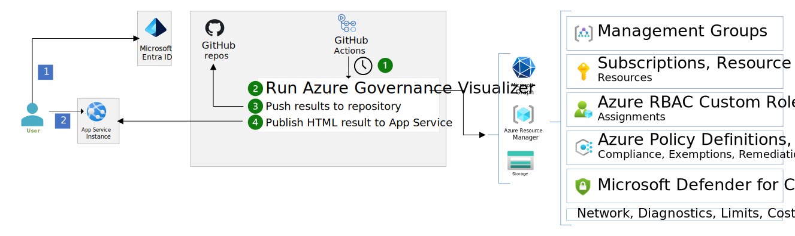

Organizations use the Azure Governance Visualizer to capture pertinent governance information about their Azure tenants. The tool captures:

- Management group hierarchy.
- Policy information such as custom policy definitions, orphaned custom policy definitions, and policy assignments.
- RBAC information such as custom role definitions, orphaned custom role definitions, and role assignments.
- Azure security and best practice analysis.
- Microsoft Entra ID insights.

The Azure Governance Visualizer accelerator runs the visualizer in an automated way through Azure pipelines or GitHub actions. The visualizer outputs the summary as HTML, MD, and CSV files. Ideally, the generated HTML report would be easily accessible to authorized users in the organization. This article shows how to automate running the Azure Governance Visualizer and host the reporting output securely and cost effectively on Azure Web Apps.

An example implementation is available on GitHub at [Azure Governance Visualizer accelerator](https://github.com/Azure/Azure-Governance-Visualizer-Accelerator).

## Architecture

*Figure 1. Azure Governance Visualizer accelerator architecture.*

## Workflow

### Data flow

The solution architecture implements the following workflow:

1. A timer triggers the GitHub Actions flow.
2. The flow makes an OpenID Connect connection to Azure. It then runs the Azure Governance Visualizer (AzGovViz) tool. The tool collects the required insights in the form of HTML, MD and CSV reports.
3. A GitHub workflow is triggered to deploy the Azure Governance Visualizer (AzGovViz) tool. This workflow runs the tool once it's deployed to start collecting all the needed insights from your tenant.
4. The output of the AzGovViz tool in HTML format is published to the created Azure web app that is protected by Entra ID authentication.

### User flow

This flow explains how a user would use the tool:

1. The user browses to the Azure web app Url to access the html report of the visualizer.
2. The user can start drilling down through the various insights provided by the visualizer.

## Components

The accelerator is based on a GitHub template repository that consists of the following components:

- [Microsoft Entra ID](https://azure.microsoft.com/products/active-directory) is an enterprise identity service that provides single sign-on, multifactor authentication, and conditional access.output.
- [Azure App Service](https://azure.microsoft.com/services/app-service) is a fully managed platform for creating and deploying cloud applications. It lets you define a set of compute resources for a web app to run, deploy web apps, and configure deployment slots.
- [GitHub](https://docs.github.com/) is a popular SaaS offering from Microsoft that is frequently used by developers to build, ship, and maintain their software projects
- [GitHub Actions](https://learn.microsoft.com/azure/developer/github/github-actions) provides continuous integration and continuous deployment capabilities in this architecture.

## Alternatives

- The Azure Governance Visualizer is a powerShell script, which can be run directly on a local machine. The visualizer can be configured to run as part of a GitHub Action or Azure DevOps pipeline to receive up-to-date information about your environment. The visualizer produces a wiki as an output that can be published in GitHub or Azure DevOps.

- The visualizer can also be hosted on any other hosting platform that is secure and also cost-effective like [Azure Static Web Apps](https://learn.microsoft.com/azure/static-web-apps/overview).

## Scenario

Azure Governance Visualizer is a PowerShell based script that iterates your Azure Tenant´s Management Group hierarchy down to Subscription level. It captures most relevant Azure governance capabilities such as Azure Policy, RBAC, Microsoft Entra ID and Blueprints and a lot more. From the collected data, Azure Governance Visualizer visualizes all of this information in an easy to navigate HTML report.

## Considerations

These considerations implement the pillars of the Azure Well-Architected Framework, which is a set of guiding tenets that can be used to improve the quality of a workload. For more information, see [Microsoft Azure Well-Architected Framework](https://learn.microsoft.com/azure/architecture/framework).

### Security

Protecting the reporting HTML to only those users authorized to view this data is important as this data is a gold mine for both insider and external threats, as it exposes your Azure landscape, including security controls.

- It is recommended to use Microsoft Entra authentication to restrict access to those individuals. Consider using Azure Web Apps authentication to provide this service. In the accelerator, the deployment configures to Azure Web Apps actively verifies that authentication is enabled before deploying.

- Consider leveraging network security controls to expose the site only over a [private endpoint](https://learn.microsoft.com/azure/private-link/private-endpoint-overview) to your team. Also consider the use of IP restrictions of Azure Web Apps to restrict traffic.

- Access logging should be enabled on the Azure Web App to be able to audit access. Configure the Azure Web App to send those logs to a Log Analytics workspace.

- Ensure secure communication is enabled on the Azure Web App. In the accelerator, only HTTPS and FTPs are allowed and the minimum version of TLS is configured as 1.2.

- Consider using Microsoft Defender for Cloud's Microsoft Defender for App Service.

- Use the [latest versions of the runtime stack](https://learn.microsoft.com/azure/app-service/language-support-policy?tabs=windows) of the Azure Web App.

- This visualizer deployed by this accelerator depends on a service principal with Entra ID permissions to be able to gather all the required information, make sure to rotate the secret of this service principal on a regular cadence and monitor its activity.

- See also [more security recommendations](https://learn.microsoft.com/azure/app-service/security-recommendations) for more security controls.

### Cost optimization

Cost optimization is about reducing unnecessary expenses and improving operational efficiencies. For more information, see Overview of the [cost optimization pillar](https://learn.microsoft.com/azure/architecture/framework/cost/overview).

- Azure App Service: The B1 (Basic) tier is used for the deployed Azure web app. This app service hosts the HTML output of the Azure Governance Visualizer tool so it's lightweight.

- The accelerator only deploys one instance of Azure App Service but you can choose to deploy more if needed.

### Operational excellence

- The accelerator consists mainly of an Azure Web App that hosts the HTML output of the visualizer tool. It is recommended to enable the diagnostic settings of the web app to monitor traffic, access audit logs, metrics and more.

- It's also important to monitor the performance of the web app. This helps to identify if you need to scale up or scale out depending on the amount of visualizer usage.

- Always stay on the [latest versions of the runtime stack](https://learn.microsoft.com/azure/app-service/language-support-policy?tabs=windows) of the Azure Web App.

- The Azure Governance Visualizer gets new versions regularly with new features, bug fixes or improvements. In the accelerator, the update process is handled by a dedicated GitHub workflow. This logic is implemented by a configurable option to update the visualizer's code automatically or manually by just opening a pull request with the changes for you to review and merge.

- The accelerate code might get updated with new settings on the Azure App service bicep code or new instructions for the visualizer prerequisites. In the accelerator, a dedicated GitHub workflows handles this update process. This logic is implemented by a configurable option to update the accelerator's code automatically or manually by just opening a pull request with the changes for you to review and merge.

## Deploy this scenario

To deploy this scenario, navigate to this [Azure Governance Visualizer accelerator](https://github.com/Azure/Azure-Governance-Visualizer-Accelerator).

## Contributors

This article is maintained by Microsoft. It was originally written by the following contributors.

Principal author:

Seif Bassem | Cloud Solution Architect

## Next steps

- [Azure Governance Visualizer accelerator](https://github.com/Azure/Azure-Governance-Visualizer-Accelerator)
- [Azure Governance Visualizer](https://github.com/Azure/Azure-Governance-Visualizer)
