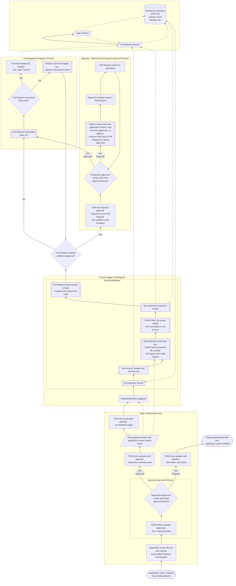

```mermaid
graph BT
    Start([Application Owner requires <br> Azure Subscription/s])

    Start-->DC2

        subgraph DC [Data Collection Process]
            DC2(Application owner fills out and submits<br>Subscription Request form/request)
            
            DC2-->BL1

                subgraph BL [Business Approval Process]
                    BL1(ITSM tooling requests approvals <br> from required parties)
                    BL2{Requested approvers<br> review and make <br>approval decision}

                    BL1-->BL2
                end
            
            DC4Deny(ITSM ticket updated with rejection <br> information and closed)
            DC4Approval(ITSM ticket updated with approval <br> information and kept open)

            BL2-->|No<br>Rejected|DC4Deny
            BL2-->|Yes<br>Approved|DC4Approval

            DCData[/Data payload created with <br> application owner request inputs/]
            DCWebhookPush(ITSM tool sends data payload, <br> via webhook trigger)

            DC4Approval-->DCData-->DCWebhookPush         
            
        end

    Finish1([Request denied/rejected and <br> application owner notififed])

    DC4Deny-->Finish1

    DCWebhookPush-->PR1

    DCData-.->PR1 & PRW3

        subgraph PR [Create/Trigger Pull Request]
            PR1(Pipeline/Workflow triggered)

            PR1-->PRW1

                subgraph PRW [Pipeline/Workflow]
                    PRW1[[Git repository cloned]]
                    PRW2[[New branch created and checked out]]
                    PRW3[[Data payload parsed and new <br> JSON/YAML parameter file created <br> with inputs from initial request]]
                    PRW4[[JSON/YAML file saved, staged <br> and committed to new branch]]
                    PRW5[[New git branch pushed to remote]]
                    PRW6[[Pull Request automatically created <br> merging new branch into `main`]]

                    PRW1-->PRW2-->PRW3-->PRW4-->PRW5-->PRW6
                end

        end

    subgraph GR [ ]
        GitRepo[(Remote git repository <br> SCM Tool <br> GitHub, Azure <br> DevOps, etc.)]
        MBranch[/`main` Branch/]    
        PRBranch[/Pull Request Branch/]

        MBranch & PRBranch-.->GitRepo
        PRBranch-->MBranch
        MBranch-.->PRBranch
    end

    GitRepo-.->PRW1
    PRW5-.->GitRepo

    PROptionalApproval{Pull Request requires <br> additional approval?}

    PRW6-->PROptionalApproval
    PROptionalApproval-->|Yes|PRA1
    PROptionalApproval-->|No|PRC1

        subgraph PRA [Optional - Additional Pull Request Approval Process]
            PRA1(SCM tool requests approval <br> requests on new Pull Request <br> from platform team members)
            PRA2{Requested approvers<br> review and make <br>approval decision}

            PRA1-->PRA2

            PRA3[[Platform team work with <br> application owners, and <br> business approvers, to address <br> concerns that lead to Pull <br> Request not being approved]]
            PRA4(Required changes made to Pull Request)
            PRA5(Pull Request review re-submitted)

            PRA2-->|No<br>Rejected|PRA3
            PRA3-->PRA4-->PRA5-->PRA2
        end

    PRA2-->|Yes<br>Approved|PRC1

        subgraph PRC [Pull Request Completion Process]
            PRC1[[Pull Request automated <br> tests run]]
            PRC2{Pull Request automated <br> tests pass?}
            PRC3(Pull Request/Branch merged <br> into `main` branch)

            PRC1-->PRC2
            PRC2-->|Yes|PRC3
            PRC2-->|No|PRC4

            PRC4[[Platform team investigate test <br> failure/s and address them]]
            PRC3
        end
    
    PRC3 & PRW2 & PRW5-.->PRBranch
    PRC4-->PROptionalApproval
```
