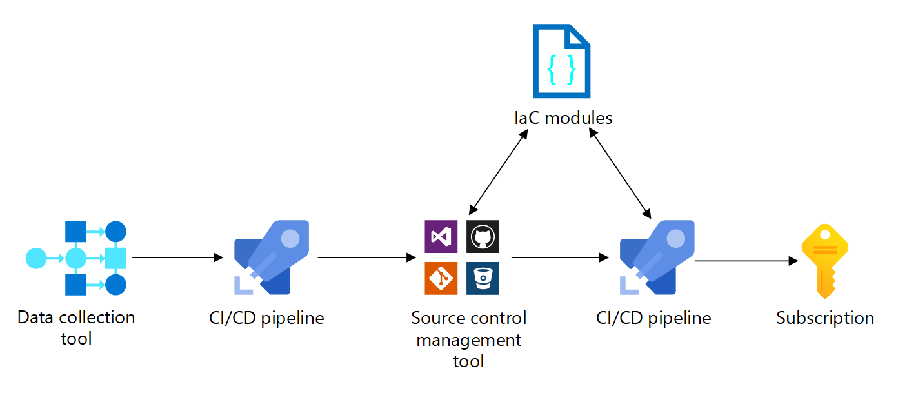
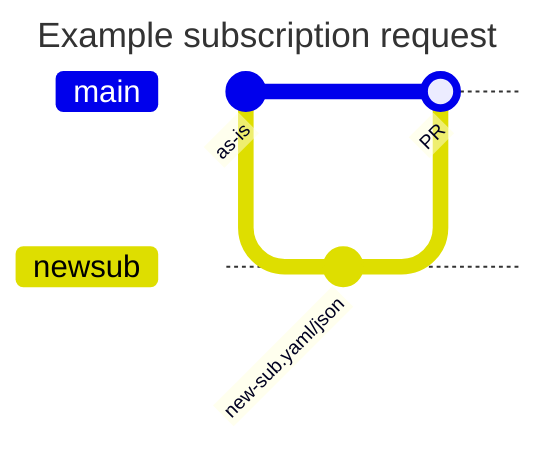

[Subscription vending](/azure/cloud-adoption-framework/ready/landing-zone/design-area/subscription-vending) is a concept set forth in the Cloud Adoption Framework that encourages defining a process for programmatically issuing subscriptions to application teams that need to deploy workloads. Automating this procedure is encouraged and this article provides core implementation guidance.

Subscription vending should be an automated process so the mechanism the platform team uses to create workload subscriptions is consistent and repeatable. The automation should use a combination of deployment pipelines and infrastructure as code (IaC) to automate the process.

The following diagram shows the components of the automated subscription vending process.

## Collect data

When a workload team makes a subscription request, you need to collect enough data to automate the subscription vending process.

**Collect required data.** You should collect data on the authorization of the request, the cost center, networking requirements, data sensitivity, environment (dev/test, pre-production, production), and any other required fields that will be used to drive subscription and core resource creation.

**Use IT service management tool.** If you already have an IT Service Management tool in active use in your organization, use that to collect the data.

**Custom portal.** Alternatively, you can also use a low-code / no-code tool like [Microsoft PowerApps](https://powerapps.microsoft.com/) to collect the data.

Your data capture portal should result in a logged and trackable request for a new subscription, complete with all necessary data to fulfill the requirements of that subscription, such as a ticket in your ITSM tool. Business logic and authorization tracking should be tied to this request. Once the request is through all approval gates (be them automated or manual), then the automated subscription creation process can begin. Ideally, your request tracking tool can perform a push notification with the necessary data to start this process after approval is met. You might need a middleware layer, such as Azure Functions or Logic Apps, to initiate the process.

**Use IP address management tool.**

## Initiate platform automation

Once subscription request data has been captured, validated, and ready to be acted on, the next step is to initiate platform automation.  The goal is to get the collected subscription request data captured in a consistent format that can be used in deployment pipelines for the actual subscription creation.

We recommend implementing this process as a file-based, PR-driven, source-controlled flow.

**Use JSON or YAML files.** You should use structured data files (JSON or YAML) to store the data necessary to create a subscription. The structure of the file should be documented and extensible to support future needs.

[example]

**You should use one file per subscription.** Each subscription should get its own dedicated configuration file.  The subscription is the unit of deployment in the vending process.

**Use a pull request-based system.** The automation that creates the config file should do the following:

1. Create a new branch for each subscription request
1. Use the data collected to create the YAML/JSON data file for the new subscription
1. Create a pull request
1. Update ITSM tooling with state change and reference to this pull request

**Perform request linting**. The pull request can kick off any automated linting process that you create to do automated validation on the request.  For example, ensuring that the IP ranges requested are still available & reserved in your IPAM system.  This linting is mostly focused on making sure the YAML/JSON data file is correctly structured to prevent a garbage-in, garbage-out scenario. Push as much business validation up to the request collection process as possible, as a validation exception this late in the process is harder to address, and likely need to be surfaced back into the request tracking system.

**Implement any necessary review gates.** The pull request becomes the first action signal for the platform team. The assumption is that if this pull request is merged, the subscription will be deployed. If desired, a human-intervention gate can be added at this step for final reviews.
1. Merge the changes

## Create subscription

Up until this point, everything has been focused on capturing, reviewing, approving, and documenting the intent to have a subscription created, with as much automation as practical.  This final phase is where the subscription is actually created and configured; which also should be automated.

The process should pick up with the subscription configuration data file merging in source control.  This is the authoritative push notification to deploy new resources (subscription and base configuration) in Azure, commits to external tracking systems (e.g. IPAM), and updating status in the request tracking system.

**Use IaC.** Your deployments should use a declarative deployment approach using IaC templates that you create to capture the necessary Azure components. Consider using the Azure Landing Zone subscription vending implementations, available as [Bicep modules](https://aka.ms/lz-vending/bicep) and [Terraform modules](https://aka.ms/lz-vending/tf) as your starting point.

You should use a CI/CD pipeline to orchestrate the creating the subscription. The CI/CD will trigger based off of the merge to `main`. The pipeline is responsible for the following:

- creating/updating any Azure AD resources to represent subscription ownership
- creating and configuring the subscription (TODO: WE NEED TO ADDRESS the lack of ability to do this programatically yet in the above).  This includes items like:
  - Management group placement
  - Subscription owner designation
  - Subscription-level RBAC to configured security groups
  - Microsoft Defender for Cloud enrollment
- deploying and configuring any base resources required.  Examples may be:
  - Virtual networks and their peering to platform resources, such as a regional hub
  - Subscription-level Azure Policy
  - Workload identities for workload team deployments
- updating external systems such as IPAM to commit on IP reservations
- updating the subscription request tracking tool with final subscription name, GUID, and anything else necessary to communicate back to the requester that the task is complete.

**Pipeline identity.** In order to perform all of these operations, the CI/CD pipeline needs to be properly permissioned across all systems it interfaces with - Azure RBAC, Azure AD, and external systems alike. For Azure recommend using either managed identity or OpenID Connect (OIDC) to authenticate to Azure.

## Post-deployment

### Cost management
