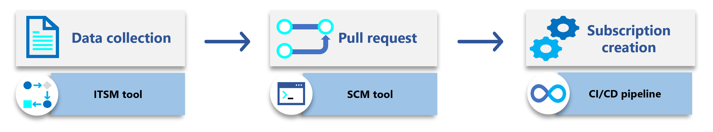
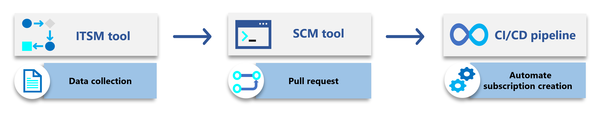
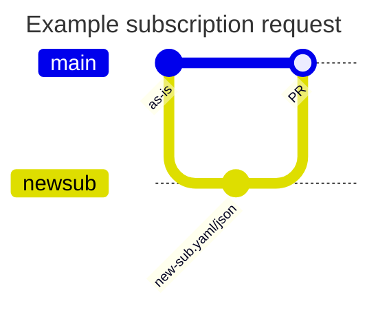

This article provides guidance for the architectural components of automated subscription vending. Automated subscription vending is a process that enables the creation of subscriptions in a consistent and repeatable manner. You should use a combination of Azure APIs and infrastructure as code (IaC) to automate the process.

It builds on the [subscription vending](https://learn.microsoft.com/azure/cloud-adoption-framework/ready/landing-zone/design-area/subscription-vending) article in the Cloud Adoption Framework.

The following diagram shows the components of the automated subscription vending process.

**Option 1 - result on top, tool on bottom**

**Option 2 - tool on top, result on bottom**

## Data collection

This process requires data collection. The authorization of the request, the cost center, the subscription name, and many other fields are required.

An IT Service Management tool can be used to orchestrate this process.
Alternatively, we can use a low-code / no-code tool like [Microsoft PowerApps](https://powerapps.microsoft.com/) to collect the data.

The tool is used to create a request for a new subscription.
It manages the business logic and authorization for the request.
Once the request is approved, the tool passes this data into the Source Code Management (SCM) tool and creates a pull request (PR). This could be via a middleware layer, such as Azure Functions or Logic Apps.

### IPAM (place holder)

## Source Code Management

The SCM tool is usually combined with the CI/CD tool and contains the Infrastructure as Code (IaC) for the subscription.
In order to scale, we recommend using semi-structured data files, e.g. JSON / YAML, to store the subscription data, using one file per subscription.

Using a simple Git flow process we can create a new branch for each subscription request, and create the YAML/JSON file for the new subscription to be created, based on the data collected previously, and use a pull request to merge the changes; and also optionally an additional approval gate before submitting the subscription to the depoloyment tooling to be created.

### Infrastructure as Code

We provide IaC modules for Bicep and Terraform, please see the links below and the associated Wiki pages for more information.

- [Bicep module](https://aka.ms/lz-vending/bicep)
- [Terraform module](https://aka.ms/lz-vending/tf)

### IPAM (place holder)

## CI/CD

The CI/CD tool provides the automation to create the subscription. We recommend using either GitHub Actions or Azure DevOps Pipelines.

### Workload Identities

In order to create the subscription, the CI/CD tool needs to authenticate to Azure.
We recommend using either managed identity or OpenID Connect (OIDC) to authenticate to Azure.
This removes the requirement to manage secrets.

## Post-deployment (place holder)

### Cost management (place holder)
