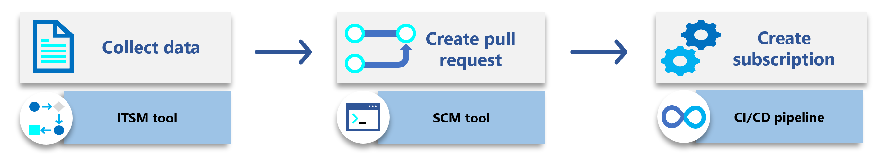
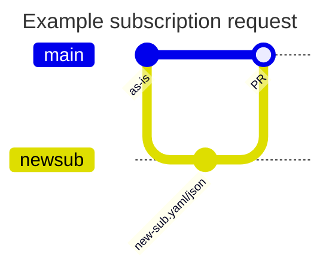

This article provides guidance for automating the subscription vending approach. It describes the technical steps and the architectural components you need to automate. It builds on the [subscription vending](/azure/cloud-adoption-framework/ready/landing-zone/design-area/subscription-vending) article in the Cloud Adoption Framework.

Subscription vending should be an automated process so the mechanism the platform team uses to create workload subscriptions is consistent and repeatable. The automation should use a combination of Azure APIs and infrastructure as code (IaC) to automate the process.

The following diagram shows the components of the automated subscription vending process.

## Collect data

When the workload team makes a subscription request, you need to collect data to automate the subscription vending process, and you should use a tool to manage this process.

**Collect required data.** You should collect data on the authorization of the request, the cost center, the subscription name, and many other fields.

**Use IT service management tool.** You can use an IT Service Management tool to orchestrate the data collection process. Alternatively, you can also use a low-code / no-code tool like [Microsoft PowerApps](https://powerapps.microsoft.com/) to collect the data. The tool should create a request for a new subscription and manage the business logic and authorization for the request. Once the request is approved, the tool passes this data into the Source Code Management (SCM) tool and creates a pull request. You might need a middleware layer, such as Azure Functions or Logic Apps, to complete the data transfer.

**Use IP address management tool.** (place holder)

## Create pull request

The subscription vending automation should use the request data to create a pull request in your source code management tool. You need to connect your source code management tool to your CI/CD pipeline. The source code management tool contains the infrastructure as code (IaC) for the subscription deployment.

**Use JSON or YAML files.** You should use semi-structured data files
(JSON or YAML) to store the subscription data. These files type allow your automation to scale.

**You should use one file per subscription.**

**Use Git flow.** You should use a Gitflow process to intake the data a merge the changes. The Gitflow should execute the following actions:

1. Create a new branch for each subscription request.
1. Use the data collected to create the YAML/JSON file for the new subscription.
1. Create a pull request.
1. Receive approval (optional).
1. Merge the changes.
1. Submit the subscription to the deployment tool.

**Use IaC modules.** We provide IaC modules for Bicep and Terraform. For more information, see:

- [Bicep module](https://aka.ms/lz-vending/bicep)
- [Bicep wiki](https://github.com/Azure/bicep-lz-vending/wiki)
- [Terraform module](https://aka.ms/lz-vending/tf)
- [Terraform wiki](https://github.com/Azure/terraform-azurerm-lz-vending/wiki)

### IPAM (???)

[to add ? ]

## Create subscription

You should use a CI/CD pipeline to create subscription. The CI/CD tool provides the automation to create the subscription. We recommend using either GitHub Actions or Azure Pipelines.

**Assign workload identity.** In order to create the subscription, the CI/CD tool needs to authenticate to Azure. We recommend using either managed identity or OpenID Connect (OIDC) to authenticate to Azure. Workload identities remove the requirement to manage secrets.

## Post-deployment (place holder)

### Cost management (place holder)
