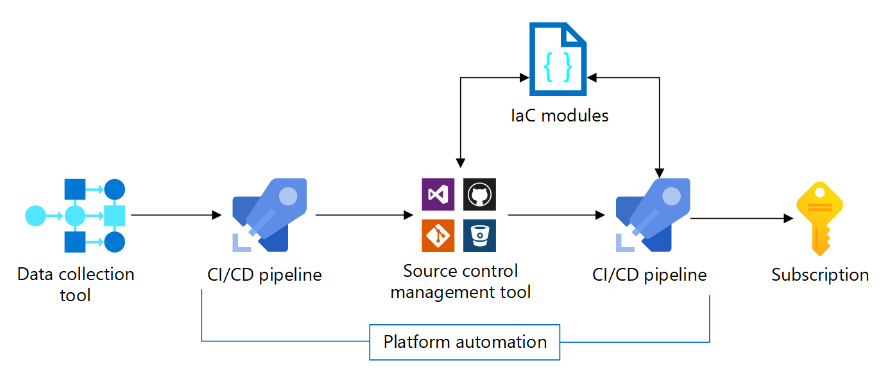

[Subscription vending](/azure/cloud-adoption-framework/ready/landing-zone/design-area/subscription-vending) is a concept set forth in the Cloud Adoption Framework that encourages defining a process for programmatically issuing subscriptions to application teams that need to deploy workloads. Automating this procedure is encouraged and this article provides core implementation guidance.

Subscription vending should be an automated process so the mechanism the platform team uses to create workload subscriptions is consistent and repeatable. The automation should use a combination of deployment pipelines and infrastructure as code (IaC) to automate the process.

The following diagram shows the components of the automated subscription vending process.

## Collect data

When a workload team makes a subscription request, you need to collect enough data to automate the subscription vending process.

**Collect required data.** You start by providing a mechanism to application teams to capture as much detail as necessary to perform the business justification and subscription creation. You should then expect to collect data such as: the authorization of the request, the cost center, networking requirements, data sensitivity, environment (dev/test, pre-production, production), and any other required fields that will be necessary to drive approval and the resulting subscription & core resource creation.

**Use IT service management tool.** If you already have an IT Service Management (ITSM) tool in active use in your organization, use that to collect the data. Alternatively, you can also use a low-code / no-code tool like [Microsoft PowerApps](https://powerapps.microsoft.com/) to build a custom portal to collect the data. The rest of this article will assume an ITSM tool is in use.

Your data capture portal should result in a logged and trackable request for a new subscription, complete with all necessary data to fulfill the requirements of that subscription, such as a ticket in your ITSM tool. Business logic and authorization tracking should be bound to this request.

Once the request is through all ITSM-automated and any manual approval gates, then the automated subscription creation process can begin. Ideally, your ITSM tool can perform a push notification with the necessary data to start this process after approval is met. You might need a middleware layer, such as Azure Functions or Logic Apps, to initiate the process.

**Use IP address management tool.** As part of a workload subscription request, expected network space and network line of sight requirements are often needed to be understood. If you have an IP address management tool, this intake process can validate available & appropriate IP space and reserve it.

A system like IPAM is just one example of an external system that may need to be interfaced with in this process. It's ideal if your subscription request intake, processing, and tracking system is capable of orchestrating interactions like these at the data collection and approval step. If not, those interactions can then be handled in subsequent steps that involve creating custom workflows.

## Initiate platform automation

Once subscription request data has been captured, validated, and ready to be acted on, the next step is to initiate platform automation. The goal is to get the collected subscription request data captured in a consistent format that can be used in deployment pipelines for the actual subscription creation.

We recommend implementing this process as a file-based, PR-driven, source-controlled flow.

**Use JSON or YAML files.** You should use structured data files (JSON or YAML) to store the data necessary to create a subscription. The structure of the file should be documented and extensible to support future needs.

[example]

**You should use one file per subscription.** Each subscription should get its own dedicated configuration file.  The subscription is the unit of deployment in the vending process.

**Use a pull request-based system.** The automation that creates the config file should do the following:

1. Create a new branch for each subscription request
1. Use the data collected to create the YAML/JSON data file for the new subscription in the branch
1. Create a pull request from your branch into `main`
1. Update ITSM tooling with state change and reference to this pull request

The above represents a logic flow that should be implemented in an automated way. We recommend this process is built as a deployment pipeline which is responsible for orchestrating the above steps.  Each subscription request is then a trigger of this pipeline with the necessary parameters passed in. Alternatively, this could be done as a code-based solution hosted in Azure if the workflow becomes sufficiently complex.

This automation is a single system that is responsible for taking the collected data for any given subscription request and initiating the platform automation. It is owned and maintained by the platform team that is responsible for subscription creation in the organization.

**Perform request linting**. The pull request can kick off any automated linting process that you create to do automated validation on the request.  For example, ensuring that the IP ranges requested are still available & reserved in your IPAM system or making sure the YAML/JSON data file is correctly structured to prevent a garbage-in, garbage-out scenario. Push as much business validation up to the request collection process as possible, as a validation exception this late in the process is harder to address and need to be surfaced back into the request tracking system.

**Implement any necessary review gates.** The pull request becomes the first action signal for the platform team responsible for the subscription creation process. The assumption is that if this pull request is merged, the subscription will be created. To that end, a human-intervention gate can be added at this step for final reviews and potential last-minute alterations to the data file.

**Merge the changes.** Once the PR merger to `main` is done, this will then initiate a continuous deployment pipeline to create the actual subscription. If no human-intervention gates are required and all linting builds are complete this could be an auto-merge PR.

## Create subscription

Up until this point, everything has been focused on capturing, reviewing, approving, and documenting the intent to have a subscription created, with as much automation as practical.  This final phase is where the subscription is actually created and configured; which also should be automated.

The process picks up when the new subscription configuration data file merged into `main`.  This is the authoritative push notification to actually deploy new resources (subscription and base configuration) in Azure, final commits to external tracking systems (e.g. IPAM), and updating status in the ITSM tooling tracking this request.

**Use IaC.** Your deployments should use a declarative approach, using IaC templates that the platform subscription team creates and maintains, to describe the necessary Azure components to be deployed. Use the Azure Landing Zone subscription vending implementations, available as [Bicep modules](https://aka.ms/lz-vending/bicep) and [Terraform modules](https://aka.ms/lz-vending/tf) as your starting point.

Like all of the automation so far, you should also use a CI/CD pipeline to orchestrate this resource creation and configuration phase. The pipeline will trigger based off of the merge to `main`. The pipeline is responsible for the following:

- Creating or updating any Azure AD resources to represent subscription ownership
- Creating and configuring the subscription. This includes items such as:
  - Management group placement
  - Subscription owner designation
  - Subscription-level RBAC to configured security groups
  - Microsoft Defender for Cloud enrollment
- Deploying and configuring any base resources required.  Some comment examples are:
  - Virtual networks and their peering to platform resources, such as a regional hub
  - Subscription-level Azure Policy
  - Highly privileged workload identities for workload team deployments
- Updating external systems, such as IPAM to commit on IP reservations
- Updating the ITSM request with final subscription name, GUID, and anything else necessary to communicate back to the requester that the task is complete.

Be aware that you do need a commercial agreement to create an Azure Subscription programmatically. If you do not have a commercial agreement, you'll need to introduce a manual process above to create the actual Azure Subscription, but you can automate all other aspects of subscription configuration without a commercial agreement.

**Pipeline identity.** In order to perform all of these operations, the CI/CD pipeline needs to be properly permissioned across all systems it interfaces with - Azure RBAC, Azure AD, and external systems alike. For Azure recommend using either managed identity or OpenID Connect (OIDC) to authenticate to Azure.

## Post-deployment

### Cost management
