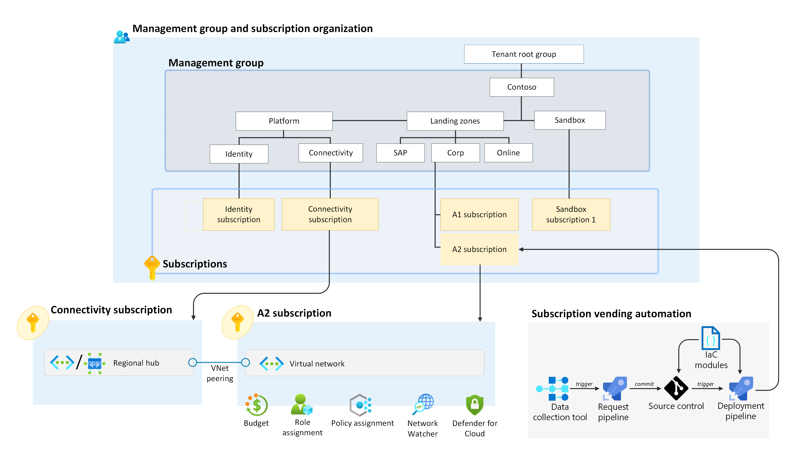
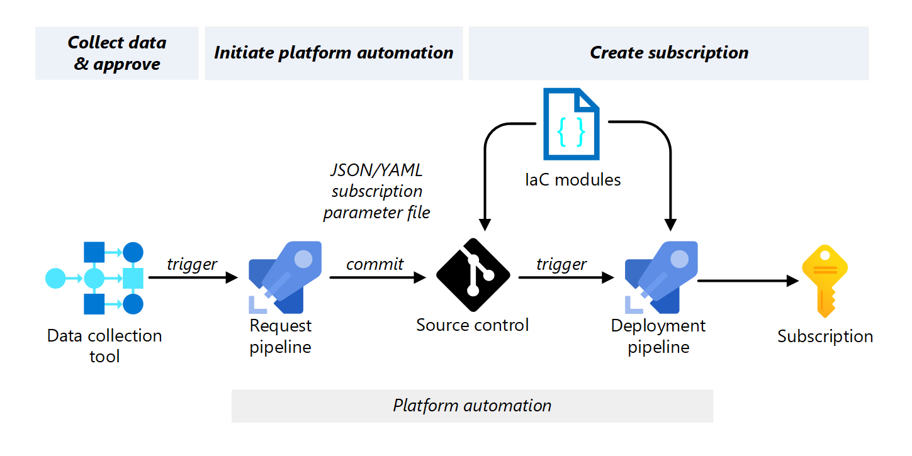

This article provides implementation guidance for subscription vending automation. Subscription vending standardizes the process for requesting, deploying, and governing subscriptions so that application teams can deploy their workloads faster.

[](images/sample-subscription-vending-architecture.png)
*Figure 1. A subscription vending implementation in an example Azure environment.*

 We created subscription vending [Bicep](https://aka.ms/lz-vending/bicep) and [Terraform](https://aka.ms/lz-vending/tf) modules that you should use as a starting point. You should modify the templates to fit your implementation needs.

For more information on the subscription vending process, see [Subscription vending overview](/azure/cloud-adoption-framework/ready/landing-zone/design-area/subscription-vending).
<br/><br/>
> [!VIDEO https://www.youtube.com/embed/OoC_0afxACg]

## Architecture

You should architect your subscription vending automation to accomplish three primary tasks. Subscription vending automation should:

- Collect subscription request data.
- Initiate platform automation.
- Create the subscription by using infrastructure-as-code.

[](images/subscription-vending-components.png)
*Figure 2. Example implementation of subscription vending automation.*

Numerous approaches exist for implementing subscription vending automation to accomplish these three tasks. The example implementation shows one approach that uses a Gitflow (*see Figure 2*). The Gitflow design aligns with the declarative approach that many platform teams use to manage the platform.

In the example implementation, the *data collection tool* gathers subscription request data. When the subscription request receives approval, it initiates the platform automation. The *platform automation* consists of the request pipeline, source control, and deployment pipeline. The *request pipeline* creates a JSON or YAML subscription parameter file with the data from the data collection tool. The request pipeline also creates a new branch, commits the subscription parameter file, and opens a pull request in *source control*. The new branch merges with the main branch in source control. The merge triggers the *deployment pipeline* to create the subscription with the infrastructure-as-code modules.

The deployment should place the *subscription* in the correct management group based on the governance requirements (*see Figure 1*). The deployment creates a preliminary subscription budget as the foundation for cost management. Based on the needs of the workload, the deployment could create an empty virtual network and configure peering to a regional hub. The platform team should hand off the subscription to the application team after creation and configuration. The application team should update the subscription budget and create the workload resources.

## Collect data

The goal of collecting data is to receive business approval and define the values of the JSON/YAML subscription parameter file. You should use a data collection tool to collect the required data when the application team submits the subscription request. The data collection tool should interface with other systems in the subscription vending workflow to initiate the platform automation.

**Use a data collection tool.** You can use an IT Service Management (ITSM) tool to collect the data or build a customer portal with a low-code or no-code tool like [Microsoft PowerApps](https://powerapps.microsoft.com/). The data collection tool should provide business logic to approve or deny the subscription request.

**Collect the required data.** You need to collect enough data to define the values of the JSON/YAML subscription parameter so that you can automate the deployment. The specific values you collect depend on your needs. You should capture the request authorizer, cost center, and networking requirements (internet or on-premises connectivity). It might be helpful to ask the application team for anticipated workload components (application platform, data requirements), data sensitivity, and number of environments (development, test, preproduction, production).

**Validate data.** You should validate data during the data collection process. It's harder to address issues later in the platform automation phases.

**Create a trackable request.** Your data collection tool should create a logged and trackable request for a new subscription (for example, a ticket in an ITSM tool). The request should contain all necessary data to fulfill the requirements of that subscription. You should bind the business logic and authorization tracking to the request.

**Interface with other internal systems.** Where needed, the data collection tool should interface with other tools or systems in your organization. The goal is to enrich the request with data from other systems. You might need identity, finance, security, and networking data to execute the automation. For example, the automation could interface with an IP address management (IPAM) tool to reserve the right IP address space.

**Create a trigger.** When the subscription request receives approval, the data transfer should trigger the platform automation. It's best to create a push notification with the necessary data from your data collection tool. You might need a middleware layer, such as Azure Functions or Azure Logic Apps, to initiate the process.

## Initiate platform automation

The notification and data from the data collection tool should trigger the platform automation. The goal of platform automation is to create a JSON/YAML subscription parameter file, merge the file to the main branch, and deploy it with the infrastructure-as-code modules to create the subscription. The platform team should own and maintain the platform automation. The platform automation in the example implementation consists of the request pipeline, source control, and deployment pipeline (*see Figure 2*).

**Use JSON or YAML files.** You should use structured data files (JSON or YAML) to store the data to create a subscription. You should document the structure of the file and make it extensible to support future needs. For example, the following JSON code snippet defines the subscription parameter values for one of the Bicep modules in GitHub.

```json
{
  "$schema": "https://schema.management.azure.com/schemas/2015-01-01/deploymentParameters.json#",
  "contentVersion": "1.0.0.0",
  "parameters": {
    "subscriptionDisplayName": {
      "value": "sub-bicep-lz-vending-example-001"
    },
    "subscriptionAliasName": {
      "value": "sub-bicep-lz-vending-example-001"
    },
    "subscriptionBillingScope": {
      "value": "providers/Microsoft.Billing/billingAccounts/1234567/enrollmentAccounts/123456"
    },
  // Insert more parameters here
  }
}
```

*[See entire file](https://github.com/azure/bicep-lz-vending/wiki/Example-1-Hub-and-Spoke#arm-json-parameter-file). For more examples, see [Bicep examples](https://github.com/azure/bicep-lz-vending/wiki/examples) and [Terraform examples](https://registry.terraform.io/modules/Azure/lz-vending/azurerm/latest#example)*

**Use one file per subscription request.** The subscription is the unit of deployment in the subscription vending process, so each subscription request should have one dedicated subscription parameter file.

**Use a pull request system.** The Gitflow process that creates the subscription parameter file should automate the following steps:

1. Create a new branch for each subscription request.
1. Use the data collected to create a single YAML/JSON subscription parameter file for the new subscription in the branch.
1. Create a pull request from your branch into `main`.
1. Update the data collection tool with a state change and reference to this pull request.

The *request pipeline* in the example implementation executes these steps (*see Figure 2*). You could also use a code-based solution hosted in Azure if the workflow is complex.

**Validate the subscription parameter file.** The pull request should trigger a linting process to validate the request data. The goal is to ensure the deployment is successful. It should validate the YAML/JSON subscription parameter file. It could also verify that the IP address range is still available. You might also want to add a manual review gate with human intervention. They could perform the final review and make changes to the subscription parameter file. The output should be a JSON/YAML subscription parameter file with all the data to create a subscription.

**Trigger the deployment pipeline.** When the pull request merges into the `main` branch, the merge should trigger the deployment pipeline.

## Create a subscription

The last task of the subscription vending automation is to create and configure the new subscription. The example implementation uses the *deployment pipeline* to deploy the infrastructure-as-code module with the JSON/YAML subscription parameter file (*see Figure 2*).

**Use infrastructure as code.** Your deployment should use infrastructure as code to create the subscription. The platform team should create and maintain these templates to ensure proper governance. You should use the subscription vending [Bicep](https://aka.ms/lz-vending/bicep) and [Terraform](https://aka.ms/lz-vending/tf) modules and modify them to fit your implementation needs.

**Use a deployment pipeline.** The deployment pipeline orchestrates the creation and configuration of the new subscription. The pipeline should execute the following tasks:

| Task category | Pipeline task |
| --- | --- |
| Identity |• Create or update Azure AD resources to represent subscription ownership.<br>• Configure privileged workload identities for workload team deployments.<br>
| Governance |• Place in management group hierarchy.<br>• Assign subscription owner.<br>• Configure subscription-level role-based access controls (RBACs) to configured security groups.<br>• Assign subscription-level Azure Policy.<br>• Configure the Microsoft Defender for Cloud enrollment.|
| Networking |• Deploy virtual networks.<br>• Configure virtual network peering to platform resources (regional hub).<br>
| Budgets |• Create budgets for the subscription owners by using the collected data.<br>|
| Reporting |• Update external systems, such as IPAM, to commit to IP reservations.<br>• Update the data collection tool request with final subscription name and globally unique identifier (GUID).<br>• Notify the application team that the subscription is ready.<br>

You need a commercial agreement to create a subscription programmatically. If you don't have a commercial agreement, you need to introduce a manual process to create the subscription. You can automate all other aspects of subscription configuration.

**Establish a workload identity.** The deployment pipeline needs permission to perform these operations with all the systems it interfaces with. You should either use managed identity or OpenID Connect (OIDC) to authenticate to Azure.

## Post-deployment

The subscription vending automation ends with subscription creation and configuration. The platform team should hand off the new subscription to the application team after creation. The application team should update the subscription budget, create the workload resources, and deploy the workload. The platform team controls the governance of the subscription and manages changes to subscription governance over time.

**Enforce cost management.** Subscription budgets provide notifications that are critical to cost management. The deployment should create a preliminary subscription budget based on the subscription request data. The application team receives the subscription. They should update the budget to meet the needs of the workload. 

For more information, see:

- [Create and manage budgets](/azure/cost-management-billing/costs/tutorial-acm-create-budgets)
- [Manage costs with Azure Budgets](/azure/cost-management-billing/manage/cost-management-budget-scenario)
- [Cost allocation](/azure/cost-management-billing/costs/allocate-costs)
- [Track costs across business units, environments, or projects](/azure/cloud-adoption-framework/ready/azure-best-practices/track-costs)

**Manage subscription governance.** You should update the subscription as the governance requirements of the workload change. For example, you might need to move a subscription to a different management group. You should build automation for some of these routine operations.

For more information, see:

- [Moving management groups and subscription](/azure/governance/management-groups/overview#moving-management-groups-and-subscriptions)
- [Keep policies and policy initiatives up to date](/azure/cloud-adoption-framework/govern/resource-consistency/keep-azure-landing-zone-up-to-date#keep-policies-and-policy-initatives-up-to-date)
- [Resource tagging](/azure/cloud-adoption-framework/govern/resource-consistency/tagging#enforce)
- [Tailor the Azure landing zone architecture to meet requirements](/azure/cloud-adoption-framework/ready/landing-zone/tailoring-alz)

## Next steps

Subscription vending simplifies and standardizes the subscription creation process and places it under the governance of the organization. You should implement subscription vending automation to help your application teams access application landing zones faster and onboard workloads quicker.

For more information, see:

- [Bicep modules](https://aka.ms/lz-vending/bicep)
- [Terraform modules](https://aka.ms/lz-vending/tf)
- [Subscription vending overview](/azure/cloud-adoption-framework/ready/landing-zone/design-area/subscription-vending)
- [Azure landing zone overview](/azure/cloud-adoption-framework/ready/landing-zone/)
