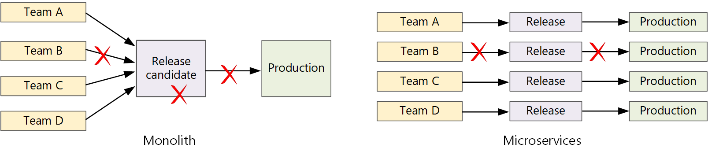

Faster release cycles are one of the major advantages of microservices architectures. But without a good CI/CD process, you won't achieve the agility that microservices promise. This article describes the challenges and recommends some approaches to the problem.

## What is CI/CD?

When we talk about CI/CD, we're really talking about several related processes: Continuous integration, continuous delivery, and continuous deployment.

- **Continuous integration**. Code changes are frequently merged into the main branch. Automated build and test processes ensure that code in the main branch is always production-quality.

- **Continuous delivery**. Any code changes that pass the CI process are automatically published to a production-like environment. Deployment into the live production environment may require manual approval, but is otherwise automated. The goal is that your code should always be *ready* to deploy into production.

- **Continuous deployment**. Code changes that pass the previous two steps are automatically deployed *into production*.

Here are some goals of a robust CI/CD process for a microservices architecture:

- Each team can build and deploy the services that it owns independently, without affecting or disrupting other teams.

- Before a new version of a service is deployed to production, it gets deployed to dev/test/QA environments for validation. Quality gates are enforced at each stage.

- A new version of a service can be deployed side by side with the previous version.

- Sufficient access control policies are in place.

- For containerized workloads, you can trust the container images that are deployed to production.

## Why a robust CI/CD pipeline matters

In a traditional monolithic application, there is a single build pipeline whose output is the application executable. All development work feeds into this pipeline. If a high-priority bug is found, a fix must be integrated, tested, and published, which can delay the release of new features. You can mitigate these problems by having well-factored modules and using feature branches to minimize the impact of code changes. But as the application grows more complex, and more features are added, the release process for a monolith tends to become more brittle and likely to break.

Following the microservices philosophy, there should never be a long release train where every team has to get in line. The team that builds service "A" can release an update at any time, without waiting for changes in service "B" to be merged, tested, and deployed.

To achieve a high release velocity, your release pipeline must be automated and highly reliable to minimize risk. If you release to production one or more times daily, regressions or service disruptions must be rare. At the same time, if a bad update does get deployed, you must have a reliable way to quickly roll back or roll forward to a previous version of a service.

## Challenges

- **Many small independent code bases**. Each team is responsible for building its own service, with its own build pipeline. In some organizations, teams may use separate code repositories. Separate repositories can lead to a situation where the knowledge of how to build the system is spread across teams, and nobody in the organization knows how to deploy the entire application. For example, what happens in a disaster recovery scenario, if you need to quickly deploy to a new cluster?

    **Mitigation**: Have a unified and automated pipeline to build and deploy services, so that this knowledge is not "hidden" within each team.

- **Multiple languages and frameworks**. With each team using its own mix of technologies, it can be difficult to create a single build process that works across the organization. The build process must be flexible enough that every team can adapt it for their choice of language or framework.

    **Mitigation**: Containerize the build process for each service. That way, the build system just needs to be able to run the containers.

- **Integration and load testing**. With teams releasing updates at their own pace, it can be challenging to design robust end-to-end testing, especially when services have dependencies on other services. Moreover, running a full production cluster can be expensive, so it's unlikely that every team will run its own full cluster at production scales, just for testing.

- **Release management**. Every team should be able to deploy an update to production. That doesn't mean that every team member has permissions to do so. But having a centralized Release Manager role can reduce the velocity of deployments.

    **Mitigation**: The more that your CI/CD process is automated and reliable, the less there should be a need for a central authority. That said, you might have different policies for releasing major feature updates versus minor bug fixes. Being decentralized doesn't mean zero governance.

- **Service updates**. When you update a service to a new version, it shouldn't break other services that depend on it.

    **Mitigation**: Use deployment techniques such as blue-green or canary release for non-breaking changes. For breaking API changes, deploy the new version side by side with the previous version. That way, services that consume the previous API can be updated and tested for the new API. See [Updating services](#updating-services), below.

## Monorepo vs. multi-repo

Before creating a CI/CD workflow, you must know how the code base will be structured and managed.

- Do teams work in separate repositories or in a monorepo (single repository)?
- What is your branching strategy?
- Who can push code to production? Is there a release manager role?

The monorepo approach has been gaining favor but there are advantages and disadvantages to both.

| &nbsp; | Monorepo | Multiple repos |
|--------|----------|----------------|
| **Advantages** | Code sharing Easier to standardize code and tooling Easier to refactor code Discoverability - single view of the code  | Clear ownership per team Potentially fewer merge conflicts Helps to enforce decoupling of microservices |
| **Challenges** | Changes to shared code can affect multiple microservices Greater potential for merge conflicts Tooling must scale to a large code base Access control More complex deployment process | Harder to share code Harder to enforce coding standards Dependency management Diffuse code base, poor discoverability Lack of shared infrastructure

## Updating services

There are various strategies for updating a service that's already in production. Here we discuss three common options: Rolling update, blue-green deployment, and canary release.

### Rolling updates

In a rolling update, you deploy new instances of a service, and the new instances start receiving requests right away. As the new instances come up, the previous instances are removed.

**Example.** In Kubernetes, rolling updates are the default behavior when you update the pod spec for a [Deployment](https://kubernetes.io/docs/concepts/workloads/controllers/deployment/). The Deployment controller creates a new ReplicaSet for the updated pods. Then it scales up the new ReplicaSet while scaling down the old one, to maintain the desired replica count. It doesn't delete old pods until the new ones are ready. Kubernetes keeps a history of the update, so you can roll back an update if needed.

**Example.** Azure Service Fabric uses the rolling update strategy by default. This strategy is best suited for deploying a version of a service with new features without changing existing APIs. Service Fabric starts an upgrade deployment by updating the application type to a subset of the nodes or an update domain. It then rolls forward to the next update domain until all domains are upgraded. If an upgrade domain fails to update, the application type rolls back to the previous version across all domains. Be aware that an application type with multiple services (and if all services are updated as part of one upgrade deployment) is prone to failure. If one service fails to update, the entire application is rolled back to the previous version and the other services are not updated.

One challenge of rolling updates is that during the update process, a mix of old and new versions are running and receiving traffic. During this period, any request could get routed to either of the two versions.

For breaking API changes, a good practice is to support both versions side by side, until all clients of the previous version are updated. See [API versioning](./design/api-design.yml#api-versioning).

### Blue-green deployment

In a blue-green deployment, you deploy the new version alongside the previous version. After you validate the new version, you switch all traffic at once from the previous version to the new version. After the switch, you monitor the application for any problems. If something goes wrong, you can swap back to the old version. Assuming there are no problems, you can delete the old version.

With a more traditional monolithic or N-tier application, blue-green deployment generally meant provisioning two identical environments. You would deploy the new version to a staging environment, then redirect client traffic to the staging environment &mdash; for example, by swapping VIP addresses. In a microservices architecture, updates happen at the microservice level, so you would typically deploy the update into the same environment and use a service discovery mechanism to swap.

**Example**. In Kubernetes, you don't need to provision a separate cluster to do blue-green deployments. Instead, you can take advantage of selectors. Create a new [Deployment](https://kubernetes.io/docs/concepts/workloads/controllers/deployment/) resource with a new pod spec and a different set of labels. Create this deployment, without deleting the previous deployment or modifying the service that points to it. Once the new pods are running, you can update the service's selector to match the new deployment.

One drawback of blue-green deployment is that during the update, you are running twice as many pods for the service (current and next). If the pods require a lot of CPU or memory resources, you may need to scale out the cluster temporarily to handle the resource consumption.

### Canary release

In a canary release, you roll out an updated version to a small number of clients. Then you monitor the behavior of the new service before rolling it out to all clients. This lets you do a slow rollout in a controlled fashion, observe real data, and spot problems before all customers are affected.

A canary release is more complex to manage than either blue-green or rolling update, because you must dynamically route requests to different versions of the service.

**Example**. In Kubernetes, you can configure a [Service](https://kubernetes.io/docs/concepts/services-networking/service/) to span two replica sets (one for each version) and adjust the replica counts manually. However, this approach is rather coarse-grained, because of the way Kubernetes load balances across pods. For example, if you have a total of 10 replicas, you can only shift traffic in 10% increments. If you are using a service mesh, you can use the service mesh routing rules to implement a more sophisticated canary release strategy.

## Next steps

- [Learning path: Define and implement continuous integration](/training/paths/az-400-define-implement-continuous-integration)
- [Training: Introduction to continuous delivery](/training/modules/introduction-to-continuous-delivery)
- [Microservices architecture](/dotnet/architecture/microservices/architect-microservice-container-applications/microservices-architecture)
- [Why use a microservices approach to building applications](/azure/service-fabric/service-fabric-overview-microservices)

## Related resources

- [CI/CD for microservices on Kubernetes](./ci-cd-kubernetes.yml)
- [Design a microservices architecture](index.yml)
- [Using domain analysis to model microservices](model/domain-analysis.md)
- [Monitor a microservices architecture in Azure Kubernetes Service (AKS)](../microservices/logging-monitoring.yml)
