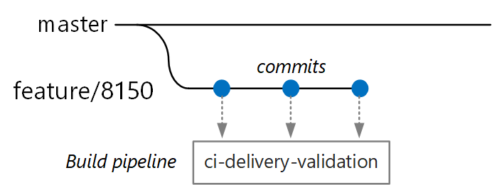
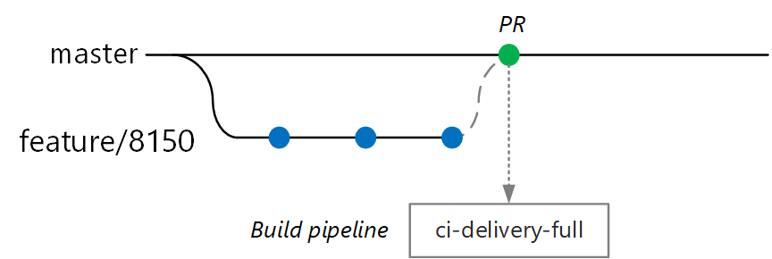
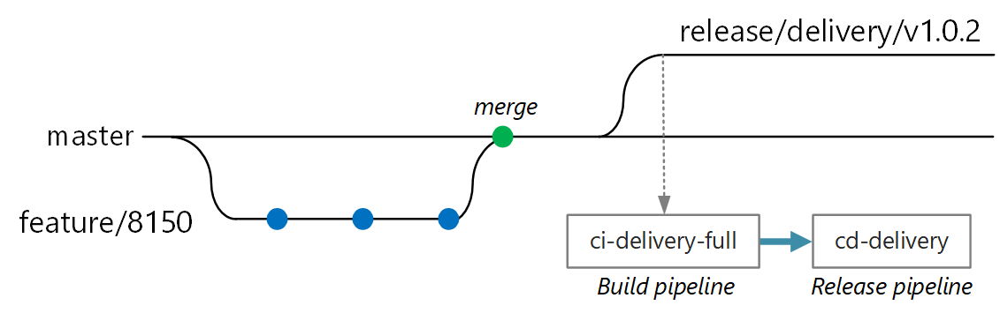
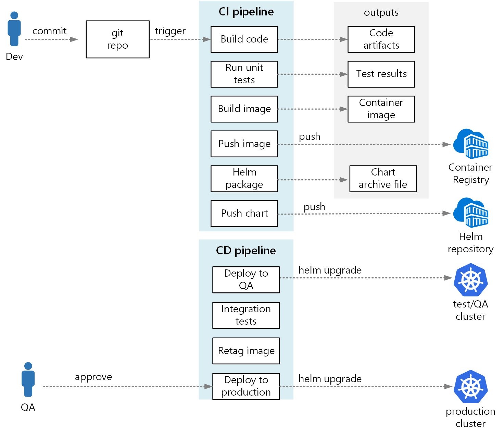

<!-- markdownlint-disable MD040 -->

# Building a CI/CD pipeline for microservices on Kubernetes

It can be challenging to create a reliable CI/CD process for a microservices architecture. Individual teams must be able to release services quickly and reliably, without disrupting other teams or destabilizing the application as a whole.

This article describes an example CI/CD pipeline for deploying microservices to Azure Kubernetes Service (AKS). Every team and project is different, so don't take this article as a set of hard-and-fast rules. Instead, it's meant to be a starting point for designing your own CI/CD process.

The example pipeline described here was created for a microservices reference implementation called the Drone Delivery application, which you can find on [GitHub][ri]. The application scenario is described [here](./design/index.md#reference-implementation).

The goals of the pipeline can be summarized as follows:

- Teams can build and deploy their services independently.
- Code changes that pass the CI process are automatically deployed to a production-like environment.
- Quality gates are enforced at each stage of the pipeline.
- A new version of a service can be deployed side by side with the previous version.

For more background, see [CI/CD for microservices architectures](./ci-cd.md).

## Assumptions

For purposes of this example, here are some assumptions about the development team and the code base:

- The code repository is a monorepo, with folders organized by microservice.
- The team's branching strategy is based on [trunk-based development](https://trunkbaseddevelopment.com/).
- The team uses [release branches](/azure/devops/repos/git/git-branching-guidance?view=azure-devops#manage-releases) to manage releases. Separate releases are created for each microservice.
- The CI/CD process uses [Azure Pipelines](/azure/devops/pipelines/?view=azure-devops) to build, test, and deploy the microservices to AKS.
- The container images for each microservice are stored in [Azure Container Registry](/azure/container-registry/).
- The team uses Helm charts to package each microservice.

These assumptions drive many of the specific details of the CI/CD pipeline. However, the basic approach described here be adapted for other processes, tools, and services, such as Jenkins or Docker Hub.

## Validation builds

Suppose that a developer is working on a microservice called the Delivery Service. While developing a new feature, the developer checks code into a feature branch. By convention, feature branches are named `feature/*`.



The build definition file includes a trigger that filters by the branch name and the source path:

```yaml
trigger:
  batch: true
  branches:
    include:
    # for new release to production: release flow strategy
    - release/delivery/v*
    - refs/release/delivery/v*
    - master
    - feature/delivery/*
    - topic/delivery/*
  paths:
    include:
    - /src/shipping/delivery/
```

&#11162; See the [source file](https://github.com/mspnp/microservices-reference-implementation/blob/master/src/shipping/delivery/azure-pipelines.yml).

Using this approach, each team can have its own build pipeline. Only code that is checked into the `/src/shipping/delivery` folder triggers a build of the Delivery Service. Pushing commits to a branch that matches the filter triggers a CI build. At this point in the workflow, the CI build runs some minimal code verification:

1. Build the code.
1. Run unit tests.

The goal is to keep build times short, so the developer can get quick feedback. Once the feature is ready to merge into master, the developer opens a PR. This triggers another CI build that performs some additional checks:

1. Build the code.
1. Run unit tests.
1. Build the runtime container image.
1. Run vulnerability scans on the image.



> [!NOTE]
> In Azure DevOps Repos, you can define [policies](/azure/devops/repos/git/branch-policies) to protect branches. For example, the policy could require a successful CI build plus a sign-off from an approver in order to merge into master.

## Full CI/CD build

At some point, the team is ready to deploy a new version of the Delivery service. The release manager creates a branch from master with this naming pattern: `release/<microservice name>/<semver>`. For example, `release/delivery/v1.0.2`.



Creation of this branch triggers a full CI build that runs all of the previous steps plus:

1. Push the container image to Azure Container Registry. The image is tagged with the version number taken from the branch name.
2. Run `helm package` to package the Helm chart for the service. The chart is also tagged with a version number.
3. Push the Helm package to Container Registry.

Assuming this build succeeds, it triggers a deployment (CD) process using an Azure Pipelines [release pipeline](/azure/devops/pipelines/release/). This pipeline has the following steps:

1. Deploy the Helm chart to a QA environment.
1. An approver signs off before the package moves to production. See [Release deployment control using approvals](/azure/devops/pipelines/release/approvals/approvals).
1. Retag the Docker image for the production namespace in Azure Container Registry. For example, if the current tag is `myrepo.azurecr.io/delivery:v1.0.2`, the production tag is `myrepo.azurecr.io/prod/delivery:v1.0.2`.
1. Deploy the Helm chart to the production environment.

Even in a monorepo, these tasks can be scoped to individual microservices, so that teams can deploy with high velocity. The process has some manual steps: Approving PRs, creating release branches, and approving deployments into the production cluster. These steps are manual by policy &mdash; they could be automated if the organization prefers.

## Isolation of environments

You will have multiple environments where you deploy services, including environments for development, smoke testing, integration testing, load testing, and finally production. These environments need some level of isolation. In Kubernetes, you have a choice between physical isolation and logical isolation. Physical isolation means deploying to separate clusters. Logical isolation uses namespaces and policies, as described earlier.

Our recommendation is to create a dedicated production cluster along with a separate cluster for your dev/test environments. Use logical isolation to separate environments within the dev/test cluster. Services deployed to the dev/test cluster should never have access to data stores that hold business data.

## Build process

When possible, package your build process into a Docker container. That allows you to build your code artifacts using Docker, without needing to configure the build environment on each build machine. A containerized build process makes it easy to scale out the CI pipeline by adding new build agents. Also, any developer on the team can build the code simply by running the build container.

By using multi-stage builds in Docker, you can define the build environment and the runtime image in a single Dockerfile. For example, here's a Dockerfile that builds an ASP.NET Core application:

```
FROM microsoft/dotnet:2.2-runtime AS base
WORKDIR /app

FROM microsoft/dotnet:2.2-sdk AS build
WORKDIR /src/Fabrikam.Workflow.Service

COPY Fabrikam.Workflow.Service/Fabrikam.Workflow.Service.csproj .
RUN dotnet restore Fabrikam.Workflow.Service.csproj

COPY Fabrikam.Workflow.Service/. .
RUN dotnet build Fabrikam.Workflow.Service.csproj -c Release -o /app

FROM build AS publish
RUN dotnet publish Fabrikam.Workflow.Service.csproj -c Release -o /app

FROM base AS final
WORKDIR /app
COPY --from=publish /app .
ENTRYPOINT ["dotnet", "Fabrikam.Workflow.Service.dll"]
```

&#11162; See the [source file](https://github.com/mspnp/microservices-reference-implementation/blob/master/src/shipping/workflow/Dockerfile).

This Dockerfile defines several build stages. Notice that the stage named `base` uses the ASP.NET Core runtime, while the stage named `build` uses the full ASP.NET Core SDK. The `build` stage is used to build the ASP.NET Core project. But the final runtime container is built from `base`, which contains just the runtime and is significantly smaller than the full SDK image.

### Building a test runner

Another good practice is to run unit tests in the container. For example, here is part of a Docker file that builds a test runner:

```
FROM build AS testrunner
WORKDIR /src/tests

COPY Fabrikam.Workflow.Service.Tests/*.csproj .
RUN dotnet restore Fabrikam.Workflow.Service.Tests.csproj

COPY Fabrikam.Workflow.Service.Tests/. .
ENTRYPOINT ["dotnet", "test", "--logger:trx"]
```

A developer can use this Docker file to run the tests locally:

```bash
docker build . -t delivery-test:1 --target=testrunner
docker run -p 8080:8080 delivery-test:1
```

The CI pipeline should also run the tests as part of the build verification step.

Note that this file uses the Docker `ENTRYPOINT` command to run the tests, not the Docker `RUN` command.

- If you use the `RUN` command, the tests run every time you build the image. By using `ENTRYPOINT`, the tests are opt-in. They run only when you explicitly target the `testrunner` stage.
- A failing test doesn't cause the Docker `build` command to fail. That way you can distinguish container build failures from test failures.
- Test results can be saved to a mounted volume.

### Container best practices

Here are some other best practices to consider for containers:

- Define organization-wide conventions for container tags, versioning, and naming conventions for resources deployed to the cluster (pods, services, and so on). That can make it easier to diagnose deployment issues.

- During the development and test cycle, the CI/CD process will build many container images. Only some of those images are candidates for release, and then only some of those release candidates will get promoted to production. Have a clear versioning strategy, so that you know which images are currently deployed to production, and can roll back to a previous version if necessary.

- Always deploy specific container version tags, not `latest`.

- Use [namespaces](/azure/container-registry/container-registry-best-practices#repository-namespaces) in Azure Container Registry to isolate images that are approved for production from images that are still being tested. Don't move an image into the production namespace until you're ready to deploy it into production. If you combine this practice with semantic versioning of container images, it can reduce the chance of accidentally deploying a version that wasn't approved for release.

- Follow the principle of least privilege by running containers as a nonprivileged user. In Kubernetes, you can create a pod security policy that prevents containers from running as *root*. See [Prevent Pods From Running With Root Privileges](https://docs.bitnami.com/kubernetes/how-to/secure-kubernetes-cluster-psp/).

## Helm charts

Consider using Helm to manage building and deploying services. Here are some of the features of Helm that help with CI/CD:

- Often a single microservice is defined by multiple Kubernetes objects. Helm allows these objects to be packaged into a single Helm chart.
- A chart can be deployed with a single Helm command, rather than a series of kubectl commands.
- Charts are explicitly versioned. Use Helm to release a version, view releases, and roll back to a previous version. Tracking updates and revisions, using semantic versioning, along with the ability to roll back to a previous version.
- Helm charts use templates to avoid duplicating information, such as labels and selectors, across many files.
- Helm can manage dependencies between charts.
- Charts can be stored in a Helm repository, such as Azure Container Registry, and integrated into the build pipeline.

For more information about using Container Registry as a Helm repository, see [Use Azure Container Registry as a Helm repository for your application charts](/azure/container-registry/container-registry-helm-repos).

> [!IMPORTANT]
> This feature is currently in preview. Previews are made available to you on the condition that you agree to the [supplemental terms of use](https://azure.microsoft.com/support/legal/preview-supplemental-terms/). Some aspects of this feature may change prior to general availability (GA).

A single microservice may involve multiple Kubernetes configuration files. Updating a service can mean touching all of these files to update selectors, labels, and image tags. Helm treats these as a single package called a chart and allows you to easily update the YAML files by using variables. Helm uses a template language (based on Go templates) to let you write parameterized YAML configuration files.

For example, here's part of a YAML file that defines a deployment:

```yaml
apiVersion: apps/v1beta2
kind: Deployment
metadata:
  name: {{ include "package.fullname" . | replace "." "" }}
  labels:
    app.kubernetes.io/name: {{ include "package.name" . }}
    app.kubernetes.io/instance: {{ .Release.Name }}
  annotations:
    kubernetes.io/change-cause: {{ .Values.reason }}

...

  spec:
      containers:
      - name: &package-container_name fabrikam-package
        image: {{ .Values.dockerregistry }}/{{ .Values.image.repository }}:{{ .Values.image.tag }}
        imagePullPolicy: {{ .Values.image.pullPolicy }}
        env:
        - name: LOG_LEVEL
          value: {{ .Values.log.level }}
```

&#11162; See the [source file](https://github.com/mspnp/microservices-reference-implementation/blob/master/charts/package/templates/package-deploy.yaml).

You can see that the deployment name, labels, and container spec all use template parameters, which are provided at deployment time. For example, from the command line:

```bash
helm install $HELM_CHARTS/package/ \
     --set image.tag=0.1.0 \
     --set image.repository=package \
     --set dockerregistry=$ACR_SERVER \
     --namespace backend \
     --name package-v0.1.0
```

Although your CI/CD pipeline could install a chart directly to Kubernetes, we recommend creating a chart archive (.tgz file) and pushing the chart to a Helm repository such as Azure Container Registry. For more information, see [Package Docker-based apps in Helm charts in Azure Pipelines](/azure/devops/pipelines/languages/helm?view=azure-devops).

Consider deploying Helm to its own namespace and using role-based access control (RBAC) to restrict which namespaces it can deploy to. For more information, see [Role-based Access Control](https://helm.sh/docs/using_helm/#helm-and-role-based-access-control) in the Helm documentation.

### Revisions

Helm charts always have a version number, which must use [semantic versioning](https://semver.org/). A chart can also have an `appVersion`. This field is optional, and doesn't have to be related to the chart version. Some teams might want to application versions separately from updates to the charts. But a simpler approach is to use one version number, so there's a 1:1 relation between chart version and application version. That way, you can store one chart per release and easily deploy the desired release:

```bash
helm install <package-chart-name> --version <desiredVersion>
```

Another good practice is to provide a change-cause annotation in the deployment template:

```yaml
apiVersion: apps/v1beta2
kind: Deployment
metadata:
  name: {{ include "delivery.fullname" . | replace "." "" }}
  labels:
     ...
  annotations:
    kubernetes.io/change-cause: {{ .Values.reason }}
```

This lets you view the change-cause field for each revision, using the `kubectl rollout history` command. In the previous example, the change-cause is provided as a Helm chart parameter.

```bash
$ kubectl rollout history deployments/delivery-v010 -n backend
deployment.extensions/delivery-v010
REVISION  CHANGE-CAUSE
1         Initial deployment
```

You can also use the `helm list` command to view the revision history:

```bash
~$ helm list
NAME            REVISION    UPDATED                     STATUS        CHART            APP VERSION     NAMESPACE
delivery-v0.1.0 1           Sun Apr  7 00:25:30 2019    DEPLOYED      delivery-v0.1.0  v0.1.0          backend
```

> [!TIP]
> Use the `--history-max` flag when initializing Helm. This setting limits the number of revisions that Tiller saves in its history. Tiller stores revision history in configmaps. If you're releasing updates frequently, the configmaps can grow very large unless you limit the history size.

## Azure DevOps Pipeline

In Azure Pipelines, pipelines are divided into *build pipelines* and *release pipelines*. The build pipeline runs the CI process and creates build artifacts. For a microservices architecture on Kubernetes, these artifacts are the container images and Helm charts that define each microservice. The release pipeline runs that CD process that deploys a microservice into a cluster.

Based on the CI flow described earlier in this article, a build pipeline might consist of the following tasks:

1. Build the test runner container.

    ```yaml
    - task: Docker@1
      inputs:
        azureSubscriptionEndpoint: $(AzureSubscription)
        azureContainerRegistry: $(AzureContainerRegistry)
        arguments: '--pull --target testrunner'
        dockerFile: $(System.DefaultWorkingDirectory)/$(dockerFileName)
        imageName: '$(imageName)-test'
    ```

1. Run the tests, by invoking docker run against the test runner container.

    ```yaml
    - task: Docker@1
      inputs:
        azureSubscriptionEndpoint: $(AzureSubscription)
        azureContainerRegistry: $(AzureContainerRegistry)
        command: 'run'
        containerName: testrunner
        volumes: '$(System.DefaultWorkingDirectory)/TestResults:/app/tests/TestResults'
        imageName: '$(imageName)-test'
        runInBackground: false
    ```

1. Publish the test results. See [Build an image](/azure/devops/pipelines/ecosystems/containers/build-image).

    ```yaml
    - task: PublishTestResults@2
      inputs:
        testResultsFormat: 'VSTest'
        testResultsFiles: 'TestResults/*.trx'
        searchFolder: '$(System.DefaultWorkingDirectory)'
        publishRunAttachments: true
    ```

1. Build the runtime container.

    ```yaml
    - task: Docker@1
      inputs:
        azureSubscriptionEndpoint: $(AzureSubscription)
        azureContainerRegistry: $(AzureContainerRegistry)
        dockerFile: $(System.DefaultWorkingDirectory)/$(dockerFileName)
        includeLatestTag: false
        imageName: '$(imageName)'
    ```

1. Push to the container to Azure Container Registry (or other container registry).

    ```yaml
    - task: Docker@1
      inputs:
        azureSubscriptionEndpoint: $(AzureSubscription)
        azureContainerRegistry: $(AzureContainerRegistry)
        command: 'Push an image'
        imageName: '$(imageName)'
        includeSourceTags: false
    ```

1. Package the Helm chart.

    ```yaml
    - task: HelmDeploy@0
      inputs:
        command: package
        chartPath: $(chartPath)
        chartVersion: $(Build.SourceBranchName)
        arguments: '--app-version $(Build.SourceBranchName)'
    ```

1. Push the Helm package to Azure Container Registry (or other Helm repository).

    ```yaml
    task: AzureCLI@1
      inputs:
        azureSubscription: $(AzureSubscription)
        scriptLocation: inlineScript
        inlineScript: |
        az acr helm push $(System.ArtifactsDirectory)/$(repositoryName)-$(Build.SourceBranchName).tgz --name $(AzureContainerRegistry);
    ```

&#11162; See the [source file](https://github.com/mspnp/microservices-reference-implementation/blob/master/src/shipping/delivery/azure-pipelines.yml).

The output from the CI pipeline is a production-ready container image and an updated Helm chart for the microservice. At this point, the release pipeline can take over. It performs the following steps:

- Deploy to dev/QA/staging environments.
- Wait for an approver to approve or reject the deployment.
- Retag the container image for release
- Push the release tag to the container registry.
- Upgrade the Helm chart in the production cluster.

For more information about creating a release pipeline, see [Release pipelines, draft releases, and release options](/azure/devops/pipelines/release/?view=azure-devops).

The following diagram shows the end-to-end CI/CD process described in this article:



## Next steps

This article was based on a reference implementation that you can find on [GitHub][ri].

[ri]: https://github.com/mspnp/microservices-reference-implementation
