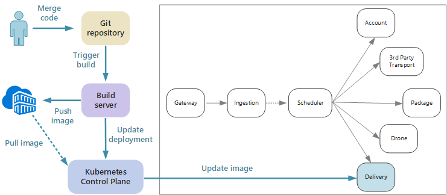

# Designing microservices: Continuous integration

Continuous integration and continuous delivery (CI/CD) are a key requirement for achieving success with microservices. Without a good CI/CD process, you will not achieve the agility that microservices promise. Some of the CI/CD challenges for microservices arise from having multiple code bases and heterogenous build environments for the various services. This chapter describes the challenges and recommends some approaches to the problem.

Faster release cycles are one of the biggest reasons to adopt a microservices architecture. 

In a purely monolithic application, there is a single build pipeline whose output is the application executable. All development work feeds into this pipeline. If a high-priority bug is found, a fix must be integrated, tested, and published, which can delay the release of new features. It's true that you can mitigate these problems by having well-factored modules and using feature branches to minimize the impact of code changes. But as the application grows more complex, and more features are added, the release process for a monolith tends to become more brittle and likely to break. 

Following the microservices philosophy, there should never be a long release train where every team has to get in line. The team that builds service "A" can release an update at any time, without waiting for changes in service "B" to be merged, tested, and deployed. The CI/CD process is critical to making this possible. Your release pipeline must be automated and highly reliable, so that the risks of deploying updates are minimized. If you are releasing to production daily or multiple times a day, regressions or service disruptions must be very rare. At the same time, if a bad update does get deployed, you must have a reliable way to quickly roll back or roll forward to a previous version of a service.

When we talk about CI/CD, we are really talking about several related processes: Continuous integration, continuous delivery, and continuous deployment.

- Continuous integration means that code changes are frequently merged into the main branch, using automated build and test processes to ensure that  code in the main branch is always production-quality.

- Continuous delivery means that code changes that pass the CI process are automatically published to a production-like environment. Deployment into the live production environment may require manual approval, but is otherwise automated. The goal is that your code should always be *ready* to deploy into production.

- Continuous deployment means that code changes that pass the CI/CD process are automatically deployed into production.

In the context of Kubernetes and microservices, the CI stage is concerned with building and testing container images, and pushing those images to a container registry. In the deployment stage, pod specs are updated to pick up the latest production image.

## Challenges

- **Many small independent code bases**. Each team is responsible for building its own service, with its own build pipeline. In some organizations, teams may use separate code repositories. This could lead to a situation where the knowledge of how to build the system is spread across teams, and nobody in the organization knows how to deploy the entire application. For example, what happens in a disaster recovery scenario, if you need to quickly deploy to a new cluster?   

- **Multiple languages and frameworks**. With each team using its own mix of technologies, it can be difficult to create a single build process that works across the organization. The build process must be flexible enough that every team can adapt it for their choice of language or framework. 

- **Integration and load testing**. With teams releasing updates at their own pace, it can be challenging to design robust end-to-end testing, especially when services have dependencies on other services. Moreover, running a full production cluster can be expensive, so it's unlikely that every team will be able to run its own full cluster at production scales, just for testing. 

- **Release management**. Every team should have the ability to deploy an update to production. That doesn't mean that every team member has permissions to do so. But having a centralized Release Manager role can reduce the velocity of deployments. The more that your CI/CD process is automated and reliable, the less there should be a need for a central authority. That said, you might have different policies for releasing major feature updates versus minor bug fixes. Being decentralized does not mean there should be zero governance.

- **Container image versioning**. During the development and test cycle, the CI/CD process will build many container images. Only some of those are candidates for release, and then only some of those release candidates will get pushed into production. You should have a clear versioning strategy, so that you know which images are currently deployed to production, and can roll back to a previous version if necessary. 

- **Service updates**. When you update a service to a new version, it shouldn't break other services that depend on it. If you do a rolling update, there will be a period of time when a mix of versions is running. 
 
These challenges reflect a fundamental tension. On the one hand, teams need to work as independently as possible. On the other hand, some coordination is needed so that a single person can do tasks like running an integration test, redeploying the entire solution to a new cluster, or rolling back a bad update. 
 
## CI/CD approaches for microservices

It's a good practice for every service team to containerize their build environment. This container should have all of the build tools necessary to build the code artifacts for their service. Often you can find an official Docker image for your language and framework. Then you can use `docker run` or Docker Compose to run the build. 

With this approach, it's trivial to set up a new build environment. A developer who wants to build your code doesn't need to install a set of build tools, but simply runs the container image. Perhaps more importantly, your build server can be configured to do the same thing. That way, you don't need to install those tools onto the build server, or manage conflicting versions of tools. 

For local development and testing, use Docker to run the service inside a container. As part of this process, you may need to run other containers that have mock services or test databases needed for local testing. You could use Docker Compose to coordinate these containers, or use Minikube to run Kubernetes locally. 

When the code is ready, open a pull request and merge into master. This will start a job on the build server:

1. Build the code assets. 
2. Run unit tests against the code.
3. Build the container image.
4. Test the container image by running functional tests on a running container. This step can catch errors in the Docker file, such as a bad entry point.
5. Push the image to a container registry.
6. Update the test cluster with the new image to run integration tests.

When the image is ready to go into production, update the deployment files as needed to specify the latest image, including any Kubernetes configuration files. Then apply the update to the production cluster.

Here are some recommendations for making deployments more reliable:
 
- Define organization-wide conventions for container tags, versioning, and naming conventions for resources deployed to the cluster (pods, services, and so on). That can make it easier to diagnose deployment issues. 

- Create two separate container registries, one for development/testing and one for production. Don't push an image to the production registry until you're ready to deploy it into production. If you combine this practice with semantic versioning of container images, it can reduce the chance of accidentally deploying a version that wasn't approved for release.

## Updating services

There are various strategies for updating a service that's already in production. Here we discuss three common options: Rolling update, blue-green deployment, and canary release.

### Rolling update 

In a rolling update, you deploy new instances of a service, and the new instances start receiving requests right away. As the new instances come up, the previous instances are removed.

Rolling updates are the default behavior in Kubernetes when you update the pod spec for a Deployment. The Deployment controller creates a new ReplicaSet for the updated pods. Then it scales up the new ReplicaSet while scaling down the old one, to maintain the desired replica count. It doesn't delete old pods until the new ones are ready. Kubernetes keeps a history of the update, so you can use kubectl to roll back an update if needed. 

If your service performs a long startup task, you can define a readiness probe. The readiness probe reports when the container is ready to start receiving traffic. Kubernetes won't send traffic to the pod until the probe reports success. 

One challenge of rolling updates is that during the update process, a mix of old and new versions are running and receiving traffic. During this period, any request could get routed to either of the two versions. That may or may not cause problems, depending on the scope of the changes between the two versions. 

### Blue-green deployment

In a blue-green deployment, you deploy the new version alongside the previous version. After you validate the new version, you switch all traffic at once from the previous version to the new version. After the switch, you monitor the application for any problems. If something goes wrong, you can swap back to the old version. Assuming there are no problems, you can delete the old version.

With a more traditional monolithic or N-tier application, blue-green deployment generally meant provisioning two identical environments. You would deploy the new version to a staging environment, then redirect client traffic to the staging environment &mdash; for example, by swapping VIP addresses.

In Kubernetes, you don't need to provision a separate cluster to do blue-green deployments. Instead, you can take advantage of selectors. Create a new Deployment resource with a new pod spec and a different set of labels. Create this deployment, without deleting the previous deployment or modifying the service that points to it. Once the new pods are running, you can update the service's selector to match the new deployment. 

An advantage of blue-green deployments is that the service switches all the pods at the same time. After the service is updated, all new requests get routed to the new version. One drawback is that during the update, you are running twice as many pods for the service (current and next). If the pods require a lot of CPU or memory resources, you may need to scale out the cluster temporarily to handle the resource consumption. 

### Canary release

In a canary release, you roll out an updated version to a small number of clients. Then you monitor the behavior of the new service before rolling it out to all clients. This lets you do a slow rollout in a controlled fashion, observe real data, and spot problems before all customers are affected.

A canary release is more complex to manage than either blue-green or rolling update, because you must dynamically route requests to different versions of the service. In Kubernetes, you can configure a Service to span two replica sets (one for each version) and adjust the replica counts manually. However, this approach is rather coarse-grained, because of the way Kubernetes load balances across pods. For example, if you have a total of ten replicas, you can only shift traffic in 10% increments. If you are using a service mesh, you can use the service mesh routing rules to implement a more sophisticated canary release strategy. Here are some resources that may be helpful:

- Kubernetes without service mesh: [Canary deployments](https://kubernetes.io/docs/concepts/cluster-administration/manage-deployment/#canary-deployments)
- Linkerd: [Dynamic request routing](https://linkerd.io/features/routing/)
- Istio: [Canary Deployments using Istio](https://istio.io/blog/canary-deployments-using-istio.html)

## Conclusion

In recent years, there has been a sea change in the industry, a movement from building *systems of record* to building *systems of engagement*.

Systems of record are traditional back-office data management applications. At the heart of these systems there often sits an RDBMS that is the single source of truth. The term "system of engagement" is credited to Geoffrey Moore, in his 2011 paper *Systems of Engagement and the Future of Enterprise IT*. Systems of engagement are applications focused on communication and collaboration. They connect people in real time. They must be available 24/7. New features are introduced regularly without taking the application offline. Users expect more and are less patient of unexpected delays or downtime.

In the consumer space, a better user experience can have measurable business value. The amount of time that a user engages with an application may translate directly into revenue. And in the realm of business systems, users' expectations have changed. If these systems aim to foster communication and collaboration, they must take their cue from consumer-facing applications.

Microservices are a response to this changing landscape. By decomposing a monolithic application into a group of loosely coupled services, we can control the release cycle of each service, and enable frequent updates without downtime or breaking changes. Microservices also help with scalability, failure isolation, and resiliency. Meanwhile, cloud platforms are making it easier to build and run microservices, with automated provisioning of compute resources, container orchestrators as a service, and event-driven serverless environments.

But as we've seen, microservices architectures also being a lot of challenges. To succeed, you must start from a solid design. You must put careful thought into analyzing the domain, choosing technologies, modeling data, designing APIs, and building a mature DevOps culture. We hope that this guide, and the accompanying [reference implementation](https://github.com/mspnp/microservices-reference-implementation), has helped to illuminate the journey. 

