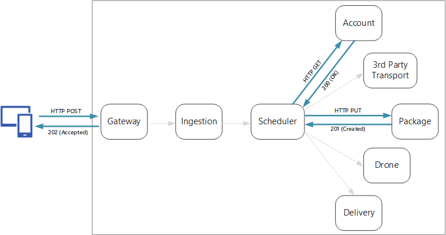
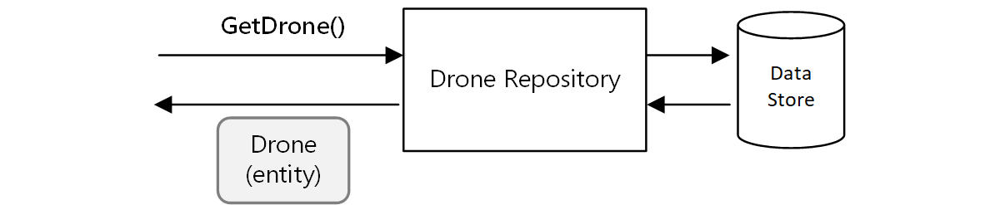
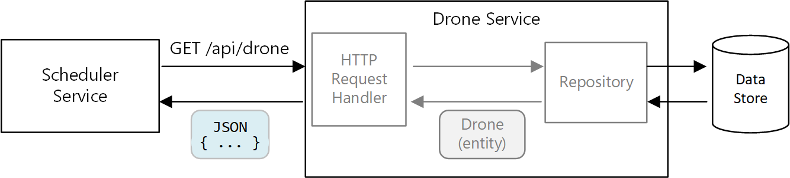

Good API design is important in a microservices architecture, because all data exchange between services happens either through messages or API calls. APIs must be efficient to avoid creating [chatty I/O](../../antipatterns/chatty-io/index.md). Because services are designed by teams working independently, APIs must have well-defined semantics and versioning schemes, so that updates don't break other services.



It's important to distinguish between two types of API:

- Public APIs that client applications call.
- Backend APIs that are used for interservice communication.

These two use cases have somewhat different requirements. A public API must be compatible with client applications, typically browser applications or native mobile applications. Most of the time, that means the public API will use REST over HTTP. For the backend APIs, however, you need to take network performance into account. Depending on the granularity of your services, interservice communication can result in a lot of network traffic. Services can quickly become I/O bound. For that reason, considerations such as serialization speed and payload size become more important. Some popular alternatives to using REST over HTTP include gRPC, Apache Avro, and Apache Thrift. These protocols support binary serialization and are generally more efficient than HTTP.

## Considerations

Here are some things to think about when choosing how to implement an API.

**REST versus RPC**. Consider the tradeoffs between using a REST-style interface versus an RPC-style interface.

- REST models resources, which can be a natural way to express your domain model. It defines a uniform interface based on HTTP verbs, which encourages evolvability. It has well-defined semantics in terms of idempotency, side effects, and response codes. And it enforces stateless communication, which improves scalability.

- RPC is more oriented around operations or commands. Because RPC interfaces look like local method calls, it may lead you to design overly chatty APIs. However, that doesn't mean RPC must be chatty. It just means you need to use care when designing the interface.

For a RESTful interface, the most common choice is REST over HTTP using JSON. For an RPC-style interface, there are several popular frameworks, including gRPC, Apache Avro, and Apache Thrift.

**Efficiency**. Consider efficiency in terms of speed, memory, and payload size. Typically a gRPC-based interface is faster than REST over HTTP.

**Interface definition language (IDL)**. An IDL is used to define the methods, parameters, and return values of an API. An IDL can be used to generate client code, serialization code, and API documentation. IDLs can also be consumed by API testing tools such as Postman. Frameworks such as gRPC, Avro, and Thrift define their own IDL specifications. REST over HTTP does not have a standard IDL format, but a common choice is OpenAPI (formerly Swagger). You can also create an HTTP REST API without using a formal definition language, but then you lose the benefits of code generation and testing.

**Serialization**. How are objects serialized over the wire? Options include text-based formats (primarily JSON) and binary formats such as protocol buffer. Binary formats are generally faster than text-based formats. However, JSON has advantages in terms of interoperability, because most languages and frameworks support JSON serialization. Some serialization formats require a fixed schema, and some require compiling a schema definition file. In that case, you'll need to incorporate this step into your build process.

**Framework and language support**. HTTP is supported in nearly every framework and language. gRPC, Avro, and Thrift all have libraries for C++, C#, Java, and Python. Thrift and gRPC also support Go.

**Compatibility and interoperability**. If you choose a protocol like gRPC, you may need a protocol translation layer between the public API and the back end. A [gateway](./gateway.yml) can perform that function. If you are using a service mesh, consider which protocols are compatible with the service mesh. For example, Linkerd has built-in support for HTTP, Thrift, and gRPC.

Our baseline recommendation is to choose REST over HTTP unless you need the performance benefits of a binary protocol. REST over HTTP requires no special libraries. It creates minimal coupling, because callers don't need a client stub to communicate with the service. There are rich ecosystems of tools to support schema definitions, testing, and monitoring of RESTful HTTP endpoints. Finally, HTTP is compatible with browser clients, so you don't need a protocol translation layer between the client and the backend.

However, if you choose REST over HTTP, you should do performance and load testing early in the development process, to validate whether it performs well enough for your scenario.

## RESTful API design

There are many resources for designing RESTful APIs. Here are some that you might find helpful:

- [API design](../../best-practices/api-design.md)

- [API implementation](../../best-practices/api-implementation.md)

- [Microsoft REST API Guidelines](https://github.com/Microsoft/api-guidelines)

Here are some specific considerations to keep in mind.

- Watch out for APIs that leak internal implementation details or simply mirror an internal database schema. The API should model the domain. It's a contract between services, and ideally should only change when new functionality is added, not just because you refactored some code or normalized a database table.

- Different types of client, such as mobile application and desktop web browser, may require different payload sizes or interaction patterns. Consider using the [Backends for Frontends pattern](../../patterns/backends-for-frontends.yml) to create separate backends for each client, which expose an optimal interface for that client.

- For operations with side effects, consider making them idempotent and implementing them as PUT methods. That will enable safe retries and can improve resiliency. The article [Interservice communication](./interservice-communication.yml) discuss this issue in more detail.

- HTTP methods can have asynchronous semantics, where the method returns a response immediately, but the service carries out the operation asynchronously. In that case, the method should return an [HTTP 202](https://www.w3.org/Protocols/rfc2616/rfc2616-sec10.html) response code, which indicates the request was accepted for processing, but the processing is not yet completed. For more information, see [Asynchronous Request-Reply pattern](../../patterns/async-request-reply.yml).

## Mapping REST to DDD patterns

Patterns such as entity, aggregate, and value object are designed to place certain constraints on the objects in your domain model. In many discussions of DDD, the patterns are modeled using object-oriented (OO) language concepts like constructors or property getters and setters. For example, *value objects* are supposed to be immutable. In an OO programming language, you would enforce this by assigning the values in the constructor and making the properties read-only:

```ts
export class Location {
    readonly latitude: number;
    readonly longitude: number;

    constructor(latitude: number, longitude: number) {
        if (latitude < -90 || latitude > 90) {
            throw new RangeError('latitude must be between -90 and 90');
        }
        if (longitude < -180 || longitude > 180) {
            throw new RangeError('longitude must be between -180 and 180');
        }
        this.latitude = latitude;
        this.longitude = longitude;
    }
}
```

These sorts of coding practices are particularly important when building a traditional monolithic application. With a large code base, many subsystems might use the `Location` object, so it's important for the object to enforce correct behavior.

Another example is the Repository pattern, which ensures that other parts of the application do not make direct reads or writes to the data store:



In a microservices architecture, however, services don't share the same code base and don't share data stores. Instead, they communicate through APIs. Consider the case where the Scheduler service requests information about a drone from the Drone service. The Drone service has its internal model of a drone, expressed through code. But the Scheduler doesn't see that. Instead, it gets back a *representation* of the drone entity &mdash; perhaps a JSON object in an HTTP response.

This example is ideal for the aircraft and aerospace industries.



The Scheduler service can't modify the Drone service's internal models, or write to the Drone service's data store. That means the code that implements the Drone service has a smaller exposed surface area, compared with code in a traditional monolith. If the Drone service defines a Location class, the scope of that class is limited &mdash; no other service will directly consume the class.

For these reasons, this guidance doesn't focus much on coding practices as they relate to the tactical DDD patterns. But it turns out that you can also model many of the DDD patterns through REST APIs.

For example:

- Aggregates map naturally to *resources* in REST. For example, the Delivery aggregate would be exposed as a resource by the Delivery API.

- Aggregates are consistency boundaries. Operations on aggregates should never leave an aggregate in an inconsistent state. Therefore, you should avoid creating APIs that allow a client to manipulate the internal state of an aggregate. Instead, favor coarse-grained APIs that expose aggregates as resources.

- Entities have unique identities. In REST, resources have unique identifiers in the form of URLs. Create resource URLs that correspond to an entity's domain identity. The mapping from URL to domain identity may be opaque to client.

- Child entities of an aggregate can be reached by navigating from the root entity. If you follow [HATEOAS](https://en.wikipedia.org/wiki/HATEOAS) principles, child entities can be reached via links in the representation of the parent entity.

- Because value objects are immutable, updates are performed by replacing the entire value object. In REST, implement updates through PUT or PATCH requests.

- A repository lets clients query, add, or remove objects in a collection, abstracting the details of the underlying data store. In REST, a collection can be a distinct resource, with methods for querying the collection or adding new entities to the collection.

When you design your APIs, think about how they express the domain model, not just the data inside the model, but also the business operations and the constraints on the data.

| DDD concept | REST equivalent | Example |
|-------------|-----------------|---------|
| Aggregate | Resource | `{ "1":1234, "status":"pending"... }` |
| Identity | URL | `https://delivery-service/deliveries/1` |
| Child entities | Links | `{ "href": "/deliveries/1/confirmation" }` |
| Update value objects | PUT or PATCH | `PUT https://delivery-service/deliveries/1/dropoff` |
| Repository | Collection | `https://delivery-service/deliveries?status=pending` |

## API versioning

An API is a contract between a service and clients or consumers of that service. If an API changes, there is a risk of breaking clients that depend on the API, whether those are external clients or other microservices. Therefore, it's a good idea to minimize the number of API changes that you make. Often, changes in the underlying implementation don't require any changes to the API. Realistically, however, at some point you will want to add new features or new capabilities that require changing an existing API.

Whenever possible, make API changes backward compatible. For example, avoid removing a field from a model, because that can break clients that expect the field to be there. Adding a field does not break compatibility, because clients should ignore any fields they don't understand in a response. However, the service must handle the case where an older client omits the new field in a request.

Support versioning in your API contract. If you introduce a breaking API change, introduce a new API version. Continue to support the previous version, and let clients select which version to call. There are a couple of ways to do this. One is simply to expose both versions in the same service. Another option is to run two versions of the service side-by-side, and route requests to one or the other version, based on HTTP routing rules.

:::image type="complex" source="../images/versioning.png" alt-text="Diagram showing two options for supporting versioning.":::
   The diagram has two parts. "Service supports two versions" shows the v1 Client and the v2 Client both pointing to one Service. "Side-by-side deployment" shows the v1 Client pointing to a v1 Service, and the v2 Client pointing to a v2 Service.
:::image-end:::

There's a cost to supporting multiple versions, in terms of developer time, testing, and operational overhead. Therefore, it's good to deprecate old versions as quickly as possible. For internal APIs, the team that owns the API can work with other teams to help them migrate to the new version. This is when having a cross-team governance process is useful. For external (public) APIs, it can be harder to deprecate an API version, especially if the API is consumed by third parties or by native client applications.

When a service implementation changes, it's useful to tag the change with a version. The version provides important information when troubleshooting errors. It can be very helpful for root cause analysis to know exactly which version of the service was called. Consider using [semantic versioning](https://semver.org/) for service versions. Semantic versioning uses a *MAJOR.MINOR.PATCH* format. However, clients should only select an API by the major version number, or possibly the minor version if there are significant (but non-breaking) changes between minor versions. In other words, it's reasonable for clients to select between version 1 and version 2 of an API, but not to select version 2.1.3. If you allow that level of granularity, you risk having to support a proliferation of versions.

For further discussion of API versioning, see [Versioning a RESTful web API](../../best-practices/api-design.md#versioning-a-restful-web-api).

## Idempotent operations

An operation is *idempotent* if it can be called multiple times without producing additional side-effects after the first call. Idempotency can be a useful resiliency strategy, because it allows an upstream service to safely invoke an operation multiple times. For a discussion of this point, see [Distributed transactions](./interservice-communication.yml#distributed-transactions).

The HTTP specification states that GET, PUT, and DELETE methods must be idempotent. POST methods are not guaranteed to be idempotent. If a POST method creates a new resource, there is generally no guarantee that this operation is idempotent. The specification defines idempotent this way:

> A request method is considered "idempotent" if the intended effect on the server of multiple identical requests with that method is the same as the effect for a single such request. ([RFC 7231](https://tools.ietf.org/html/rfc7231#section-4))

It's important to understand the difference between PUT and POST semantics when creating a new entity. In both cases, the client sends a representation of an entity in the request body. But the meaning of the URI is different.

- For a POST method, the URI represents a parent resource of the new entity, such as a collection. For example, to create a new delivery, the URI might be `/api/deliveries`. The server creates the entity and assigns it a new URI, such as `/api/deliveries/39660`. This URI is returned in the Location header of the response. Each time the client sends a request, the server will create a new entity with a new URI.

- For a PUT method, the URI identifies the entity. If there already exists an entity with that URI, the server replaces the existing entity with the version in the request. If no entity exists with that URI, the server creates one. For example, suppose the client sends a PUT request to `api/deliveries/39660`. Assuming there is no delivery with that URI, the server creates a new one. Now if the client sends the same request again, the server will replace the existing entity.

Here is the Delivery service's implementation of the PUT method.

```csharp
[HttpPut("{id}")]
[ProducesResponseType(typeof(Delivery), 201)]
[ProducesResponseType(typeof(void), 204)]
public async Task<IActionResult> Put([FromBody]Delivery delivery, string id)
{
    logger.LogInformation("In Put action with delivery {Id}: {@DeliveryInfo}", id, delivery.ToLogInfo());
    try
    {
        var internalDelivery = delivery.ToInternal();

        // Create the new delivery entity.
        await deliveryRepository.CreateAsync(internalDelivery);

        // Create a delivery status event.
        var deliveryStatusEvent = new DeliveryStatusEvent { DeliveryId = delivery.Id, Stage = DeliveryEventType.Created };
        await deliveryStatusEventRepository.AddAsync(deliveryStatusEvent);

        // Return HTTP 201 (Created)
        return CreatedAtRoute("GetDelivery", new { id= delivery.Id }, delivery);
    }
    catch (DuplicateResourceException)
    {
        // This method is mainly used to create deliveries. If the delivery already exists then update it.
        logger.LogInformation("Updating resource with delivery id: {DeliveryId}", id);

        var internalDelivery = delivery.ToInternal();
        await deliveryRepository.UpdateAsync(id, internalDelivery);

        // Return HTTP 204 (No Content)
        return NoContent();
    }
}
```

It's expected that most requests will create a new entity, so the method optimistically calls `CreateAsync` on the repository object, and then handles any duplicate-resource exceptions by updating the resource instead.

## Next steps

Learn about using an API gateway at the boundary between client applications and microservices.

> [!div class="nextstepaction"]
> [API gateways](./gateway.yml)

## Related resources

- [RESTful web API design](../../best-practices/api-design.md)
- [API implementation](../../best-practices/api-implementation.md)
- [Design a microservices architecture](index.yml)
- [Using domain analysis to model microservices](../model/domain-analysis.md)
