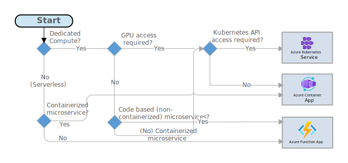

# Choose an Azure compute option for microservices

The term *compute* refers to the hosting model for the computing resources that your application runs on. This article aims to provide prescriptive guidance to choose a compute platform for microservices. The choice of microservice compute platform may vary based on more nuanced requirements.

For a microservices architecture, two approaches are especially popular:

- Microservices deployed on dedicated compute platforms, typically leveraging a microservice orchestrator.
- Microservices deployed on serverless platform.

While these aren't the only options, they are both proven approaches to building microservices. An application might include both approaches.

## Microservices leveraging serverless platform. 

You can leverage serverless platform for deploying Microservices on either Azure Container Apps, or on Azure Functions. Both Azure Container Apps and Azure Functions provide the option for serverless compute, where the billing is based on the volume of requests (and not on the compute consumption). Both Azure Container Apps and Azure Functions provide you the option to host the workloads on dedicated capacity as well. 

## Code based microservices vs Continerized microservices. 

If you do not wish to containerize the microservices and would like to deploy the microservice as code, you may want to choose either Azure Functions or Azure Spring Apps. Please note that the programming / scripting languages supported by Azure Functions are .NET, Java, Node.js, Python and PowerShell Core. For microservices developed in other languages, you may want to implement a custom handler in Azure function or consider containerizing the application. 

## Microservices leveraging GPU

If the microservice requires GPU capacity (for example, to execute machine learning tasks), Azure Container Apps and Azure Kubernetes Service are the platforms of choice. While Azure Kubernetes Service can [leverage any GPU models in Azure](/azure/aks/gpu-cluster), Azure Container Apps offer a [subset of GPU models to select from](/azure/container-apps/workload-profiles-overview). 

## Compute platform for Java Spring based microservices 

Azure Spring Apps is an ideal choice for deploying Spring based microservices. Spring Apps supports deploying both code based and container based spring microservices. You can also deploy spring based microservices in Azure functions, or deploy spring containers in other orchestrator based compute platforms such as Azure Kubernetes Services or Azure Container Apps as well. Compared to other computing choices, Azure Spring Apps provides certain advantages to deploying Spring microservices, such as configuration management, service discovery, blue-green deployments etc. 

## Microservices leveraging service orchestrators. 

An orchestrator handles tasks related to deploying and managing a set of services. These tasks include placing services on nodes, monitoring the health of services, restarting unhealthy services, load balancing network traffic across service instances, service discovery, scaling the number of instances of a service, and applying configuration updates. Popular orchestrators include Kubernetes, Service Fabric, DC/OS, and Docker Swarm.

On the Azure platform, consider the following options:

- [Azure Kubernetes Service (AKS)](/azure/aks/) is a managed Kubernetes service. AKS provisions Kubernetes and exposes the Kubernetes API endpoints, hosts and manages the Kubernetes control plane, performing automated upgrades, automated patching, autoscaling, and other management tasks. Azure Kubernetes Service provides you direct access to Kubernetes APIs. 

- [Azure Container Apps](/azure/container-apps) is a managed service built on Kubernetes that abstracts the complexities of container orchestration and other management tasks. Container Apps simplifies the deployment and management of containerized applications and microservices in a serverless environment while providing the features of Kubernetes. Azure Container Apps is ideal for scenarios where direct access to Kubernetes APIs are not required. 

- [Azure Spring Apps](/azure/spring-apps/) is a fully managed service that helps Spring developers focus on code, not on infrastructure. You can deploy any type of Spring app—including web apps, microservices, event-driven, serverless, and batch in Azure Spring Apps environment.  Azure Spring Apps provides lifecycle management using comprehensive monitoring and diagnostics, configuration management, service discovery, CI/CD integration, blue-green deployments, and more.

- [Service Fabric](/azure/service-fabric/) is a distributed systems platform for packaging, deploying, and managing microservices. Microservices can be deployed to Service Fabric as containers, as binary executables, or as [Reliable Services](/azure/service-fabric/service-fabric-reliable-services-introduction). Using the Reliable Services programming model, services can directly use Service Fabric programming APIs to query the system, report health, receive notifications about configuration and code changes, and discover other services.

- [Azure RedHat OpenShift](/azure/openshift) enables you to deploy fully managed OpenShift clusters. Azure Red Hat OpenShift extends Kubernetes. Azure Red Hat OpenShift is jointly engineered, operated, and supported by Red Hat and Microsoft.

- Other options such as Docker Enterprise Edition can run in an IaaS environment on Azure. You can find deployment templates on [Azure Marketplace](https://azuremarketplace.microsoft.com).

### Microservices leveraging Kubernetes APIs

Access to Kubernetes APIs is often a deciding factor - Azure Kubernetes Service provides direct access to Kubernetes APIs, while Azure Container Apps does not. Azure Container Apps hides the complexities of Kubernetes and simplifies the container deployment experience. However, if the microservice deployment is designed to directly interact with Kubernetes APIs, Azure Kubernetes Service may be the right choice. 

### Other decision factors

There may be other decision factors impacting the choice of microservice compute platform selection. They include the use and choice of service mesh, platform scalability, skill set within the organization etc. 

## Considerations
These considerations implement the pillars of the Azure Well-Architected Framework, which is a set of guiding tenets that you can use to improve the quality of a workload. For more information, see Microsoft Azure Well-Architected Framework.

### Reliability

Reliability ensures that your application can meet the commitments that you make to your customers. For more information, see Overview of the [reliability pillar](/architecture/framework/resiliency/overview). 

One of the key pillars of reliability is resiliency. The goal of resiliency is to return the application to a fully functioning state after a failure occurs. 

If you choose Azure functions as the microservice computing platform, consider deploying the function plan or app service plan in zone-redundant configuration. Please see [reliability in Azure functions](/reliability/reliability-functions?tabs=azure-portal) for details. 

If you choose Azure Kubernetes Service as the microservice computing platorm, microservice reliability can be enhanced by deploying [AKS cluster using availability zones](/aks/availability-zones), using [Standard or Premium tier](/aks/free-standard-pricing-tiers) for Azure Kubernetes Cluster, increasing the minimum number of pods and nodes, etc. Please see [deployment and cluster reliability best practices for AKS](aks/best-practices-app-cluster-reliability) for details. 

If you choose Azure Container Apps as the microservice computing platform, reliability can be enhanced by leveraging availability zones. Please see [reliability in container apps](/reliability/reliability-azure-container-apps) for details. 

If you choose Azure Spring Apps as the microservice computing platform, reliability can be enhanced by leveraging availability zones and by leveraging multi-region deployments. Please see [reliability in azure spring apps](/azure/reliability/reliability-spring-apps) for details. 

### Security
Security provides assurances against deliberate attacks and the abuse of your valuable data and systems. For more information, see Overview of the security pillar.

If you choose Azure functions as the compute platform to deploy microservices, the principles of [securing in Azure functions](azure/azure-functions/security-concepts) apply to microservices as well. 

If you choose Azure Kubernetes Service as the compute platform to deploy microservices, [AKS security baseline architecture](/security/benchmark/azure/baselines/azure-kubernetes-service-aks-security-baseline) provides guidance of securing the compute platform. Please refer to [Advanced AKS microservice architecture](/azure/architecture/reference-architectures/containers/aks-microservices/aks-microservices-advanced) for best practices on microservice security on Azure Kubernetes Service. 

If Azure Spring Apps is the compute platform of choice to deploy microservices, please follow the guidance [securing spring app communications end to end](/azure/spring-apps/enterprise/secure-communications-end-to-end) to understand the best practices around application security in Azure Spring Apps.

If Azure Container Apps is the compute platform of choice to deploy microservices, please refer the [security baseline for Azure Container Apps](/en-us/security/benchmark/azure/baselines/azure-container-apps-security-baseline) for security best practices. 

### Cost management 

With an orchestrator, you pay for the VMs that are running in the cluster. With a serverless application, you pay only for the actual compute resources consumed. In both cases, you need to factor in the cost of any additional services, such as storage, databases, and messaging services.

Azure Functions, Azure Container Apps, Azure Kubernetes Service and Azure Spring Apps provides you auto-scaling options. 

### Operational excellence
Operational excellence covers the operations processes that deploy an application and keep it running in production. For more information, see Overview of the operational excellence pillar.

All of the microservice compute choices described in this article can be deployed in an automated manner using Terraform, Bicep, and other scripting languages. Azure application insights, Azure monitor and other monitoring solutions can be leveraged to monitor these compute platforms and the microservices. 

**Flexibility and control**. An orchestrator gives you a great deal of control over configuring and managing your services and the cluster. The tradeoff is additional complexity. With a serverless architecture, you give up some degree of control because these details are abstracted.

**Portability**. All of the orchestrators listed here (Kubernetes, DC/OS, Docker Swarm, and Service Fabric) can run on-premises or in multiple public clouds.

**Application integration**. It can be challenging to build a complex application using a serverless architecture, due to the need to coordinate, deploy, and manage many small independent functions. One option in Azure is to use [Azure Logic Apps](/azure/logic-apps/) to coordinate a set of Azure Functions. For an example of this approach, see [Create a function that integrates with Azure Logic Apps](/azure/azure-functions/functions-twitter-email).

## Next steps

> [!div class="nextstepaction"]
> [Interservice communication](./interservice-communication.yml)

## Related resources

- [Using domain analysis to model microservices](../model/domain-analysis.md)
- [Design a microservices architecture](index.yml)
- [Expose Azure Spring Apps through a reverse proxy](../../web-apps/spring-apps/guides/spring-cloud-reverse-proxy.yml)
- [Design APIs for microservices](../design/api-design.yml)
