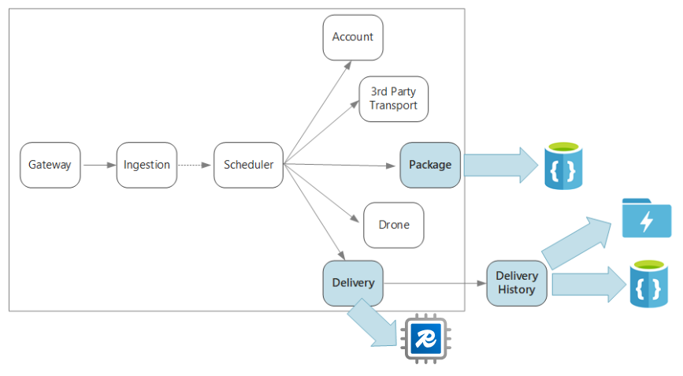

This article describes considerations for managing data in a microservices architecture. Because every microservice manages its own data, data integrity and data consistency are critical challenges.

A basic principle of microservices is that each service manages its own data. Two services should not share a data store. Instead, each service is responsible for its own private data store, which other services cannot access directly.

The reason for this rule is to avoid unintentional coupling between services, which can result if services share the same underlying data schemas. If there is a change to the data schema, the change must be coordinated across every service that relies on that database. By isolating each service's data store, we can limit the scope of change, and preserve the agility of truly independent deployments. Another reason is that each microservice may have its own data models, queries, or read/write patterns. Using a shared data store limits each team's ability to optimize data storage for their particular service.

This approach naturally leads to [polyglot persistence](https://martinfowler.com/bliki/PolyglotPersistence.html) &mdash; the use of multiple data storage technologies within a single application. One service might require the schema-on-read capabilities of a document database. Another might need the referential integrity provided by an RDBMS. Each team is free to make the best choice for their service. For more about the general principle of polyglot persistence, see [Use the best data store for the job](/azure/architecture/guide/design-principles/use-best-data-store).

> [!NOTE]
> It's fine for services to share the same physical database server. The problem occurs when services share the same schema, or read and write to the same set of database tables.

## Challenges

Some challenges arise from this distributed approach to managing data. First, there may be redundancy across the data stores, with the same item of data appearing in multiple places. For example, data might be stored as part of a transaction, then stored elsewhere for analytics, reporting, or archiving. Duplicated or partitioned data can lead to issues of data integrity and consistency. When data relationships span multiple services, you can't use traditional data management techniques to enforce the relationships.

Traditional data modeling uses the rule of "one fact in one place." Every entity appears exactly once in the schema. Other entities may hold references to it but not duplicate it. The obvious advantage to the traditional approach is that updates are made in a single place, which avoids problems with data consistency. In a microservices architecture, you have to consider how updates are propagated across services, and how to manage eventual consistency when data appears in multiple places without strong consistency.

## Approaches to managing data

There is no single approach that's correct in all cases, but here are some general guidelines for managing data in a microservices architecture.

- Embrace eventual consistency where possible. Understand the places in the system where you need strong consistency or ACID transactions, and the places where eventual consistency is acceptable.

- When you need strong consistency guarantees, one service may represent the source of truth for a given entity, which is exposed through an API. Other services might hold their own copy of the data, or a subset of the data, that is eventually consistent with the master data but not considered the source of truth. For example, imagine an e-commerce system with a customer order service and a recommendation service. The recommendation service might listen to events from the order service, but if a customer requests a refund, it is the order service, not the recommendation service, that has the complete transaction history.

- For transactions, use patterns such as [Scheduler Agent Supervisor](../../patterns/scheduler-agent-supervisor.yml) and [Compensating Transaction](../../patterns/compensating-transaction.yml) to keep data consistent across several services.  You may need to store an additional piece of data that captures the state of a unit of work that spans multiple services, to avoid partial failure among multiple services. For example, keep a work item on a durable queue while a multi-step transaction is in progress.

- Store only the data that a service needs. A service might only need a subset of information about a domain entity. For example, in the Shipping bounded context, we need to know which customer is associated to a particular delivery. But we don't need the customer's billing address &mdash; that's managed by the Accounts bounded context. Thinking carefully about the domain, and using a DDD approach, can help here.

- Consider whether your services are coherent and loosely coupled. If two services are continually exchanging information with each other, resulting in chatty APIs, you may need to redraw your service boundaries, by merging two services or refactoring their functionality.

- Use an [event driven architecture style](../../guide/architecture-styles/event-driven.yml). In this architecture style, a service publishes an event when there are changes to its public models or entities. Interested services can subscribe to these events. For example, another service could use the events to construct a materialized view of the data that is more suitable for querying.

- A service that owns events should publish a schema that can be used to automate serializing and deserializing the events, to avoid tight coupling between publishers and subscribers. Consider JSON schema or a framework like [Microsoft Bond](https://github.com/Microsoft/bond), Protobuf, or Avro.

- At high scale, events can become a bottleneck on the system, so consider using aggregation or batching to reduce the total load.

## Example: Choosing data stores for the Drone Delivery application

The previous articles in this series discuss a drone delivery service as a running example. You can read more about the scenario and the corresponding reference implementation [here](./index.yml). This example is ideal for the aircraft and aerospace industries.

To recap, this application defines several microservices for scheduling deliveries by drone. When a user schedules a new delivery, the client request includes information about the delivery, such as pickup and dropoff locations, and about the package, such as size and weight. This information defines a unit of work.

The various backend services care about different portions of the information in the request, and also have different read and write profiles.

### Delivery service

The Delivery service stores information about every delivery that is currently scheduled or in progress. It listens for events from the drones, and tracks the status of deliveries that are in progress. It also sends domain events with delivery status updates.

It's expected that users will frequently check the status of a delivery while they are waiting for their package. Therefore, the Delivery service requires a data store that emphasizes throughput (read and write) over long-term storage. Also, the Delivery service does not perform any complex queries or analysis, it simply fetches the latest status for a given delivery. The Delivery service team chose Azure Cache for Redis for its high read-write performance. The information stored in Redis is relatively short-lived. Once a delivery is complete, the Delivery History service is the system of record.

### Delivery History service

The Delivery History service listens for delivery status events from the Delivery service. It stores this data in long-term storage. There are two different use-cases for this historical data, which have different data storage requirements.

The first scenario is aggregating the data for the purpose of data analytics, in order to optimize the business or improve the quality of the service. Note that the Delivery History service doesn't perform the actual analysis of the data. It's only responsible for the ingestion and storage. For this scenario, the storage must be optimized for data analysis over a large set of data, using a schema-on-read approach to accommodate a variety of data sources. [Azure Data Lake Store](/azure/data-lake-store/) is a good fit for this scenario. Data Lake Store is an Apache Hadoop file system compatible with Hadoop Distributed File System (HDFS), and is tuned for performance for data analytics scenarios.

The other scenario is enabling users to look up the history of a delivery after the delivery is completed. Azure Data Lake is not optimized for this scenario. For optimal performance, Microsoft recommends storing time-series data in Data Lake in folders partitioned by date. (See [Tuning Azure Data Lake Store for performance](/azure/data-lake-store/data-lake-store-performance-tuning-guidance)). However, that structure is not optimal for looking up individual records by ID. Unless you also know the timestamp, a lookup by ID requires scanning the entire collection. Therefore, the Delivery History service also stores a subset of the historical data in Azure Cosmos DB for quicker lookup. The records don't need to stay in Azure Cosmos DB indefinitely. Older deliveries can be archived &mdash; say, after a month. This could be done by running an occasional batch process. Archiving older data can reduce costs for Cosmos DB while still keeping the data available for historical reporting from the Data Lake.

### Package service

The Package service stores information about all of the packages. The storage requirements for the Package are:

- Long-term storage.
- Able to handle a high volume of packages, requiring high write throughput.
- Support simple queries by package ID. No complex joins or requirements for referential integrity.

Because the package data is not relational, a document-oriented database is appropriate, and Azure Cosmos DB can achieve high throughput by using sharded collections. The team that works on the Package service is familiar with the MEAN stack (MongoDB, Express.js, AngularJS, and Node.js), so they select the [MongoDB API](/azure/cosmos-db/mongodb-introduction) for Azure Cosmos DB. That lets them leverage their existing experience with MongoDB, while getting the benefits of Azure Cosmos DB, which is a managed Azure service.

## Next steps

Learn about design patterns that can help mitigate some common challenges in a microservices architecture.

> [!div class="nextstepaction"]
> [Design patterns for microservices](./patterns.yml)

## Related resources

- [Using domain analysis to model microservices](../model/domain-analysis.md)
- [Design a microservices architecture](index.yml)
- [Design APIs for microservices](api-design.yml)
- [Microservices architecture design](../../microservices/index.yml)
