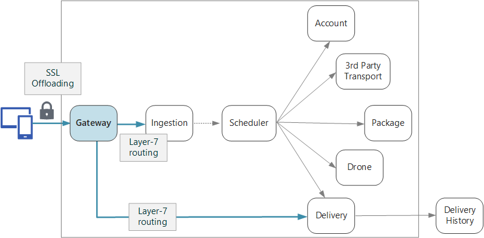

In a microservices architecture, a client might interact with more than one front-end service. Given this fact, how does a client know what endpoints to call? What happens when new services are introduced, or existing services are refactored? How do services handle SSL termination, authentication, and other concerns? An *API gateway* can help to address these challenges.

*Download a [Visio file](https://arch-center.azureedge.net/gateway.vsdx) of this architecture.*

## What is an API gateway?

An API gateway sits between clients and services. It acts as a reverse proxy, routing requests from clients to services. It may also perform various cross-cutting tasks such as authentication, SSL termination, and rate limiting. If you don't deploy a gateway, clients must send requests directly to front-end services. However, there are some potential problems with exposing services directly to clients:

- It can result in complex client code. The client must keep track of multiple endpoints, and handle failures in a resilient way.
- It creates coupling between the client and the backend. The client needs to know how the individual services are decomposed. That makes it harder to maintain the client and also harder to refactor services.
- A single operation might require calls to multiple services. That can result in multiple network round trips between the client and the server, adding significant latency.
- Each public-facing service must handle concerns such as authentication, SSL, and client rate limiting.
- Services must expose a client-friendly protocol such as HTTP or WebSocket. This limits the choice of [communication protocols](./interservice-communication.yml).
- Services with public endpoints are a potential attack surface, and must be hardened.

A gateway helps to address these issues by decoupling clients from services. Gateways can perform a number of different functions, and you may not need all of them. The functions can be grouped into the following design patterns:

[Gateway Routing](../../patterns/gateway-routing.yml). Use the gateway as a reverse proxy to route requests to one or more backend services, using layer 7 routing. The gateway provides a single endpoint for clients, and helps to decouple clients from services.

[Gateway Aggregation](../../patterns/gateway-aggregation.yml). Use the gateway to aggregate multiple individual requests into a single request. This pattern applies when a single operation requires calls to multiple backend services. The client sends one request to the gateway. The gateway dispatches requests to the various backend services, and then aggregates the results and sends them back to the client. This helps to reduce chattiness between the client and the backend.

[Gateway Offloading](../../patterns/gateway-offloading.yml). Use the gateway to offload functionality from individual services to the gateway, particularly cross-cutting concerns. It can be useful to consolidate these functions into one place, rather than making every service responsible for implementing them. This is particularly true for features that require specialized skills to implement correctly, such as authentication and authorization.

Here are some examples of functionality that could be offloaded to a gateway:

- SSL termination
- Authentication
- IP allowlist or blocklist
- Client rate limiting (throttling)
- Logging and monitoring
- Response caching
- Web application firewall
- GZIP compression
- Servicing static content

## Choosing a gateway technology

Here are some options for implementing an API gateway in your application.

- **Reverse proxy server**. Nginx and HAProxy are popular reverse proxy servers that support features such as load balancing, SSL, and layer 7 routing. They are both free, open-source products, with paid editions that provide additional features and support options. Nginx and HAProxy are both mature products with rich feature sets and high performance. You can extend them with third-party modules or by writing custom scripts in Lua. Nginx also supports a JavaScript-based scripting module referred to as [NGINX JavaScript](https://www.nginx.com/blog/introduction-nginscript/). This module was formally named nginScript.

- **Service mesh ingress controller**. If you are using a service mesh such as Linkerd or Istio, consider the features that are provided by the ingress controller for that service mesh. For example, the Istio ingress controller supports layer 7 routing, HTTP redirects, retries, and other features.

- [Azure Application Gateway](/azure/application-gateway/). Application Gateway is a managed load balancing service that can perform layer-7 routing and SSL termination. It also provides a web application firewall (WAF).

- [Azure Front Door](/azure/frontdoor/front-door-overview) is Microsoft’s modern cloud Content Delivery Network (CDN) that provides fast, reliable, and secure access between your users and your applications’ static and dynamic web content across the globe. Azure Front Door delivers your content using the Microsoft’s global edge network with hundreds of global and local points of presence (PoPs) distributed around the world close to both your enterprise and consumer end users.

- [Azure API Management](/azure/api-management/). API Management is a turnkey solution for publishing APIs to external and internal customers. It provides features that are useful for managing a public-facing API, including rate limiting, IP restrictions, and authentication using Azure Active Directory or other identity providers. API Management doesn't perform any load balancing, so it should be used in conjunction with a load balancer such as Application Gateway or a reverse proxy. For information about using API Management with Application Gateway, see [Integrate API Management in an internal VNet with Application Gateway](/azure/api-management/api-management-howto-integrate-internal-vnet-appgateway).

When choosing a gateway technology, consider the following:

**Features**. The options listed above all support layer 7 routing, but support for other features will vary. Depending on the features that you need, you might deploy more than one gateway.

**Deployment**. Azure Application Gateway and API Management are managed services. Nginx and HAProxy will typically run in containers inside the cluster, but can also be deployed to dedicated VMs outside of the cluster. This isolates the gateway from the rest of the workload, but incurs higher management overhead.

**Management**. When services are updated or new services are added, the gateway routing rules might need to be updated. Consider how this process will be managed. Similar considerations apply to managing SSL certificates, IP allowlists, and other aspects of configuration.

## Deploying Nginx or HAProxy to Kubernetes

You can deploy Nginx or HAProxy to Kubernetes as a [ReplicaSet](https://kubernetes.io/docs/concepts/workloads/controllers/replicaset/) or [DaemonSet](https://kubernetes.io/docs/concepts/workloads/controllers/daemonset/) that specifies the Nginx or HAProxy container image. Use a ConfigMap to store the configuration file for the proxy, and mount the ConfigMap as a volume. Create a service of type LoadBalancer to expose the gateway through an Azure Load Balancer.

An alternative is to create an Ingress Controller. An Ingress Controller is a Kubernetes resource that deploys a load balancer or reverse proxy server. Several implementations exist, including Nginx and HAProxy. A separate resource called an Ingress defines settings for the Ingress Controller, such as routing rules and TLS certificates. That way, you don't need to manage complex configuration files that are specific to a particular proxy server technology.

The gateway is a potential bottleneck or single point of failure in the system, so always deploy at least two replicas for high availability. You may need to scale out the replicas further, depending on the load.

Also consider running the gateway on a dedicated set of nodes in the cluster. Benefits to this approach include:

- Isolation. All inbound traffic goes to a fixed set of nodes, which can be isolated from backend services.

- Stable configuration. If the gateway is misconfigured, the entire application may become unavailable.

- Performance. You may want to use a specific VM configuration for the gateway for performance reasons.

## Next steps

The previous articles have looked at the interfaces *between* microservices or between microservices and client applications. By design, these interfaces treat each service as an opaque box. In particular, microservices should never expose implementation details about how they manage data. That has implications for data integrity and data consistency, explored in the next article.

> [!div class="nextstepaction"]
> [Data considerations for microservices](./data-considerations.yml)

## Related resources

- [Design APIs for microservices](api-design.yml)
- [Design a microservices architecture](index.yml)
- [Using domain analysis to model microservices](../model/domain-analysis.md)
- [Microservices assessment and readiness](../../guide/technology-choices/microservices-assessment.md)
