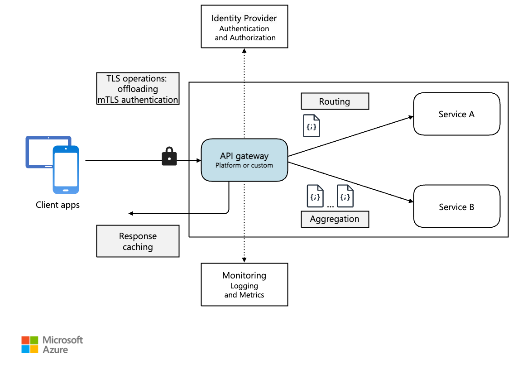

In a microservices architecture, a client might interact with more than one front-end service. Given this fact, how does a client know what endpoints to call? What happens when new services are introduced, or existing services are refactored? How do services handle SSL termination, mutual TLS, authentication, and other concerns? An *API gateway* can help to address these challenges.

*Download a [Visio file](https://arch-center.azureedge.net/gateway.vsdx) of this architecture.*

## What is an API gateway?

An API gateway provides a centralized entry point for managing interactions between clients and application services. It acts as a reverse proxy and routes clients requests to the appropriate services. It can also perform various cross-cutting tasks such as authentication, SSL termination, mutual TLS, and rate limiting.

## Why use an API gateway?

An API gateway simplifies communication, enhances client interactions, and centralizes the management of common service-level responsibilities. It acts as an intermediary, and it prevents direct exposure of application services to clients. Without an API gateway, clients must communicate directly with individual application services, which can introduce the following challenges:

- **Complex client code**: It can result in complex client code. Clients must track multiple endpoints and handle failures resiliently.

- **Tight coupling**: It creates coupling between the client and the backend. Clients need to understand decomposition of individual services, complicating service maintenance and refactoring.

- **Increased latency**: A single operation might require calls to multiple services. The result can be multiple network round trips between the client and the server, adding significant latency.

- **Redundant handling of concerns**: Each public-facing service must handle concerns such as authentication, SSL, and client rate limiting.

- **Protocol limitations**: Services must expose a client-friendly protocol such as HTTP or WebSocket. This exposure limits [communication protocols](./interservice-communication.yml) options.

- **Expanded attack surface**: Public endpoints increase the potential attack surface and require hardening.

## How to use an API gateway

An API gateway can be tailored to your application’s requirements by using specific design patterns. These design patterns address key functionality such as routing, request aggregation, and cross-cutting concerns:

- [Gateway routing](../../patterns/gateway-routing.yml). You can use an API gateway as a reverse proxy to route client requests to different application services. The API gateway uses layer-7 routing and provides a single endpoint for clients to use. Use API gateway routing when you want to decouple clients from application services.

- [Gateway aggregation](../../patterns/gateway-aggregation.yml). You can use the API gateway to aggregate multiple client requests into a single request. Use this pattern when a single operation requires calls to multiple application services. In API aggregation, the client sends one request to the API gateway. Then, the API gateway routes requests to the various services required for the operations. Finally, the API gateway aggregates the results and sends them back to the client. The aggregation helps reduce chattiness between the client and the application services.

- [Gateway offloading](../../patterns/gateway-offloading.yml). You can use an API gateway to provide cross-cutting functionality, so individual services don't have to provide it. Here are some examples of functionality that could be offloaded to an API gateway:

    - SSL termination
    - Mutal TLS
    - Authentication
    - IP allowlist or blocklist
    - Client rate limiting (throttling)
    - Logging and monitoring
    - Response caching
    - Web application firewall
    - GZIP compression
    - Servicing static content

     It can be useful to consolidate these functions into one place, rather than making every service responsible for implementing them. Offloading is helpful for features that require specialized skills to implement, such as authentication and authorization.

## API gateway options

Here are some options for implementing an API gateway in your application.

- **Reverse proxy server**. Nginx and HAProxy are open-source reverse proxy servers. They support features such as load balancing, SSL termination, and layer-7 routing. They have free versions and paid editions that provide extra features and support options. Nginx and HAProxy are both mature products with rich feature sets and high performance. You can extend each with third-party modules or by writing custom scripts in Lua. Nginx also supports a JavaScript-based scripting module referred to as NGINX JavaScript, formally named *nginScript*.

- **Service mesh ingress controller**. If you're using a service mesh, such as Linkerd or Istio, consider the features that are provided by the ingress controller for that service mesh. For example, the Istio ingress controller supports layer 7 routing, HTTP redirects, retries, and other features.

- **[Azure Application Gateway](/azure/application-gateway/)**. Application Gateway is a managed load balancing service. It provides perform layer-7 routing, SSL termination, and a web application firewall (WAF).

- **[Azure Front Door](/azure/frontdoor/front-door-overview)**. Azure Front Door is a content delivery network (CDN). It uses global and local points of presence (PoPs) to provide fast, reliable, and secure access to your applications' static and dynamic web content globally.

- **[Azure API Management](/azure/api-management/)**. API Management is a managed solution for publishing APIs to external and internal customers. It provides features to manage public-facing APIs, including rate limiting, IP restrictions, and authentication using Microsoft Entra ID or other identity providers. API Management doesn't perform any load balancing, so you should use it with a load balancer, such as Azure Application Gateway, or a reverse proxy. For information, see [API Management with Azure Application Gateway](/azure/api-management/api-management-howto-integrate-internal-vnet-appgateway).

## Choosing an API gateway technology

When selecting an API gateway, consider the following factors:

**Available features**. All the previous [API gateway options](#api-gateway-options) support layer-7 routing, but support for other features can vary. Evaluate your requirements, such as authentication, rate limiting, or SSL termination. Determine whether a single gateway is sufficient or if you need multiple gateways to meet your needs.

**Deployment options**. Azure Application Gateway and Azure API Management are managed Azure services. However, Nginx and HAProxy aren't. They typically run in containers inside a cluster. You can also deploy Nginx and HAProxy to dedicated virtual machines outside of a cluster. Deployment outside a cluster isolates the API gateway from the rest of the workload, but it creates more management overhead.

**Management overhead**. When you update services or add new ones, you might need to update the gateway routing rules. Consider how to manage this process. Also, consider how to manage SSL certificates, IP allowlists, and other aspects of API gateway configuration.

## Deploying Nginx or HAProxy to Kubernetes

You can deploy Nginx or HAProxy to Kubernetes as a [ReplicaSet](https://kubernetes.io/docs/concepts/workloads/controllers/replicaset/) or [DaemonSet](https://kubernetes.io/docs/concepts/workloads/controllers/daemonset/) that specifies the Nginx or HAProxy container image. Use a ConfigMap to store the configuration file for the proxy and mount the ConfigMap as a volume. Create a service of type LoadBalancer to expose the gateway through an Azure Load Balancer.

An alternative is to create an Ingress Controller. An Ingress Controller is a Kubernetes resource that deploys a load balancer or reverse proxy server. Several implementations exist, including Nginx and HAProxy. A separate resource called an Ingress defines settings for the Ingress Controller, such as routing rules and TLS certificates. This setup means you don't need to manage complex configuration files that are specific to a particular proxy server technology.

The API gateway is a potential bottleneck or single point of failure in the system. Always deploy at least two replicas for high availability. You might need to scale out the replicas further, depending on the load.

Also consider running the gateway on a dedicated set of nodes in the cluster. Benefits to this approach include:

- **Isolation**: All inbound traffic goes to a fixed set of nodes, which can be isolated from backend services.

- **Stable configuration**: If the gateway is misconfigured, the entire application might become unavailable.

- **Performance**: You might want to use a specific virtual machine configuration for the gateway for performance reasons.

## Next steps

Previous articles explored the interfaces *between* microservices and between microservices and client applications. These interfaces treat each service as a self-contained, opaque unit. A critical principle of microservices architecture is that services should never expose internal details about how they manage data. This approach has significant implications for maintaining data integrity and consistency, which is the subject of the next article.

> [!div class="nextstepaction"]
> [Data considerations for microservices](./data-considerations.yml)

## Related resources

- [Design APIs for microservices](api-design.yml)
- [Design a microservices architecture](index.yml)
- [Using domain analysis to model microservices](../model/domain-analysis.md)
- [Microservices assessment and readiness](../../guide/technology-choices/microservices-assessment.md)
