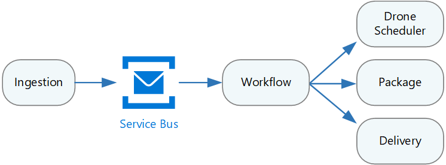

Microservices have become a popular architectural style for building cloud applications that are resilient, highly scalable, independently deployable, and able to evolve quickly. To be more than just a buzzword, however, microservices require a different approach to designing and building applications.

In this set of articles, we explore how to build a microservices architecture on Azure. Topics include:

- [Compute options for microservices](./compute-options.md)
- [Interservice communication](./interservice-communication.yml)
- [API design](./api-design.yml)
- [API gateways](./gateway.yml)
- [Data considerations](./data-considerations.yml)
- [Design patterns](./patterns.yml)

## Prerequisites

Before reading these articles, you might start with the following:

- [Introduction to microservices architectures](../index.yml). Understand the benefits and challenges of microservices, and when to use this style of architecture.
- [Using domain analysis to model microservices](../model/domain-analysis.md). Learn a domain-driven approach to modeling microservices.

## Reference implementation

To illustrate best practices for a microservices architecture, we created a reference implementation that we call the Drone Delivery application. This implementation runs on Kubernetes using Azure Kubernetes Service (AKS). You can find the reference implementation on [GitHub][drone-ri].

*Download a [Visio file](https://arch-center.azureedge.net/design-microservice-drone-delivery-imp.vsdx) of this architecture.*

## Scenario

Fabrikam, Inc. is starting a drone delivery service. The company manages a fleet of drone aircraft. Businesses register with the service, and users can request a drone to pick up goods for delivery. When a customer schedules a pickup, a backend system assigns a drone and notifies the user with an estimated delivery time. While the delivery is in progress, the customer can track the location of the drone, with a continuously updated ETA. 

This solution is ideal for the aerospace and aircraft industries.

This scenario involves a fairly complicated domain. Some of the business concerns include scheduling drones, tracking packages, managing user accounts, and storing and analyzing historical data. Moreover, Fabrikam wants to get to market quickly and then iterate quickly, adding new functionality and capabilities. The application needs to operate at cloud scale, with a high service level objective (SLO). Fabrikam also expects that different parts of the system will have very different requirements for data storage and querying. All of these considerations lead Fabrikam to choose a microservices architecture for the Drone Delivery application.

> [!NOTE]
> For help in choosing between a microservices architecture and other architectural styles, see the [Azure Application Architecture Guide](../../guide/index.md).

Our reference implementation uses Kubernetes with [Azure Kubernetes Service](/azure/aks/) (AKS). However, many of the high-level architectural decisions and challenges will apply to any container orchestrator, including [Azure Service Fabric](/azure/service-fabric/).

<!-- links -->

[drone-ri]: https://github.com/mspnp/microservices-reference-implementation/tree/v0.1.0-orig

## Next steps

> [!div class="nextstepaction"]
> [Choose a compute option](./compute-options.md)

## Related resources

- [Design interservice communication for microservices](./interservice-communication.yml)
- [Design APIs for microservices](./api-design.yml)
- [Use API gateways in microservices](./gateway.yml)
- [Data considerations for microservices](./data-considerations.yml)
- [Design patterns for microservices](./patterns.yml)
