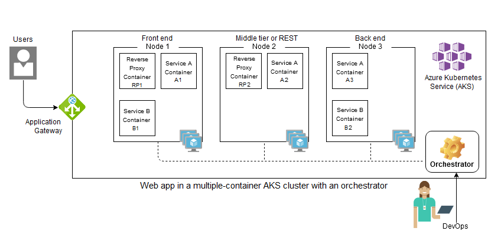
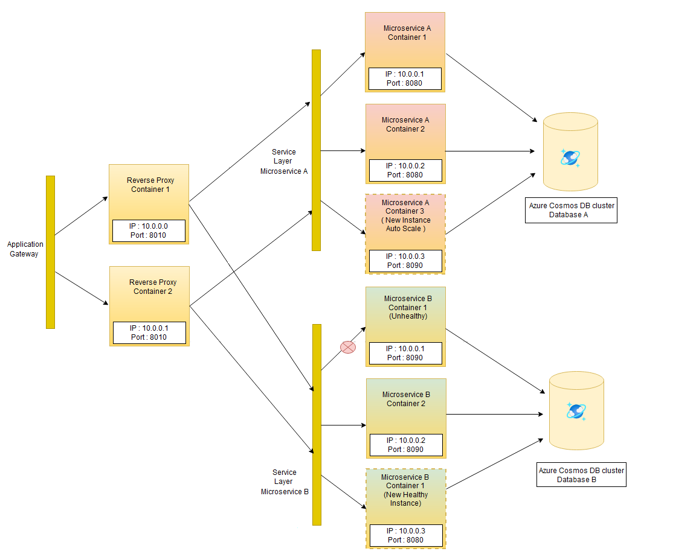

Microservices architectures typically package and deploy each microservice instance inside a single container. Many instances of the microservices might be running, each in a separate container. Containers are lightweight and short-lived, making them easy to create and destroy, but difficult to coordinate and communicate between.

This article discusses the challenges of running a containerized microservices architecture at production scale, and how container orchestration can help. The article presents several Azure container orchestration options.

## Containerized microservices architecture

In this simple containerized Azure Kubernetes Service (AKS) cluster:

- One Microservice A instance is running in Node 1, another instance in Node 2, and a third instance in Node 3.
- One instance of Microservice B is running in Node 1, and another instance in Node 3.
- Containerized [reverse proxy servers](https://komodor.com/learn/kubernetes-sidecar-containers-practical-guide-with-examples/) are running in Nodes 1 and 2 to distribute traffic.

To manage the cluster, a DevOps team has to:

- Run multiple container instances in each node.
- Load balance traffic between the instances.
- Manage communication between dependent instances in separate nodes.
- Maintain the desired AKS cluster state.

With container orchestration, the DevOps team can represent the cluster's desired state as a configuration. A container orchestration engine enforces the desired configuration and automates all the management tasks.

Consider containerizing a simple three-tier web application:

- A container hosts the front-end component.
- Another container hosts the middle tier or REST API layer.
- The middle tier layer communicates with a globally distributed database.

Running these containers on a single development machine might not be too hard. However, running the application in high availability mode at scale in a production cluster quickly becomes challenging. Container orchestration is crucial for large and dynamic production environments.

## Advantages of container orchestration

The following example shows how container orchestration can help manage cluster deployment, networking, and scaling.

The container orchestrator:

- Automatically scales the number of microservice instances, based on traffic or resource utilization. In the example, the orchestrator automatically adds another Microservice A instance in response to increased traffic.

- Manages the containers to reflect the configured desired state. In the example, Microservice B is configured to have two instances. One instance has become unhealthy, so the orchestrator maintains the desired state by creating another instance.

- Wraps the containers for each microservice in a simple service layer. The service layer:

  - Abstracts out complexities like IP address, port, and number of instances.
  - Load balances traffic between microservice instances.
  - Supports easy communication between dependent microservice instances.

Container orchestrators also provide flexibility and traffic control to:

- Release new versions or roll back to old versions of microservices or sets of microservices, without downtime.
- Enable side by side testing of different microservice versions.

## Choose an Azure container orchestrator

Here are some options for implementing microservices container orchestration in Azure:

- [Azure Kubernetes Service (AKS)](/azure/well-architected/service-guides/azure-kubernetes-service) is a fully managed [Kubernetes](https://kubernetes.io/) container orchestration service in Azure that simplifies deployment and management of containerized applications. AKS provides elastic provisioning, flexible application deployment model, and advanced identity and access management.

- [Azure Container Instances (ACI)](/azure/container-instances/container-instances-overview) is the quickest and simplest way to run a container in Azure. With ACI, you don't have to manage virtual machines or adapt higher-level services.

  For simple orchestration scenarios, you can use [Docker Compose](https://docs.docker.com/compose/) to define and run a multi-container application locally. Then, deploy the Docker containers as an ACI container group in a managed, serverless Azure environment. For full container orchestration scenarios, ACI can integrate with AKS to create virtual nodes for AKS orchestration.

- [Azure Container Apps](/azure/well-architected/service-guides/azure-container-apps) is a fully managed serverless container service for building and deploying modern apps at scale. With Container Apps, you can run microservices built with [Spring Boot](https://spring.io/projects/spring-boot) and other frameworks without having to manage infrastructure. Container Apps supports built-in autoscaling, traffic splitting, and integration with Azure.

- [Azure Red Hat OpenShift (ARO)](/azure/openshift/intro-openshift) supports deployment of fully managed [OpenShift](https://www.openshift.com/) clusters on Azure. Running Kubernetes production containers requires integration with frameworks and tools like image registries, storage management, monitoring, and DevOps. ARO extends Kubernetes by combining these components into a single container platform as a service (PaaS).

## Contributors

*This article is maintained by Microsoft. It was originally written by the following contributors.*

Principal author:

- [Veerash Ayyagari](https://www.linkedin.com/in/veerash-ayyagari/) | Principal Software Engineer

*To see non-public LinkedIn profiles, sign in to LinkedIn.*

## Next steps

- [Microservices architecture on Azure Kubernetes Service (AKS)](../../reference-architectures/containers/aks-microservices/aks-microservices.yml)
- [Advanced Azure Kubernetes Service (AKS) microservices architecture](../../reference-architectures/containers/aks-microservices/aks-microservices-advanced.yml)
- [CI/CD for AKS apps with Azure Pipelines](../../guide/aks/aks-cicd-azure-pipelines.md)
- [Use API gateways in microservices](gateway.yml)

## Related resources

- [Build microservices on Azure](../../guide/architecture-styles/microservices.md)
- [Design a microservices architecture](index.md)
- [Design patterns for microservices](patterns.yml)
- [Azure Kubernetes Service solution journey](../../reference-architectures/containers/aks-start-here.md)
