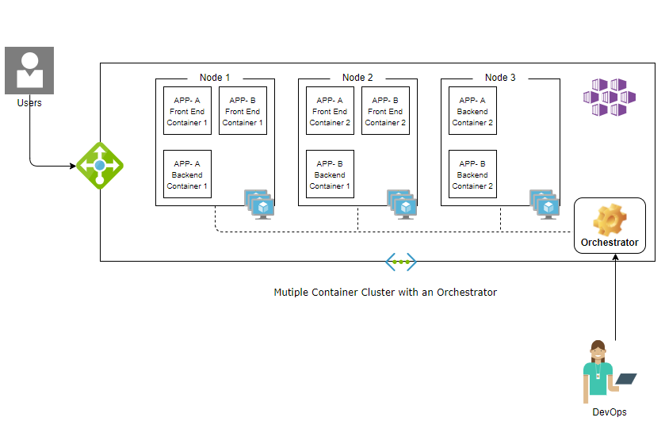

# Container Orchestration in microservices

In a microservices architecture, each instance of a microservice is typically packaged and deployed to run inside a single container. Containers by nature are light weight and ephemeral which makes them easy to create and destroy but at the same time tough to orchestrate communication between them at scale. In this article we will look at what are the various challenges with running containers at scale in a microservice architecture, how a container orchestration engine can help, what are some of the popular offerings that help with container orchestration on Azure.

## Why do we need a Container Orchestrator?

Let's  consider containerizing a simple 3- tiered web application, with a container hosting the front end component , a container hosting the middle tier (or the REST API layer) talking to a globally distributed database cluster. Running three containers on a single machine for development might not sound like a daunting task for the Developer, running in a high availability mode at scale in a production cluster can quickly becoming challenging. Imagine the effort that the DevOps team has to spend in managing a cluster, running multiple container replicas for each component, load balancing the traffic between these replicas, establishing communication between the replicas of one component and the replicas of the dependent component, and  maintaining the desired state of the cluster. Now imagine scaling this to a microservices architecture that has more than three containers running at scale. Wouldn't it be nice if the DevOps team can represent the desired state of the cluster as a configuration and an engine enforcing this state while automating all the tasks ? This is exactly what a Container Orchestrator does.

## Potential use cases

Container orchestration eases the management of deploying, networking and scaling of clusters. This is extremely useful in maintaining large and dynamic production environments. Let's look at one such sample cluster.

- The Orchestrator can manage the container to reflect the configured desired state. If a given microservice (Microservice B) is configured to have 2 instances, the orchestrator maintains the configured state by spinning another instance in case one goes down.

- Based on the bursts in traffic or resource utilization, the orchestrator can automatically scale up/down the number of instances configured for a microservice (as shown with Microservice A).

- Abstracts out all the complexities (like IP address, port and # of instances ) of the microservice containers by wrapping them with a simple service layer (colored “orange”) that load balances traffic between instances of each microservice and allows easy orchestration of communication between dependent microservices.

- Releasing a new version or Rolling back to an old version of any given microservice or a set of microservices in the cluster is done with Zero down time.

- Provides flexibility and additional customization to control traffic flow that enables side-by-side testing of various microservice versions.

## Choosing a container orchestrator technology in Azure

Here are some options for implementing container orchestration for your microservices application in Azure.

- **Azure Kubernetes Service (AKS)**. AKS is a fully managed [Kubernetes](https://kubernetes.io/) based container orchestration service in Azure that simplifies deployment and management of containerized applications. It provides elastic provisioning, faster end-end deployment, advance identity and access management.

- **Azure Service Fabric**. Service Fabric is Microsoft's container orchestrator for deploying and managing microservices across a cluster of machines. It comes with a lightweight runtime that supports building of the stateless and stateful microservices. A key differentiator of Service Fabric is its robust support for building stateful services, either with Service Fabric built-in programming models or containerized stateful services.

- **Azure Container Instances (ACI)**. ACI  is the fastest and simplest way to run a container in Azure, without having to manage any virtual machines and with out having to adapt any higher level service offering. This allows containers to run in a serverless mode. For simpler orchestration scenarios, it provides the ability to use [Docker Compose](https://docs.docker.com/compose/) to define and run a multi-container application locally and then deploy it as a container group on Azure Container Instances. For scenarios that require full container orchestration, ACI integrates with AKS in spinning up Virtual Nodes that can be orchestrated by Kubernetes.

- **Azure Spring Cloud**. Azure Sprint Cloud is an enterprise ready fully managed service for [Sprint Boot](https://spring.io/projects/spring-boot) apps that lets you focus on building and running apps without the hassle of managing infrastructure. It comes with built-in lifecycle management, ease of monitoring and full integration to Azure's ecosystems and services.

- **Azure Red Hat OpenShift (ARO)**. Azure Red Hat OpenShift service allows for deployment of fully managed [OpenShift](https://www.openshift.com/) clusters on Azure. Running containers in production with [Kubernetes](https://kubernetes.io/) requires additional tools like image registries, storage management, monitoring, CI/CD tools and integration with various frameworks. Azure Red Hat OpenShift extends Kubernetes by combining all these tools into a single platform, bringing ease of operations to DevOps teams.

## Next steps

In this article we have looked at how a container orchestrator can simplify the effort that a DevOps team has to spend in managing a multi container production grade cluster. In the subsequent articles you can explore how to log end to end request flows for easier debugging, monitor the health of your containers and the over all cluster itself using Azure Kubernetes service.

> [!div class="nextstepaction"]
> [Operate microservices in production](../logging-monitoring.md)
