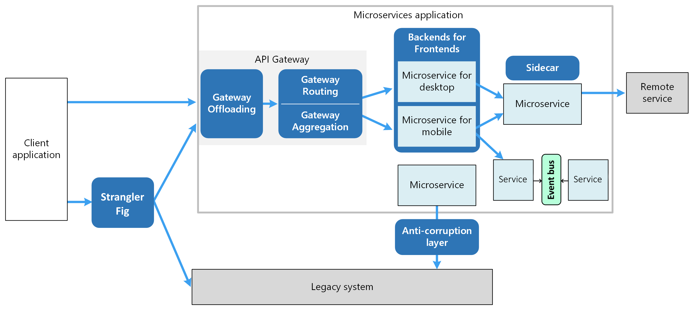

A microservices architecture distributes responsibility across independent services. That independence changes how you handle common architectural challenges:

- maintaining data consistency without distributed transactions
- managing cross-service communication
- isolating failures so they don't cascade
- integrating with legacy systems during migration

The design patterns in this article address these challenges directly. Each pattern targets a specific concern that you're likely to encounter as you design, build, and operate microservices.

## Common design patterns

- [**Anti-corruption layer**](../../patterns/anti-corruption-layer.yml) implements a façade or adapter layer between subsystems that don't share the same semantics. This pattern translates requests between subsystems and prevents a new service's design from being limited by dependencies on legacy systems or other services with incompatible domain models.

- [**Backends for Frontends**](../../patterns/backends-for-frontends.md) creates separate backend services for different types of clients, such as desktop and mobile. That way, a single backend service doesn't need to handle the conflicting requirements of various client types. This pattern can help keep each microservice simple, by separating client-specific concerns.

- [**Bulkhead**](../../patterns/bulkhead.yml) isolates critical resources, such as connection pool, memory, and CPU, for each workload or service. By using bulkheads, a single workload (or service) can't consume all of the resources, starving others. This pattern increases the resiliency of the system by preventing cascading failures caused by one service.

- [**Choreography**](../../patterns/choreography.yml) lets each service decide when and how a business operation is processed, rather than depending on a central orchestrator. This pattern reduces coupling between services and is a viable approach when you expect to update or add services frequently.

- [**CQRS**](../../patterns/cqrs.md) segregates read operations from write operations into separate data models. This pattern can maximize performance, scalability, and security in microservices where reads and writes have different performance or scaling requirements.

- [**Gateway Routing**](../../patterns/gateway-routing.yml) uses an API gateway as a reverse proxy to route client requests to different services based on the request, giving clients a single endpoint instead of many.

  [**Gateway Aggregation**](../../patterns/gateway-aggregation.yml) uses the gateway to combine multiple client requests into a single request, reducing chattiness between clients and services.

  [**Gateway Offloading**](../../patterns/gateway-offloading.yml) centralizes cross-cutting functionality, such as SSL termination, authentication, and rate limiting, into the gateway so that individual services don't each have to implement it.

  For more information, see [API gateways for microservices](gateway.yml).

- [**Saga**](../../patterns/saga.yml) manages data consistency across microservices that have independent datastores by defining a sequence of local transactions. Each local transaction updates the datastore for its service and triggers the next transaction in the saga. If a transaction fails, the saga runs compensating transactions to undo the preceding changes. This pattern is an alternative to distributed transactions, which are often impractical in a microservices architecture.

- [**Sidecar**](../../patterns/sidecar.md) deploys helper components of an application as a separate container or process to provide isolation and encapsulation. This pattern lets you attach common functionality such as logging, monitoring, and networking configuration to a service without embedding it in the service's code.

- [**Strangler Fig**](../../patterns/strangler-fig.md) supports incremental migration from a legacy system by gradually replacing specific pieces of functionality with new services. Consumers continue to use the same interface, unaware that the migration is taking place, until the legacy system is fully replaced.

## Supporting patterns

The [Interservice communication](interservice-communication.yml) article discusses the [Retry](../../patterns/retry.yml) and [Circuit Breaker](../../patterns/circuit-breaker.md) patterns for resilient service-to-service calls.

For the complete catalog of cloud design patterns on the Azure Architecture Center, see [Cloud Design Patterns](../../patterns/index.md).

## Next steps

- [Training: Build your first microservice with .NET](/training/modules/dotnet-microservices/)
- [What are microservices?](/devops/deliver/what-are-microservices)
- [Microservices architecture](/dotnet/architecture/microservices/architect-microservice-container-applications/microservices-architecture)

## Related resources

- [Microservice architecture style](../../guide/architecture-styles/microservices.md)
- [Design a microservices architecture](index.md)
- [Using domain analysis to model microservices](../model/domain-analysis.md)
- [Data considerations for microservices](data-considerations.md)
