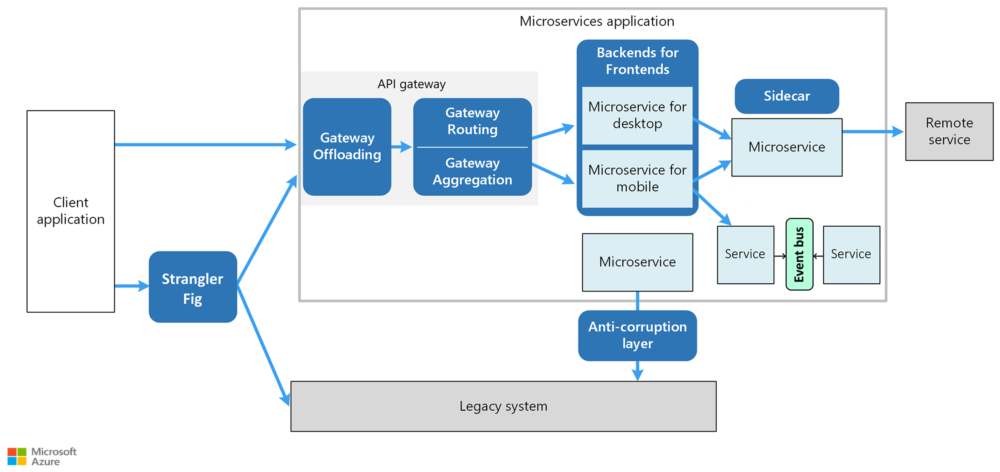

# Design patterns for microservices

The goal of microservices is to increase the velocity of application releases, by decomposing the application into small autonomous services that can be deployed independently. A microservices architecture also brings some challenges. The design patterns shown here can help mitigate these challenges.

[**Ambassador**](../../patterns/ambassador.md) can be used to offload common client connectivity tasks such as monitoring, logging, routing, and security (such as TLS) in a language agnostic way. Ambassador services are often deployed as a sidecar (see below).

[**Anti-corruption layer**](../../patterns/anti-corruption-layer.md) implements a façade between new and legacy applications, to ensure that the design of a new application is not limited by dependencies on legacy systems.

[**Backends for Frontends**](../../patterns/backends-for-frontends.md) creates separate backend services for different types of clients, such as desktop and mobile. That way, a single backend service doesn’t need to handle the conflicting requirements of various client types. This pattern can help keep each microservice simple, by separating client-specific concerns.

[**Bulkhead**](../../patterns/bulkhead.md) isolates critical resources, such as connection pool, memory, and CPU, for each workload or service. By using bulkheads, a single workload (or service) can’t consume all of the resources, starving others. This pattern increases the resiliency of the system by preventing cascading failures caused by one service.

[**Gateway Aggregation**](../../patterns/gateway-aggregation.md) aggregates requests to multiple individual microservices into a single request, reducing chattiness between consumers and services.

[**Gateway Offloading**](../../patterns/gateway-offloading.md) enables each microservice to offload shared service functionality, such as the use of SSL certificates, to an API gateway.

[**Gateway Routing**](../../patterns/gateway-routing.md) routes requests to multiple microservices using a single endpoint, so that consumers don't need to manage many separate endpoints.

[**Sidecar**](../../patterns/sidecar.md) deploys helper components of an application as a separate container or process to provide isolation and encapsulation.

[**Strangler**](../../patterns/strangler.md) supports incremental refactoring of an application, by gradually replacing specific pieces of functionality with new services.

For the complete catalog of cloud design patterns on the Azure Architecture Center, see [Cloud Design Patterns](../../patterns/index.md).
