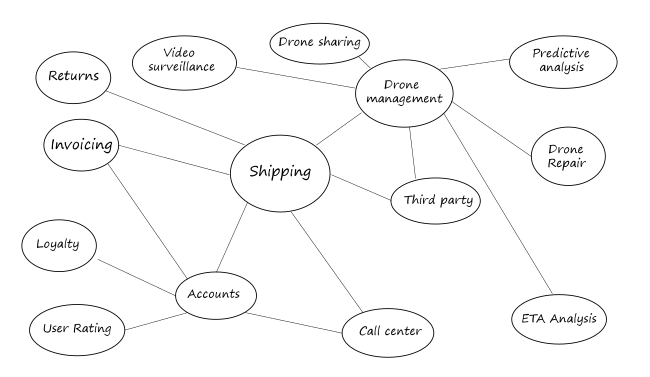
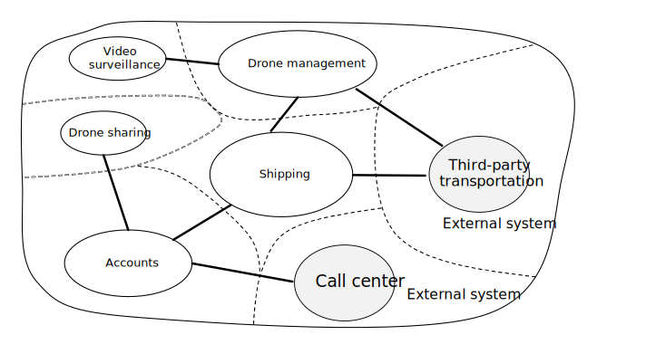

# Designing microservices: Domain analysis 

One of the biggest challenges of microservices is to define the boundaries of individual services. The general rule is that a service should do "one thing" &mdash; but putting that rule into practice requires careful thought. There is no mechanical process that will produce the "right" design. You have to think deeply about your business domain, requirements, and goals. Otherwise, you can end up with a haphazard design that exhibits some undesirable characteristics, such as hidden dependencies between services, tight coupling, or poorly designed interfaces. In this chapter, we take a domain-driven approach to designing microservices. 

Microservices should be designed around business capabilities, not horizontal layers such as data access or messaging. In addition, they should have loose coupling and high functional cohesion. Microservices are *loosely coupled* if you can change one service without requiring other services to be updated at the same time. A microservice is *cohesive* if it has a single, well-defined purpose, such as managing user accounts or tracking delivery history. A service should encapsulate domain knowledge and abstract that knowledge from clients. For example, a client should be able to schedule a drone without knowing the details of the scheduling algorithm or how the drone fleet is managed.

Domain-driven design (DDD) provides a framework that can get you most of the way to a set of well-designed microservices. DDD has two distinct phases, strategic and tactical. In strategic DDD, you are defining the large-scale structure of the system. Strategic DDD helps to ensure that your architecture remains focused on business capabilities. Tactical DDD provides a set of design patterns that you can use to create the domain model. These patterns include entities, aggregates, and domain services. These tactical patterns will help you to design microservices that are both loosely coupled and cohesive.

In this chapter and the next, we'll walk through the following steps, applying them to the Drone Delivery application: 

1. Start by analyzing the business domain to understand the application's functional requirements. The output of this step is an informal description of the domain, which can be refined into a more formal set of domain models. 

2. Next, define the *bounded contexts* of the domain. Each bounded context contains a domain model that represents a particular subdomain of the larger application. 

3. Within a bounded context, apply tactical DDD patterns to define entities, aggregates, and domain services. 
 
4. Use the results from the previous step to identify the microservices in your application.

In this chapter, we cover the first three steps, which are primarily concerned with DDD. In the next chapter, we will identify the microservices. However, it's important to remember that DDD is an iterative, ongoing process. Service boundaries aren't fixed in stone. As an application evolves, you may decide to break apart a service into several smaller services.

> [!NOTE]
> This chapter is not meant to show a complete and comprehensive domain analysis. We deliberately kept the example brief, in order to illustrate the main points. For more background on DDD, we recommend Eric Evans' *Domain-Driven Design*, the book that first introduced the term. Another good reference is *Implementing Domain-Driven Design* by Vaughn Vernon. 

## Analyze the domain

Using a DDD approach will help you to design microservices so that every service forms a natural fit to a functional business requirement. It can help you to avoid the trap of letting organizational boundaries or technology choices dictate your design.

Before writing any code, you need a bird's eye view of the system that you are creating. DDD starts by modeling the business domain and creating a *domain model*. The domain model is an abstract model of the business domain. It distills and organizes domain knowledge, and provides a common language for developers and domain experts. 

Start by mapping all of the business functions and their connections. This will likely be a collaborative effort that involves domain experts, software architects, and other stakeholders. You don't need to use any particular formalism.  Sketch a diagram or draw on whiteboard.

As you fill in the diagram, you may start to identify discrete subdomains. Which functions are closely related? Which functions are core to the business, and which provide ancillary services? What is the dependency graph? During this initial phase, you aren't concerned with technologies or implementation details. That said, you should note the place where the application will need to integrate with external systems, such as CRM, payment processing, or billing systems. 

## Drone Delivery: Analyzing the business domain.

After some initial domain analysis, the Fabrikam team came up with a rough sketch that depicts the Drone Delivery domain.

 

- **Shipping** is placed in the center of the diagram, because it's core to the business. Everything else in the diagram exists to enable this functionality.
- **Drone management** is also core to the business. Functionality that is closely related to drone management includes **drone repair** and using **predictive analysis** to predict when drones need servicing and maintenance. 
- **ETA analysis** provides time estimates for pickup and delivery. 
- **Third-party transportation** will enable the application to schedule alternative transportation methods if a package cannot be shipped entirely by drone.
- **Drone sharing** is a possible extension of the core business. The company may have excess drone capacity during certain hours, and could rent out drones that would otherwise be idle. This feature will not be in the initial release.
- **Video surveillance** is another area that the company might expand into later.
- **User accounts**, **Invoicing**, and **Call center** are subdomains that support the core business.
 
Notice that at this point in the process, we haven't made any decisions about implementation or technologies. Some of the subsystems may involve external software systems or third-party services. Even so, the application needs to interact with these systems and services, so it's important to include them in the domain model. 

> [!NOTE]
> When an application depends on an external system, there is a risk that the external system's data schema or API will leak into your application, ultimately compromising the architectural design. This is particularly true with legacy systems that may not follow modern best practices, and may use convoluted data schemas or obsolete APIs. In that case, it's important to have a well-defined boundary between these external systems and the application. Consider using the [Strangler Pattern](../patterns/strangler.md) or the [Anti-Corruption Layer Pattern](../patterns/anti-corruption-layer.md) for this purpose.

## Define bounded contexts

The domain model will include representations of real things in the world &mdash; users, drones, packages, and so forth. But that doesn't mean that every part of the system needs to use the same representations for the same things. 

For example, subsystems that handle drone repair and predictive analysis will need to represent many physical characteristics drones, such as their maintenance history, mileage, age, model number, performance characteristics, and so on. But when it's time to schedule a delivery, we don't care about those things. The scheduling subsystem only needs to know whether a drone is available, and the ETA for pickup and delivery. 

If we tried to create a single model for both of these subsystems, it would be unnecessarily complex. It would also become harder for the model to evolve over time, because any changes will need to satisfy multiple teams working on separate subsystems. Therefore, it's often better to design separate models that represent the same real-world entity (in this case, a drone) in two different contexts. Each model contains only the features and attributes that are relevant within its particular context.

This is where the DDD concept of *bounded contexts* comes into play. A bounded context is simply the boundary within a domain where a particular domain model applies. Looking at the previous diagram, we can group functionality according to whether various functions will share a single domain model. 

 
 
Bounded contexts are not necessarily isolated from one another. In this diagram, the solid lines connecting the bounded contexts represent places where two bounded contexts interact. For example, Shipping depends on User Accounts to get information about customers, and on Drone Management to schedule drones from the fleet.

In the book *Domain Driven Design*, Eric Evans describes several patterns for maintaining the integrity of a domain model when it interacts with another bounded context. One of the main principles of microservices is that services communicate through well-defined APIs. This approach corresponds to two patterns that Evans calls Open Host Service and Published Language. The idea of Open Host Service is that a subsystem defines a formal protocol (API) for other subsystems to communicate with it. Published Language extends this idea by publishing the API in a form that other teams can use to write clients. In the chapter on [API Design](./api-design.md), we discuss using [OpenAPI Specification](https://www.openapis.org/specification/repo) (formerly known as Swagger) to define language-agnostic interface descriptions for REST APIs, expressed in JSON or YAML format.

For the rest of this journey, we will focus on the Shipping bounded context. 

## Tactical DDD

During the strategic phase of DDD, you are mapping out the business domain and defining bounded contexts for your domain models. Tactical DDD is when you define your domain models with more precision. The tactical patterns are applied within a single bounded context. In a microservices architecture, we are particularly interested in the entity and aggregate patterns. Applying these patterns will help us to identify natural boundaries for the services in our application (see [next chapter](./microservice-boundaries.md)). As a general principle, a microservice should be no smaller than an aggregate, and no larger than a bounded context. First, we'll review the tactical patterns. Then we'll apply them to the Shipping bounded context in the Drone Delivery application. 

### Overview of the tactical patterns

This section provides a brief summary of the tactical DDD patterns, so if you are already familiar with DDD, you can probably skip this section. The patterns are described in more detail in chapters 5 &ndash; 6 of Eric Evans' book, and in *Implementing Domain-Driven Design* by Vaughn Vernon. 

**Entities**. An entity is an object with a unique identity that persists over time. For example, in a banking application, customers and accounts would be entities. 

- An entity has a unique identifier in the system, which can be used to look up or retrieve the entity. That doesn't mean the identifier is always exposed directly to users. It could be a GUID or a primary key in a database. 
- An identity may span multiple bounded contexts, and may endure beyond the lifetime of the application. For example, bank account numbers or government-issued IDs are not tied to the lifetime of a particular application.
- The attributes of an entity may change over time. For example, a person's name or address might change, but they are still the same person. 
- An entity can hold references to other entities.
 
**Value objects**. A value object has no identity. It is defined only by the values of its attributes. Value objects are also immutable. To update a value object, you always create a new instance to replace the old one. Value objects can have methods that encapsulate domain logic, but those methods should have no side-effects on the object's state. Typical examples of value objects include colors, dates and times, and currency values. 

**Aggregates**. An aggregate defines a consistency boundary around one or more entities. Exactly one entity in an aggregate is the root. Lookup is done using the root entity's identifier. Any other entities in the aggregate are children of the root, and are referenced by following pointers from the root. 

The purpose of an aggregate is to model transactional invariants. Things in the real world have complex webs of relationships. Customers create orders, orders contain products, products have suppliers, and so on. If the application modifies several related objects, how does it guarantee consistency? How do we keep track of invariants and enforce them?  

Traditional applications have often used database transactions to enforce consistency. In a distributed application, however, that's often not feasible. A single business transaction may span multiple data stores, or may be long running, or may involve third-party services. Ultimately it's up to the application, not the data layer, to enforce the invariants required for the domain. That's what aggregates are meant to model.

> [!NOTE]
> An aggregate might consist of a single entity, without child entities. What makes it an aggregate is the transactional boundary.

**Domain and application services**. In DDD terminology, a service is an object that implements some logic without holding any state. Evans distinguishes between *domain services*, which encapsulate domain logic, and *application services*, which provide technical functionality, such as user authentication or sending an SMS message. Domain services are often used to model behavior that spans multiple entities. 

> [!NOTE]
> The term *service* is overloaded in software development. The definition here is not directly related to microservices.

**Domain events**. Domain events can be used to notify other parts of the system when something happens. As the name suggests, domain events should mean something within the domain. For example, "a record was inserted into a table" is not a domain event. "A delivery was cancelled" is a domain event. Domain events are especially relevant in a microservices architecture. Because microservices are distributed and don't share data stores, domain events provide a way for microservices to coordinate with each other. The chapter [Interservice communication](./interservice-communication.md) discusses asynchronous messaging in more detail.
 
There are a few other DDD patterns not listed here, including factories, repositories, and modules. These can be useful patterns for when you are implementing a microservice, but they are less relevant when designing the boundaries between microservice.

## Drone delivery: Applying the patterns

We start with the scenarios that the Shipping bounded context must handle.

- A customer can request a drone to pick up goods from a business that is registered with the drone delivery service.
- The sender generates a tag (barcode or RFID) to put on the package. 
- A drone will pick up and deliver a package from the source location to the destination location.
- When a customer schedules a delivery, the system provides an ETA based on route information, weather conditions, and historical data. 
- When the drone is in flight, a user can track the current location and the latest ETA. 
- Until a drone has picked up the package, the customer can cancel a delivery.
- The customer is notified when the delivery is completed.
- The sender can request delivery confirmation from the customer, in the form of a signature or finger print.
- Users can look up the history of a completed delivery.

From these scenarios, the development team identified the following **entities**.

- Delivery
- Package
- Drone
- Account
- Confirmation
- Notification
- Tag

The first four, Delivery, Package, Drone, and Account, are all **aggregates** that represent transactional consistency boundaries. Confirmations and Notifications are child entities of Deliveries, and Tags are child entities of Packages. 

The **value objects** in this design include Location, ETA, PackageWeight, and PackageSize. 

To illustrate, here is a UML diagram of the Delivery aggregate. Notice that it holds references to other aggregates, including Account, Package, and Drone.

There are two domain events:

- While a drone is in flight, the Drone entity sends DroneStatus events that describe the drone's location and status (in-flight, landed).

- The Delivery entity sends DeliveryTracking events whenever the stage of a delivery changes. These include DeliveryCreated, DeliveryRescheduled, DeliveryHeadedToDropoff, and DeliveryCompleted. 

Notice that these events describe things that are meaningful within the domain model. They describe something about the domain, and aren't tied to a particular programming language construct.

The development team identified one more area of functionality, which doesn't fit neatly into any of the entities described so far. Some part of the system must coordinate all of the steps involved in scheduling or updating a delivery. Therefore, the development team added two **domain services** to the design: a *Scheduler* that coordinates the steps, and a *Supervisor* that monitors the status of each step, in order to detect whether any steps have failed or timed out. This is a variation of the [Scheduler Agent Supervisor pattern](../patterns/scheduler-agent-supervisor.md).

> [!div class="nextstepaction"]
> [Identifying microservice boundaries](./microservice-boundaries.md)
