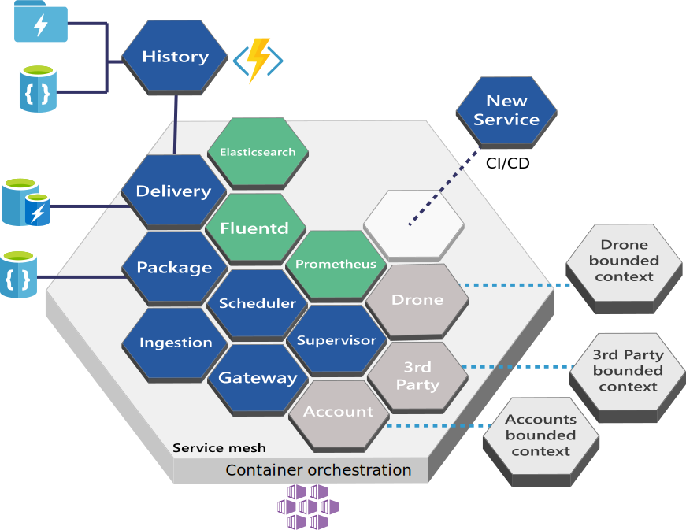

# Designing, building, and operating microservices on Azure

Microservices have become a popular architectural style for building cloud applications that are resilient, highly scalable, independently deployable, and able to evolve quickly. To be more than just a buzzword, however, microservices require a different approach to designing and building applications. 

In this set of articles, we explore how to build and run a microservices architecture on Azure. Topics include:

- Using Domain Driven Design (DDD) to design a microservices architecture. 
- Choosing the right Azure technologies for compute, storage, messaging, and other elements of the design.
- Understanding microservices design patterns.
- Designing for resiliency, scalability, and performance.
- Building a CI/CD pipeline.

Throughout, we focus on an end-to-end scenario: A drone delivery service that lets customers schedule packages to be picked up and delivered via drone. You can find the code for our reference implementation on GitHub

[ Reference implementation][drone-ri]

But first, let's start with fundamentals. What are microservices, and what are the advantages of adopting a microservices architecture?

## Why build microservices?

In a microservices architecture, the application is composed of small, independent services. Here are some of the defining characteristics of microservices:

- Each microservice implements a single business capability.
- A microservice is small enough that a single small team of developers can write and maintain it.
- Microservices run in separate processes, communicating through well-defined APIs or messaging patterns. 
- Microservices do not share data stores or data schemas. Each microservice is responsible for managing its own data. 
- Microservices have separate code bases, and do not share source code. They may use common utility libraries, however.
- Each microservice can be deployed and updated independently of other services. 

Done correctly, microservices can provide a number of useful benefits:

- **Agility.** Because microservices are deployed independently, it's easier to manage bug fixes and feature releases. You can update a service without redeploying the entire application, and roll back an update if something goes wrong. In many traditional applications, if a bug is found in one part of the application, it can block the entire release process; as a result, new features may be held up waiting for a bug fix to be integrated, tested, and published.  

- **Small code, small teams.** A microservice should be small enough that a single feature team can build, test, and deploy it. Small code bases are easier to understand. In a large monolithic application, there is a tendency over time for code dependencies to become tangled, so that adding a new feature requires touching code in a lot of places. By not sharing code or data stores, a microservices architecture minimizes dependencies, and that makes it easier to add new features. Small team sizes also promote greater agility. The "two-pizza rule" says that a team should be small enough that two pizzas can feed the team. Obviously that's not an exact metric and depends on team appetites! But the point is that large groups tend be less productive, because communication is slower, management overhead goes up, and agility diminishes.  

- **Mix of technologies**. Teams can pick the technology that best fits their service, using a mix of technology stacks as appropriate. 

- **Resiliency**. If an individual microservice becomes unavailable, it won't disrupt the entire application, as long as any upstream microservices are designed to handle faults correctly (for example, by implementing circuit breaking).

- **Scalability**. A microservices architecture allows each microservice to be scaled independently of the others. That lets you scale out subsystems that require more resources, without scaling out the entire application. If you deploy services inside containers, you can also pack a higher density of microservices onto a single host, which allows for more efficient utilization of resources.

- **Data isolation**. It is much easier to perform schema updates, because only a single microservice is impacted. In a monolithic application, schema updates can become very challenging, because different parts of the application may all touch the same data, making any alterations to the schema risky.
 
## No free lunch

These benefits don't come for free. This series of articles is designed to address some of the challenges of building microservices that are resilient, scalable, and manageable.

- **Service boundaries**. When you build microservices, you need to think carefully about where to draw the boundaries between services. Once services are built and deployed in production, it can be hard to refactor across those boundaries. Choosing the right service boundaries is one of the biggest challenges when designing a microservices architecture. How big should each service be? When should functionality be factored across several services, and when should it be kept inside the same service? In this guide, we describe an approach that uses domain-driven design to find service boundaries. It starts with [Domain analysis](./domain-analysis.md) to find the bounded contexts, then applies a set of [tactical DDD patterns](./microservice-boundaries.md) based on functional and non-functional requirements. 

- **Data consistency and integrity**. A basic principle of microservices is that each service manages its own data. This keeps services decoupled, but can lead to challenges with data integrity or redundancy. We explore some of these issues in the [Data considerations](./data-considerations.md).

- **Network congestion and latency**. The use of many small, granular services can result in more interservice communication and longer end-to-end latency. The chapter [Interservice communication](./interservice-communication.md) describes considerations for messaging between services. Both synchronous and asynchronous communication have a place in microservices architectures. Good [API design](./api-design.md) is important so that services remain loosely coupled, and can be independently deployed and updated.
 
- **Complexity**. A microservices application has more moving parts. Each service may be simple, but the services have to work together as a whole. A single user operation may involve multiple services. In the chapter [Ingestion and workflow](./ingestion-workflow.md), we examine some of the issues around ingesting requests at high throughput, coordinating a workflow, and handling failures. 

- **Communication between clients and the application.**  When you decompose an application into many small services, how should clients communicate with those services? Should a client call each individual service directly, or route requests through an [API Gateway](./gateway.md)?

- **Monitoring**. Monitoring a distributed application can be a lot harder than a monolithic application, because you must correlate telemetry from multiple services. The chapter [Logging and monitoring](./logging-monitoring.md) addresses these concerns.

- **Continuous integration and delivery (CI/CD)**. One of the main goals of microservices is agility. To achieve this, you must have automated and robust [CI/CD](./ci-cd.md), so that you can quickly and reliably deploy individual services into test and production environments.

## The Drone Delivery application

To explore these issues, and to illustrate some of the best practices for a microservices architecture, we created a reference implementation that we call the Drone Delivery application. You can find the reference implementation on [GitHub][drone-ri].

​Fabrikam, Inc. is starting a drone delivery service. The company manages a fleet of drone aircraft. Businesses register with the service, and users can request a drone to pick up goods for delivery. When a customer schedules a pickup, a backend system assigns a drone and notifies the user with an estimated delivery time. While the delivery is in progress, the customer can track the location of the drone, with a continuously updated ETA.

This scenario involves a fairly complicated domain. Some of the business concerns include scheduling drones, tracking packages, managing user accounts, and storing and analyzing historical data. Moreover, Fabrikam wants to get to market quickly and then iterate quickly, adding new functionality and capabilities. The application needs to operate at cloud scale, with a high service level objective (SLO). Fabrikam also expects that different parts of the system will have very different requirements for data storage and querying. All of these considerations lead Fabrikam to choose a microservices architecture for the Drone Delivery application.

> [!NOTE]
> For help in choosing between a microservices architecture and other architectural styles, see the [Azure Application Architecture Guide](../guide/index.md).

Our reference implementation uses Kubernetes with [Azure Container Service (ACS)](/azure/container-service/kubernetes/). However, many of the high-level architectural decisions and challenges will apply to any container orchestrator, including [Azure Service Fabric](/azure/service-fabric/). 

> [!div class="nextstepaction"]
> [Domain analysis](./domain-analysis.md)

<!-- links -->

[drone-ri]: https://github.com/mspnp/microservices-reference-implementation
