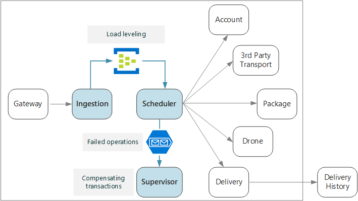
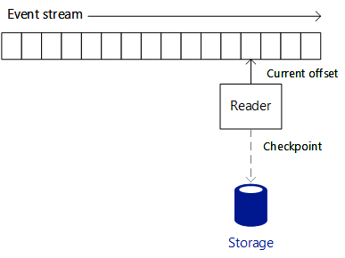
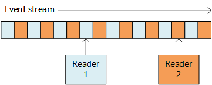

# Designing microservices: Ingestion and workflow

Microservices often have a workflow that spans multiple services for a single transaction. The workflow must be reliable; it can't lose transactions or leave them in a partially completed state. It's also critical to control the ingestion rate of incoming requests. With many small services communicating with each other, a burst of incoming requests can overwhelm the interservice communication. 



## The drone delivery workflow

In the Drone Delivery application, the following operations must be performed to schedule a delivery:

1. Check the status of the customer's account (Account service).
2. Create a new package entity (Package service).
3. Check whether any third-party transportation is required for this delivery, based on the pickup and delivery locations (Third-party Transportation service).
4. Schedule a drone for pickup (Drone service).
5. Create a new delivery entity (Delivery service).

This is the core of the entire application, so the end-to-end process must be performant as well as reliable. Some particular challenges must be addressed:

- **Load leveling**. Too many client requests can overwhelm the system with interservice network traffic. It can also overwhelm backend dependencies such as storage or remote services. These may react by throttling the services calling them, creating backpressure in the system. Therefore, it's important to load level the requests coming into the system, by putting them into a buffer or queue for processing. 

- **Guaranteed delivery**. To avoid dropping any client requests, the ingestion component must guarantee at-least-once delivery of messages. 

- **Error handling**. If any of the services returns an error code or experiences a non-transient failure, the delivery cannot be scheduled. An error code might indicate an expected error condition (for example, the customer's account is suspended) or an unexpected server error (HTTP 5xx). A service might also be unavailable, causing the network call to time out. 

First we'll look at the ingestion side of the equation &mdash; how the system can ingest incoming user requests at high throughput. Then we'll consider how the drone delivery application can implement a reliable workflow. It turns out that the design of the ingestion subsystem affects the workflow backend. 

## Ingestion

Based on business requirements, the development team identified the following non-functional requirements for ingestion:

- Sustained throughput of 10K requests/sec.
- Able to handle spikes of up to 50K/sec without dropping client requests or timing out.
- Less than 500ms latency in the 99th percentile.

The requirement to handle occasional spikes in traffic presents a design challenge. In theory, the system could be scaled out to handle the maximum expected traffic. However, provisioning that many resources would be very inefficient. Most of the time, the application will not need that much capacity, so there would be idle cores, costing money without adding value.

A better approach is to put the incoming requests into a buffer, and let the buffer act as a load leveler. With this design, the Ingestion service must be able to handle the maximum ingestion rate over short periods, but the backend services only need to handle the maximum sustained load. By buffering at the front end, the backend services shouldn't need to handle large spikes in traffic. At the scale required for the Drone Delivery application, [Azure Event Hubs](/azure/event-hubs/) is a good choice for load leveling. Event Hubs offers low latency and high throughput, and is a cost effective solution at high ingestion volumes. 

For our testing, we used a Standard tier event hub with 32 partitions and 100 throughput units. We observed about 32K events / second ingestion, with latency around 90ms. Currently the default limit is 20 throughput units, but Azure customers can request additional throughput units by filing a support request. See [Event Hubs quotas](/azure/event-hubs/event-hubs-quotas) for more information. As with all performance metrics, many factors can affect performance, such as message payload size, so don't interpret these numbers as a benchmark. If more throughput is needed, the Ingestion service can shard across more than one event hub. For even higher throughput rates, [Event Hubs Dedicated](/azure/event-hubs/event-hubs-dedicated-overview) offers single-tenant deployments that can ingress over 2 million events per second.

It's important to understand how Event Hubs can achieve such high throughput, because that affects how a client should consume messages from Event Hubs. Event Hubs does not implement a *queue*. Rather, it implements an *event stream*. 

With a queue, an individual consumer can remove a message from the queue, and the next consumer won't see that message. Queues therefore allow you to use a [Competing Consumers pattern](../patterns/competing-consumers.md) to process messages in parallel and improve scalability. For greater resiliency, the consumer holds a lock on the message and releases the lock when it's done processing the message. If the consumer fails &mdash; for example, the node it's running on crashes &mdash; the lock times out and the message goes back onto the queue. 


Event Hubs, on the other hand, uses streaming semantics. Consumers read the stream independently at their own pace. Each consumer is responsible for keeping track of its current position in the stream. A consumer should write its current position to persistent storage at some predefined interval. That way, if the consumer experiences a fault (for example, the consumer crashes, or the host fails), then a new instance can resume reading the stream from the last recorded position. This process is called *checkpointing*. 

For performance reasons, a consumer generally doesn't checkpoint after each message. Instead, it checkpoints at some fixed interval, for example after processing *n* messages, or every *n* seconds. As a consequence, if a consumer fails, some events may get processed twice, because a new instance always picks up from the last checkpoint. There is a tradeoff: Frequent checkpoints can hurt performance, but sparse checkpoints mean you will replay more events after a failure.  


 
Event Hubs is not designed for competing consumers. Although multiple consumers can read a stream, each traverses the stream independently. Instead, Event Hubs uses a partitioned consumer pattern. An event hub has up to 32 partitions. Horizontal scale is achieved by assigning a separate consumer to each partition.

What does this mean for the drone delivery workflow? To get the full benefit of Event Hubs, the Delivery Scheduler cannot wait for each message to be processed before moving onto the next. If it does that, it will spend most of its time waiting for network calls to complete. Instead, it needs to process batches of messages in parallel, using asynchronous calls to the backend services. As we'll see, choosing the right checkpointing strategy is also important.  

## Workflow

We looked at three options for reading and processing the messages: Event Processor Host, Service Bus queues, and the IoTHub React library. We chose IoTHub React, but to understand why, it helps to start with Event Processor Host. 

### Event Processor Host

Event Processor Host is designed for message batching. The application implements the `IEventProcessor` interface, and the Processor Host creates one event processor instance for each partition in the event hub. The Event Processor Host then calls each event processor's `ProcessEventsAsync` method with batches of event messages. The application controls when to checkpoint inside the `ProcessEventsAsync` method, and the Event Processor Host writes the checkpoints to Azure storage. 

Within a partition, Event Processor Host waits for `ProcessEventsAsync` to return before calling again with the next batch. This approach simplifies the programming model, because your event processing code doesn't need to be reentrant. However, it also means that the event processor handles one batch at a time, and this gates the speed at which the Processor Host can pump messages.

> [!NOTE] 
> The Processor Host doesn't actually *wait* in the sense of blocking a thread. The `ProcessEventsAsync` method is asynchronous, so the Processor Host can do other work while the method is completing. But it won't deliver another batch of messages for that partition until the method returns. 

In the drone application, a batch of messages can be processed in parallel. But waiting for the whole batch to complete can still cause a bottleneck. Processing can only be as fast as the slowest message within a batch. Any variation in response times can create a "long tail," where a few slow responses drag down the entire system. Our performance tests showed that we did not achieve our target throughput using this approach. This does *not* mean that you should avoid using Event Processor Host. But for high throughput, avoid doing any long-running tasks inside the `ProcesssEventsAsync` method. Process each batch quickly.

### IotHub React 

[IotHub React](https://github.com/Azure/toketi-iothubreact) is an Akka Streams library for reading events from Event Hub. Akka Streams is a stream-based programming framework that implements the [Reactive Streams](http://www.reactive-streams.org/) specification. It provides a way to build efficient streaming pipelines, where all streaming operations are performed asynchronously, and the pipeline gracefully handles backpressure. Backpressure occurs when an event source produces events at a faster rate than the downstream consumers can receive them &mdash; which is exactly the situation when the drone delivery system has a spike in traffic. If backend services go slower, IoTHub React will slow down. If capacity is increased, IoTHub React will push more messages through the pipeline.

Akka Streams is also a very natural programming model for streaming events from Event Hubs. Instead of looping through a batch of events, you define a set of operations that will be applied to each event, and let Akka Streams handle the streaming. Akka Streams defines a streaming pipeline in terms of *Sources*, *Flows*, and *Sinks*. A source generates an output stream, a flow processes an input stream and produces an output stream, and a sink consumes a stream without producing any output.

Here is the code in the Scheduler service that sets up the Akka Streams pipeline:

```java
IoTHub iotHub = new IoTHub();
Source<MessageFromDevice, NotUsed> messages = iotHub.source(options);

messages.map(msg -> DeliveryRequestEventProcessor.parseDeliveryRequest(msg))
        .filter(ad -> ad.getDelivery() != null).via(deliveryProcessor()).to(iotHub.checkpointSink())
        .run(streamMaterializer);
```

This code configures Event Hubs as a source. The `map` statement deserializes each event message into a Java class that represents a delivery request. The `filter` statement removes any `null` objects from the stream; this guards against the case where a message can't be deserialized. The `via` statement joins the source to a flow that processes each delivery request. The `to` method joins the flow to the checkpoint sink, which is built into IoTHub React.

IoTHub React uses a different checkpointing strategy than Event Host Processor. Checkpoints are written by the checkpoint sink, which is the terminating stage in the pipeline. The design of Akka Streams allows the pipeline to continue streaming data while the sink is writing the checkpoint. That means the upstream processing stages don't need to wait for checkpointing to happen. You can configure checkpointing to occur after a timeout or after a certain number of messages have been processed.

The `deliveryProcessor` method creates the Akka Streams flow:  

```java
private static Flow<AkkaDelivery, MessageFromDevice, NotUsed> deliveryProcessor() {
    return Flow.of(AkkaDelivery.class).map(delivery -> {
        CompletableFuture<DeliverySchedule> completableSchedule = DeliveryRequestEventProcessor
                .processDeliveryRequestAsync(delivery.getDelivery(), 
                        delivery.getMessageFromDevice().properties());
        
        completableSchedule.whenComplete((deliverySchedule,error) -> {
            if (error!=null){
                Log.info("failed delivery" + error.getStackTrace());
            }
            else{
                Log.info("Completed Delivery",deliverySchedule.toString());
            }
                                
        });
        completableSchedule = null;
        return delivery.getMessageFromDevice();
    });
}
```

The flow calls a static `processDeliveryRequestAsync` method that does the actual work of processing each message.

### Scaling with IoTHub React

The Scheduler service is designed so that each container instance reads from a single partition. For example, if the Event Hub has 32 partitions, the Scheduler service is deployed with 32 replicas. This allows for a lot of flexibility in terms of horizontal scaling. 

Depending on the size of the cluster, a node in the cluster might have more than one Scheduler service pod running on it. But if the Scheduler service needs more resources, the cluster can be scaled out, in order to distribute the pods across more nodes. Our performance tests showed that the Scheduler service is memory- and thread-bound, so performance depended greatly on the VM size and the number of pods per node.

Each instance needs to know which Event Hubs partition to read from. To configure the partition number, we took advantage of the [StatefulSet](https://kubernetes.io/docs/concepts/workloads/controllers/statefulset/) resource type in Kubernetes. Pods in a StatefulSet have a persistent identifier that includes a numeric index. Specifically, the pod name is `<statefulset name>-<index>`, and this value is available to the container through the Kubernetes [Downward API](https://kubernetes.io/docs/tasks/inject-data-application/downward-api-volume-expose-pod-information/). At run time, the Scheduler services reads the pod name and uses the pod index as the partition ID.

If you needed to scale out the Scheduler service even further, you could assign more than one pod per event hub partition, so that multiple pods are reading each partition. However, in that case, each instance would read all of the events in the assigned partition. To avoid duplicate processing, you would need to use a hashing algorithm, so that each instance skips over a portion of the messages. That way, multiple readers can consume the stream, but every message is processed by only one instance. 
 


### Service Bus queues

A third option that we considered was to copy messages from Event Hubs into a Service Bus queue, and then have the Scheduler service read the messages from Service Bus. It might seem strange to writing the incoming requests into Event Hubs only to copy them in Service Bus.  However, the idea was to leverage the different strengths of each service: Use Event Hubs to absorb spikes of heavy traffic, while taking advantage of the queue semantics in Service Bus to process the workload with a competing consumers pattern. Remember that our target for sustained throughput is less than our expected peak load, so processing the Service Bus queue would not need to be as fast the message ingestion.
 
With this approach, our proof-of-concept implementation achieved about 4K operations per second. These tests used mock backend services that did not do any real work, but simply added a fixed amount of latency per service. Note that our performance numbers were much less than the theoretical maximum for Service Bus. Possible reasons for the discrepancy include:

- Not having optimal values for various client parameters, such as the connection pool limit, the degree of parallelization, the prefetch count, and the batch size.

- Network I/O bottlenecks.

- Use of [PeekLock](/rest/api/servicebus/peek-lock-message-non-destructive-read) mode rather than [ReceiveAndDelete](/rest/api/servicebus/receive-and-delete-message-destructive-read), which was needed to ensure at-least-once delivery of messages.

Further performance tests might have discovered the root cause and allowed us to resolve these issues. However, IotHub React met our performance target, so we chose that option. That said, Service Bus is a viable option for this scenario.

## Handling failures 

There are three general classes of failure to consider.

1. A downstream service may have a non-transient failure, which is any failure that's unlikely to go away by itself. Non-transient failures include normal error conditions, such as invalid input to a method. They also include unhandled exceptions in application code or a process crashing. If this type of error occurs, the entire business transaction must be marked as a failure. It may be necessary to undo other steps in the same transaction that already succeeded. (See Compensating Transactions, below.)
 
2. A downstream service may experience a transient failure such as a network timeout. These errors can often be resolved simply by retrying the call. If the operation still fails after a certain number of attempts, it's considered a non-transient failure. 

3. The Scheduler service itself might fault (for example, because a node crashes). In that case, Kubernetes will bring up a new instance of the service. However, any transactions that were already in progress must be resumed. 

## Compensating transactions

If a non-transient failure happens, the current transaction might be in a *partially failed* state, where one or more steps already completed successfully. For example, if the Drone service already scheduled a drone, the drone must be canceled. In that case, the application needs to undo the steps that succeeded, by using a [Compensating Transaction](../patterns/compensating-transaction.md). In some cases, this must be done by an external system or even by a manual process. 

If the logic for compensating transactions is complex, consider creating a separate service that is responsible for this process. In the Drone Delivery application, the Scheduler service puts failed operations onto a dedicated queue. A separate microservice, called the Supervisor, reads from this queue and calls a cancellation API on the services that need to compensate. This is a variation of the [Scheduler Agent Supervisor pattern][scheduler-agent-supervisor]. The Supervisor service might take other actions as well, such as notify the user by text or email, or send an alert to an operations dashboard. 


## Idempotent vs non-idempotent operations

To avoid losing any requests, the Scheduler service must guarantee that all messages are processed at least once. Event Hubs can guarantee at-least-once delivery if the client checkpoints correctly.

If the Scheduler service crashes, it may be in the middle of processing one or more client requests. Those messages will be picked up by another instance of the Scheduler and reprocessed. What happens if a request is processed twice? It's important to avoid duplicating any work. After all, we don't want the system to send two drones for the same package.

One approach is to design all operations to be idempotent. An operation is idempotent if it can be called multiple times without producing additional side-effects after the first call. In other words, a client can invoke the operation once, twice, or many times, and the result will be the same. Essentially, the service should ignore duplicate calls. For a method with side effects to be idempotent, the service must be able to detect duplicate calls. For example, you can have the caller assign the ID, rather than having the service generate a new ID. The service can then check for duplicate IDs.

> [!NOTE]
> The HTTP specification states that GET, PUT, and DELETE methods must be idempotent. POST methods are not guaranteed to be idempotent. If a POST method creates a new resource, there is generally no guarantee that this operation is idempotent. 

It's not always straightforward to write idempotent method. Another option is for the Scheduler to track the progress of every transaction in a durable store. Whenever it processes a message, it would look up the state in the durable store. After each step, it would write the result to the store. There may be performance implications to this approach.

## Example: Idempotent operations

The HTTP specification states that PUT methods must be idempotent. The specification defines idempotent this way:

>  A request method is considered "idempotent" if the intended effect on the server of multiple identical requests with that method is the   same as the effect for a single such request. ([RFC 7231](https://tools.ietf.org/html/rfc7231#section-4))

It's important to understand the difference between PUT and POST semantics when creating a new entity. In both cases, the client sends a representation of an entity in the request body. But the meaning of the URI is different.

- For a POST method, the URI represents a parent resource of the new entity, such as a collection. For example, to create a new delivery, the URI might be `/api/deliveries`. The server creates the entity and assigns it a new URI, such as `/api/deliveries/39660`. This URI is returned in the Location header of the response. Each time the client sends a request, the server will create a new entity with a new URI.

- For a PUT method, the URI identifies the entity. If there already exists an entity with that URI, the server replaces the existing entity with the version in the request. If no entity exists with that URI, the server creates one. For example, suppose the client sends a PUT request to `api/deliveries/39660`. Assuming there is no delivery with that URI, the server creates a new one. Now if the client sends the same request again, the server will replace the existing entity.

Here is the Delivery service's implementation of the PUT method. 

```csharp
[HttpPut("{id}")]
[ProducesResponseType(typeof(Delivery), 201)]
[ProducesResponseType(typeof(void), 204)]
public async Task<IActionResult> Put([FromBody]Delivery delivery, string id)
{
    logger.LogInformation("In Put action with delivery {Id}: {@DeliveryInfo}", id, delivery.ToLogInfo());
    try
    {
        var internalDelivery = delivery.ToInternal();

        // Create the new delivery entity.
        await deliveryRepository.CreateAsync(internalDelivery);

        // Create a delivery status event.
        var deliveryStatusEvent = new DeliveryStatusEvent { DeliveryId = delivery.Id, Stage = DeliveryEventType.Created };
        await deliveryStatusEventRepository.AddAsync(deliveryStatusEvent);

        // Return HTTP 201 (Created)
        return CreatedAtRoute("GetDelivery", new { id= delivery.Id }, delivery);
    }
    catch (DuplicateResourceException)
    {
        // This method is mainly used to create deliveries. If the delivery already exists then update it.
        logger.LogInformation("Updating resource with delivery id: {DeliveryId}", id);

        var internalDelivery = delivery.ToInternal();
        await deliveryRepository.UpdateAsync(id, internalDelivery);

        // Return HTTP 204 (No Content)
        return NoContent();
    }
}
```

It's expected that most requests will create a new entity, so the method optimistically calls `CreateAsync` on the repository object, and then handles any duplicate-resource exceptions by updating the resource instead. 

> [!div class="nextstepaction"]
> [API gateways](./gateway.md)

<!-- links -->

[scheduler-agent-supervisor]: ../patterns/scheduler-agent-supervisor.md