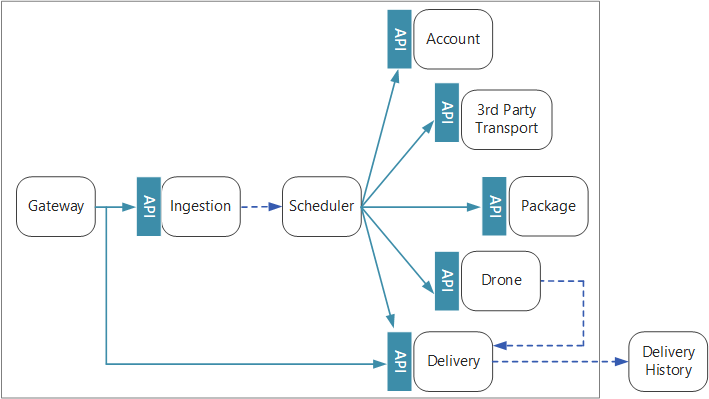

# Designing microservices: Interservice communication

Communication between microservices must be efficient and robust. With lots of small services interacting to complete a single transaction, this can be a challenge. In this chapter, we look at the tradeoffs between asynchronous messaging versus synchronous APIs. Then we look at some of the challenges in designing resilient interservice communication, and the role that a service mesh can play.

## Challenges 

Here are some of the main challenges arising from service-to-service communication. Service meshes, described later in this chapter, are designed to handle many of these challenges.

**Resiliency.** There may be dozens or even hundreds of instances of any given microservice. An instance can fail for any number of reasons. There can be a node-level failure, such as a hardware failure or a VM reboot. An instance might crash, or be overwhelmed with requests and unable to process any new requests. Any of these events can cause a network call to fail. There are two design patterns that can help make service-to-service network calls more resilient:

- **[Retry](../patterns/retry.md)**. A network call may fail because of a transient fault that goes away by itself. Rather than fail outright, the caller should typically retry the operation a certain number of times, or until a configured time-out period elapses. However, if an operation is not idempotent, retries can cause unintended side effects. The original call might succeed, but the caller never gets a response. If the caller retries, the operation may be invoked twice. Generally, it's not safe to retry POST or PATCH methods, because these are not guaranteed to be idempotent.

- **[Circuit Breaker](../patterns/circuit-breaker.md)**. Too many failed requests can cause a bottleneck, as pending requests accumulate in the queue. These blocked requests might hold critical system resources such as memory, threads, database connections, and so on, which can cause cascading failures. The Circuit Breaker pattern can prevent a service from repeatedly trying an operation that is likely to fail. 

**Load balancing**. When service "A" calls service "B", the request must reach a running instance of service "B". In Kubernetes, the `Service` resource type provides a stable IP address for a group of pods. Network traffic to the service's IP address gets forwarded to a pod by means of iptable rules. By default, a random pod is chosen. A service mesh (see below) can provide more intelligent load balancing algorithms based on observed latency or other metrics.

**Distributed tracing**. A single transaction may span multiple services. That can make it hard to monitor the overall performance and health of the system. Even if every service generates logs and metrics, without some way to tie them together, they are of limited use. The chapter [Logging and monitoring](./logging-monitoring.md) talks more about distributed tracing, but we mention it here as a challenge.

**Service versioning**. When a team deploys a new version of a service, they must avoid breaking any other services or external clients that depend on it. In addition, you might want to run multiple versions of a service side-by-side, and route requests to a particular version. See [API Versioning](./api-design.md#api-versioning) for more discussion of this issue.

**TLS encryption and mutual TLS authentication**. For security reasons, you may want to encrypt traffic between services with TLS, and use mutual TLS authentication to authenticate callers.

## Synchronous versus asynchronous messaging

There are two basic messaging patterns that microservices can use to communicate with other microservices. 

1. Synchronous communication. In this pattern, a service calls an API that another service exposes, using a protocol such as HTTP or gRPC. This option is a synchronous messaging pattern because the caller waits for a response from the receiver. 

2. Asynchronous message passing. In this pattern, a service sends message without waiting for a response, and one or more services process the message asynchronously.

It's important to distinguish between asynchronous I/O and an asynchronous protocol. Asynchronous I/O means the calling thread is not blocked while the I/O completes. That's important for performance, but is an implementation detail in terms of the architecture. An asynchronous protocol means the sender doesn't wait for a response. HTTP is a synchronous protocol, even though an HTTP client may use asynchronous I/O when it sends a request. 

There are tradeoffs to each pattern. Request/response is a well-understood paradigm, so designing an API may feel more natural than designing a messaging system. However, asynchronous messaging has some advantages that can be very useful in a microservices architecture:

- **Reduced coupling**. The message sender does not need to know about the consumer. 

- **Multiple subscribers**. Using a pub/sub model, multiple consumers can subscribe to receive events. See [Event-driven architecture style](/azure/architecture/guide/architecture-styles/event-driven).

- **Failure isolation**. If the consumer fails, the sender can still send messages. The messages will be picked up when the consumer recovers. This ability is especially useful in a microservices architecture, because each service has its own lifecycle. A service could become unavailable or be replaced with a newer version at any given time. Asynchronous messaging can handle intermittent downtime. Synchronous APIs, on the other hand, require the downstream service to be available or the operation fails. 
 
- **Responsiveness**. An upstream service can reply faster if it does not wait on downstream services. This is especially useful in a microservices architecture. If there is a chain of service dependencies (service A calls B, which calls C, and so on), waiting on synchronous calls can add unacceptable amounts of latency.

- **Load leveling**. A queue can act as a buffer to level the workload, so that receivers can process messages at their own rate. 

- **Workflows**. Queues can be used to manage a workflow, by check-pointing the message after each step in the workflow.

However, there are also some challenges to using asynchronous messaging effectively.

- **Coupling with the messaging infrastructure**. Using a particular messaging infrastructure may cause tight coupling with that infrastructure. It will be difficult to switch to another messaging infrastructure later.

- **Latency**. End-to-end latency for an operation may become high if the message queues fill up.  

- **Cost**. At high throughputs, the monetary cost of the messaging infrastructure could be significant.

- **Complexity**. Handling asynchronous messaging is not a trivial task. For example, you must handle duplicated messages, either by de-duplicating or by making operations idempotent. It's also hard to implement request-response semantics using asynchronous messaging. To send a response, you need another queue, plus a way to correlate request and response messages.

- **Throughput**. If messages require *queue semantics*, the queue can become a bottleneck in the system. Each message requires at least one queue operation and one dequeue operation. Moreover, queue semantics generally require some kind of locking inside the messaging infrastructure. If the queue is a managed service, there may be additional latency, because the queue is external to the cluster's virtual network. You can mitigate these issues by batching messages, but that complicates the code. If the messages don't require queue semantics, you might be able to use an event *stream* instead of a queue. For more information, see [Event-driven architectural style](../guide/architecture-styles/event-driven.md).  

## Drone Delivery: Choosing the messaging patterns

With these considerations in mind, the development team made the following design choices for the Drone Delivery application

- The Ingestion service exposes a public REST API that client applications use to schedule, update, or cancel deliveries.

- The Ingestion service uses Event Hubs to send asynchronous messages to the Scheduler service. Asynchronous messages are necessary to implement the load-leveling that is required for ingestion. For details on how the Ingestion and Scheduler services interact, see [Ingestion and workflow][ingestion-workflow].

- The Account, Delivery, Package, Drone, and Third-party Transport services all expose internal REST APIs. The Scheduler service calls these APIs to carry out a user request. One reason to use synchronous APIs is that the Scheduler needs to get a response from each of the downstream services. A failure in any of the downstream services means the entire operation failed. However, a potential issue is the amount of latency that is introduced by calling the backend services. 

- If any downstream service has a non-transient failure, the entire transaction should be marked as failed. To handle this case, the Scheduler service sends an asynchronous message to the Supervisor, so that the Supervisor can schedule compensating transactions, as described in the chapter [Ingestion and workflow][ingestion-workflow].   

- The Delivery service exposes a public API that clients can use to get the status of a delivery. In the chapter [API gateway](./gateway.md), we discuss how an API gateway can hide the underlying services from the client, so the client doesn't need to know which services expose which APIs. 

- While a drone is in flight, the Drone service sends events that contain the drone's current location and status. The Delivery service listens to these events in order to track the status of a delivery.

- When the status of a delivery changes, the Delivery service sends a delivery status event, such as `DeliveryCreated` or `DeliveryCompleted`. Any service can subscribe to these events. In the current design, the Delivery service is the only subscriber, but there might be other subscribers later. For example, the events might go to a real-time analytics service. And because the Scheduler doesn't have to wait for a response, adding more subscribers doesn't affect the main workflow path.

Notice that delivery status events are derived from drone location events. For example, when a drone reaches a delivery location and drops off a package, the Delivery service translates this into a DeliveryCompleted event. This is an example of thinking in terms of domain models. As described earlier, Drone Management belongs in a separate bounded context. The drone events convey the physical location of a drone. The delivery events, on the other hand, represent changes in the status of a delivery, which is a different business entity.

## Using a service mesh

A *service mesh* is a software layer that handles service-to-service communication. Service meshes are designed to address many of the concerns listed in the previous section, and to move responsibility for these concerns away from the microservices themselves and into a shared layer. The service mesh acts as a proxy that intercepts network communication between microservices in the cluster. 

> [!NOTE]
> Service mesh is an example of the [Ambassador pattern](../patterns/ambassador.md) &mdash; a helper service that sends network requests on behalf of the application. 

Right now, the main options for a service mesh in Kubernetes are [linkerd](https://linkerd.io/) and [Istio](https://istio.io/). Both of these technologies are evolving rapidly. At the time we wrote this guide, the latest Istio release is 0.2, so it is still very new. However, some features that both linkerd and Istio have in common include: 

- Load balancing at the session level, based on observed latencies or number of outstanding requests. This can improve performance over the layer-4 load balancing that is provided by Kubernetes. 

- Layer-7 routing based on URL path, Host header, API version, or other application-level rules.

- Retry of failed requests. A service mesh understands HTTP error codes, and can automatically retry failed requests. You can configure that maximum number of retries, along with a timeout period in order to bound the maximum latency. 

- Circuit breaking. If an instance consistently fails requests, the service mesh will temporarily mark it as unavailable. After a backoff period, it will try the instance again. You can configure the circuit breaker based on various criteria, such as the number of consecutive failures,  

- Service mesh captures metrics about interservice calls, such as the request volume, latency, error and success rates, and response sizes. The service mesh also enables distributed tracing by adding correlation information for each hop in a request.

- Mutual TLS Authentication for service-to-service calls.

Do you need a service mesh? The value they add to a distributed system is certainly compelling. If you don't have a service mesh, you will need to consider each of the challenges mentioned at the beginning of the chapter. You can solve problems like retry, circuit breaker, and distributed tracing without a service mesh, but a service mesh moves these concerns out of the individual services and into a dedicated layer. On the other hand, service meshes are a relatively new technology that is still maturing. Deploying a service mesh adds complexity to the setup and configuration of the cluster. There may be performance implications, because requests now get routed through the service mesh proxy, and because extra services are now running on every node in the cluster. You should do thorough performance and load testing before deploying a service mesh in production.

> [!div class="nextstepaction"]
> [API design](./api-design.md)

<!-- links -->

[ingestion-workflow]: ./ingestion-workflow.md
