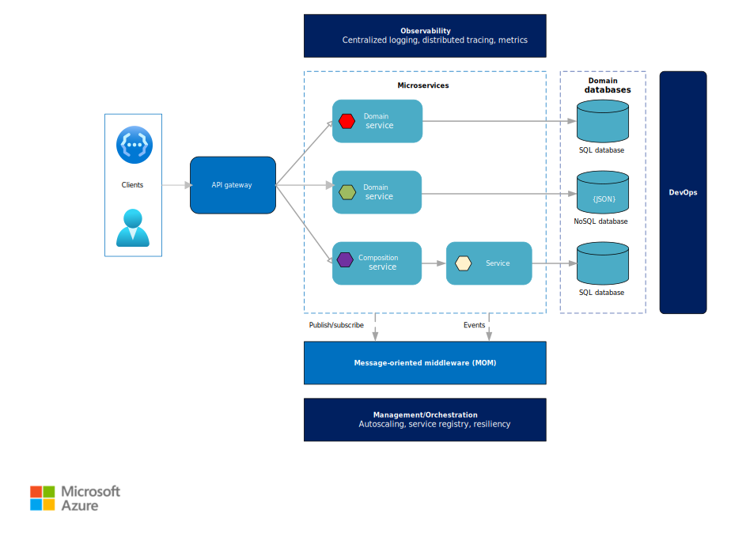

# Introduction to microservices architectures

A microservices architecture consists of a collection of small, autonomous services. Each service is self-contained and should implement a single business capability. Here are some of the defining characteristics of microservices:

- In a microservices architecture, services are small, independent, and loosely coupled.
- A microservice is small enough that a single small team of developers can write and maintain it.
- Services can be deployed independently. A team can update an existing service without rebuilding and redeploying the entire application.
- Services are responsible for persisting their own data or external state. This differs from the traditional model, where a separate data layer handles data persistence.
- Services communicate with each other by using well-defined APIs. Internal implementation details of each service are hidden from other services.
- Services don't need to share the same technology stack, libraries, or frameworks.

<!-- markdownlint-disable MD026 -->

## Why build microservices?

Microservices can provide a number of useful benefits:

- **Agility.** Because microservices are deployed independently, it's easier to manage bug fixes and feature releases. You can update a service without redeploying the entire application, and roll back an update if something goes wrong. In many traditional applications, if a bug is found in one part of the application, it can block the entire release process; as a result, new features may be held up waiting for a bug fix to be integrated, tested, and published.  

- **Small code, small teams.** A microservice should be small enough that a single feature team can build, test, and deploy it. Small code bases are easier to understand. In a large monolithic application, there is a tendency over time for code dependencies to become tangled, so that adding a new feature requires touching code in a lot of places. By not sharing code or data stores, a microservices architecture minimizes dependencies, and that makes it easier to add new features. Small team sizes also promote greater agility. The "two-pizza rule" says that a team should be small enough that two pizzas can feed the team. Obviously that's not an exact metric and depends on team appetites! But the point is that large groups tend be less productive, because communication is slower, management overhead goes up, and agility diminishes.  

- **Mix of technologies**. Teams can pick the technology that best fits their service, using a mix of technology stacks as appropriate. 

- **Resiliency**. If an individual microservice becomes unavailable, it won't disrupt the entire application, as long as any upstream microservices are designed to handle faults correctly (for example, by implementing circuit breaking).

- **Scalability**. A microservices architecture allows each microservice to be scaled independently of the others. That lets you scale out subsystems that require more resources, without scaling out the entire application. If you deploy services inside containers, you can also pack a higher density of microservices onto a single host, which allows for more efficient utilization of resources.

- **Data isolation**. It is much easier to perform schema updates, because only a single microservice is impacted. In a monolithic application, schema updates can become very challenging, because different parts of the application may all touch the same data, making any alterations to the schema risky.

## When should I build microservices?

Consider a microservices architecture for:

- Large applications that require a high release velocity.
- Complex applications that need to be highly scalable.
- Applications with rich domains or many subdomains.
- An organization that consists of small development teams.

## Challenges

The benefits of microservices don't come for free. Here are some of the challenges to consider before embarking on a microservices architecture.

- **Complexity**. A microservices application has more moving parts than the equivalent monolithic application. Each service is simpler, but the entire system as a whole is more complex.

- **Development and testing**. Writing a small service that relies on other dependent services requires a different approach than a writing a traditional monolithic or layered application. Existing tools are not always designed to work with service dependencies. Refactoring across service boundaries can be difficult. It is also challenging to test service dependencies, especially when the application is evolving quickly.

- **Lack of governance**. The decentralized approach to building microservices has advantages, but it can also lead to problems. You may end up with so many different languages and frameworks that the application becomes hard to maintain. It may be useful to put some project-wide standards in place, without overly restricting teams' flexibility. This especially applies to cross-cutting functionality such as logging.

- **Network congestion and latency**. The use of many small, granular services can result in more interservice communication. Also, if the chain of service dependencies gets too long (service A calls B, which calls C...), the additional latency can become a problem. You will need to design APIs carefully. Avoid overly chatty APIs, think about serialization formats, and look for places to use asynchronous communication patterns.

- **Data integrity**. With each microservice responsible for its own data persistence. As a result, data consistency can be a challenge. Embrace eventual consistency where possible.

- **Management**. To be successful with microservices requires a mature DevOps culture. Correlated logging across services can be challenging. Typically, logging must correlate multiple service calls for a single user operation.

- **Versioning**. Updates to a service must not break services that depend on it. Multiple services could be updated at any given time, so without careful design, you might have problems with backward or forward compatibility.

- **Skillset**. Microservices are highly distributed systems. Carefully evaluate whether the team has the skills and experience to be successful.
