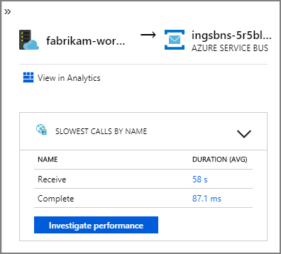

<!-- cSpell:ignore kusto kube kubelet Backoff Fluentd TICK Serilog Telegraf Dropoff Istio linkerd kubectl -->
This article describes best practices for monitoring a microservices application that runs on Azure Kubernetes Service (AKS). Specific topics include telemetry collection, monitoring a cluster's status, metrics, logging, structured logging, and distributed tracing. The latter is illustrated in this diagram:

:::image type="content" source="images/drone-delivery-impl.png" alt-text="Diagram that shows the architecture of a drone delivery application." lightbox="images/drone-delivery-impl.png" border="false":::

*Download a [Visio file](https://arch-center.azureedge.net/design-microservice-drone-delivery-imp.vsdx) of this architecture.*

## Telemetry collection

In any complex application, at some point, something will go wrong. In a microservices application, you need to track what's happening across dozens or even hundreds of services. You need to collect telemetry from the application to make sense of what's happening. Telemetry can be divided into these categories: _logs_, _traces_, and _metrics_.

**Logs** are text-based records of events occurring while an application runs. They include application logs (trace statements) and web server logs. Logs are primarily helpful for forensics and root cause analysis.

**Traces**, also called _operations_, connect the steps of a single request across multiple calls within and across microservices. They can provide structured observability into the interactions of system components. Traces can begin early in the request process, such as within the UI of an application, and can propagate through network services across a network of microservices that handle the request.

- **Spans** are units of work within a trace. Each span is connected with a single trace and can be nested with other spans. They often correspond to individual _requests_ in a cross-service operation but can also define work in individual components within a service. Spans also track outbound calls from one service to another. (Sometimes spans are called _dependency records_.)

**Metrics** are numerical values that can be analyzed. You can use them to observe a system in real-time (or close to real-time) or to analyze performance trends over time. To understand a system holistically, you need to collect metrics at various levels of the architecture, from the physical infrastructure to the application, including:

- **Node-level** metrics, including CPU, memory, network, disk, and file system usage. System metrics help you to understand resource allocation for each node in the cluster and to troubleshoot outliers.

- **Container** metrics. For containerized applications, you must collect metrics at the container level, not just at the VM level.

- **Application** metrics. These metrics are relevant to understanding the behaviour of a service. Examples include the number of queued inbound HTTP requests, request latency and message-queue length. Applications can also use custom metrics specific to the domain, like the number of business transactions processed per minute.

- **Dependent service** metrics. Services sometimes call external services or endpoints, like managed PaaS or SaaS services. Third-party services might not provide metrics. If they don't, you need to rely on your application metrics to track statistics for latency and error rates.

## Monitoring cluster status

Use [Azure Monitor][azure-monitor] to monitor the health of your clusters. The following screenshot shows a cluster that has critical errors in user-deployed pods:

:::image type="content" source="images/monitoring/pod-status.png" alt-text="Screenshot that shows the Monitor dashboard." lightbox="images/monitoring/pod-status.png" border="false":::

From here, you can drill in further to find the problem. For example, if the pod status is `ImagePullBackoff`, Kubernetes couldn't pull the container image from the registry. This problem could be caused by an invalid container tag or an authentication error during a pull from the registry.

If a container crashes, the `State` becomes `Waiting`, with a `Reason` of `CrashLoopBackOff`. For a typical scenario, where a pod is part of a replica set, and the retry policy is `Always`, this problem doesn't show as an error in the cluster status. However, you can run queries or set up alerts for this condition. For more information, see [Understand AKS cluster performance with Azure Monitor Container insights](/azure/azure-monitor/insights/container-insights-analyze).

There are multiple container-specific workbooks available in the workbooks pane of an AKS resource. You can use these workbooks for a quick overview, troubleshooting, management, and insights. The following screenshot shows a list of workbooks that are available by default for AKS workloads.

:::image type="content" source="images/monitoring/aks-workbooks.png" alt-text="Screenshot that shows the workbooks for an AKS resource." lightbox="images/monitoring/aks-workbooks.png" border="false":::

## Metrics

We recommend using [Monitor][azure-monitor] to collect and view metrics for your AKS clusters and other dependent Azure services.

- Enable [Azure Monitor Container insights](/azure/monitoring/monitoring-container-insights-overview) for cluster and container metrics. When this feature is enabled, Monitor collects memory and processor metrics from controllers, nodes, and containers via the Kubernetes Metrics API. For more information about the metrics that are available from Container insights, see [Understand AKS cluster performance with Azure Monitor Container insights](/azure/azure-monitor/insights/container-insights-analyze).

- Use [Application Insights](/azure/application-insights/app-insights-overview) to collect application metrics. Application Insights is an extensible application performance management (APM) service. To use it, you install an instrumentation package in your application. This package monitors the app and sends telemetry data to Application Insights. It can also pull telemetry data from the host environment. The data is then sent to Monitor. Application Insights also provides built-in correlation and dependency tracking. (See [Distributed tracing](#distributed-tracing), later in this article.)

Application Insights has a maximum throughput that's measured in events per second, and it throttles telemetry if the data rate exceeds the limit. For details, see [Application Insights limits](/azure/azure-monitor/service-limits#application-insights). Create different Application Insights instances for each environment so that dev/test environments don't compete against the production telemetry for quota.

A single operation can generate many telemetry events, so if an application experiences a high volume of traffic, its telemetry capture is likely to be throttled. To mitigate this problem, you can perform sampling to reduce the telemetry traffic. The tradeoff is that your metrics will be less precise unless the instrumentation supports [pre-aggregation](https://opentelemetry.io/docs/reference/specification/overview/#recording-metrics-with-predefined-aggregation). In that case, there will be fewer trace samples for troubleshooting, but the metrics maintain accuracy. For more information, see [Sampling in Application Insights](/azure/application-insights/app-insights-sampling). You can also reduce the data volume by pre-aggregating metrics. That is, you can calculate statistical values, like the average and standard deviation, and send those values instead of the raw telemetry. This blog post describes an approach to using Application Insights at scale: [Azure Monitoring and Analytics at Scale](/archive/blogs/azurecat/azure-monitoring-and-analytics-at-scale).

If your data rate is high enough to trigger throttling, and sampling or aggregation aren't acceptable, consider exporting metrics to a time-series database, like Azure Data Explorer, Prometheus, or InfluxDB, running in the cluster.

- [Azure Data Explorer](/azure/data-explorer/data-explorer-overview) is an Azure-native, highly scalable data exploration service for log and telemetry data. It features support for multiple data formats, a rich query language, and connections for consuming data in popular tools like [Jupyter Notebooks](/azure/data-explorer/kqlmagic) and [Grafana](/azure/data-explorer/grafana). Azure Data Explorer has built-in connectors to ingest log and metrics data via Azure Event Hubs. For more information, see [Ingest and query monitoring data in Azure Data Explorer](/azure/data-explorer/ingest-data-no-code).

- InfluxDB is a push-based system. An agent needs to push the metrics. You can use [TICK stack][tick stack] to set up the monitoring of Kubernetes. Next, you can push metrics to InfluxDB using [Telegraf](https://www.influxdata.com/time-series-platform/telegraf/), an agent for collecting and reporting metrics. You can use InfluxDB for irregular events and string data types.

- Prometheus is a pull-based system. It periodically scrapes metrics from configured locations. Prometheus can [scrape metrics generated by Azure Monitor](/azure/azure-monitor/containers/container-insights-agent-config#overview-of-configurable-prometheus-scraping-settings) or kube-state-metrics. [kube-state-metrics][kube-state-metrics] is a service that collects metrics from the Kubernetes API server and makes them available to Prometheus (or a scraper that's compatible with a Prometheus client endpoint). For system metrics, use [node exporter](https://github.com/prometheus/node_exporter), which is a Prometheus exporter for system metrics. Prometheus supports floating-point data but not string data, so it's appropriate for system metrics but not logs. [Kubernetes Metrics Server](https://github.com/kubernetes-sigs/metrics-server) is a cluster-wide aggregator of resource usage data.

## Logging

Here are some of the general challenges of logging in a microservices application:

- Understanding the end-to-end processing of a client request, where multiple services might be invoked to handle a single request.
- Consolidating logs from multiple services into a single aggregated view.
- Parsing logs from multiple sources that use their logging schemas or have no particular schema. Logs might be generated by third-party components that you don't control.
- Microservices architectures often generate a larger volume of logs than traditional monoliths because there are more services, network calls, and steps in a transaction. That means logging itself can be a performance or resource bottleneck for the application.

There are some additional challenges for Kubernetes-based architectures:

- Containers can move around and be rescheduled.
- Kubernetes has a networking abstraction that uses virtual IP addresses and port mappings.

In Kubernetes, the standard approach to logging is for a container to write logs to stdout and stderr. The container engine redirects these streams to a logging driver. To make querying easier and to prevent possible loss of log data if a node stops responding, the usual approach is to collect the logs from each node and send them to a central storage location.

Azure Monitor integrates with AKS to support this approach. Monitor collects container logs and sends them to a Log Analytics workspace. From there, you can use the [Kusto Query Language](/azure/kusto/query/) to write queries across the aggregated logs. For example, here's a Kusto query for showing the container logs for a specified pod:

```kusto
let ContainerIdList = KubePodInventory
| where ClusterName =~ '<cluster-name>'
| where Name =~ '<pod-name>'
| distinct ContainerID;
ContainerLog
| where ContainerID in (ContainerIdList)
```

Azure Monitor is a managed service, and configuring an AKS cluster to use Monitor is a simple configuration change in the CLI or Azure Resource Manager template. (For more information, see [How to enable Azure Monitor Container insights](/azure/azure-monitor/insights/container-insights-onboard).) Another advantage of using Azure Monitor is consolidating your AKS logs with other Azure platform logs to provide a unified monitoring experience.

Azure Monitor is billed per gigabyte (GB) of data ingested into the service. (See [Azure Monitor pricing](https://azure.microsoft.com/pricing/details/monitor/).) At  high volumes, the cost might become a consideration. There are many open-source alternatives available for the Kubernetes ecosystem. For example, many organizations use Fluentd with Elasticsearch. Fluentd is an open-source data collector, and Elasticsearch is a document database used for search. A challenge with these options is that they require extra configuration and management of the cluster. For a production workload, you should experiment with configuration settings. You'll also need to monitor the performance of the logging infrastructure.

### OpenTelemetry

OpenTelemetry is a cross-industry effort to improve tracing by standardizing the interface between applications, libraries, telemetry, and data collectors. When you use a library and framework that are instrumented with OpenTelemetry, most of the work of tracing operations that are traditionally system operations is handled by the underlying libraries, which includes the following common scenarios:

- Logging of basic request operations, like start time, exit time, and duration
- Exceptions thrown
- Context propagation (like sending a correlation ID across HTTP call boundaries)

Instead, the base libraries and frameworks that handle these operations create rich interrelated spans, trace data structures, and propagate them across contexts. Before OpenTelemetry, these were usually just injected as special log messages or proprietary data structures specific to the vendor who built the monitoring tools. OpenTelemetry also encourages a richer instrumentation data model than a traditional logging-first approach, and the logs are more beneficial because the log messages are linked to the traces and spans where they were generated. This often makes finding logs associated with a specific operation or request easy.

Many of the Azure SDKs have been instrumented with OpenTelemetry or are in the process of implementing it.

An application developer can add manual instrumentation by using the OpenTelemetry SDKs to do the following activities:

- Add instrumentation where an underlying library doesn't provide it.
- Enrich the trace context by adding spans to expose application-specific units of work (like an order loop that creates a span for the processing of each order line).
- Enrich existing spans with entity keys to enable easier tracing. (For example, add an OrderID key/value to the request that processes that order.) These keys are surfaced by the monitoring tools as structured values for querying, filtering, and aggregating (without parsing out log message strings or looking for combinations of log message sequences, as was common with a logging-first approach).
- Propagate trace context by accessing trace and span attributes, injecting traceIds into responses and payloads, and/or reading traceIds from incoming messages to create requests and spans.

Read more about instrumentation and the OpenTelemetry SDKs in the [OpenTelemetry documentation](https://opentelemetry.io/docs/concepts/instrumenting).

### Application Insights

Application Insights collects rich data from OpenTelemetry and its instrumentation libraries and captures it in an efficient data store to provide rich visualization and query support. The [Application Insights OpenTelemetry-based instrumentation libraries](/azure/azure-monitor/app/opentelemetry-enable), for languages like .NET, Java, Node.js, and Python, make it easy to send telemetry data to Application Insights.

If you're using .NET Core, we recommend also considering the [Application Insights for Kubernetes](https://github.com/microsoft/ApplicationInsights-Kubernetes) library. This library enriches Application Insights traces with additional information, like the container, node, pod, labels, and replica set.

Application Insights maps the OpenTelemetry context to its internal data model:

- Trace -> Operation
- Trace ID -> Operation ID
- Span -> Request or Dependency

Take the following considerations into account:

- Application Insights throttles telemetry if the data rate exceeds a maximum limit. For details, see [Application Insights limits](/azure/azure-monitor/service-limits#application-insights). A single operation can generate several telemetry events, so if an application experiences a high volume of traffic, it's likely to be throttled.
- Because Application Insights batches data, you can lose a batch if a process fails with an unhandled exception.
- Application Insights billing is based on data volume. For more information, see [Manage pricing and data volume in Application Insights](/azure/application-insights/app-insights-pricing).

## Structured logging

To make logs easier to parse, use structured logging when you can. When you use structured logging, the application writes logs in a structured format, like JSON, rather than outputting unstructured text strings. There are many structured logging libraries available. For example, here's a logging statement that uses the [Serilog library](https://github.com/serilog/serilog-aspnetcore) for .NET Core:

```csharp
public async Task<IActionResult> Put([FromBody]Delivery delivery, string id)
{
    logger.LogInformation("In Put action with delivery {Id}: {@DeliveryInfo}", id, delivery.ToLogInfo());

    ...
}
```

Here, the call to `LogInformation` includes an `Id` parameter and `DeliveryInfo` parameter. When you use structured logging, these values aren't interpolated into the message string. Instead, the log output looks something like this:

```json
{"@t":"2019-06-13T00:57:09.9932697Z","@mt":"In Put action with delivery {Id}: {@DeliveryInfo}","Id":"36585f2d-c1fa-4a3d-9e06-a7f40b7d04ef","DeliveryInfo":{...
```

This is a JSON string, where the `@t` field is a timestamp, `@mt` is the message string, and the remaining key/value pairs are the parameters. Outputting JSON format makes it easier to query the data in a structured way. For example, the following Log Analytics query, written in the [Kusto query language](/azure/kusto/query/), searches for instances of this particular message from all containers named `fabrikam-delivery`:

```kusto
traces
| where customDimensions.["Kubernetes.Container.Name"] == "fabrikam-delivery"
| where customDimensions.["{OriginalFormat}"] == "In Put action with delivery {Id}: {@DeliveryInfo}"
| project message, customDimensions["Id"], customDimensions["@DeliveryInfo"]
```

If you view the result in the Azure portal, you can see that `DeliveryInfo` is a structured record that contains the serialized representation of the `DeliveryInfo` model:

:::image type="content" source="images/monitoring/structured-logs.png" alt-text="Screenshot that shows the Log Analytics workspace." lightbox="images/monitoring/structured-logs.png" border="false":::

Here's the JSON from this example:
```json
{
  "Id": "36585f2d-c1fa-4a3d-9e06-a7f40b7d04ef",
  "Owner": {
    "UserId": "user id for logging",
    "AccountId": "52dadf0c-0067-43e7-af76-86e32b48bc5e"
  },
  "Pickup": {
    "Altitude": 0.29295161612934972,
    "Latitude": 0.26815900219052985,
    "Longitude": 0.79841844309047727
  },
  "Dropoff": {
    "Altitude": 0.31507750848078986,
    "Latitude": 0.753494655598651,
    "Longitude": 0.89352830773849423
  },
  "Deadline": "string",
  "Expedited": true,
  "ConfirmationRequired": 0,
  "DroneId": "AssignedDroneId01ba4d0b-c01a-4369-ba75-51bde0e76cc9"
}
```

Many log messages mark the start or end of a unit of work, or they connect a business entity with a set of messages and operations for traceability. In many cases, enriching OpenTelemetry span and request objects is a better approach than only logging the start and end of the operation. Doing so adds that context to all connected traces and child operations, and it puts that information in the scope of the full operation. The OpenTelemetry SDKs for various languages support creating spans or adding custom attributes on spans. For example, the following code [uses the Java OpenTelemetry SDK](https://github.com/open-telemetry/opentelemetry-java-instrumentation/tree/main/docs), which is [supported by Application Insights](/azure/azure-monitor/app/java-in-process-agent#add-span-attributes). An existing parent span (for example, a request span that's associated with a REST controller call and created by the web framework being used) can be enriched with an entity ID that's associated with it, as shown here:

```java
import io.opentelemetry.api.trace.Span;

// ...

Span.current().setAttribute("A1234", deliveryId);
```

This code sets a key or value on the current span, which is connected to operations and log messages that occur under that span. The value appears in the Application Insights request object, as shown here:

```kusto
requests
| extend deliveryId = tostring(customDimensions.deliveryId)  // promote to column value (optional)
| where deliveryId == "A1234"
| project timestamp, name, url, success, resultCode, duration, operation_Id, deliveryId
```

This technique becomes more powerful when used with logs, filtering, and annotating log traces with span context, as shown here:

```kusto
requests
| extend deliveryId = tostring(customDimensions.deliveryId)  // promote to column value (optional)
| where deliveryId == "A1234"
| project deliveryId, operation_Id, requestTimestamp = timestamp, requestDuration = duration  // keep some request info
| join kind=inner traces on operation_Id   // join logs only for this deliveryId
| project requestTimestamp, requestDuration, logTimestamp = timestamp, deliveryId, message
```

If you use a library or framework that's already instrumented with OpenTelemetry, it handles creating spans and requests, but the application code might also create units of work. For example, a method that loops through an array of entities that performs work on each one might create a span for each iteration of the processing loop. For information about adding instrumentation to application and library code, see the [OpenTelemery instrumentation documentation](https://opentelemetry.io/docs/instrumentation/go/instrumentation).

## Distributed tracing

One of the challenges when you use microservices is understanding the flow of events across services. A single transaction can involve calls to multiple services.

### Example of distributed tracing

This example describes the path of a distributed transaction through a set of microservices. The example is based on a [drone delivery application](./design/index.yml#reference-implementation).

:::image type="content" source="images/drone-delivery-impl.png" alt-text="Diagram that shows the architecture of a drone delivery application." lightbox="images/drone-delivery-impl.png" border="false":::

In this scenario, the distributed transaction includes these steps:

1. The Ingestion service puts a message on an Azure Service Bus queue.
1. The Workflow service pulls the message from the queue.
1. The Workflow service calls three back-end services to process the request (Drone Scheduler, Package, and Delivery).

The following screenshot shows the [application map](/azure/azure-monitor/app/app-map) for the drone delivery application. This map shows calls to the public API endpoint that result in a workflow that involves five microservices.

:::image type="content" source="images/monitoring/application-map.png" alt-text="Screenshot that shows the application map for the drone delivery application." border="false":::

The arrows from `fabrikam-workflow` and `fabrikam-ingestion` to a Service Bus queue show where the messages are sent and received. You can't tell from the diagram which service is sending messages and which is receiving them. The arrows show that both services are calling Service Bus. But information about which service is sending and which is receiving is available in the details:



Because every call includes an operation ID, you can also view the end-to-end steps of a single transaction, including timing information and the HTTP calls at each step. Here's the visualization of one such transaction:

:::image type="content" source="images/monitoring/transaction.png" alt-text="Screenshot that shows an end-to-end transaction." lightbox="images/monitoring/transaction.png" border="false":::

This visualization shows the steps from the ingestion service to the queue, from the queue to the Workflow service, and from the Workflow service to the other back-end services. The last step is the Workflow service marking the Service Bus message as completed.

This example shows calls to a back-end service that are failing:

:::image type="content" source="images/monitoring/application-map-errors.png" alt-text="Screenshot that shows an application map with errors." border="false":::

This map shows that a large fraction (36%) of calls to the Drone Scheduler service failed during the period of the query. The end-to-end transaction view reveals that an exception occurs when an HTTP PUT request is sent to the service:

:::image type="content" source="images/monitoring/transaction-errors.png" alt-text="Screenshot of the end-to-end transaction. It shows that an exception occurs when an HTTP PUT request is sent to the service." lightbox="images/monitoring/transaction-errors.png":::

If you drill in further, you can see that the exception is a socket exception: "No such device or address."

```
Fabrikam.Workflow.Service.Services.BackendServiceCallFailedException: 
No such device or address 
---u003e System.Net.Http.HttpRequestException: No such device or address 
---u003e System.Net.Sockets.SocketException: No such device or address
```

This exception suggests that the back-end service isn't reachable. At this point, you might use kubectl to view the deployment configuration. In this example, the service hostname isn't resolving because of an error in the Kubernetes configuration files. The article [Debug Services](https://kubernetes.io/docs/tasks/debug/debug-application/debug-service/) in the Kubernetes documentation has tips for diagnosing this type of error.

Here are some common causes of errors:

- Code bugs. These bugs might appear as follows:
  - Exceptions. Look in the Application Insights logs to view the exception details.
  - A process is failing. Look at container and pod status, and view container logs or Application Insights traces.
  - HTTP 5*xx* errors.
- Resource exhaustion:
  - Look for throttling (HTTP 429) or request timeouts.
  - Examine container metrics for CPU, memory, and disk.
  - Look at the configurations for container and pod resource limits.
- Service discovery. Examine the Kubernetes service configuration and port mappings.
- API mismatch. Look for HTTP 400 errors. If APIs are versioned, look at the version that's being called.
- Error in pulling a container image. Look at the pod specification. Also, make sure that the cluster is authorized to pull from the container registry.
- RBAC problems.

## Next steps

Learn more about features in Azure Monitor that support monitoring of applications on AKS:

- [Azure Monitor container insights overview](/azure/azure-monitor/insights/container-insights-overview)
- [Understand AKS cluster performance with Azure Monitor Container insights](/azure/azure-monitor/insights/container-insights-analyze)

## Related resources

- [Performance tuning a distributed application](../performance/index.md)
- [Using domain analysis to model microservices](model/domain-analysis.md)
- [Design a microservices architecture](index.yml)
- [Design APIs for microservices](design/api-design.yml)

<!-- links -->

[azure-monitor]: /azure/azure-monitor
[tick stack]: https://github.com/influxdata/kube-influxdb
[kube-state-metrics]: https://github.com/kubernetes/kube-state-metrics
