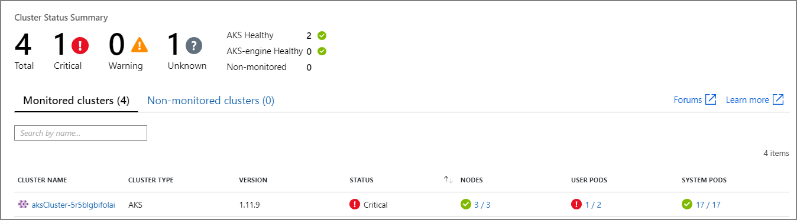
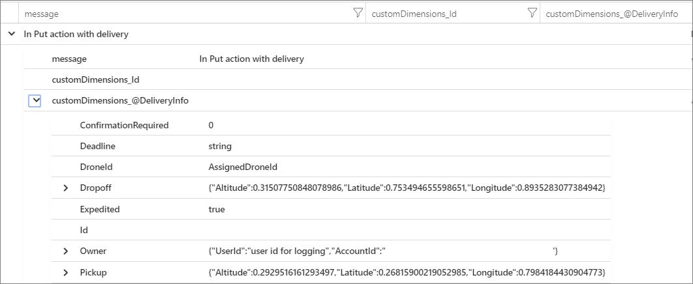
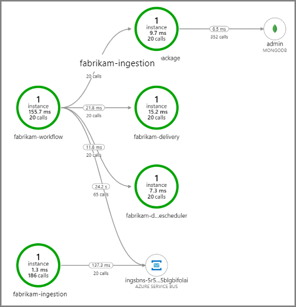
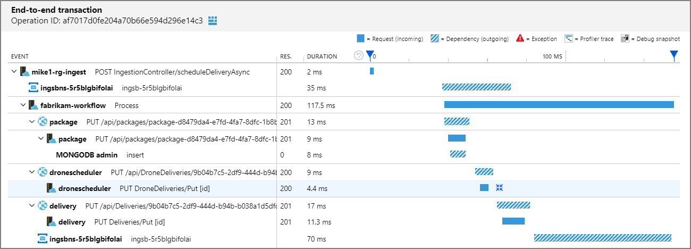
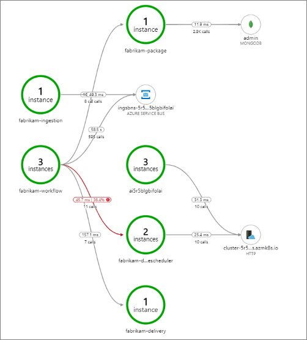
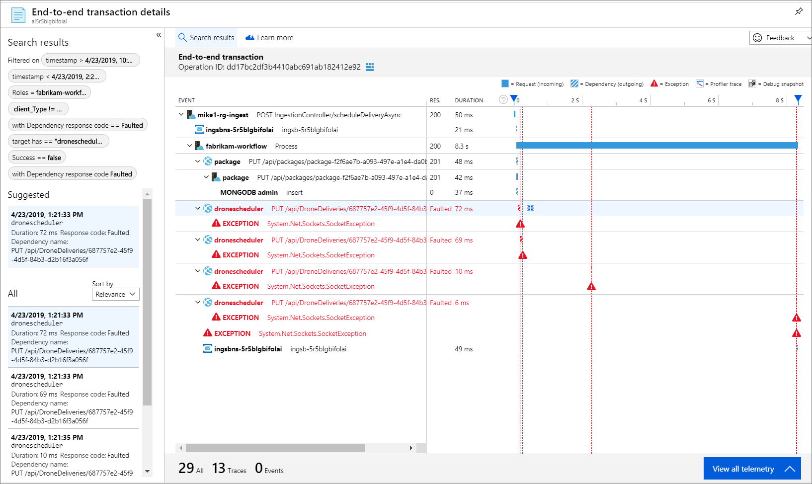

# Monitoring a microservices architecture in Azure Kubernetes Service (AKS)

This article describes best practices for monitoring a microservices application that runs on Azure Kubernetes Service (AKS).

In any complex application, at some point something will go wrong. In a microservices application, you need to track what's happening across dozens or even hundreds of services. To make sense of what's happening, you must collect telemetry from the application. Telemetry can be divided into *logs* and *metrics*. 

**Logs** are text-based records of events that occur while the application is running. They include things like application logs (trace statements) or web server logs. Logs are primarily useful for forensics and root cause analysis.

**Metrics** are numerical values that can be analyzed. You can use them to observe the system in real time (or close to real time), or to analyze performance trends over time. To understand the system holistically, you must collect metrics at various levels of the architecture, from the physical infrastructure to the application, including:

- **Node-level** metrics, including CPU, memory, network, disk, and file system usage. System metrics help you to understand resource allocation for each node in the cluster, and troubleshoot outliers.

- **Container** metrics. For containerized applications, you need to collect metrics at the container level, not just at the VM level. 

- **Application** metrics. This includes any metrics that are relevant to understanding the behavior of a service. Examples include the number of queued inbound HTTP requests, request latency, or message queue length. Applications can also create custom metrics that are specific to the domain, such as the number of business transactions processed per minute. 

- **Dependent service** metrics. Services may call external services or endpoints, such as managed PaaS services or SaaS services. Third-party services may or may not provide any metrics. If not, you'll have to rely on your own application metrics to track statistics for latency and error rate.

## Monitoring cluster status

Use [Azure Monitor][azure-monitor] to monitor the overall health of your clusters. The following screenshot shows a cluster with critical errors in user-deployed pods.



From here, you can drill in further to find the issue. For example, if the pod status is `ImagePullBackoff`, it means that Kubernetes could not pull the container image from the registry. This could be caused by an invalid container tag or an authentication error trying to pull from the registry.

Note that a container crashing will put the container state into `State` = `Waiting`,with `Reason` = `CrashLoopBackOff`. For a typical scenario where a pod is part of a replica set and the retry policy is `Always`, this won’t show as an error in the cluster status. However, you can run queries or set up alerts for this condition. For more information, see [Understand AKS cluster performance with Azure Monitor for containers](/azure/azure-monitor/insights/container-insights-analyze).

## Metrics

We recommend using [Azure Monitor][azure-monitor] to collect and view metrics for your AKS clusters and any other dependent Azure services. 

- For cluster and container metrics, enable [Azure Monitor for containers](/azure/monitoring/monitoring-container-insights-overview). When this feature is enabled, Azure Monitor collects memory and processor metrics from controllers, nodes, and containers via the Kubernetes metrics API. For more information about the metrics that are available through Azure Monitor for containers, see [Understand AKS cluster performance with Azure Monitor for containers](/azure/azure-monitor/insights/container-insights-analyze).

- Use [Application Insights](/azure/application-insights/app-insights-overview) to collect application metrics. Application Insights is an extensible Application Performance Management (APM) service. To use it, you install an instrumentation package in your application. This package monitors the app and sends telemetry data to the Application Insights service. It can also pull telemetry data from the host environment. The data is then sent to Azure Monitor. Application Insights also provides built-in correlation and dependency tracking (see [Distributed tracing](#distributed-tracing), below).

Application Insights has a maximum throughput measured in events/second, and it throttles if the data rate exceeds the limit. For details, see [Application Insights limits](/azure/azure-subscription-service-limits#application-insights). Create different Application Insights instances per environment, so that dev/test environments don't compete against the production telemetry for quota.

A single operation may generate several telemetry events, so if the application experiences a high volume of traffic, it is likely to get throttled. To mitigate this problem, you can perform sampling to reduce the telemetry traffic. The tradeoff is that your metrics will be less precise. For more information, see [Sampling in Application Insights](/azure/application-insights/app-insights-sampling). You can also reduce the data volume by pre-aggregating metrics &mdash; that is, calculating statistical values such as average and standard deviation, and sending those values instead of the raw telemetry. The following blog post describes an approach to using Application Insights at scale: [Azure Monitoring and Analytics at Scale](https://blogs.msdn.microsoft.com/azurecat/2017/05/11/azure-monitoring-and-analytics-at-scale/).

If your data rate is high enough to trigger throttling, and sampling or aggregation are not acceptable, consider exporting metrics to a time-series database such as **Prometheus** or **InfluxDB** running in the cluster.

- InfluxDB is a push-based system. An agent needs to push the metrics. You can use [Heapster][heapster], which is a service that collects cluster-wide metrics from kubelet, aggregates the data, and pushes it to InfluxDB or other time-series storage solution. Azure Container Service deploys Heapster as part of the cluster setup. Another option is [Telegraf](https://www.influxdata.com/time-series-platform/telegraf/), which is an agent for collecting and reporting metrics.

- Prometheus is a pull-based system. It periodically scrapes metrics from configured locations. Prometheus can scrape metrics generated by cAdvisor or kube-state-metrics. [kube-state-metrics][kube-state-metrics] is a service that collects metrics from the Kubernetes API server and makes them available to Prometheus (or a scraper that is compatible with a Prometheus client endpoint). Whereas Heapster aggregates metrics that Kubernetes generates and forwards them to a sink, kube-state-metrics generates its own metrics and makes them available through an endpoint for scraping. For system metrics, use [Node exporter](https://github.com/prometheus/node_exporter), which is a Prometheus exporter for system metrics. Prometheus supports floating point data, but not string data, so it is appropriate for system metrics but not logs.

## Logging

Here are some of the general challenges of logging in a microservices application:

- Understanding the end-to-end processing of a client request, where multiple services might be invoked to handle a single request.
- Consolidating logs from multiple services into a single aggregated view.
- Parsing logs that come from multiple sources, which use their own logging schemas or have no particular schema. Logs may be generated by third-party components that you don't control.
- Microservices architectures often generate a larger volume of logs than traditional monoliths, because there are more services, network calls, and steps in a transaction. That means logging itself can be a performance or resource bottleneck for the application.

There are some additional challenges for a Kubernetes-based architecture:

- Containers can move around and be rescheduled.
- Kubernetes has a networking abstraction that uses virtual IP addresses and port mappings.

In Kubernetes, the standard approach to logging is for a container to write logs to stdout and stderr. The container engine redirects these streams to a logging driver. For ease of querying, and to prevent possible loss of log data if a node crashes, the usual approach is to collect the logs from each node and send them to a central storage location.

Azure Monitor integrates with AKS to support this approach. Azure Monitor collects container logs and sends them to a Log Analytics workspace. From there, you can use the [Kusto query language](/azure/kusto/query/) to write queries across the aggregated logs. For example, here is a Kusto query to show the container logs for a specified pod:

```kusto
let ContainerIdList = KubePodInventory
| where ClusterName =~ '<cluster-name>'
| where Name =~ '<pod-name>'
| distinct ContainerID;
ContainerLog
| where ContainerID in (ContainerIdList)
```

Azure Monitor is a managed service, and configuring an AKS cluster to use Azure Monitor is a simple configuration switch in the CLI or Resource Manager template. (For more information, see [How to enable Azure Monitor for containers](/azure/azure-monitor/insights/container-insights-onboard).) Another advantage of using Azure Monitoring is that it consolidates your AKS logs with other Azure platform logs, providing a unified monitoring experience.

Azure Monitor is billed per gigabyte (GB) of data ingested into the service (see [Azure Monitor pricing](https://azure.microsoft.com/pricing/details/monitor/)). At very high volumes, cost may become a consideration. There are many open-source alternatives available for the Kubernetes ecosystem. For example, many organizations use **Fluentd** with **Elasticsearch**. Fluentd is an open-source data collector, and Elasticsearch is a document database that is for search. A challenge with these options is that they require additional configuration and management of the cluster. For a production workload, you may need to experiment with configuration settings. You'll also need to monitor the performance of the logging infrastructure.

### Application Insights

For richer log data, we recommend instrumenting your code with Application Insights. 
This requires adding an Application Insights package to your code and configuring your code to send logging statements to Application Insights. The details depend on the platform, such as .NET, Java, or Node.js. The Application Insights package sends telemetry data to Azure Monitor.

If you are using .NET Core, we recommend also using the [Application Insights for Kubernetes](https://github.com/microsoft/ApplicationInsights-Kubernetes) library. This library enriches Application Insights traces with additional information such as the container, node, pod, labels, and replica set.

Advantages of this approach include:

- Application Insights logs HTTP requests, including latency and result code.
- Distributed tracing is enabled by default.
- Traces include an operation ID, so you can match all traces for a particular operation.
- Traces generated by Application Insights often have additional contextual information. For example, ASP.NET traces are decorated with the action name and a category such as `ControllerActionInvoker`, which give you insights into the ASP.NET request pipeline.
- Application Insights collects performance metrics for performance troubleshooting and optimization.

Considerations:

- Application Insights throttles the telemetry if the data rate exceeds a maximum limit; for details, see [Application Insights limits](/azure/azure-subscription-service-limits#application-insights). A single operation may generate several telemetry events, so if the application experiences a high volume of traffic, it is likely to get throttled.
- Because Application Insights batches data, it's possible to lose a batch if a process crashes with an unhandled exception.
- Application Insights is billed based on data volume. For more information, see [Manage pricing and data volume in Application Insights](/azure/application-insights/app-insights-pricing).

## Structured logging

To make logs easier to parse, use structured logging where possible. Structured logging is approach where the application writes logs in a structured format, such as JSON, rather than outputting unstructured text strings. There are many structured logging libraries available. For example, here is a logging statement that uses the [Serilog library](https://github.com/serilog/serilog-aspnetcore) for .NET Core:

```csharp
public async Task<IActionResult> Put([FromBody]Delivery delivery, string id)
{
    logger.LogInformation("In Put action with delivery {Id}: {@DeliveryInfo}", id, delivery.ToLogInfo());

    ...
}
```

Here, the call to `LogInformation` includes an `Id` parameter and `DeliveryInfo` parameter. With structured logging, these values are not interpolated into the message string. Instead, the log output will look something like this:

```json
{"@t":"2019-06-13T00:57:09.9932697Z","@mt":"In Put action with delivery {Id}: {@DeliveryInfo}","Id":"36585f2d-c1fa-4a3d-9e06-a7f40b7d04ef","DeliveryInfo":{...
```

This is a JSON string, where the "@t" field is a timestamp, "@mt" is the message string, and the remaining key/value pairs are the parameters. Outputting JSON format makes it easier to query the data in a structured way. For example, the following Log Analytics query, written in the [Kusto query language](/azure/kusto/query/), searches for instances of this particular message from all containers named `fabrikam-delivery`:

```Kusto
traces
| where customDimensions.["Kubernetes.Container.Name"] == "fabrikam-delivery"
| where customDimensions.["{OriginalFormat}"] == "In Put action with delivery {Id}: {@DeliveryInfo}"
| project message, customDimensions["Id"], customDimensions["@DeliveryInfo"]
```

Viewing the result in the Azure portal shows that `DeliveryInfo` is a structured record that contains the serialized representation of the `DeliveryInfo` model:



Here is the JSON from this example:

```json
{
    "Id": "36585f2d-c1fa-4a3d-9e06-a7f40b7d04ef",
    "Owner": {
        "UserId": "user id for logging",
        "AccountId": "52dadf0c-0067-43e7-af76-86e32b48bc5e"
    },
    "Pickup": {
        "Altitude": 0.29295161612934972,
        "Latitude": 0.26815900219052985,
        "Longitude": 0.79841844309047727
    },
    "Dropoff": {
        "Altitude": 0.31507750848078986,
        "Latitude": 0.753494655598651,
        "Longitude": 0.89352830773849423
    },
    "Deadline": "string",
    "Expedited": true,
    "ConfirmationRequired": 0,
    "DroneId": "AssignedDroneId01ba4d0b-c01a-4369-ba75-51bde0e76cc9"
}
```

The previous code snippet used the Serilog library, but structured logging libraries are available for other languages as well. For example, here's an example using the [SLF4J](https://www.slf4j.org/) library for Java:

```java
MDC.put("DeliveryId", deliveryId);

log.info("In schedule delivery action with delivery request {}", externalDelivery.toString());
```

## Distributed tracing

A significant challenge of microservices is to understand the flow of events across services. A single transaction may involve calls to multiple services. To reconstruct the entire sequence of steps, each service should propagate a *correlation ID* that acts as a unique identifier for that operation. The correlation ID enables [distributed tracing](https://microservices.io/patterns/observability/distributed-tracing.html) across services.

The first service that receives a client request should generate the correlation ID. If the service makes an HTTP call to another service, it puts the correlation ID in a request header. If the service sends an asynchronous message, it puts the correlation ID into the message. Downstream services continue to propagate the correlation ID, so that it flows through the entire system. In addition, all code that writes application metrics or log events should include the correlation ID.

When service calls are correlated, you can calculate operational metrics such as the end-to-end latency for a complete transaction, the number of successful transactions per second, and the percentage of failed transactions. Including correlation IDs in application logs makes it possible to perform root cause analysis. If an operation fails, you can find the log statements for all of the service calls that were part of the same operation.

We recommend using Application Insights for distributed tracing. The Application Insights SDK automatically injects correlation context into HTTP headers, and includes the correlation ID in Application Insights logs. Some services may still need to explicitly propagate the correlation headers, depending on the frameworks and libraries being used. For more information, see [Telemetry correlation in Application Insights](/azure/azure-monitor/app/correlation).

Some additional considerations when implementing distributed tracing:

- There is currently no standard HTTP header for correlation IDs, although a [W3C proposal](https://w3c.github.io/trace-context/) exists. Your team should standardize on a custom header value. The choice may be decided by your logging framework, such as Application Insights, or choice of service mesh.

- For asynchronous messages, if your messaging infrastructure supports adding metadata to messages, you should include the correlation ID as metadata. Otherwise, include it as part of the message schema. For example, see [Distributed tracing and correlation through Service Bus messaging](/azure/service-bus-messaging/service-bus-end-to-end-tracing).

- Rather than a single opaque identifier, you might send a *correlation context* that includes richer information, such as caller-callee relationships.

- If you are using Istio or linkerd as a service mesh, these technologies automatically generate correlation headers when HTTP calls are routed through the service mesh proxies. Services should forward the relevant headers.

### Example of distributed tracing

This example follows a distributed transaction through a set of microservices. The example is taken from a reference implementation described [here](./design/index.md#reference-implementation).


In this scenario, the distributed transaction has the following steps:

1. The Ingestion service puts a message on a Service Bus queue.
1. The Workflow service pulls the message from the queue.
1. The Workflow service calls three backend services to process the request (Drone Scheduler, Package, and Delivery).

The following screenshot shows the [application map](/azure/azure-monitor/app/app-map) for the Drone Delivery application. This map shows calls to the public API endpoint that result in a workflow that involves five microservices.



The arrows from `fabrikam-workflow` and `fabrikam-ingestion` to a Service Bus queue show where the messages are sent and received. You can't tell from the diagram which service is sending messages and which is receiving &mdash; the arrows just show that both services are calling Service Bus &mdash; but this information is available in the details:


Because every call includes an operation ID, you can also view the end-to-end steps in a single transaction, including timing information and the HTTP calls at each step. Here is the visualization of one such transaction:



This visualization shows the steps from the ingestion service to the queue, from the queue to the workflow service, and from the workflow service to the other backend services. The last step is the Workflow service marking the Service Bus message as completed.

Now here is an example when calls to a backend service were failing:



This shows that a large fraction (36%) of calls to the Drone Scheduler service failed during the period being queried. In the end-to-end transaction view, it shows that an exception occurs when sending an HTTP PUT request to the service.



Further drilling in, the exception turns out to be a socket exception, "No such device or address."

> Fabrikam.Workflow.Service.Services.BackendServiceCallFailedException: No such device or address ---u003e System.Net.Http.HttpRequestException: No such device or address ---u003e System.Net.Sockets.SocketException: No such device or address

This is a hint that the backend service is not reachable. At this point, you might use kubectl to view the deployment configuration. In this example, it turned out the service hostname was not resolving, due to an error in the Kubernetes configuration files. The article [Debug Services](https://kubernetes.io/docs/tasks/debug-application-cluster/debug-service/) in the Kubernetes documentation has tips for diagnosing this sort of error.

Here are some common causes of errors:

- Code bugs. These might manifest as:
  - Exceptions. Look in the Application Insights logs to view the exception details.
  - Process crashing. Look at container and pod status, and view container logs or Application Insights traces.
  - HTTP 5xx errors
- Resource exhaustion:
  - Look for throttling (HTTP 429) or request timeouts.
  - Examine container metrics for CPU, memory, and disk
  - Look at the configurations for container and pod resource limits.
- Service discovery. Examine the Kubernetes service configuration and port mappings.
- API mismatch. Look for HTTP 400 errors. If APIs are versioned, look at which version is being called.
- Error pulling a container image. Look at the pod specification. Also make sure the cluster is authorized to pull from the container registry.
- RBAC issues.

## Next steps

Learn more about features in Azure Monitor that support monitoring of applications on AKS:

- [Azure Monitor for containers overview](/azure/azure-monitor/insights/container-insights-overview)
- [Understand AKS cluster performance with Azure Monitor for containers](/azure/azure-monitor/insights/container-insights-analyze)

For more information about using metrics for performance tuning, see see [Performance tuning a distributed application](../performance/index.md).

<!-- links -->

[azure-monitor]: /azure/azure-monitor
[heapster]: https://github.com/kubernetes/heapster
[kube-state-metrics]: https://github.com/kubernetes/kube-state-metrics
