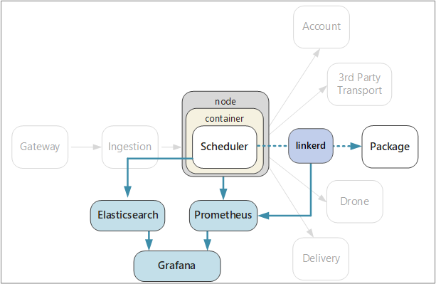

# Designing microservices: Logging and monitoring

In any complex application, at some point something will go wrong. In a microservices application, you need to track what's happening across dozens or even hundreds of services. Logging and monitoring are critically important to give you a holistic view of the system. 



In a microservices architecture, it can be especially challenging to pinpoint the exact cause of errors or performance bottlenecks. A single user operation might span multiple services. Services may hit network I/O limits inside the cluster. A chain of calls across services may cause backpressure in the system, resulting in high latency or cascading failures. Moreover, you generally don't know which node a particular container will run in. Containers placed on the same node may be competing for limited CPU or memory. 

To make sense of what's happening, you must collect telemetry from the application.  Telemetry can be divided into *logs* and *metrics*. [Azure Monitor](/azure/monitoring-and-diagnostics/monitoring-overview) collects both logs and metriocs across the Azure platform.

**Logs** are text-based records of events that occur while the application is running. They include things like application logs (trace statements) or web server logs. Logs are primarily useful for forensics and root cause analysis. 

**Metrics** are numerical values that can be analyzed. You can use them to observe the system in real time (or close to real time), or to analyze performance trends over time. Metrics can be further subcategorized as follows:

- **Node-level** metrics, including CPU, memory, network, disk, and file system usage. System metrics help you to understand resource allocation for each node in the cluster, and troubleshoot outliers.

- **Container** metrics. If services are run inside containers, you need to collect metrics at the container level, not just at the VM level. You can set up Azure Monitor to monitor container workloads in Azure Kubernetes Service (AKS). For more information, see [Azure Monitor for containers overview](/azure/monitoring/monitoring-container-insights-overview). For other container orchestrators, use the [Container Monitoring solution in Log Analytics](/azure/log-analytics/log-analytics-containers).

- **Application** metrics. This includes any metrics that are relevant to understanding the behavior of a service. Examples include the number of queued inbound HTTP requests, request latency, or message queue length. Applications can also create custom metrics that are specific to the domain, such as the number of business transactions processed per minute. Use [Application Insights](/azure/application-insights/app-insights-overview) to enable application metrics. 

- **Dependent service** metrics. Services may call external services or endpoints, such as managed PaaS services or SaaS services. Third-party services may or may not provide any metrics. If not, you'll have to rely on your own application metrics to track statistics for latency and error rate.

## Considerations

The article [Monitoring and diagnostics](../best-practices/monitoring.md) describes general best practices for monitoring an application. Here are some particular things to think about in the context of a microservices architecture.

**Configuration and management**. Will you use a managed service for logging and monitoring, or deploy logging and monitoring components as containers inside the cluster? For more discussion of these options, see the section [Technology Options](#technology-options) below.

**Ingestion rate**. What is the throughput at which the system can ingest telemetry events? What happens if that rate is exceeded? For example, the system may throttle clients, in which case telemetry data is lost, or it may downsample the data. Sometimes you can mitigate this problem by reducing the amount of data that you collect:

  - Aggregate metrics by calculating statistics, such as average and standard deviation, and send that statistical data to the monitoring system.  

  - Downsample the data &mdash; that is, process only a percentage of the events.

  - Batch the data to reduce the number of network calls to the monitoring service.

**Cost**. The cost of ingesting and storing telemetry data may be high, especially at high volumes. In some cases it could even exceed the cost of running the application. In that case, you may need to reduce the volume of telemetry by aggregating, downsampling, or batching the data, as described above. 
        
**Data fidelity**. How accurate are the metrics? Averages can hide outliers, especially at scale. Also, if the sampling rate is too low, it can smooth out fluctuations in the data. It may appear that all requests have about the same end-to-end latency, when in fact a significant fraction of requests are taking much longer. 

**Latency**. To enable real-time monitoring and alerts, telemetry data should be available quickly. How "real-time" is the data that appears on the monitoring dashboard? A few seconds old? More than a minute?

**Storage.** For logs, it may be most efficient to write the log events to ephemeral storage in the cluster, and configure an agent to ship the log files to more persistent storage.  Data should eventually be moved to long-term storage so that it's available for retrospective analysis. A microservices architecture can generate a large volume of telemetry data, so the cost of storing that data is an important consideration. Also consider how you will query the data. 

**Dashboard and visualization.** Do you get a holistic view of the system, across all of the services, both within the cluster and external services? If you are writing telemetry data and logs to more than one location, can the dashboard show all of them and correlate? The monitoring dashboard should show at least the following information:

- Overall resource allocation for capacity and growth. This includes the number of containers, file system metrics, network, and core allocation.
- Container metrics correlated at the service level.
- System metrics correlated with containers.
- Service errors and outliers.
    

## Distributed tracing

As mentioned, one challenge in microservices is understanding the flow of events across services. A single operation or transaction may involve calls to multiple services. To reconstruct the entire sequence of steps, each service should propagate a *correlation ID* that acts as a unique identifier for that operation. The correlation ID enables [distributed tracing](https://microservices.io/patterns/observability/distributed-tracing.html) across services.

The first service that receives a client request should generate the correlation ID. If the service makes an HTTP call to another service, it puts the correlation ID in a request header. Similarly, if the service sends an asynchronous message, it puts the correlation ID into the message. Downstream services continue to propagate the correlation ID, so that it flows through the entire system. In addition, all code that writes application metrics or log events should include the correlation ID.

When service calls are correlated, you can calculate operational metrics such as the end-to-end latency for a complete transaction, the number of successful transactions per second, and the percentage of failed transactions. Including correlation IDs in application logs makes it possible to perform root cause analysis. If an operation fails, you can find the log statements for all of the service calls that were part of the same operation. 

Here are some considerations when implementing distributed tracing:

- There is currently no standard HTTP header for correlation IDs. Your team should standardize on a custom header value. The choice may be decided by your logging/monitoring framework or choice of service mesh.

- For asynchronous messages, if your messaging infrastructure supports adding metadata to messages, you should include the correlation ID as metadata. Otherwise, include it as part of the message schema.

- Rather than a single opaque identifier, you might send a *correlation context* that includes richer information, such as caller-callee relationships. 

- The Azure Application Insights SDK automatically injects correlation context into HTTP headers, and includes the correlation ID in Application Insights logs. If you decide to use the correlation features built into Application Insights, some services may still need to explicitly propagate the correlation headers, depending on the libraries being used. For more information, see [Telemetry correlation in Application Insights](/azure/application-insights/application-insights-correlation).
   
- If you are using Istio or linkerd as a service mesh, these technologies automatically generate correlation headers when HTTP calls are routed through the service mesh proxies. Services should forward the relevant headers. 

    - Istio: [Distributed Request Tracing](https://istio-releases.github.io/v0.1/docs/tasks/zipkin-tracing.html)
    
    - linkerd: [Context Headers](https://linkerd.io/config/1.3.0/linkerd/index.html#http-headers)
    
- Consider how you will aggregate logs. You may want to standardize across teams on how to include correlation IDs in logs. Use a structured or semi-structured format, such as JSON, and define a common field to hold the correlation ID.

## Technology options

**Application Insights** is a managed service in Azure that ingests and stores telemetry data, and provides tools for analyzing and searching the data. To use Application Insights, you install an instrumentation package in your application. This package monitors the app and sends telemetry data to the Application Insights service. It can also pull telemetry data from the host environment. Application Insights provides built-in correlation and dependency tracking. It lets you track system metrics, application metrics, and Azure service metrics, all in one place.

Be aware that Application Insights throttles if the data rate exceeds a maximum limit; for details, see [Application Insights limits](/azure/azure-subscription-service-limits#application-insights-limits). A single operation may generate several telemetry events, so if the application experiences a high volume of traffic, it is likely to get throttled. To mitigate this problem, you can perform sampling to reduce the telemetry traffic. The tradeoff is that your metrics will be less precise. For more information, see [Sampling in Application Insights](/azure/application-insights/app-insights-sampling). You can also reduce the data volume by pre-aggregating metrics &mdash; that is, calculating statistical values such as average and standard deviation, and sending those values instead of the raw telemetry. The following blog post describes an approach to using Application Insights at scale: [Azure Monitoring and Analytics at Scale](https://blogs.msdn.microsoft.com/azurecat/2017/05/11/azure-monitoring-and-analytics-at-scale/).

In addition, make sure that you understand the pricing model for Application Insights, because you are charged based on data volume. For more information, see [Manage pricing and data volume in Application Insights](/azure/application-insights/app-insights-pricing). If your application generates a large volume of telemetry, and you don't wish to perform sampling or aggregation of the data, then Application Insights may not be the appropriate choice. 

If Application Insights doesn't meet your requirements, here are some suggested approaches that use popular open-source technologies.

For system and container metrics, consider exporting metrics to a time-series database such as **Prometheus** or **InfluxDB** running in the cluster.

- InfluxDB is a push-based system. An agent needs to push the metrics. You can use [Heapster][heapster], which is a service that collects cluster-wide metrics from kubelet, aggregates the data, and pushes it to InfluxDB or other time-series storage solution. Azure Container Service deploys Heapster as part of the cluster setup. Another option is [Telegraf](https://www.influxdata.com/time-series-platform/telegraf/), which is an agent for collecting and reporting metrics. 

- Prometheus is a pull-based system. It periodically scrapes metrics from configured locations. Prometheus can scrape metrics generated by cAdvisor or kube-state-metrics. [kube-state-metrics][kube-state-metrics] is a service that collects metrics from the Kubernetes API server and makes them available to Prometheus (or a scraper that is compatible with a Prometheus client endpoint). Whereas Heapster aggregates metrics that Kubernetes generates and forwards them to a sink, kube-state-metrics generates its own metrics and makes them available through an endpoint for scraping. For system metrics, use [Node exporter](https://github.com/prometheus/node_exporter), which is a Prometheus exporter for system metrics. Prometheus supports floating point data, but not string data, so it is appropriate for system metrics but not logs.

- Use a dashboard tool such as **Kibana** or **Grafana** to visualize and monitor the data. The dashboard service can also run inside a container in the cluster.

For application logs, consider using **Fluentd** and **Elasticsearch**. Fluentd is an open source data collector, and Elasticsearch is a document database that is optimized to act as a search engine. Using this approach, each service sends logs to `stdout` and `stderr`, and Kubernetes writes these streams to the local file system. Fluentd collects the logs, optionally enriches them with additional metadata from Kubernetes, and sends the logs to Elasticsearch. Use Kibana, Grafana, or a similar tool to create a dashboard for Elasticsearch. Fluentd runs as a daemonset in the cluster, which ensures that one Fluentd pod is assigned to each node. You can configure Fluentd to collect kubelet logs as well as container logs. At high volumes, writing logs to the local file system could become a performance bottleneck, especially when multiple services are running on the same node. Monitor disk latency and file system utilization in production.

One advantage of using Fluentd with Elasticsearch for logs is that services do not require any additional library dependencies. Each service just writes to `stdout` and `stderr`, and Fluentd handles exporting the logs into Elasticsearch. Also, the teams writing services don't need to understand how to configure the logging infrastructure. One challenge is to configure the Elasticsearch cluster for a production deployment, so that it scales to handle your traffic. 

Another option is to send logs to Operations Management Suite (OMS) Log Analytics. The [Log Analytics][log-analytics] service collects log data into a central repository, and can also consolidate data from other Azure services that your application uses. For more information, see [Monitor an Azure Container Service cluster with Microsoft Operations Management Suite (OMS)][k8s-to-oms].

## Example: Logging with correlation IDs

To illustrate some of the points discussed in this chapter, here is an extended example of how the Package service implements logging. The Package service was written in TypeScript and uses the [Koa](https://koajs.com/) web framework for Node.js. There are several Node.js logging libraries to choose from. We picked [Winston](https://github.com/winstonjs/winston), a popular logging library that met our performance requirements when we tested it.

To encapsulate the implementation details, we defined an abstract  `ILogger` interface:

```ts
export interface ILogger {
    log(level: string, msg: string, meta?: any)
    debug(msg: string, meta?: any)
    info(msg: string, meta?: any)
    warn(msg: string, meta?: any)
    error(msg: string, meta?: any)
}
```

Here is an `ILogger` implementation that wraps the Winston library. It takes the correlation ID as a constructor parameter, and injects the ID into every log message. 

```ts
class WinstonLogger implements ILogger {
    constructor(private correlationId: string) {}
    log(level: string, msg: string, payload?: any) {
        var meta : any = {};
        if (payload) { meta.payload = payload };
        if (this.correlationId) { meta.correlationId = this.correlationId }
        winston.log(level, msg, meta)
    }
  
    info(msg: string, payload?: any) {
        this.log('info', msg, payload);
    }
    debug(msg: string, payload?: any) {
        this.log('debug', msg, payload);
    }
    warn(msg: string, payload?: any) {
        this.log('warn', msg, payload);
    }
    error(msg: string, payload?: any) {
        this.log('error', msg, payload);
    }
}
```

The Package service needs to extract the correlation ID from the HTTP request. For example, if you're using linkerd, the correlation ID is found in the `l5d-ctx-trace` header. In Koa, the HTTP request is stored in a Context object that gets passed through the request processing pipeline. We can define a middleware function to get the correlation ID from the Context and initialize the logger. (A middleware function in Koa is simply a function that gets executed for each request.)

```ts
export type CorrelationIdFn = (ctx: Context) => string;

export function logger(level: string, getCorrelationId: CorrelationIdFn) {
    winston.configure({ 
        level: level,
        transports: [new (winston.transports.Console)()]
        });
    return async function(ctx: any, next: any) {
        ctx.state.logger = new WinstonLogger(getCorrelationId(ctx));
        await next();
    }
}
```

This middleware invokes a caller-defined function, `getCorrelationId`, to get the correlation ID. Then it creates an instance of the logger and stashes it inside `ctx.state`, which is a key-value dictionary used in Koa to pass information through the pipeline. 

The logger middleware is added to the pipeline on startup:

```ts
app.use(logger(Settings.logLevel(), function (ctx) {
    return ctx.headers[Settings.correlationHeader()];  
}));
```

Once everything is configured, it's easy to add logging statements to the code. For example, here is the method that looks up a package. It makes two calls to the `ILogger.info` method.

```ts
async getById(ctx: any, next: any) {
  var logger : ILogger = ctx.state.logger;
  var packageId = ctx.params.packageId;
  logger.info('Entering getById, packageId = %s', packageId);

  await next();

  let pkg = await this.repository.findPackage(ctx.params.packageId)

  if (pkg == null) {
    logger.info(`getById: %s not found`, packageId);
    ctx.response.status= 404;
    return;
  }

  ctx.response.status = 200;
  ctx.response.body = this.mapPackageDbToApi(pkg);
}
```

We don't need to include the correlation ID in the logging statements, because that's done automatically by the middleware function. This makes the logging code cleaner, and reduces the chance that a developer will forget to include the correlation ID. And because all of the logging statements use the abstract `ILogger` interface, it would be easy to replace the logger implementation later.

> [!div class="nextstepaction"]
> [Continuous integration and delivery](./ci-cd.md)

<!-- links -->

[app-insights]: /azure/application-insights/app-insights-overview
[heapster]: https://github.com/kubernetes/heapster
[kube-state-metrics]: https://github.com/kubernetes/kube-state-metrics
[k8s-to-oms]: /azure/container-service/kubernetes/container-service-kubernetes-oms
[log-analytics]: /azure/log-analytics/