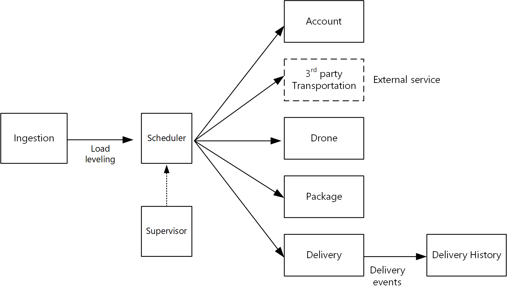

# Designing microservices: Identifying microservice boundaries

What is the right size for a microservice? You often hear something to the effect of, "not too big and not too small" &mdash; and while that's certainly correct, it's not very helpful in practice. But if you start from a carefully designed domain model, it's much easier to reason about microservices.

## From domain model to microservices

In the [previous chapter](./domain-analysis.md), we defined a set of bounded contexts for the Drone Delivery application. Then we looked more closely at one of these bounded contexts, the Shipping bounded context, and identified a set of entities, aggregates, and domain services for that bounded context.

Now we're ready to go from domain model to application design. Here's an approach that you can use to derive microservices from the domain model.

1. Start with a bounded context. In general, the functionality in a microservice should not span more than one bounded context. By definition, a bounded context marks the boundary of a particular domain model. If you find that a microservice mixes different domain models together, that's a sign that you may need to go back and refine your domain analysis.

2. Next, look at the aggregates in your domain model. Aggregates are often good candidates for microservices. A well-designed aggregate exhibits many of the characteristics of a well-designed microservice, such as:

    - An aggregate is derived from business requirements, rather than technical concerns such as data access or messaging.  
    - An aggregate should have high functional cohesion.
    - An aggregate is a boundary of persistence.
    - Aggregates should be loosely coupled. 
    
3. Domain services are also good candidates for microservices. Domain services are stateless operations across multiple aggregates. A typical example is a workflow that involves several microservices. We'll see an example of this in the Drone Delivery application.

4. Finally, consider non-functional requirements. Look at factors such as team size, data types, technologies, scalability requirements, availability requirements, and security requirements. These factors may lead you to further decompose a microservice into two or more smaller services, or do the opposite and combine several microservices into one. 

After you identify the microservices in your application, validate your design against the following criteria:

- Each service has a single responsibility.
- There are no chatty calls between services. If splitting functionality into two services causes them to be overly chatty, it may be a symptom that these functions belong in the same service.
- Each service is small enough that it can be built by a small team working independently.
- There are no inter-dependencies that will require two or more services to be deployed in lock-step. It should always be possible to deploy a service without redeploying any other services.
- Services are not tightly coupled, and can evolve independently.
- Your service boundaries will not create problems with data consistency or integrity. Sometimes it's important to maintain data consistency by putting functionality into a single microservice. That said, consider whether you really need strong consistency. There are strategies for addressing eventual consistency in a distributed system, and the benefits of decomposing services often outweigh the challenges of managing eventual consistency.

Above all, it's important to be pragmatic, and remember that domain-driven design is an iterative process. When in doubt, start with more coarse-grained microservices. Splitting a microservice into two smaller services is easier than refactoring functionality across several existing microservices.
  
## Drone Delivery: Defining the microservices

Recall that the development team had identified the four aggregates &mdash; Delivery, Package, Drone, and Account &mdash; and two domain services, Scheduler and Supervisor. 

Delivery and Package are obvious candidates for microservices. The Scheduler and Supervisor coordinate the activities performed by other microservices, so it makes sense to implement these domain services as microservices.  

Drone and Account are interesting because they belong to other bounded contexts. One option is for the Scheduler to call the Drone and Account bounded contexts directly. Another option is to create Drone and Account microservices inside the Shipping bounded context. These microservices would mediate between the bounded contexts, by exposing APIs or data schemas that are more suited to the Shipping context.

The details of the Drone and Account bounded contexts are beyond the scope of this guidance, so we created mock services for them in our reference implementation. But here are some factors to consider in this situation:

- What is the network overhead of calling directly into the other bounded context? 

- Is the data schema for the other bounded context suitable for this context, or is it better to have a schema that's tailored to this bounded context? 

- Is the other bounded context a legacy system? If so, you might create a service that acts as an [anti-corruption layer](../patterns/anti-corruption-layer.md) to translate between the legacy system and the modern application. 

- What is the team structure? Is it easy to communicate with the team that's responsible for the other bounded context? If not, creating a service that mediates between the two contexts can help to mitigate the cost of cross-team communication.

So far, we haven't considered any non-functional requirements. Thinking about the application's throughput requirements, the development team decided to create a separate Ingestion microservice that is responsible for ingesting client requests. This microservice will implement [load leveling](../patterns/queue-based-load-leveling.md) by putting incoming requests into a buffer for processing. The Scheduler will read the requests from the buffer and execute the workflow. 

Non-functional requirements led the team to create one additional service. All of the services so far have been about the process of scheduling and delivering packages in real time. But the system also needs to store the history of every delivery in long-term storage for data analysis. The team considered making this the responsibility of the Delivery service. However, the data storage requirements are quite different for historical analysis versus in-flight operations (see [Data considerations](./data-considerations.md)). Therefore, the team decided to create a separate Delivery History service, which will listen for DeliveryTracking events from the Delivery service and write the events into long-term storage.

The following diagram shows the design at this point:
 

## Choosing a compute option

The term *compute* refers to the hosting model for the computing resources that your application runs on. For a microservices architecture, two approaches are especially popular:

- A service orchestrator that manages services running on dedicated nodes (VMs).
- A serverless architecture using functions as a service (FaaS). 

While these aren't the only options, they are both proven approaches to building microservices. An application might include both approaches.

### Service orchestrators

An orchestrator handles tasks related to deploying and managing a set of services. These tasks include placing services on nodes, monitoring the health of services, restarting unhealthy services, load balancing network traffic across service instances, service discovery, scaling the number of instances of a service, and applying configuration updates. Popular orchestrators include Kubernetes, DC/OS, Docker Swarm, and Service Fabric. 

- [Azure Container Service](/azure/container-service/) (ACS) is an Azure service that lets you deploy a production-ready Kubernetes, DC/OS, or Docker Swarm cluster.

- [AKS (Azure Container Service)](/azure/aks/) is a managed Kubernetes service. AKS provisions Kubernetes and exposes the Kubernetes API endpoints, but hosts and manages the Kubernetes control plane, performing automated upgrades, automated patching, autoscaling, and other management tasks. You can think of AKS as being "Kubernetes APIs as a service." At the time of writing, AKS is still in preview. However, it's expected that AKS will become the preferred way to run Kubernetes in Azure. 

- [Service Fabric](/azure/service-fabric/) is a distributed systems platform for packaging, deploying, and managing microservices. Microservices can be deployed to Service Fabric as containers, as binary executables, or as [Reliable Services](/azure/service-fabric/service-fabric-reliable-services-introduction). Using the Reliable Services programming model, services can directly use Service Fabric programming APIs to query the system, report health, receive notifications about configuration and code changes, and discover other services. A key differentiation with Service Fabric is its strong focus on building stateful services using [Reliable Collections](/azure/service-fabric/service-fabric-reliable-services-reliable-collections).

### Containers

Sometimes people talk about containers and microservices as if they were the same thing. While that's not true &mdash; you don't need containers to build microservices &mdash; containers do have some benefits that are particularly relevant to microservices, such as:

- **Portability**. A container image is a standalone package that runs without needing to install libraries or other dependencies. That makes them easy to deploy. Containers can be started and stopped quickly, so you can spin up new instances to handle more load or to recover from node failures. 

- **Density**. Containers are lightweight compared with running a virtual machine, because they share OS resources. That makes it possible to pack multiple containers onto a single node, which is especially useful when the application consists of many small services.

- **Resource isolation**. You can limit the amount of memory and CPU that is available to a container, which can help to ensure that a runaway process doesn't exhaust the host resources. See the [Bulkhead Pattern](../patterns/bulkhead.md) for more information.

### Serverless (Functions as a Service)

With a serverless architecture, you don't manage the VMs or the virtual network infrastructure. Instead, you deploy code and the hosting service handles putting that code onto a VM and executing it. This approach tends to favor small granular functions that are coordinated using event-based triggers. For example, a message being placed onto a queue might trigger a function that reads from the queue and processes the message.

[Azure Functions][functions] is a serverless compute service that supports various function triggers, including HTTP requests, Service Bus queues, and Event Hubs events. For a complete list, see [Azure Functions triggers and bindings concepts][functions-triggers]. Also consider [Azure Event Grid][event-grid], which is a managed event routing service in Azure.

### Orchestrator or serverless?

Here are some factors to consider when choosing between an orchestrator approach and a serverless approach.

**Manageability** A serverless application is easy to manage, because the platform manages all the of compute resources for you. While an orchestrator abstracts some aspects of managing and configuring a cluster, it does not completely hide the underlying VMs. With an orchestrator, you will need to think about issues such as load balancing, CPU and memory usage, and networking.

**Flexibility and control**. An orchestrator gives you a great deal of control over configuring and managing your services and the cluster. The tradeoff is additional complexity. With a serverless architecture, you give up some degree of control because these details are abstracted.

**Portability**. All of the orchestrators listed here (Kubernetes, DC/OS, Docker Swarm, and Service Fabric) can run on-premises or in multiple public clouds. 

**Application integration**. It can be challenging to build a complex application using a serverless architecture. One option in Azure is to use [Azure Logic Apps](/azure/logic-apps/) to coordinate a set of Azure Functions. For an example of this approach, see [Create a function that integrates with Azure Logic Apps](/azure/azure-functions/functions-twitter-email).

**Cost**. With an orchestrator, you pay for the VMs that are running in the cluster. With a serverless application, you pay only for the actual compute resources consumed. In both cases, you need to factor in the cost of any additional services, such as storage, databases, and messaging services.

**Scalability**. Azure Functions scales automatically to meet demand, based on the number of incoming events. With an orchestrator, you can scale out by increasing the number of service instances running in the cluster. You can also scale by adding additional VMs to the cluster.

Our reference implementation primarily uses Kubernetes, but we did use Azure Functions for one service, namely the Delivery History service. Azure Functions was a good fit for this particular service, because it's is an event-driven workload. By using an Event Hubs trigger to invoke the function, the service needed a minimal amount of code. Also, the Delivery History service is not part of the main workflow, so running it outside of the Kubernetes cluster doesn't affect the end-to-end latency of user-initiated operations. 

> [!div class="nextstepaction"]
> [Data considerations](./data-considerations.md)

<!-- links -->

[acs-engine]: https://github.com/Azure/acs-engine
[acs-faq]: /azure/container-service/dcos-swarm/container-service-faq
[event-grid]: /azure/event-grid/
[functions]: /azure/azure-functions/functions-overview
[functions-triggers]: /azure/azure-functions/functions-triggers-bindings
