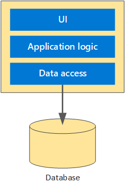
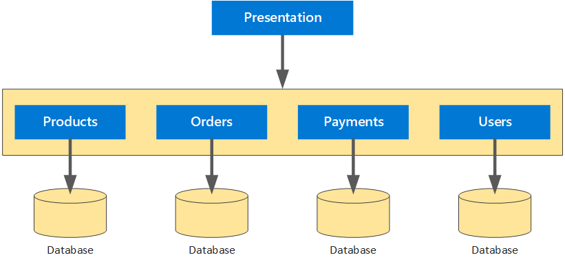
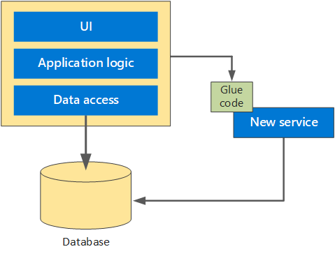
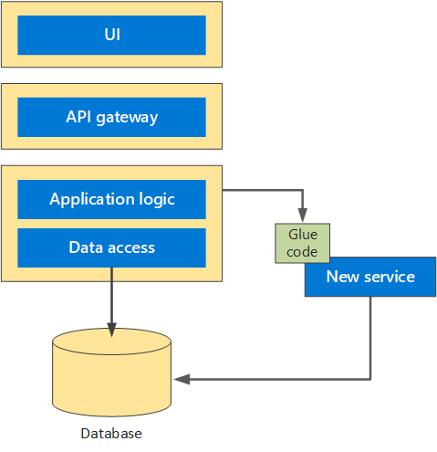
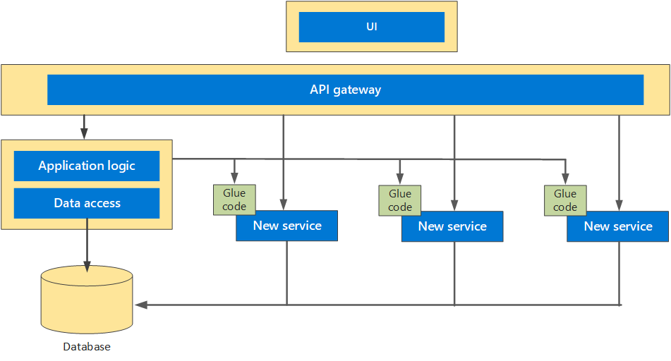

This article describes how to use domain-driven design (DDD) to migrate a monolithic application to microservices.

A monolithic application is typically an application system in which all of the relevant modules are packaged together as a single deployable unit of execution. For example, it might be a Java Web Application (WAR) running on Tomcat or an ASP.NET application running on IIS. A typical monolithic application uses a layered design, with separate layers for UI, application logic, and data access.

These systems start small but tend to grow over time to meet business needs. At some point, as new features are added, a monolithic application can begin to suffer from the following problems:

- The individual parts of the system cannot be scaled independently, because they are tightly coupled.
- It is hard to maintain the code, because of tight coupling and hidden dependencies.
- Testing becomes harder, increasing the probability of introducing vulnerabilities.

These problems can become an obstacle to future growth and stability. Teams become wary of making changes, especially if the original developers are no longer working on the project and design documents are sparse or outdated.

Despite these limitations, a monolithic design can make sense as a starting point for an application. Monoliths are often the quickest path to building a proof-of-concept or minimal viable product. In the early phases of development, monoliths tend to be:

- Easier to build, because there is a single shared code base.
- Easier to debug, because the code runs within a single process and memory space.
- Easier to reason about, because there are fewer moving parts.

As the application grows in complexity, however, these advantages can disappear. Large monoliths often become progressively harder to build, debug, and reason about. At some point, the problems outweigh the benefits. This is the point when it can make sense to migrate the application to a [microservices architecture](/azure/architecture/guide/architecture-styles/microservices). Unlike monoliths, microservices are typically decentralized, loosely coupled units of execution. The following diagram shows a typical microservices architecture:

Migrating a monolith to a microservice requires significant time and investment to avoid failures or overruns. To ensure that any migration is successful, it's good to understand both the benefits and also challenges that microservices bring. The benefits include:

- Services can evolve independently based on user needs.
- Services can scale independently to meet user demand.
- Over time, development cycles become faster as features can be released to market quicker.
- Services are isolated and are more tolerant of failure.
- A single service that fails will not bring down the entire application.
- Testing becomes more coherent and consistent, using [behavior-driven development](https://en.wikipedia.org/wiki/Behavior-driven_development).

For more information about the benefits and challenges of microservices, see [Microservices architecture style](../guide/architecture-styles/microservices.yml).

## Apply domain-driven design

Any migration strategy should allow teams to incrementally refactor the application into smaller services, while still providing continuity of service to end users. Here's the general approach:

- Stop adding functionality to the monolith.
- Split the front end from the back end.
- Decompose and decouple the monolith into a series of microservices.

To help facilitate this decomposition, a viable software development approach is to apply the principles of domain-driven design (DDD).

Domain Driven Design (DDD) is a software development approach first introduced by [Eric Evans](http://domainlanguage.com/ddd/). DDD requires a good understanding of the domain for which the application will be written. The necessary domain knowledge to create the application resides within the people who understand it &mdash; the domain experts.

The DDD approach can be applied retroactively to an existing application, as a way to begin decomposing the application.

1. Start with a *ubiquitous language*, a common vocabulary that is shared between all stakeholders.

1. Identify the relevant modules in the monolithic application and apply the common vocabulary to them.

1. Define the domain models of the monolithic application. The domain model is an abstract model of the business domain.

1. Define *bounded contexts* for the models. A bounded context is the boundary within a domain where a particular domain model applies. Apply explicit boundaries with clearly defined models and responsibilities.

The bounded contexts identified in step 4 are candidates for refactoring into smaller microservices. The following diagram shows the existing monolith with the bounded contexts overlaid:

For more information about using a DDD approach for microservices architectures, see [Using domain analysis to model microservices](./model/domain-analysis.md).

## Use glue code (anti-corruption layer)

While this investigative work is carried out to inventory the monolithic application, new functionality can be added by applying the principles of DDD as separate services. "Glue code" allows the monolithic application to proxy calls to the new service to obtain new functionality.

The  [glue code](https://en.wikipedia.org/wiki/Glue_code) (adapter pattern) effectively acts as an anti-corruption layer, ensuring that the new service is not polluted by data models required by the monolithic application. The glue code helps to mediate interactions between the two and ensures that only data required by the new service is passed to enable compatibility.

Through the process of refactoring, teams can inventory the monolithic application and identify candidates for microservices refactoring while also establishing new functionality with new services.

For more information about anti-corruption layers, see [Anti-Corruption Layer pattern](../patterns/anti-corruption-layer.yml).

## Create a presentation layer

The next step is to separate the presentation layer from the backend layer. In a traditional n-tier application, the application (business) layer tends to be the components that are core to the application and have domain logic within them. These coarse-grained APIs interact with the data access layer to retrieve persisted data from within a database. These APIs establish a natural boundary to the presentation tier, and help to decouple the presentation tier into a separate application space.

The following diagram shows the presentation layer (UI) split out from the application logic and data access layers.

This diagram also introduces another layer, the API gateway, that sits between the presentation layer and the application logic. The API gateway is a façade layer that provides a consistent and uniform interface for the presentation layer to interact with, while allowing downstream services to evolve independently, without affecting the application. The API Gateway may use a technology such as [Azure API Management](/azure/api-management), and allows the application to interact in a RESTful manner.

The presentation tier can be developed in any language or framework that the team has expertise in, such as a single page application or an MVC application. These applications interact with the microservices via the gateway, using standard HTTP calls. For more information about API Gateways, see [Using API gateways in microservices](./design/gateway.yml).

## Start to retire the monolith

At this stage, the team can begin peeling away the monolithic application and slowly extract the services that have been established by their bounded contexts into their own set of microservices. The microservices can expose a RESTful interface for the application layer to interact with, through the API gateway, with glue code in place to communicate with the monolith in specific circumstances.

As you continue to peel away the monolith, eventually there will come the point when it no longer needs to exist, and the microservices have been successfully extracted from the monolith. At this point, the anti-corruption layer (glue code) can safely be removed.

This approach is an example of the [Strangler Fig pattern](../patterns/strangler-fig.yml) and allows for a controlled decomposition of a monolith into a set of microservices. Over time, as existing functionality is moved into microservices, the monolith will shrink in size and complexity, to the point that it no longer exists.

## Contributors

*This article is maintained by Microsoft. It was originally written by the following contributors.* 

Principal author:

 - [Lavan Nallainathan](https://www.linkedin.com/in/lavan-nallainathan-8771b05b) | Senior Cloud Solution Architect
 
*To see non-public LinkedIn profiles, sign in to LinkedIn.*

## Next steps

When the application has been decomposed into constituent microservices, it becomes possible to use modern orchestration tools such as [Azure DevOps](/azure/devops) to manage the lifecycle of each service. For more information, see [CI/CD for microservices architectures](./ci-cd.yml).

## Related resources

- [Using tactical DDD to design microservices](model/tactical-ddd.yml)
- [Microservices architecture design](index.yml)
- [Microservices assessment and readiness](../guide/technology-choices/microservices-assessment.md)
- [Design patterns for microservices](design/patterns.yml)
