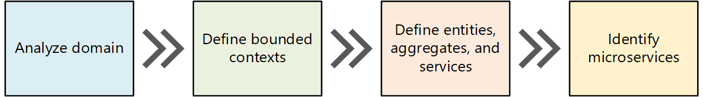
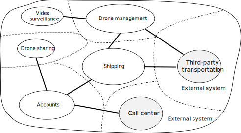

# Using domain analysis to model microservices

One of the biggest challenges of microservices is to define the boundaries of individual services. The general rule is that a service should do "one thing" &mdash; but putting that rule into practice requires careful thought. There is no mechanical process that will produce the "right" design. You have to think deeply about your business domain, requirements, and goals. Otherwise, you can end up with a haphazard design that exhibits some undesirable characteristics, such as hidden dependencies between services, tight coupling, or poorly designed interfaces. This article shows a domain-driven approach to designing microservices.

This article uses a drone delivery service as a running example. You can read more about the scenario and the corresponding reference implementation [here](../design/index.yml).

## Introduction

Microservices should be designed around business capabilities, not horizontal layers such as data access or messaging. In addition, they should have loose coupling and high functional cohesion. Microservices are *loosely coupled* if you can change one service without requiring other services to be updated at the same time. A microservice is *cohesive* if it has a single, well-defined purpose, such as managing user accounts or tracking delivery history. A service should encapsulate domain knowledge and abstract that knowledge from clients. For example, a client should be able to schedule a drone without knowing the details of the scheduling algorithm or how the drone fleet is managed.

Domain-driven design (DDD) provides a framework that can get you most of the way to a set of well-designed microservices. DDD has two distinct phases, strategic and tactical. In strategic DDD, you are defining the large-scale structure of the system. Strategic DDD helps to ensure that your architecture remains focused on business capabilities. Tactical DDD provides a set of design patterns that you can use to create the domain model. These patterns include entities, aggregates, and domain services. These tactical patterns will help you to design microservices that are both loosely coupled and cohesive.

In this article and the next, we'll walk through the following steps, applying them to the Drone Delivery application:

1. Start by analyzing the business domain to understand the application's functional requirements. The output of this step is an informal description of the domain, which can be refined into a more formal set of domain models.

2. Next, define the *bounded contexts* of the domain. Each bounded context contains a domain model that represents a particular subdomain of the larger application.

3. Within a bounded context, apply tactical DDD patterns to define entities, aggregates, and domain services.

4. Use the results from the previous step to identify the microservices in your application.

In this article, we cover the first three steps, which are primarily concerned with DDD. In the next article, we'll identify the microservices. However, it's important to remember that DDD is an iterative, ongoing process. Service boundaries aren't fixed in stone. As an application evolves, you may decide to break apart a service into several smaller services.

> [!NOTE]
> This article doesn't show a complete and comprehensive domain analysis. We deliberately kept the example brief, to illustrate the main points. For more background on DDD, we recommend Eric Evans' *Domain-Driven Design*, the book that first introduced the term. Another good reference is *Implementing Domain-Driven Design* by Vaughn Vernon.

## Scenario: Drone delivery

Fabrikam, Inc. is starting a drone delivery service. The company manages a fleet of drone aircraft. Businesses register with the service, and users can request a drone to pick up goods for delivery. When a customer schedules a pickup, a backend system assigns a drone and notifies the user with an estimated delivery time. While the delivery is in progress, the customer can track the location of the drone, with a continuously updated ETA.

This scenario involves a fairly complicated domain. Some of the business concerns include scheduling drones, tracking packages, managing user accounts, and storing and analyzing historical data. Moreover, Fabrikam wants to get to market quickly and then iterate quickly, adding new functionality and capabilities. The application needs to operate at cloud scale, with a high service level objective (SLO). Fabrikam also expects that different parts of the system will have very different requirements for data storage and querying. All of these considerations lead Fabrikam to choose a microservices architecture for the Drone Delivery application.

## Analyze the domain

Using a DDD approach will help you to design microservices so that every service forms a natural fit to a functional business requirement. It can help you to avoid the trap of letting organizational boundaries or technology choices dictate your design.

Before writing any code, you need a bird's eye view of the system that you are creating. DDD starts by modeling the business domain and creating a *domain model*. The domain model is an abstract model of the business domain. It distills and organizes domain knowledge, and provides a common language for developers and domain experts.

Start by mapping all of the business functions and their connections. This will likely be a collaborative effort that involves domain experts, software architects, and other stakeholders. You don't need to use any particular formalism.  Sketch a diagram or draw on whiteboard.

As you fill in the diagram, you may start to identify discrete subdomains. Which functions are closely related? Which functions are core to the business, and which provide ancillary services? What is the dependency graph? During this initial phase, you aren't concerned with technologies or implementation details. That said, you should note the place where the application will need to integrate with external systems, such as CRM, payment processing, or billing systems.

## Example: Drone delivery application

After some initial domain analysis, the Fabrikam team came up with a rough sketch that depicts the Drone Delivery domain.

- **Shipping** is placed in the center of the diagram, because it's core to the business. Everything else in the diagram exists to enable this functionality.
- **Drone management** is also core to the business. Functionality that is closely related to drone management includes **drone repair** and using **predictive analysis** to predict when drones need servicing and maintenance.
- **ETA analysis** provides time estimates for pickup and delivery.
- **Third-party transportation** will enable the application to schedule alternative transportation methods if a package cannot be shipped entirely by drone.
- **Drone sharing** is a possible extension of the core business. The company may have excess drone capacity during certain hours, and could rent out drones that would otherwise be idle. This feature will not be in the initial release.
- **Video surveillance** is another area that the company might expand into later.
- **User accounts**, **Invoicing**, and **Call center** are subdomains that support the core business.

Notice that at this point in the process, we haven't made any decisions about implementation or technologies. Some of the subsystems may involve external software systems or third-party services. Even so, the application needs to interact with these systems and services, so it's important to include them in the domain model.

> [!NOTE]
> When an application depends on an external system, there is a risk that the external system's data schema or API will leak into your application, ultimately compromising the architectural design. This is particularly true with legacy systems that may not follow modern best practices, and may use convoluted data schemas or obsolete APIs. In that case, it's important to have a well-defined boundary between these external systems and the application. Consider using the [Strangler Fig pattern](../../patterns/strangler-fig.yml) or the [Anti-Corruption Layer pattern](../../patterns/anti-corruption-layer.yml) for this purpose.

## Define bounded contexts

The domain model will include representations of real things in the world &mdash; users, drones, packages, and so forth. But that doesn't mean that every part of the system needs to use the same representations for the same things.

For example, subsystems that handle drone repair and predictive analysis will need to represent many physical characteristics of drones, such as their maintenance history, mileage, age, model number, performance characteristics, and so on. But when it's time to schedule a delivery, we don't care about those things. The scheduling subsystem only needs to know whether a drone is available, and the ETA for pickup and delivery.

If we tried to create a single model for both of these subsystems, it would be unnecessarily complex. It would also become harder for the model to evolve over time, because any changes will need to satisfy multiple teams working on separate subsystems. Therefore, it's often better to design separate models that represent the same real-world entity (in this case, a drone) in two different contexts. Each model contains only the features and attributes that are relevant within its particular context.

This is where the DDD concept of *bounded contexts* comes into play. A bounded context is simply the boundary within a domain where a particular domain model applies. Looking at the previous diagram, we can group functionality according to whether various functions will share a single domain model.

Bounded contexts are not necessarily isolated from one another. In this diagram, the solid lines connecting the bounded contexts represent places where two bounded contexts interact. For example, Shipping depends on User Accounts to get information about customers, and on Drone Management to schedule drones from the fleet.

In the book *Domain Driven Design*, Eric Evans describes several patterns for maintaining the integrity of a domain model when it interacts with another bounded context. One of the main principles of microservices is that services communicate through well-defined APIs. This approach corresponds to two patterns that Evans calls Open Host Service and Published Language. The idea of Open Host Service is that a subsystem defines a formal protocol (API) for other subsystems to communicate with it. Published Language extends this idea by publishing the API in a form that other teams can use to write clients. In the article [Designing APIs for microservices](../design/api-design.yml), we discuss using [OpenAPI Specification](https://www.openapis.org/specification/repo) (formerly known as Swagger) to define language-agnostic interface descriptions for REST APIs, expressed in JSON or YAML format.

For the rest of this journey, we will focus on the Shipping bounded context.

## Next steps

After completing a domain analysis, the next step is to apply tactical DDD, to define your domain models with more precision.

> [!div class="nextstepaction"]
> [Tactical DDD](./tactical-ddd.yml)

## Related resources

- [Microservices architecture design](../../microservices/index.yml)
- [Design a microservices architecture](../../microservices/design/index.yml)
- [Identify microservice boundaries](microservice-boundaries.yml)
- [Choose an Azure compute option for microservices](../../microservices/design/compute-options.md)
