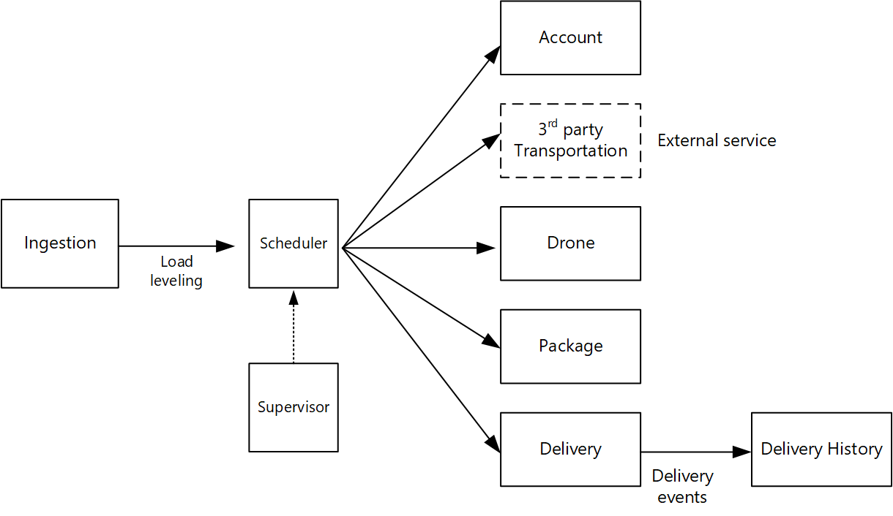

What is the right size for a microservice? You often hear something to the effect of, "not too big and not too small" &mdash; and while that's certainly correct, it's not very helpful in practice. But if you start from a carefully designed domain model, it's much easier to reason about microservices.

This article uses a drone delivery service as a running example. You can read more about the scenario and the corresponding reference implementation [here](../design/index.yml).

## From domain model to microservices

In the [previous article](./domain-analysis.md), we defined a set of bounded contexts for a Drone Delivery application. Then we looked more closely at one of these bounded contexts, the Shipping bounded context, and identified a set of entities, aggregates, and domain services for that bounded context.

Now we're ready to go from domain model to application design. Here's an approach that you can use to derive microservices from the domain model.

1. Start with a bounded context. In general, the functionality in a microservice should not span more than one bounded context. By definition, a bounded context marks the boundary of a particular domain model. If you find that a microservice mixes different domain models together, that's a sign that you may need to go back and refine your domain analysis.

2. Next, look at the aggregates in your domain model. Aggregates are often good candidates for microservices. A well-designed aggregate exhibits many of the characteristics of a well-designed microservice, such as:

    - An aggregate is derived from business requirements, rather than technical concerns such as data access or messaging.
    - An aggregate should have high functional cohesion.
    - An aggregate is a boundary of persistence.
    - Aggregates should be loosely coupled.

3. Domain services are also good candidates for microservices. Domain services are stateless operations across multiple aggregates. A typical example is a workflow that involves several microservices. We'll see an example of this in the Drone Delivery application.

4. Finally, consider non-functional requirements. Look at factors such as team size, data types, technologies, scalability requirements, availability requirements, and security requirements. These factors may lead you to further decompose a microservice into two or more smaller services, or do the opposite and combine several microservices into one.

After you identify the microservices in your application, validate your design against the following criteria:

- Each service has a single responsibility.
- There are no chatty calls between services. If splitting functionality into two services causes them to be overly chatty, it may be a symptom that these functions belong in the same service.
- Each service is small enough that it can be built by a small team working independently.
- There are no inter-dependencies that will require two or more services to be deployed in lock-step. It should always be possible to deploy a service without redeploying any other services.
- Services are not tightly coupled, and can evolve independently.
- Your service boundaries will not create problems with data consistency or integrity. Sometimes it's important to maintain data consistency by putting functionality into a single microservice. That said, consider whether you really need strong consistency. There are strategies for addressing eventual consistency in a distributed system, and the benefits of decomposing services often outweigh the challenges of managing eventual consistency.

Above all, it's important to be pragmatic, and remember that domain-driven design is an iterative process. When in doubt, start with more coarse-grained microservices. Splitting a microservice into two smaller services is easier than refactoring functionality across several existing microservices.

## Example: Defining microservices for the Drone Delivery application

Recall that the development team had identified the four aggregates &mdash; Delivery, Package, Drone, and Account &mdash; and two domain services, Scheduler and Supervisor.

Delivery and Package are obvious candidates for microservices. The Scheduler and Supervisor coordinate the activities performed by other microservices, so it makes sense to implement these domain services as microservices.

Drone and Account are interesting because they belong to other bounded contexts. One option is for the Scheduler to call the Drone and Account bounded contexts directly. Another option is to create Drone and Account microservices inside the Shipping bounded context. These microservices would mediate between the bounded contexts, by exposing APIs or data schemas that are more suited to the Shipping context.

The details of the Drone and Account bounded contexts are beyond the scope of this guidance, so we created mock services for them in our reference implementation. But here are some factors to consider in this situation:

- What is the network overhead of calling directly into the other bounded context?

- Is the data schema for the other bounded context suitable for this context, or is it better to have a schema that's tailored to this bounded context?

- Is the other bounded context a legacy system? If so, you might create a service that acts as an [anti-corruption layer](../../patterns/anti-corruption-layer.yml) to translate between the legacy system and the modern application.

- What is the team structure? Is it easy to communicate with the team that's responsible for the other bounded context? If not, creating a service that mediates between the two contexts can help to mitigate the cost of cross-team communication.

So far, we haven't considered any non-functional requirements. Thinking about the application's throughput requirements, the development team decided to create a separate Ingestion microservice that is responsible for ingesting client requests. This microservice will implement [load leveling](../../patterns/queue-based-load-leveling.yml) by putting incoming requests into a buffer for processing. The Scheduler will read the requests from the buffer and execute the workflow.

Non-functional requirements led the team to create one additional service. All of the services so far have been about the process of scheduling and delivering packages in real time. But the system also needs to store the history of every delivery in long-term storage for data analysis. The team considered making this the responsibility of the Delivery service. However, the data storage requirements are quite different for historical analysis versus in-flight operations (see [Data considerations](../design/data-considerations.yml)). Therefore, the team decided to create a separate Delivery History service, which will listen for DeliveryTracking events from the Delivery service and write the events into long-term storage.

The following diagram shows the design at this point:

*Download a [Visio file](https://arch-center.azureedge.net/microservice-boundaries.vsdx) of this architecture.*

## Next steps

At this point, you should have a clear understanding of the purpose and functionality of each microservice in your design. Now you can architect the system.

> [!div class="nextstepaction"]
> [Design a microservices architecture](../design/index.yml)

## Related resources

- [Microservices architecture design](../../microservices/index.yml)
- [Using tactical DDD to design microservices](tactical-ddd.yml)
- [Using domain analysis to model microservices](domain-analysis.md)
- [Choose an Azure compute option for microservices](../../microservices/design/compute-options.md)
