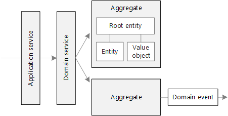
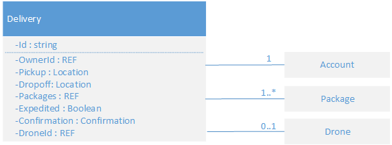
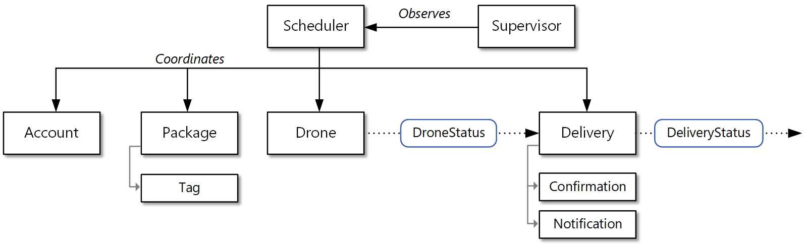

During the strategic phase of domain-driven design (DDD), you are mapping out the business domain and defining bounded contexts for your domain models. Tactical DDD is when you define your domain models with more precision. The tactical patterns are applied within a single bounded context. In a microservices architecture, we are particularly interested in the entity and aggregate patterns. Applying these patterns will help us to identify natural boundaries for the services in our application (see the [next article](./microservice-boundaries.yml) in this series). As a general principle, a microservice should be no smaller than an aggregate, and no larger than a bounded context. First, we'll review the tactical patterns. Then we'll apply them to the Shipping bounded context in the Drone Delivery application.

## Overview of the tactical patterns

This section provides a brief summary of the tactical DDD patterns, so if you are already familiar with DDD, you can probably skip this section. The patterns are described in more detail in chapters 5 &ndash; 6 of Eric Evans' book, and in *Implementing Domain-Driven Design* by Vaughn Vernon.

**Entities**. An entity is an object with a unique identity that persists over time. For example, in a banking application, customers and accounts would be entities.

- An entity has a unique identifier in the system, which can be used to look up or retrieve the entity. That doesn't mean the identifier is always exposed directly to users. It could be a GUID or a primary key in a database.
- An identity may span multiple bounded contexts, and may endure beyond the lifetime of the application. For example, bank account numbers or government-issued IDs are not tied to the lifetime of a particular application.
- The attributes of an entity may change over time. For example, a person's name or address might change, but they are still the same person.
- An entity can hold references to other entities.

**Value objects**. A value object has no identity. It is defined only by the values of its attributes. Value objects are also immutable. To update a value object, you always create a new instance to replace the old one. Value objects can have methods that encapsulate domain logic, but those methods should have no side-effects on the object's state. Typical examples of value objects include colors, dates and times, and currency values.

**Aggregates**. An aggregate defines a consistency boundary around one or more entities. Exactly one entity in an aggregate is the root. Lookup is done using the root entity's identifier. Any other entities in the aggregate are children of the root, and are referenced by following pointers from the root.

The purpose of an aggregate is to model transactional invariants. Things in the real world have complex webs of relationships. Customers create orders, orders contain products, products have suppliers, and so on. If the application modifies several related objects, how does it guarantee consistency? How do we keep track of invariants and enforce them?

Traditional applications have often used database transactions to enforce consistency. In a distributed application, however, that's often not feasible. A single business transaction may span multiple data stores, or may be long running, or may involve third-party services. Ultimately it's up to the application, not the data layer, to enforce the invariants required for the domain. That's what aggregates are meant to model.

> [!NOTE]
> An aggregate might consist of a single entity, without child entities. What makes it an aggregate is the transactional boundary.

**Domain and application services**. In DDD terminology, a service is an object that implements some logic without holding any state. Evans distinguishes between *domain services*, which encapsulate domain logic, and *application services*, which provide technical functionality, such as user authentication or sending an SMS message. Domain services are often used to model behavior that spans multiple entities.

> [!NOTE]
> The term *service* is overloaded in software development. The definition here is not directly related to microservices.

**Domain events**. Domain events can be used to notify other parts of the system when something happens. As the name suggests, domain events should mean something within the domain. For example, "a record was inserted into a table" is not a domain event. "A delivery was cancelled" is a domain event. Domain events are especially relevant in a microservices architecture. Because microservices are distributed and don't share data stores, domain events provide a way for microservices to coordinate with each other. The article [Interservice communication](../design/interservice-communication.yml) discusses asynchronous messaging in more detail.

There are a few other DDD patterns not listed here, including factories, repositories, and modules. These can be useful patterns for when you are implementing a microservice, but they are less relevant when designing the boundaries between microservice.

## Drone delivery: Applying the patterns

We start with the scenarios that the Shipping bounded context must handle.

- A customer can request a drone to pick up goods from a business that is registered with the drone delivery service.
- The sender generates a tag (barcode or RFID) to put on the package.
- A drone will pick up and deliver a package from the source location to the destination location.
- When a customer schedules a delivery, the system provides an ETA based on route information, weather conditions, and historical data.
- When the drone is in flight, a user can track the current location and the latest ETA.
- Until a drone has picked up the package, the customer can cancel a delivery.
- The customer is notified when the delivery is completed.
- The sender can request delivery confirmation from the customer, in the form of a signature or finger print.
- Users can look up the history of a completed delivery.

From these scenarios, the development team identified the following **entities**.

- Delivery
- Package
- Drone
- Account
- Confirmation
- Notification
- Tag

The first four, Delivery, Package, Drone, and Account, are all **aggregates** that represent transactional consistency boundaries. Confirmations and Notifications are child entities of Deliveries, and Tags are child entities of Packages.

The **value objects** in this design include Location, ETA, PackageWeight, and PackageSize.

To illustrate, here is a UML diagram of the Delivery aggregate. Notice that it holds references to other aggregates, including Account, Package, and Drone.

There are two domain events:

- While a drone is in flight, the Drone entity sends DroneStatus events that describe the drone's location and status (in-flight, landed).

- The Delivery entity sends DeliveryTracking events whenever the stage of a delivery changes. These include DeliveryCreated, DeliveryRescheduled, DeliveryHeadedToDropoff, and DeliveryCompleted.

Notice that these events describe things that are meaningful within the domain model. They describe something about the domain, and aren't tied to a particular programming language construct.

The development team identified one more area of functionality, which doesn't fit neatly into any of the entities described so far. Some part of the system must coordinate all of the steps involved in scheduling or updating a delivery. Therefore, the development team added two **domain services** to the design: a *Scheduler* that coordinates the steps, and a *Supervisor* that monitors the status of each step, in order to detect whether any steps have failed or timed out. This is a variation of the [Scheduler Agent Supervisor pattern](../../patterns/scheduler-agent-supervisor.yml).

## Next steps

The next step is to define the boundaries for each microservice.

> [!div class="nextstepaction"]
> [Identify microservice boundaries](./microservice-boundaries.yml)

## Related resources

- [Microservices architecture design](../../microservices/index.yml)
- [Design a microservices architecture](../../microservices/design/index.yml)
- [Using domain analysis to model microservices](domain-analysis.md)
- [Choose an Azure compute option for microservices](../../microservices/design/compute-options.md)
