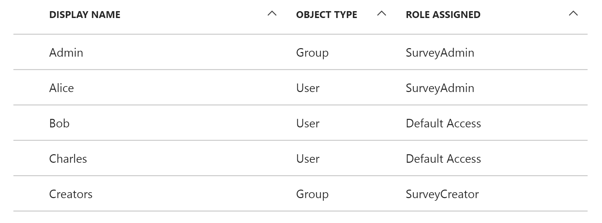
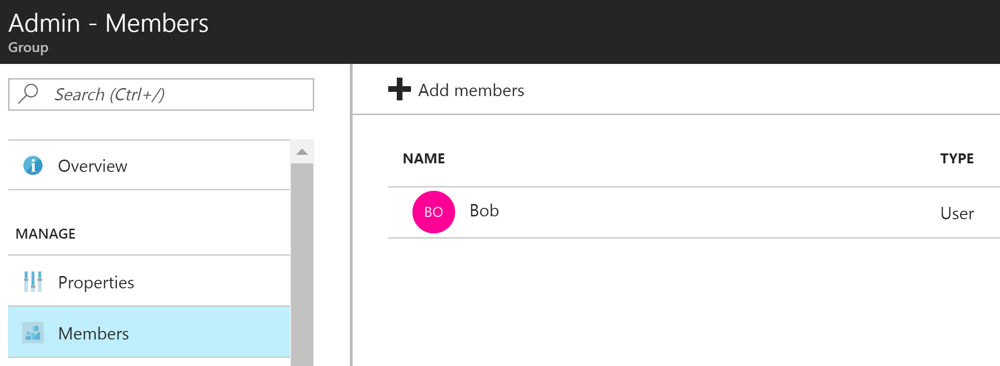

# Application roles

[:::image type="icon" source="../_images/github.png" border="false"::: Sample code][sample application]

You can use application roles to assign permissions to users. For example, the [Tailspin Surveys][tailspin] application defines the following roles:

* SurveyAdmin. Can perform all CRUD operations on any survey that belongs to the tenant.
* SurveyCreator. Can create new surveys.
* Reader. Can read any survey that belongs to the tenant.

Roles are ultimately translated into permissions during [authorization][authorization]. The first step is to assign and manage roles. There are three commonly used ways to assign roles:

* [Azure AD app roles](#assign-roles-by-using-azure-ad-app-roles)
* [Azure AD security groups](#assign-roles-by-using-azure-ad-security-groups)
* [Application role manager](#assign-roles-by-using-an-application-role-manager)

## Assign roles by using Azure AD app roles

This approach is used in the Tailspin Surveys app.

When you use this approach, the SaaS provider defines the application roles by adding them to the application manifest. After a customer signs up, an admin for the customer's Azure AD directory assigns users to the roles. When a user signs in, the user's assigned roles are sent as claims.

> [!NOTE]
> If the customer has Azure AD Premium, the admin can assign a security group to a role. As a result, user members of the group inherit the app role. This is a convenient way to manage roles because the group owner doesn't need to be an admin or app owner.

Advantages of this approach:

* The programming model is simple.
* Roles are specific to the application. The role claims for one application aren't sent to another application.
* If the customer removes the application from the Azure AD tenant, the roles disappear.
* The application doesn't need any extra Azure AD permissions, other than the ability to read the user's profile.

Disadvantages:

* Customers that don't have Azure AD Premium can't assign app roles to security groups. For these customers, all app role assignments to users must be done individually, by an administrator or an owner of the app.
* If you have a backend web API that's separate from the web app, the app role assignments for the web app don't apply to the web API. For more information, see [Securing a backend web API].

### Implementation

#### Define the roles 

The SaaS provider defines the app roles in the [application manifest][application manifest]. For example, here's the manifest entry for the Surveys app:

```json
"appRoles": [
  {
    "allowedMemberTypes": [
      "User"
    ],
    "description": "Creators can create Surveys",
    "displayName": "SurveyCreator",
    "id": "1b4f816e-5eaf-48b9-8613-7923830595ad",
    "isEnabled": true,
    "value": "SurveyCreator"
  },
  {
    "allowedMemberTypes": [
      "User"
    ],
    "description": "Administrators can manage the Surveys in their tenant",
    "displayName": "SurveyAdmin",
    "id": "c20e145e-5459-4a6c-a074-b942bbd4cfe1",
    "isEnabled": true,
    "value": "SurveyAdmin"
  }
],
```

The `value` property appears in the role claim. The `id` property is the unique identifier for the defined role. Always generate a new GUID value for `id`.

#### Assign users 

When a new customer signs up, the application is registered in the customer's Azure AD tenant. At this point, an Azure AD admin for that tenant or an app owner can assign app roles to users (under **Enterprise applications**).

> [!NOTE]
> As noted earlier, customers with Azure AD Premium can also assign app roles to security groups.

The following screenshot from the Azure portal shows users and groups for the Survey application. Admin and Creators are groups. They're assigned the SurveyAdmin and SurveyCreator app roles, respectively. Alice is a user who was directly assigned the SurveyAdmin app role. Bob and Charles are users who haven't been directly assigned an app role.



As shown in the following screenshot, Charles is part of the Admin group, so he inherits the SurveyAdmin role. Bob isn't yet assigned an app role.



> [!NOTE]
> An alternative approach is to enable the application to assign app roles programmatically by using the Microsoft Graph API. However, this approach requires the application to obtain write permissions for the customer's Azure AD directory, which is a high privilege that's usually unnecessary.

#### Get role claims

When a user signs in, the application receives the user's assigned roles in a claim with type `http://schemas.microsoft.com/ws/2008/06/identity/claims/role` (the `roles` claim in a JWT token).

A user can be assigned multiple roles, or no role. In your authorization code, don't assume that a user has exactly one role claim. Instead, write code that checks whether a particular claim value is present:

```csharp
if (context.User.HasClaim(ClaimTypes.Role, "Admin")) { ... }
```

## Assign roles by using Azure AD security groups

When you use this approach, roles are represented as Azure AD security groups. The application assigns permissions to users based on their security group memberships.

Advantages of this approach:

* Customers who don't have Azure AD Premium can use security groups to manage role assignments.

Disadvantages:

* This approach is complicated. Because every tenant sends different group claims, the app must track which security groups correspond to each application role, for each tenant.
* As users are added to more groups, access tokens grow to include more claims. After a certain limit, Azure AD adds an overage claim to limit the token size. For more information, see [Microsoft identity platform access tokens](/azure/active-directory/develop/access-tokens). Using application roles can help you avoid this issue because roles are scoped to specific applications.

<!-- markdownlint-disable MD024 -->

### Implementation

<!-- markdownlint-enable MD024 -->

In the application manifest, set the `groupMembershipClaims` property to `SecurityGroup`. You need to provide this value to get group membership claims from Azure AD.

```json
{
   // ...
   "groupMembershipClaims": "SecurityGroup",
}
```

When a new customer signs up, the application instructs the customer to create security groups for the roles that are needed by the application. The customer then needs to enter the group object IDs into the application. The application stores these IDs in a table that maps group IDs to application roles, on a per-tenant basis.

> [!NOTE]
> Alternatively, the application can create the groups programmatically by using the Microsoft Graph API. This approach might be less error prone, but the application needs to obtain privileged read/write permissions for the customer's directory. Some customers might be unwilling to grant this level of access.

When a user signs in:

1. The application receives the user's groups as claims. The value of each claim is the object ID of a group.
2. Azure AD limits the number of groups that can be sent in the token. If the number of groups exceeds the limit, Azure AD sends an overage claim. If that claim is present, the application must query the Microsoft Graph API to get all the groups that include the user. For more information, see [Groups overage claim](/azure/active-directory/develop/id-tokens#groups-overage-claim).
3. To find the corresponding application roles to assign to the user, the application looks up the object IDs in its own database.
4. The application adds a custom claim value to the user principal that expresses the application role. For example: `survey_role` = "SurveyAdmin".

Authorization policies should use the custom role claim, not the group claim.

## Assign roles by using an application role manager

When you use this approach, application roles aren't stored in Azure AD at all. Instead, the application stores the role assignments for each user in its own database, for example, by using the **RoleManager** class in ASP.NET **Identity**.

Advantages of this approach:

* The app has full control over the roles and user assignments.

Disadvantages:

* This approach is more complex and requires more maintenance.
* You can't use Azure AD security groups to manage role assignments.
* User information is stored in the application database, where it becomes out of sync with the tenant's Azure AD directory as users are added and removed.

[**Next**][authorization]

<!-- links -->

[tailspin]: ./tailspin.yml
[authorization]: ./authorize.md
[Securing a backend web API]: ./web-api.yml
[application manifest]: /azure/active-directory/active-directory-application-manifest
[sample application]: https://github.com/mspnp/multitenant-saas-guidance
