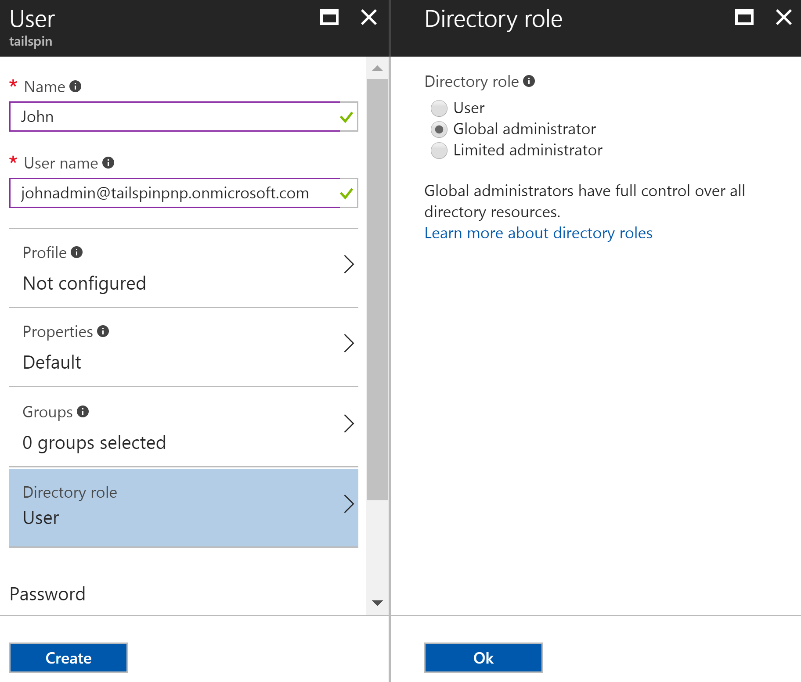

# Use Azure Key Vault to protect application secrets

[ Sample code][sample application]

It's common to have application settings that are sensitive and must be protected, such as:

* Database connection strings
* Passwords
* Cryptographic keys

As a security best practice, you should never store these secrets in source control. It's too easy for them to leak &mdash; even if your source code repository is private. And it's not just about keeping secrets from the general public. On larger projects, you might want to restrict which developers and operators can access the production secrets. (Settings for test or development environments are different.)

A more secure option is to store these secrets in [Azure Key Vault][KeyVault]. Key Vault is a cloud-hosted service for managing cryptographic keys and other secrets. This article shows how to use Key Vault to store configuration settings for your app.

In the [Tailspin Surveys][Surveys] application, the following settings are secret:

* The database connection string.
* The Redis connection string.
* The client secret for the web application.

The Surveys application loads configuration settings from the following places:

* The appsettings.json file
* The [user secrets store][user-secrets] (development environment only; for testing)
* The hosting environment (app settings in Azure web apps)
* Key Vault (when enabled)

Each of these overrides the previous one, so any settings stored in Key Vault take precedence.

> [!NOTE]
> By default, the Key Vault configuration provider is disabled. It's not needed for running the application locally. You would enable it in a production deployment.

At startup, the application reads settings from every registered configuration provider, and uses them to populate a strongly typed options object. For more information, see [Using Options and configuration objects][options].

## Setting up Key Vault in the Surveys app
Prerequisites:

* Install the [Azure Resource Manager Cmdlets][azure-rm-cmdlets].
* Configure the Surveys application as described in [Run the Surveys application][readme].

High-level steps:

1. Set up an admin user in the tenant.
2. Set up a client certificate.
3. Create a key vault.
4. Add configuration settings to your key vault.
5. Uncomment the code that enables key vault.
6. Update the application's user secrets.

### Set up an admin user
> [!NOTE]
> To create a key vault, you must use an account which can manage your Azure subscription. Also, any application that you authorize to read from the key vault must be registered in the same tenant as that account.
> 
> 

In this step, you will make sure that you can create a key vault while signed in as a user from the tenant where the Surveys app is registered.

Create an administrator user within the Azure AD tenant where the Surveys application is registered.

1. Log into the [Azure portal][azure-portal].
2. Select the Azure AD tenant where your application is registered.
3. Click **More service** > **SECURITY + IDENTITY** > **Azure Active Directory** > **User and groups** > **All users**.
4. At the top of the portal, click **New user**.
5. Fill in the fields and assign the user to the **Global administrator** directory role.
6. Click **Create**.



Now assign this user as the subscription owner.

1. On the Hub menu, select **Subscriptions**.

    

2. Select the subscription that you want the administrator to access.
3. In the subscription blade, select **Access control (IAM)**.
4. Click **Add**.
4. Under **Role**, select **Owner**.
5. Type the email address of the user you want to add as owner.
6. Select the user and click **Save**.

### Set up a client certificate
1. Run the PowerShell script [/Scripts/Setup-KeyVault.ps1][Setup-KeyVault] as follows:
   
    ```
    .\Setup-KeyVault.ps1 -Subject <<subject>>
    ```
    For the `Subject` parameter, enter any name, such as "surveysapp". The script generates a self-signed certificate and stores it in the "Current User/Personal" certificate store. The output from the script is a JSON fragment. Copy this value.

2. In the [Azure portal][azure-portal], switch to the directory where the Surveys application is registered, by selecting your account in the top right corner of the portal.

3. Select **Azure Active Directory** > **App Registrations** > Surveys

4.	Click **Manifest** and then **Edit**.

5.	Paste the output from the script into the `keyCredentials` property. It should look similar to the following:
        
    ```json
    "keyCredentials": [
        {
        "type": "AsymmetricX509Cert",
        "usage": "Verify",
        "keyId": "29d4f7db-0539-455e-b708-....",
        "customKeyIdentifier": "ZEPpP/+KJe2fVDBNaPNOTDoJMac=",
        "value": "MIIDAjCCAeqgAwIBAgIQFxeRiU59eL.....
        }
    ],
    ```          

6. Click **Save**.  

7. Repeat steps 3-6 to add the same JSON fragment to the application manifest of the web API (Surveys.WebAPI).

8. From the PowerShell window, run the following command to get the thumbprint of the certificate.
   
    ```
    certutil -store -user my [subject]
    ```
    
    For `[subject]`, use the value that you specified for Subject in the PowerShell script. The thumbprint is listed under "Cert Hash(sha1)". Copy this value. You will use the thumbprint later.

### Create a key vault
1. Run the PowerShell script [/Scripts/Setup-KeyVault.ps1][Setup-KeyVault] as follows:
   
    ```
    .\Setup-KeyVault.ps1 -KeyVaultName <<key vault name>> -ResourceGroupName <<resource group name>> -Location <<location>>
    ```
   
    When prompted for credentials, sign in as the Azure AD user that you created earlier. The script creates a new resource group, and a new key vault within that resource group. 
   
2. Run SetupKeyVault.ps again as follows:
   
    ```
    .\Setup-KeyVault.ps1 -KeyVaultName <<key vault name>> -ApplicationIds @("<<Surveys app id>>", "<<Surveys.WebAPI app ID>>")
    ```
   
    Set the following parameter values:
   
       * key vault name = The name that you gave the key vault in the previous step.
       * Surveys app ID = The application ID for the Surveys web application.
       * Surveys.WebApi app ID = The application ID for the Surveys.WebAPI application.
         
    Example:
     
    ```
     .\Setup-KeyVault.ps1 -KeyVaultName tailspinkv -ApplicationIds @("f84df9d1-91cc-4603-b662-302db51f1031", "8871a4c2-2a23-4650-8b46-0625ff3928a6")
    ```
    
    This script authorizes the web app and web API to retrieve secrets from your key vault. See [Get started with Azure Key Vault](/azure/key-vault/key-vault-get-started/) for more information.

### Add configuration settings to your key vault
1. Run SetupKeyVault.ps as follows::
   
    ```
    .\Setup-KeyVault.ps1 -KeyVaultName <<key vault name> -KeyName Redis--Configuration -KeyValue "<<Redis DNS name>>.redis.cache.windows.net,password=<<Redis access key>>,ssl=true" 
    ```
    where
   
   * key vault name = The name that you gave the key vault in the previous step.
   * Redis DNS name = The DNS name of your Redis cache instance.
   * Redis access key = The access key for your Redis cache instance.
     
2. At this point, it's a good idea to test whether you successfully stored the secrets to key vault. Run the following PowerShell command:
   
    ```
    Get-AzureKeyVaultSecret <<key vault name>> Redis--Configuration | Select-Object *
    ```

3. Run SetupKeyVault.ps again to add the database connection string:
   
    ```
    .\Setup-KeyVault.ps1 -KeyVaultName <<key vault name> -KeyName Data--SurveysConnectionString -KeyValue <<DB connection string>> -ConfigName "Data:SurveysConnectionString"
    ```
   
    where `<<DB connection string>>` is the value of the database connection string.
   
    For testing with the local database, copy the connection string from the Tailspin.Surveys.Web/appsettings.json file. If you do that, make sure to change the double backslash ('\\\\') into a single backslash. The double backslash is an escape character in the JSON file.
   
    Example:
   
    ```
    .\Setup-KeyVault.ps1 -KeyVaultName mykeyvault -KeyName Data--SurveysConnectionString -KeyValue "Server=(localdb)\MSSQLLocalDB;Database=Tailspin.SurveysDB;Trusted_Connection=True;MultipleActiveResultSets=true" 
    ```

### Uncomment the code that enables Key Vault
1. Open the Tailspin.Surveys solution.
2. In Tailspin.Surveys.Web/Startup.cs, locate the following code block and uncomment it.
   
    ```csharp
    //var config = builder.Build();
    //builder.AddAzureKeyVault(
    //    $"https://{config["KeyVault:Name"]}.vault.azure.net/",
    //    config["AzureAd:ClientId"],
    //    config["AzureAd:ClientSecret"]);
    ```
3. In Tailspin.Surveys.Web/Startup.cs, locate the code that registers the `ICredentialService`. Uncomment the line that uses `CertificateCredentialService`, and comment out the line that uses `ClientCredentialService`:
   
    ```csharp
    // Uncomment this:
    services.AddSingleton<ICredentialService, CertificateCredentialService>();
    // Comment out this:
    //services.AddSingleton<ICredentialService, ClientCredentialService>();
    ```
   
    This change enables the web app to use [Client assertion][client-assertion] to get OAuth access tokens. With client assertion, you don't need an OAuth client secret. Alternatively, you could store the client secret in key vault. However, key vault and client assertion both use a client certificate, so if you enable key vault, it's a good practice to enable client assertion as well.

### Update the user secrets
In Solution Explorer, right-click the Tailspin.Surveys.Web project and select **Manage User Secrets**. In the secrets.json file, delete the existing JSON and paste in the following:

    ```
    {
      "AzureAd": {
        "ClientId": "[Surveys web app client ID]",
        "ClientSecret": "[Surveys web app client secret]",
        "PostLogoutRedirectUri": "https://localhost:44300/",
        "WebApiResourceId": "[App ID URI of your Surveys.WebAPI application]",
        "Asymmetric": {
          "CertificateThumbprint": "[certificate thumbprint. Example: 105b2ff3bc842c53582661716db1b7cdc6b43ec9]",
          "StoreName": "My",
          "StoreLocation": "CurrentUser",
          "ValidationRequired": "false"
        }
      },
      "KeyVault": {
        "Name": "[key vault name]"
      }
    }
    ```

Replace the entries in [square brackets] with the correct values.

* `AzureAd:ClientId`: The client ID of the Surveys app.
* `AzureAd:ClientSecret`: The key that you generated when you registered the Surveys application in Azure AD.
* `AzureAd:WebApiResourceId`: The App ID URI that you specified when you created the Surveys.WebAPI application in Azure AD.
* `Asymmetric:CertificateThumbprint`: The certificate thumbprint that you got previously, when you created the client certificate.
* `KeyVault:Name`: The name of your key vault.

> [!NOTE]
> `Asymmetric:ValidationRequired` is false because the certificate that you created previously was not signed by a root certificate authority (CA). In production, use a certificate that is signed by a root CA and set `ValidationRequired` to true.
> 
> 

Save the updated secrets.json file.

Next, in Solution Explorer, right-click the Tailspin.Surveys.WebApi project and select **Manage User Secrets**. Delete the existing JSON and paste in the following:

```
{
  "AzureAd": {
    "ClientId": "[Surveys.WebAPI client ID]",
    "WebApiResourceId": "https://tailspin5.onmicrosoft.com/surveys.webapi",
    "Asymmetric": {
      "CertificateThumbprint": "[certificate thumbprint]",
      "StoreName": "My",
      "StoreLocation": "CurrentUser",
      "ValidationRequired": "false"
    }
  },
  "KeyVault": {
    "Name": "[key vault name]"
  }
}
```

Replace the entries in [square brackets] and save the secrets.json file.

> [!NOTE]
> For the web API, make sure to use the client ID for the Surveys.WebAPI application, not the Surveys application.
> 
> 

[**Next**][adfs]

<!-- Links -->
[adfs]: ./adfs.md
[authorize-app]: /azure/key-vault/key-vault-get-started//#authorize
[azure-portal]: https://portal.azure.com
[azure-rm-cmdlets]: https://msdn.microsoft.com/library/mt125356.aspx
[client-assertion]: client-assertion.md
[configuration]: /aspnet/core/fundamentals/configuration
[KeyVault]: https://azure.microsoft.com/services/key-vault/
[key-tags]: https://msdn.microsoft.com/library/azure/dn903623.aspx#BKMK_Keytags
[Microsoft.Azure.KeyVault]: https://www.nuget.org/packages/Microsoft.Azure.KeyVault/
[options]: /aspnet/core/fundamentals/configuration#using-options-and-configuration-objects
[readme]: ./run-the-app.md
[Setup-KeyVault]: https://github.com/mspnp/multitenant-saas-guidance/blob/master/scripts/Setup-KeyVault.ps1
[Surveys]: tailspin.md
[user-secrets]: /aspnet/core/security/app-secrets
[sample application]: https://github.com/mspnp/multitenant-saas-guidance
