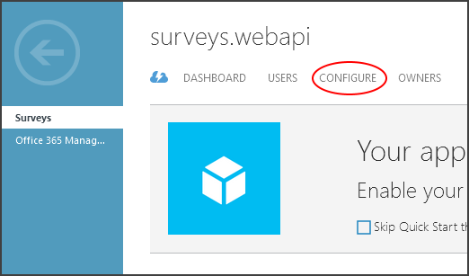
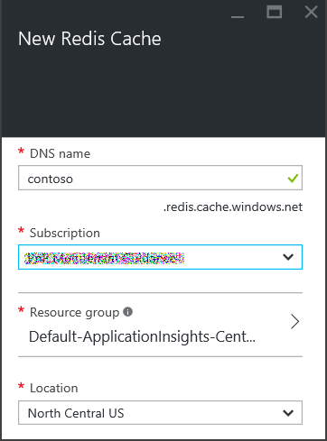
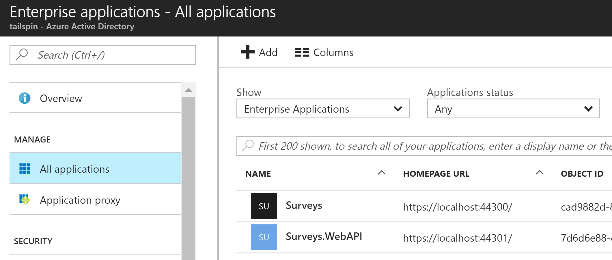
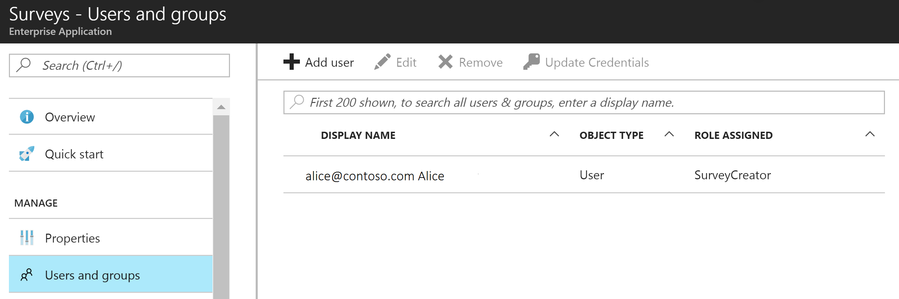
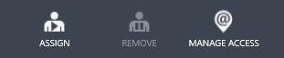
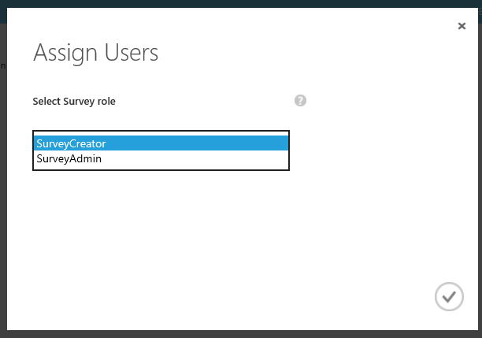

# Run the Surveys application
This topic describes how to run the [Tailspin Surveys](./tailspin.md) application locally, from Visual Studio. In these steps, you won't deploy the application to Azure. However, you will need to create some Azure resources (an Azure AD tenant and a Redis cache).

## Prerequisites:
-	[Visual Studio 2015][VS2015]
-	[ASP.NET Core and Microsoft Web Developer Tools](/aspnet/core/getting-started#install-asp-net-with-visual-studio)
-	[Microsoft Azure](https://azure.microsoft.com) account

## Set up your Azure AD directory

In this step, you will register the Surveys application in an Azure AD directory.

> This AD directory would belong to the application provider (Tailspin, in our example), not the customers who use the application.
Registering the application enables the application to use Azure AD for authentication. For more information, see [Authentication and sign-in](./authenticate.md).

### Create a new Azure AD directory

1. Sign into the [Azure management portal](https://manage.windowsazure.com).

2. Click **New** > **App Services** > **Active Directory** > **Directory** > **Custom Create**.

3. Enter the required information and click the **Finish** (checkmark) button.
    - Do _not_ check **This is a B2C directory**.

## Register the Surveys web API in your AD directory

1.	In the [Azure management portal](https://manage.windowsazure.com), navigate to your AD directory.

2.	Click **Applications**.

3.	At the bottom of the portal, click **Add**.

4.	Select **Add an application my organization is developing**.

5.	In the first page of the **Add Application** dialog, enter the following:

  - In the **Name** edit box, enter `Surveys.WebAPI`.
  - Under **Type**, select **Web application and/or Web API**.

6.	In the second page of the dialog:

  - In the **Sign-on URL** edit box, enter `https://localhost:44301/`.
  - In the **App ID URI** edit box, enter `https://(your AD tenant)/surveys.webapi`. Example: `https://tailspin.onmicrosoft.com/surveys.webapi`

7.	Click the checkmark to complete the dialog.

8.	In the portal, click **Configure**.

    

9.	Set **Application is Multi-Tenant** to **YES**.

10.	Click **Save**.

## Register the Surveys web app in your AD directory

1. In the [Azure management portal](https://manage.windowsazure.com), navigate to your AD directory.

2. Add a new application as described in the previous section.

3. In the **Add Application** dialog, enter the following:

  - Name = `Surveys`
  - Sign-on URL = `https://localhost:44300/`
  - App ID URI = `https://(your AD tenant)/surveys`. Example: `https://tailspin.onmicrosoft.com/surveys`

4. When you complete the **Add application** dialog, click **Configure**.

5. Copy the client ID. You will need this later.

6. Set **Application is Multi-Tenant** to **YES**.

7.	Under **Keys**, in the **Select Duration** dropdown, select **1 year**. The key will be generated when you save.

8.	Click **Save**.

9.	Copy the value of the key.

    _Note_: Do this now, because the key won't be visible after you navigate away from this page, although you can always generate a new one.

## Give the Surveys web app permissions to call the web API

1.	In the Azure management portal, navigate to your Azure AD tenant and select the Surveys application.

2.	Click **Configure**.

3.	Under **Permissions to other applications**, click **Add Application**.

4.	In the dropdown next to **Show**, select **All Apps**.

5.	Click the top checkmark to search.

6.	Select `Surveys.WebAPI`.

    

7.	Click the bottom checkmark to complete the dialog. This will add `Surveys.WebAPI` to the permissions list.

8.	In the **Delegated Permissions** dropdown, select **Access Surveys.WebAPI**.

    

9.	Click **Save**.

## Update the application manifests

Update the application manifest for the web API.

1.	In the Azure management portal, navigate to your Azure AD directory select the Surveys.WepAPI application.

2.	Click **Manage Manifest** and select **Download Manifest**.

3.	Open the manifest JSON file.

4.	Add the following to the `appRoles` element. For the `id` properties, generate new GUIDs.

          {
            "allowedMemberTypes": ["User"],
            "description": "Creators can create surveys",
            "displayName": "SurveyCreator",
            "id": "[Generate a new GUID. Example: 1b4f816e-5eaf-48b9-8613-7923830595ad]",
            "isEnabled": true,
            "value": "SurveyCreator"
          },
          {
            "allowedMemberTypes": ["User"],
            "description": "Administrators can manage the surveys in their tenant",
            "displayName": "SurveyAdmin",
            "id": "[Generate a new GUID]",  
            "isEnabled": true,
            "value": "SurveyAdmin"
          }

    > To create a new GUID in Visual Studio, select the **Tools** > **Create GUID** menu.

5.	In the `knownClientApplications` property, add the client ID for the Surveys web application. (You got the client ID when you registered the Surveys application in Azure AD.)

          "knownClientApplications": "[Web app client ID. Example: be2cea23-aa0e-4e98-8b21-2963d494912e]",

  This setting adds the Surveys app to the list of clients authorized to call the web API.

6.	Save your changes to the JSON file.

7.	Go back to the portal. Click **Manage Manifest** > **Upload Manifest** and upload the JSON file.

Now repeat the same steps for the Surveys app, except do not add an entry for `knownClientApplications`. Use the same role definitions, but generate new GUIDs for the IDs.

## Create a new Redis Cache instance

The Surveys application uses Redis to cache OAuth 2 access tokens. To create the cache:

1.	Go to [https://portal.azure.com](https://portal.azure.com) and click **New** > **Data + Storage** > **Redis Cache**.
2.	Fill in the required information (DNS name, subscription, etc) and click **Create**.
3.	When the cache is created, click **Show access keys** and copy the primary key.

For more information about creating a Redis cache, see [How to Use Azure Redis Cache](/azure/redis-cache/cache-dotnet-how-to-use-azure-redis-cache).

## Set user secrets

1.	Open the Tailspin.Surveys solution in Visual Studio.

2.	In Solution Explorer, right-click the Tailspin.Surveys.Web project and select **Manage User Secrets**.

3.	In the secrets.json file, paste in the following:

          {
              "AzureAd": {
                "ClientId": "[Surveys web app client ID]",
                "ClientSecret": "[Surveys web app client secret]",
                "PostLogoutRedirectUri": "https://localhost:44300/",
                "WebApiResourceId": "[Surveys.WebAPI app ID URI]"
              },
            "Redis": {
              "Configuration": "[Redis DNS name].redis.cache.windows.net,password=[Redis primary key],ssl=true"
              }
          }

    Replace the entries in [square brackets] with the correct values.

    - `AzureAd:ClientId`: The client ID of the Surveys app.
    - `AzureAd:ClientSecret`: The key that you generated when you registered the Surveys application in Azure AD.
    - `AzureAd:WebApiResourceId`: The App ID URI that you specified when you created the Surveys.WebAPI application in Azure AD.
    - `Redis:Configuration`: Build this string from the DNS name of the Redis cache and the primary access key. For example, "tailspin.redis.cache.windows.net,password=2h5tBxxx,ssl=true".

4.	Save the updated secrets.json file.

5.	Repeat these steps for the Tailspin.Surveys.WebAPI project, but paste the following into secrets.json:

          {
              "AzureAd": {
                "WebApiResourceId": "[Surveys.WebAPI app ID URI]"
              },
            "Redis": {
                "Configuration": "[Redis DNS name].redis.cache.windows.net,password=[Redis primary key],ssl=true"
              }
          }

      Replace the entries in [square brackets] with the correct values, as above.

## Initialize the database

In this step, you will use Entity Framework 7 to create a local SQL database, using LocalDB.

1.	Open a command window

2.	Navigate to the Tailspin.Surveys.Data project.

3.	Run the following commands:

          dotnet ef database update

## Run the application

To run the application, start both the Tailspin.Surveys.Web and Tailspin.Surveys.WebAPI projects.

Note: You can set Visual Studio to run both projects automatically on F5, as follows:

1.	In Solution Explorer, right-click the solution and click **Set Startup Projects**.
2.	Select **Multiple startup projects**.
3.	Set **Action** = **Start** for the Tailspin.Surveys.Web and Tailspin.Surveys.WebAPI projects.

## Sign up a new tenant

When the application starts, you are not signed in, so you see the welcome page:

To sign up:

1. Click **Enroll your company in Tailspin**.
2. Sign in as the admin user for your tenant.
3. Accept the consent prompt.

The application registers the tenant, and then signs you out. The app signs you out because you need to set up the application roles in Azure AD, before using the application.

## Assign application roles

When a tenant signs up, an AD admin for the tenant must assign application roles to users.

1. Sign into the Azure management portal and navigate to the Azure AD tenant that signed up for the application.
2. Click **Applications**. The portal will list `Survey` and `Survey.WebAPI` under "Applications that my company uses". If not, make sure you completed the sign up process.

If you have Azure AD Premium:

1.	Click on the Survey application.

2.	Click **Users and Groups**.

3.	In the **Show** dropdown, select either **Groups** or **All Users**.

4.	Click the top checkmark to search.

    

5.	Select a user or group.

6.	At the bottom of the portal, click **Assign**.

    

7.	Select a role and click the bottom checkmark.

    

If you do not have Azure AD Premium, the steps are similar, except there is no option for Groups:

1.	Click on the Survey application.
2.	Click **Users**.
3.	Select a user.
4.	At the bottom of the portal, click **Assign**.
5.	Select a role and click the checkmark.

Next, repeat the same steps to assign roles for the Survey.WebAPI application.

> Important: A user should always have the same roles in both Survey and Survey.WebAPI. Otherwise, the user will have inconsistent permissions, which may lead to 403 (Forbidden) errors from the Web API.

Now go back to the app and sign in again. Click **My Surveys**. If the user is assigned to the SurveyAdmin or SurveyCreator role, you will see a **Create Survey** button, indicating that the user has permissions to create a new survey.

<!-- links -->

[VS2015]: https://www.visualstudio.com/products/vs-2015-product-editions
