# Run the Surveys application

This article describes how to run the [Tailspin Surveys](./tailspin.md) application locally, from Visual Studio. In these steps, you won't deploy the application to Azure. However, you will need to create some Azure resources &mdash; an Azure Active Directory (Azure AD) directory and a Redis cache.

Here is a summary of the steps:

1. Create an Azure AD directory (tenant) for the fictitious Tailspin company.
2. Register the Surveys application and the backend web API with Azure AD.
3. Create an Azure Redis Cache instance.
4. Configure application settings and create a local database.
5. Run the application and sign up a new tenant.
6. Add application roles to users.

## Prerequisites
-	[Visual Studio 2017][VS2017]
-	[Microsoft Azure](https://azure.microsoft.com) account

## Create the Tailspin tenant

Tailspin is the fictitious company that hosts the Surveys application. Tailspin uses Azure AD to enable other tenants to register with the app. Those customers can then use their Azure AD credentials to sign into the app.

In this step, you'll create an Azure AD directory for Tailspin.

1. Sign into the [Azure portal][portal].

2. Click **New** > **Security + Identity** > **Azure Active Directory**.

3. Enter `Tailspin` for the organization name, and enter a domain name. The domain name will have the form `xxxx.onmicrosoft.com` and must be globally unique. 

    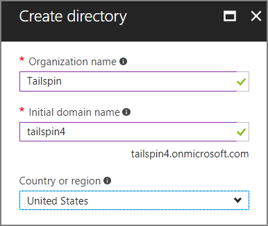

4. Click **Create**. It may take a few minutes to create the new directory.

To complete the end-to-end scenario, you'll need a second Azure AD directory to represent a customer that signs up for the application. You can use your default Azure AD directory (not Tailspin), or create a new directory for this purpose. In the examples, we use Contoso as the fictitious customer.

## Register the Surveys web API 

1. In the [Azure portal][portal], switch to the new Tailspin directory by selecting your account in the top right corner of the portal.

2. In the left-hand navigation pane, choose **Azure Active Directory**. 

3. Click **App registrations** > **New application registration**.

4. In the **Create** blade, enter the following information:

   - **Name**: `Surveys.WebAPI`

   - **Application type**: `Web app / API`

   - **Sign-on URL**: `https://localhost:44301/`
   
   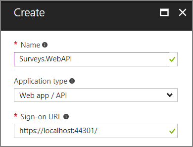 

5. Click **Create**.

6. In the **App registrations** blade, select the new **Surveys.WebAPI** application.
 
7. Click **Properties**.

8. In the **App ID URI** edit box, enter `https://<domain>/surveys.webapi`, where `<domain>` is the domain name of the directory. For example: `https://tailspin.onmicrosoft.com/surveys.webapi`

    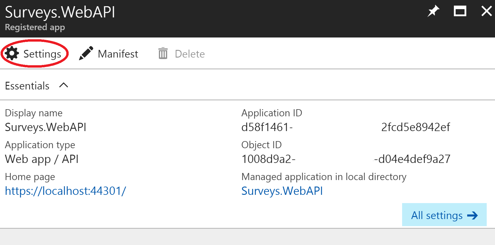

9. Set **Multi-tenanted** to **YES**.

10.	Click **Save**.

## Register the Surveys web app 

1. Navigate back to the **App registrations** blade, and click **New application registration**.

2. In the **Create** blade, enter the following information:

   - **Name**: `Surveys`
   - **Application type**: `Web app / API`
   - **Sign-on URL**: `https://localhost:44300/`
   
   Notice that the sign-on URL has a different port number from the `Surveys.WebAPI` app in the previous step.

3. Click **Create**.
 
4. In the **App registrations** blade, select the new **Surveys** application.
 
5. Copy the application ID. You will need this later.

    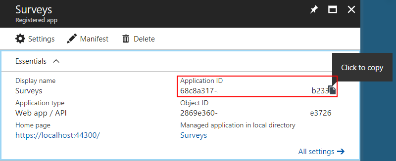

6. Click **Properties**.

7. In the **App ID URI** edit box, enter `https://<domain>/surveys`, where `<domain>` is the domain name of the directory. 

    

8. Set **Multi-tenanted** to **YES**.

9. Click **Save**.

10. In the **Settings** blade, click **Reply URLs**.
 
11. Add the following reply URL: `https://localhost:44300/signin-oidc`.

12. Click **Save**.

13. Under **API ACCESS**, click **Keys**.

14. Enter a description, such as `client secret`.

15. In the **Select Duration** dropdown, select **1 year**. 

16.	Click **Save**. The key will be generated when you save.

17.	Before you navigate away from this blade, copy the value of the key.

    > [!NOTE] 
    > The key won't be visible again after you navigate away from the blade. 

18.	Under **API ACCESS**, click **Required permissions**.

19.	Click **Add** > **Select an API**.

20.	In the search box, search for `Surveys.WebAPI`.

    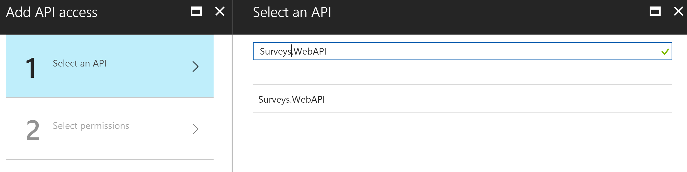

21.	Select `Surveys.WebAPI` and click **Select**.

22.	Under **Delegated Permissions**, check **Access Surveys.WebAPI**.

    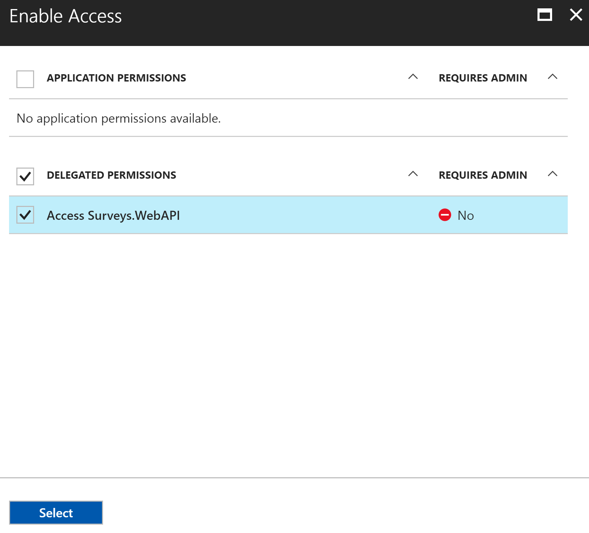

23.	Click **Select** > **Done**.


## Update the application manifests

1. Navigate back to the **Settings** blade for the `Surveys.WebAPI` app.

2. Click **Manifest** > **Edit**.

    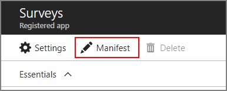
 
3. Add the following JSON to the `appRoles` element. Generate new GUIDs for the `id` properties.

   ```json
   {
     "allowedMemberTypes": ["User"],
     "description": "Creators can create surveys",
     "displayName": "SurveyCreator",
     "id": "<Generate a new GUID. Example: 1b4f816e-5eaf-48b9-8613-7923830595ad>",
     "isEnabled": true,
     "value": "SurveyCreator"
   },
   {
     "allowedMemberTypes": ["User"],
     "description": "Administrators can manage the surveys in their tenant",
     "displayName": "SurveyAdmin",
     "id": "<Generate a new GUID>",  
     "isEnabled": true,
     "value": "SurveyAdmin"
   }
   ```

4. In the `knownClientApplications` property, add the application ID for the Surveys web application, which you got when you registered the Surveys application earlier. For example:

   ```json
   "knownClientApplications": ["be2cea23-aa0e-4e98-8b21-2963d494912e"],
   ```

   This setting adds the Surveys app to the list of clients authorized to call the web API.

5. Click **Save**.

Now repeat the same steps for the Surveys app, except do not add an entry for `knownClientApplications`. Use the same role definitions, but generate new GUIDs for the IDs.

## Create a new Redis Cache instance

The Surveys application uses Redis to cache OAuth 2 access tokens. To create the cache:

1.	Go to [Azure Portal](https://portal.azure.com) and click **New** > **Databases** > **Redis Cache**.

2.	Fill in the required information, including DNS name, resource group, location, and pricing tier. You can create a new resource group or use an existing resource group.

3. Click **Create**.

4. After the Resis cache is created, navigate to the resource in the portal.

5. Click **Access keys** and copy the primary key.

For more information about creating a Redis cache, see [How to Use Azure Redis Cache](/azure/redis-cache/cache-dotnet-how-to-use-azure-redis-cache).

## Set application secrets

1.	Open the Tailspin.Surveys solution in Visual Studio.

2.	In Solution Explorer, right-click the Tailspin.Surveys.Web project and select **Manage User Secrets**.

3.	In the secrets.json file, paste in the following:
    
    ```json
    {
      "AzureAd": {
        "ClientId": "<Surveys application ID>",
        "ClientSecret": "<Surveys app client secret>",
        "PostLogoutRedirectUri": "https://localhost:44300/",
        "WebApiResourceId": "<Surveys.WebAPI app ID URI>"
      },
      "Redis": {
        "Configuration": "<Redis DNS name>.redis.cache.windows.net,password=<Redis primary key>,ssl=true"
      }
    }
    ```
   
    Replace the items shown in angle brackets, as follows:

    - `AzureAd:ClientId`: The application ID of the Surveys app.
    - `AzureAd:ClientSecret`: The key that you generated when you registered the Surveys application in Azure AD.
    - `AzureAd:WebApiResourceId`: The App ID URI that you specified when you created the Surveys.WebAPI application in Azure AD. It should have the form `https://<directory>.onmicrosoft.com/surveys.webapi`
    - `Redis:Configuration`: Build this string from the DNS name of the Redis cache and the primary access key. For example, "tailspin.redis.cache.windows.net,password=2h5tBxxx,ssl=true".

4.	Save the updated secrets.json file.

5.	Repeat these steps for the Tailspin.Surveys.WebAPI project, but paste the following into secrets.json. Replace the items in angle brackets, as before.

    ```json
    {
      "AzureAd": {
        "WebApiResourceId": "<Surveys.WebAPI app ID URI>"
      },
      "Redis": {
        "Configuration": "<Redis DNS name>.redis.cache.windows.net,password=<Redis primary key>,ssl=true"
      }
    }
    ```

## Initialize the database

In this step, you will use Entity Framework 7 to create a local SQL database, using LocalDB.

1.	Open a command window

2.	Navigate to the Tailspin.Surveys.Data project.

3.	Run the following command:

    ```
    dotnet ef database update --startup-project ..\Tailspin.Surveys.Web
    ```
    
## Run the application

To run the application, start both the Tailspin.Surveys.Web and Tailspin.Surveys.WebAPI projects.

You can set Visual Studio to run both projects automatically on F5, as follows:

1.	In Solution Explorer, right-click the solution and click **Set Startup Projects**.
2.	Select **Multiple startup projects**.
3.	Set **Action** = **Start** for the Tailspin.Surveys.Web and Tailspin.Surveys.WebAPI projects.

## Sign up a new tenant

When the application starts, you are not signed in, so you see the welcome page:

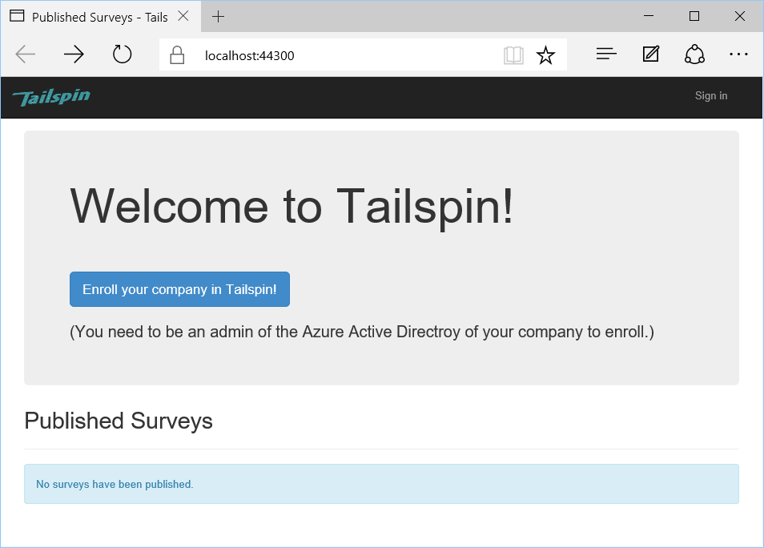

To sign up an organization:

1. Click **Enroll your company in Tailspin**.
2. Sign in to the Azure AD directory that represents the organization using the Surveys app. You must sign in as an admin user.
3. Accept the consent prompt.

The application registers the tenant, and then signs you out. The app signs you out because you need to set up the application roles in Azure AD, before using the application.

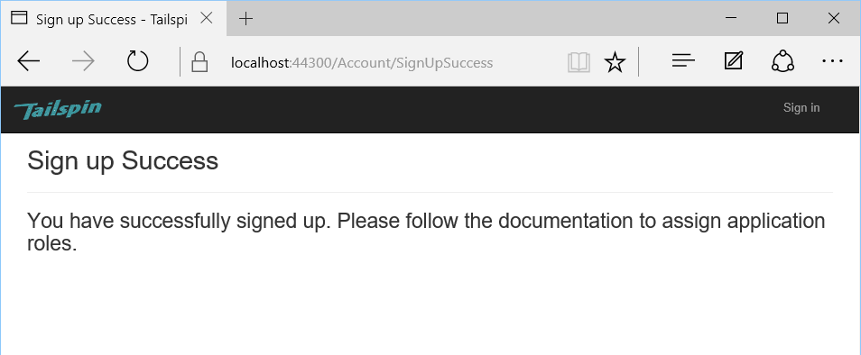

## Assign application roles

When a tenant signs up, an AD admin for the tenant must assign application roles to users.


1. In the [Azure portal][portal], switch to the Azure AD directory that you used to sign up for the Surveys app. 

2. In the left-hand navigation pane, choose **Azure Active Directory**. 

3. Click **Enterprise applications** > **All applications**. The portal will list `Survey` and `Survey.WebAPI`. If not, make sure that you completed the sign up process.

4.	Click on the Surveys application.

5.	Click **Users and Groups**.

4.	Click **Add user**.

5.	If you have Azure AD Premium, click **Users and groups**. Otherwise, click **Users**. (Assigning a role to a group requires Azure AD Premium.)

6. Select one or more users and click **Select**.

    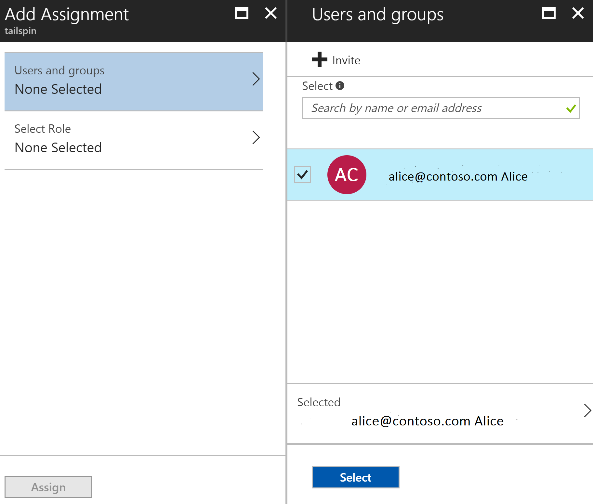

6.	Select the role and click **Select**.

    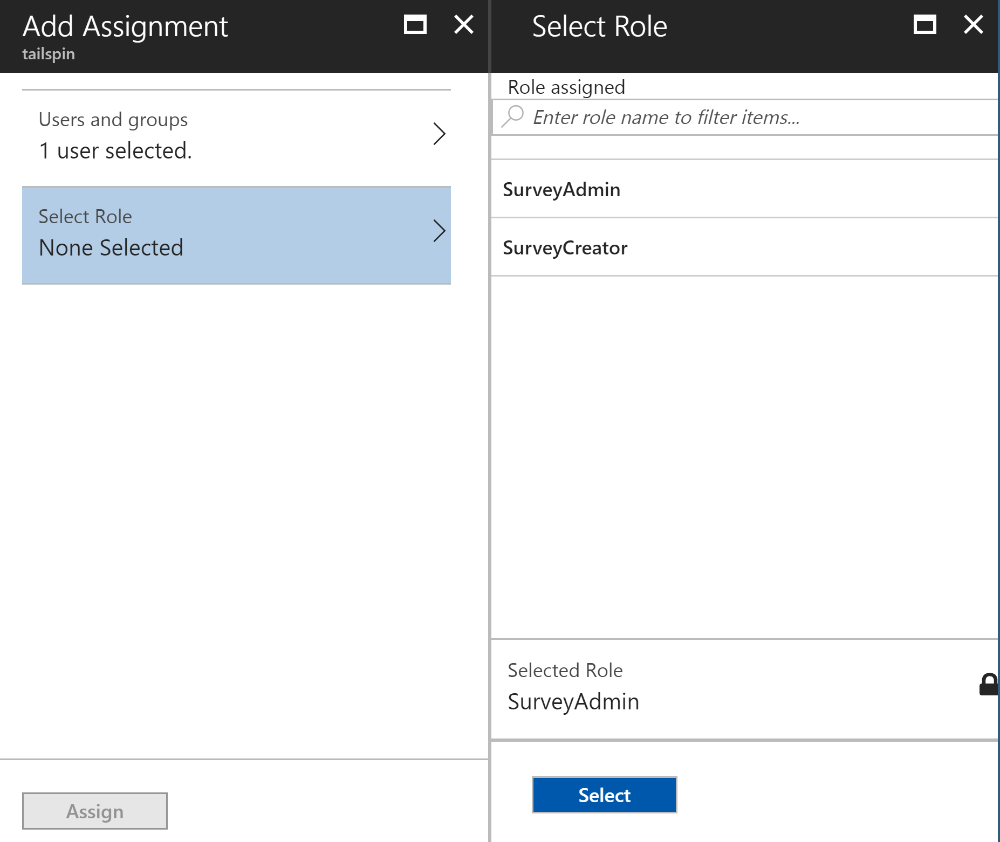

7.	Click **Assign**.

Repeat the same steps to assign roles for the Survey.WebAPI application.

> Important: A user should always have the same roles in both Survey and Survey.WebAPI. Otherwise, the user will have inconsistent permissions, which may lead to 403 (Forbidden) errors from the Web API.

Now go back to the app and sign in again. Click **My Surveys**. If the user is assigned to the SurveyAdmin or SurveyCreator role, you will see a **Create Survey** button, indicating that the user has permissions to create a new survey.

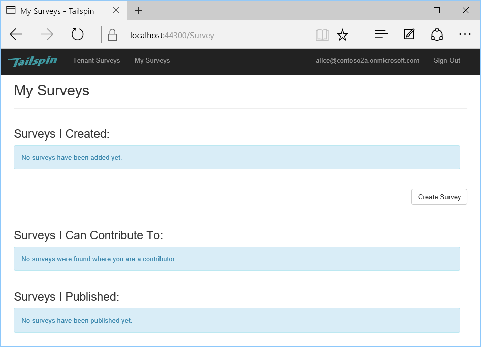


<!-- links -->

[portal]: https://portal.azure.com
[VS2017]: https://www.visualstudio.com/vs/
