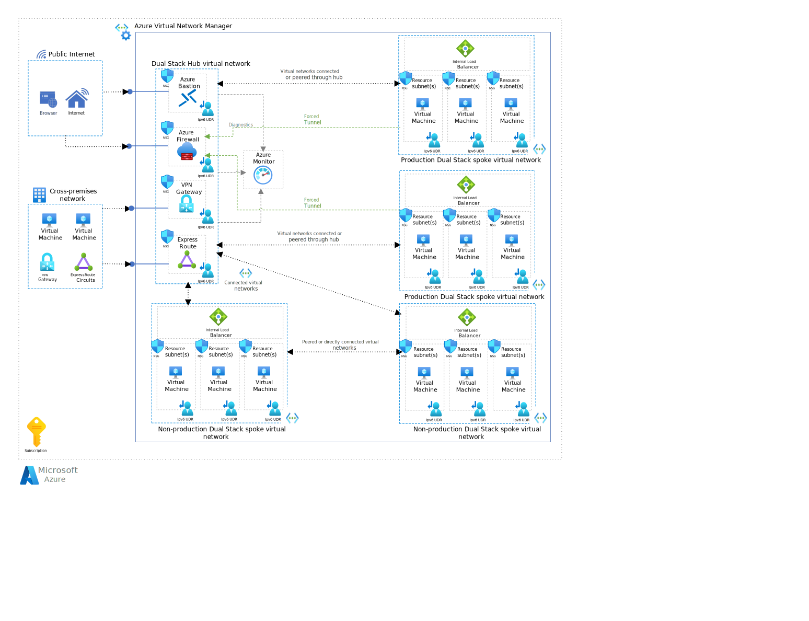

This article describes how to transition an IPv4 hub-and-spoke network topology to IPv6. It presents the [hub-and-spoke network topology](/azure/architecture/reference-architectures/hybrid-networking/hub-spoke) as a starting point and describes the steps you can take to implement IPv6 support.

In a hub-and-spoke network, the hub virtual network is a central point of connectivity for the spoke virtual networks. The spoke virtual networks connect to the hub and can provide isolation for application resources. For more information, see [Transitioning to IPv6](./ipv6-ip-planning.md).

## Architecture

*Download a [Visio file](https://arch-center.azureedge.net/ipv6-hub-spoke-network-topology.vsdx) of this architecture.*

### Workflow

1. **Public internet and cross-premises network:** Users or services can access Azure resources via the public internet. The cross-premises network has on-premises virtual machines that connect securely to the Azure network via a VPN gateway.

1. **Azure Virtual Network Manager:** This component is the management layer that oversees the entire network infrastructure within Azure. It handles the routing, policies, and overall health of the virtual network.

1. **Hub virtual network:** The hub is the central point of the network topology. The network configuration supports both IPv4 and IPv6 (dual stack).

    - Azure Bastion provides secure and seamless Remote Desktop Protocol/Secure Shell (RDP/SSH) connectivity from the Azure portal to the virtual machines directly over Transport Layer Security (TLS).
    - Azure Firewall inspects and filters traffic between the hub and the public internet.
    - ExpressRoute connects the cross-premises network to the hub.
    - VPN Gateway also connects the cross-premises network to the hub and provides redundancy.
    - The services in the hub virtual network send logs and metrics (diagnostics) to Azure Monitor for monitoring.

1. **Spoke virtual networks:** There are four spokes connected to the hub. Each spoke is a dual-stack network, supporting both IPv4 and IPv6.

    - IPv6 user-defined routes (UDRs) define custom routes for IPv6 traffic from the spoke.
    - The spoke virtual networks are connected via [peering connections](/azure/virtual-network/virtual-network-peering-overview) or [connected groups](/azure/virtual-network-manager/concept-connectivity-configuration). Peering connections and connected groups are nontransitive, low-latency connections between virtual networks. Peered or connected virtual networks can exchange traffic over the Azure backbone.
    - All outbound traffic from the spoke virtual networks flows through the hub, using a configuration in Azure Firewall called [forced tunneling](/azure/firewall/forced-tunneling).
    - Within each spoke, there are three subnets designated as resource subnets, each hosting a virtual machine.
    - Each virtual machine connects to an internal load balancer configured to support IPv4 and IPv6 address ranges. The load balancer distributes incoming network traffic across the virtual machines.

### Components

- [Azure Virtual Network](/azure/well-architected/service-guides/virtual-network) is the foundational networking layer in Azure that enables secure communication between Azure resources, the internet, and on-premises networks. In this architecture, it forms the hub-and-spoke topology, which supports dual-stack (IPv4 and IPv6) configurations for centralized and isolated connectivity.
- A [virtual network interface](/azure/virtual-network/virtual-network-network-interface) is a logical interface that connects Azure resources to a virtual network. In this architecture, it enables virtual machines to communicate over both IPv4 and IPv6. You can set up virtual machines and other resources to have multiple network interfaces, which allows you to create dual-stack (IPv4 and IPv6) configurations.
- [A public IP address](/azure/virtual-network/ip-services/public-ip-addresses) provides inbound connectivity to Azure resources over the internet. In this architecture, it supports both IPv4 and IPv6 access to services hosted in the virtual network.
- [Virtual Network Manager](/azure/virtual-network-manager/overview) is a centralized management service for organizing and configuring virtual networks and their connectivity. In this architecture, it manages [network groups](/azure/virtual-network-manager/concept-network-groups) and connections across both the hub and the spoke networks.
- [Azure Firewall](/azure/well-architected/service-guides/azure-firewall) is a network security service that protects Azure resources by inspecting and filtering traffic. In this architecture, it enforces traffic control between the hub and the public internet and supports forced tunneling for outbound traffic from spokes. It protects your Virtual Network resources. An Azure Firewall managed firewall instance resides in its own subnet.
- [Azure VPN Gateway](/azure/vpn-gateway/vpn-gateway-about-vpngateways) and [Azure ExpressRoute](/azure/expressroute/expressroute-introduction) are services that provide secure cross-premises connectivity between Azure and on-premises networks. They can create virtual network gateways that connect Azure virtual networks to virtual private network (VPN) devices or ExpressRoute circuits, which enables encrypted or private communication. In this architecture, you can use either service to connect the hub network to external networks and support IPv6 routing.
- [Azure Load Balancer](/azure/well-architected/service-guides/azure-load-balancer) is a layer-4 load balancing service that distributes incoming network traffic across multiple back-end resources to ensure high availability and scalability. In this architecture, it balances IPv6 traffic across virtual machines deployed in spoke subnets.
- A [route table](/azure/virtual-network/manage-route-table) is a set of UDRs that provide custom control over how traffic flows within and between Azure virtual networks. In this architecture, UDRs direct IPv6 traffic across hub-and-spoke subnets to enforce traffic flow and security policies.
- [Azure Virtual Machines](/azure/well-architected/service-guides/virtual-machines) is an infrastructure as a service (IaaS) solution that provides flexible, scalable compute resources. In this architecture, virtual machines are deployed in spoke subnets configured by using dual-stack network interfaces, which enable support for both IPv4 and IPv6 workloads.
- [Azure Bastion](/azure/bastion/bastion-overview) is a managed platform as a service (PaaS) that provides secure RDP and SSH access to virtual machines without exposing them to the public internet. In this architecture, it enables TLS-secured remote access to virtual machines in the hub network.
- [Azure Monitor](/azure/azure-monitor/overview) is an observability platform that collects, analyzes, and acts on telemetry data from Azure and hybrid environments. In this architecture, it gathers diagnostics and metrics from hub services to support performance monitoring and operational visibility.

## Transition a hub virtual network to IPv6

To transition a hub virtual network to support IPv6, you must update the network infrastructure to accommodate IPv6 address ranges, so the central, controlling part of the network can handle IPv6 traffic. This approach ensures that the central hub can efficiently route and manage traffic among various network segments (spokes) by using IPv6. To implement IPv6 in the hub virtual network, follow these steps:

### Add IPv6 address space to the hub virtual network and the hub subnets

You need to add IPv6 address ranges to the hub virtual network first and then to its subnets. Use the /56 address block for the virtual network and the /64 address block for each subnet. The following table shows an example setup.

| Hub virtual network address range | Hub subnet address range |
| --- | --- |
| Hub virtual network: `2001:db8:1234:0000::/56` | Azure Bastion subnet: `2001:db8:1234:0000::/64` Azure Firewall subnet: `2001:db8:1234:0001::/64`  VPN Gateway subnet: `2001:db8:1234:0002::/64` ExpressRoute subnet: `2001:db8:1234:0003::/64` |

These IPv6 addresses are examples. You should replace `2001:db8:1234::` with your organization's IPv6 address block. Carefully plan and document your IPv6 address allocations to avoid overlaps and ensure efficient use of the address space. To add the IPv6 address space to the hub virtual network, you can use the [Azure portal](/azure/virtual-network/ip-services/add-dual-stack-ipv6-vm-portal#add-ipv6-to-virtual-network), [PowerShell](/azure/virtual-network/ip-services/add-dual-stack-ipv6-vm-powershell#add-ipv6-to-virtual-network), or [Azure CLI](/azure/virtual-network/ip-services/add-dual-stack-ipv6-vm-cli#add-ipv6-to-virtual-network).

### Configure user-define routes (UDRs) for each hub subnet

UDRs are routes that you manually set up to override Azure's default system routes. In Azure, UDRs are essential for controlling the flow of network traffic in a virtual network. You can use UDRs to direct traffic from one subnet to specific appliances, gateways, or targets within Azure or to on-premises networks. When you add IPv6 support to the hub virtual network, you need to:

- *Add IPv6 routes*. If there's an established route table, add new routes that specify the IPv6 address prefixes.
- *Modify existing routes*. If there are already routes for IPv4, you might need to modify them to ensure that they also apply to IPv6 traffic, or create separate IPv6-specific routes.
- *Associate the route table with subnets*. After you define the routes, associate the route table with the relevant subnets within the virtual network. This association determines which subnets use the routes that you defined.

You don't need to add a route for every resource, but you do need a route for each subnet. Each subnet can have multiple resources, and they all follow the rules that are defined in the route table associated with their subnet. For more information, see [User-define route overview](/azure/virtual-network/virtual-networks-udr-overview).

For the example architecture, the hub virtual network has four subnets: Azure Bastion, Azure Firewall, VPN Gateway, and ExpressRoute. The following table shows example UDRs for each subnet.

| Hub subnet         | Description        | IPv6 address range           | Route name     | Destination       | Next hop                           |
| -------------- | ------------------ | ---------------------------- | -------------- | ----------------- | ---------------------------------- |
| Azure Bastion  | Route to Firewall  | `2001:db8:1234:0000::/64`    | Internet route | `::/0`            | `2001:db8:1234:0001::/64` (Azure Firewall) |
| Azure Firewall | Default route      | `2001:db8:1234:0001::/64`    | Internet route | `::/0`            | Internet Gateway                  |
| VPN Gateway    | On-premises route  | `2001:db8:1234:0002::/64`    | On-premises route  | `2001:db8:abcd::/56` | VPN Gateway                       |
| ExpressRoute   | On-premises route  | `2001:db8:1234:0003::/64`    | On-premises route  | `2001:db8:efgh::/56` | ExpressRoute                      |

When you set up your UDRs, you must align them with your organizational network policies and the architecture of your Azure deployment.

### Modify the ExpressRoute circuit (if applicable)

To provide the ExpressRoute circuit with IPv6 support, you need to:

- *Enable IPv6 private peering*. Enable IPv6 private peering for the ExpressRoute circuit. This configuration enables IPv6 traffic between your on-premises network and the hub virtual network.
- *Allocate IPv6 address space*. Provide IPv6 subnets for the primary and secondary ExpressRoute links.
- *Update route tables*. Ensure that you direct IPv6 traffic appropriately through the ExpressRoute circuit.

These configurations extend IPv6 connectivity to your Azure services via an ExpressRoute circuit, so you can route dual-stack capabilities simultaneously. To modify ExpressRoute, you can use the [Azure portal](/azure/expressroute/expressroute-howto-add-ipv6-portal), [PowerShell](/azure/expressroute/expressroute-howto-add-ipv6-powershell), or [Azure CLI](/azure/expressroute/expressroute-howto-add-ipv6-cli).

## Transition spoke virtual networks to IPv6

Spoke virtual networks are connected to the central hub. When you provide the spoke virtual networks with IPv6 support, each spoke network can communicate via the more advanced IPv6 protocol, and it extends uniformity across the network. To provide the spoke virtual networks with IPv6 support, follow these steps:

### Add IPv6 address space to the spoke virtual networks and spoke subnets

Like the hub virtual network, you must add IPv6 address ranges to every spoke virtual network and then their subnets. Use the /56 address block for the virtual networks and the /64 address block for the subnets. The following table provides an example of IPv6 address ranges for spoke virtual networks and their subnets.

| Spoke virtual network address range | Spoke subnet address range |
| ----------------------------- | --------------------- |
| Spoke virtual network 1: `2001:db8:1234:0100::/56` | Subnet 1: `2001:db8:1234:0100::/64` Subnet 2: `2001:db8:1234:0101::/64` Subnet 3: `2001:db8:1234:0102::/64` |
| Spoke virtual network 2: `2001:db8:1234:0200::/56` | Subnet 1: `2001:db8:1234:0200::/64` Subnet 2: `2001:db8:1234:0201::/64` Subnet 3: `2001:db8:1234:0202::/64` |
| Spoke virtual network 3: `2001:db8:1234:0300::/56` | Subnet 1: `2001:db8:1234:0300::/64` Subnet 2: `2001:db8:1234:0301::/64` Subnet 3: `2001:db8:1234:0302::/64` |
| Spoke virtual network 4: `2001:db8:1234:0400::/56` | Subnet 1: `2001:db8:1234:0400::/64` Subnet 2: `2001:db8:1234:0401::/64` Subnet 3: `2001:db8:1234:0402::/64` |

For your setup, adjust the IPv6 addresses according to your organization's allocation and needs.

### Modify spoke virtual network resources

Each spoke virtual network contains multiple virtual machines and an internal load balancer. The internal load balancer enables you to route IPv4 and IPv6 traffic to the virtual machines. You must modify the virtual machines and internal load balancers so they support IPv6.

For each virtual machine, you must create an IPv6 network interface and associate it with the virtual machine to add IPv6 support. For more information, see [Add IPv6 configuration to a virtual machine](/azure/virtual-network/ip-services/add-dual-stack-ipv6-vm-portal#add-ipv6-configuration-to-virtual-machine).

If there isn't an internal load balancer in each spoke virtual network, you should create a dual-stack internal load balancer. For more information, see, [Create a dual-stack internal load balancer](/azure/load-balancer/ipv6-dual-stack-standard-internal-load-balancer-powershell). If there's an internal load balancer, you can use [PowerShell](/azure/load-balancer/ipv6-add-to-existing-vnet-powershell) or [Azure CLI](/azure/load-balancer/ipv6-add-to-existing-vnet-cli) to add IPv6 support.

### Configure user-defined routes (UDRs) for each spoke subnet

To configure UDRs, spoke virtual networks use the same configuration as hub virtual networks When you add IPv6 support to a spoke virtual network, you need to:

- *Add IPv6 routes*. If there's an established route table, add new routes that specify the IPv6 address prefixes.

- *Modify existing routes*. If there are already routes for IPv4, you might need to modify them to ensure that they also apply to IPv6 traffic, or create separate IPv6-specific routes.
- *Associate the route table with subnets*. After you define the routes, associate the route table with the relevant subnets within the virtual network. This association determines which subnets use the routes that you defined.

The following table shows example UDRs for each subnet in a spoke virtual network.

| Spoke subnet   | Description           | IPv6 address range           | Route name         | Destination       | Next hop                           |
| -------- | --------------------- | ---------------------------- | ------------------ | ----------------- | ---------------------------------- |
| Subnet 1 | Route to Firewall     | `2001:db8:1234:0100::/64`    | Internet route     | `::/0`            | `2001:db8:1234:0001::/64` (Azure Firewall) |
| Subnet 2 | Route to VPN Gateway  | `2001:db8:1234:0101::/64`    | VPN route          | `2001:db8:abcd::/64` | `2001:db8:1234:0002::/64` (VPN Gateway) |
| Subnet 3 | Route to ExpressRoute | `2001:db8:1234:0102::/64`    | ExpressRoute route | `2001:db8:5678::/64` | `2001:db8:1234:0003::/64` (ExpressRoute) |

For your setup, you must align the UDRs with your organizational network policies and the architecture of your Azure deployment.

## Contributors

*Microsoft maintains this article. The following contributors originally wrote the article.*

Principal author:

- [Werner Rall](https://www.linkedin.com/in/werner-rall) | Senior Cloud Solutions Architect Engineer

Other contributors:

- [Sherri Babylon](https://www.linkedin.com/in/sbabylon) | Senior Technical Program Manager
- [Dawn Bedard](https://www.linkedin.com/in/dawnbedard) | Principal Technical Program Manager
- [Brandon Stephenson](https://www.linkedin.com/in/brandon-stephenson-3340219b) | Senior Customer Engineer

*To see nonpublic LinkedIn profiles, sign in to LinkedIn.*

## Next steps

- [Create a virtual machine with a IPv6 dual-stack network](/azure/virtual-network/ip-services/create-vm-dual-stack-ipv6-portal)
- [Manage IP address ranges](/azure/virtual-network/manage-virtual-network#add-or-remove-an-address-range)
- [Cloud Adoption Framework: Plan for IP addressing](/azure/cloud-adoption-framework/ready/azure-best-practices/plan-for-ip-addressing#ipv6-considerations)
- [IPv6 for Azure Virtual Network](/azure/virtual-network/ip-services/ipv6-overview)
- [Add IPv6 support via ExpressRoute](/azure/expressroute/expressroute-howto-add-ipv6-portal)
- [Azure DNS IPv6 support](/azure/dns/dns-reverse-dns-overview)
- [IPv6 for Azure Load Balancer](/azure/load-balancer/load-balancer-ipv6-overview)
- [Add IPv6 support for private peering using the Azure portal](/azure/expressroute/expressroute-howto-add-ipv6-portal)

## Related resources

- [Transition to IPv6](ipv6-ip-planning.md)
- [Virtual network connectivity options and spoke-to-spoke communication](../../reference-architectures/hybrid-networking/virtual-network-peering.yml)
- [Firewall and Application Gateway for virtual networks](../../example-scenario/gateway/firewall-application-gateway.yml)
- [Deploy AD DS in an Azure virtual network](../../example-scenario/identity/adds-extend-domain.yml)
