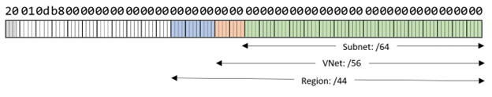

# Conceptual planning for IPv6 networking

This guide outlines strategies for transitioning an IPv4 network environment in Azure to IPv6. This transition is necessary as the number of internet-connected devices expands and IPv4 addresses near exhaustion. The IPv6 protocol provides a larger pool of internet addresses to accommodate future growth and offers enhanced security features (native IPsec), flow labeling, and simplified network configurations. This article helps you understand IPv6, acquire IPv6 addresses, and transition to IPv6.

## Understand IPv6

IPv6 has such a large address space that you should use consistent IPv6 address block sizes that over-allocate IPv6 addresses. This networking strategy contrasts with IPv4. The limited number of IPv4 addresses forces you to use the smallest possible subnet size. This table gives you a sense of the increased size of IPv6:

| IP version | Number of IP addresses |
|---|---|
| IPv4 | 4,294,967,296 |
| IPv6 | 340,282,366,920,938,463,463,374,607,431,768,211,456 |

**Dual stacking**. Azure virtual networks support dual stacking. A network that supports dual stacking can process IPv4 and IPv6 traffic simultaneously. You can assign a new IPv6 address block to a subnet that has an existing IPv4 block. Services that use IPv6 can coexist with services that use IPv4. You can therefore start the IPv6 transition before all services support IPv6.

**IPv6 in Azure**. In your Azure environment, network interfaces receive one of three types of IPv6 addresses:
  
- *Private IP addresses*. To enable IPv6 on private IP addresses, you apply an IPv6 address range to the virtual network and its subnets. The network interfaces in subnets get a static or dynamic address, depending on your configuration. You can see the IP address assignment in the Azure portal. You can also see it in the virtual machine configuration, if you use virtual machines. In the operating system, this address is shown as the *IPv6 address*.

- *Public IP addresses*. You can apply public IPv6 addresses to network interfaces. Public IP addresses must be globally unique and routable on the internet. You need to generate a unique IPv6 address that can be used for public endpoints on Azure, like load balancers or application gateways. You can use the `New-AzPublicIpAddress` cmdlet to create an IPv6 public address in PowerShell.

  The operating system configuration doesn't show the public IP address, but you can see the public IP address in the Azure portal. You can use public IPv6 addresses for inbound and outbound communication to and from the internet. You might need to update the route table with user defined routes to support IPv6. Many organizations use shared network virtual appliances (NVAs) for public communication and don't assign a public IP address to network interfaces. You aren't charged for Azure public IPv6 addresses, although you're charged for IPv4 addresses. For more information, see [IP Addresses pricing](https://azure.microsoft.com/pricing/details/ip-addresses/).

- *Link-local addresses*. Link-local addresses are a special type of private IP address. In IPv6, link-local addresses are automatically configured on all interfaces. They're used for communication within a single network segment and aren't routable on the internet. They come from the `fe80::/10` space instead of from your subnet's address block. You can see the `fe80::/10` address assigned to your interface from within the operating system.

For more information about other specialty address blocks, see [IANA IPv6 Special-Purpose Address Registry](https://www.iana.org/assignments/iana-ipv6-special-registry/iana-ipv6-special-registry.xhtml).

## Acquire IPv6 addresses

If your organization already has IPv6 addresses, you can benefit from using them in your Azure environment. If not, you need to acquire new ones. Using existing addresses can be more cost-effective and efficient, but acquiring new ones ensures that you have a sufficient and continuous block of addresses for your needs. It also reduces the chance of address conflicts. If you don't have IPv6 space secured for your organization, you can use global addresses or local addresses.

**Global addresses**: Global addresses are public IP addresses that are unique across the internet. You can contact a registrar to request a continuous block of general allocation or global addresses. These IPv6 addresses can be used in subnets, virtual networks, and regional supernets in Azure. To have sufficient space for growth in multiple regions, you should plan to allocate a /36 address space to your whole Azure environment. You can use global addresses for both private networks and public endpoints, or you can allocate different ranges. Unique global addresses can't have IP address conflicts.

**Local addresses**: Local addresses are private IP addresses that are used within a virtual network. You can use IPs in the unique local address range. This address range functions like the IPv4 private address range, such as the `10.0.0.0/8` address space. IPv6 reserves the `fc00::/7` address blocks for unique local addresses. These addresses aren't globally reachable, even though they're a part of the IPv6 Global Unicast Address range.

If you use the unique local address range, your IP addresses might overlap with the IP address range of another organization. If there's an overlap, you might experience challenges with integrating networks. For more information, see [the Unique Local IPv6 Unicast Addresses memo](https://www.rfc-editor.org/rfc/rfc4193.html).

## Transition to IPv6

You should align your plan for assigning IPv6 addresses to your Azure networks with your organization's IPv6 addressing plan. Your organization should already have a plan for on-premises IPv6 use, so that you can allocate space between different locations without overlapping. If you don't have a plan, you should define one before you start your implementation on Azure. For more information, see [Plan for IP addressing](/azure/cloud-adoption-framework/ready/azure-best-practices/plan-for-ip-addressing).

Some of the practices that are necessary in IPv4 to conserve addresses aren't applicable in IPv6. You should over-allocate IPv6 addresses and use a standard block size for the Azure environment, regions, virtual networks, and subnets, as shown in the following table. These recommendations apply to IPv6, not to IPv4 environments. For more information, see [Plan for IP addressing](/azure/cloud-adoption-framework/ready/azure-best-practices/plan-for-ip-addressing).

| Scope | Size | Number of instances |
|--|--|--|
| Azure environment | /36 | 1 |
| Region | /44 | 256 |
| Virtual network | /56 | 4,096 per region |
| Subnet | /64 | 256 per virtual network |

**Transitioning regions to IPv6.** You should use a supernet and assign a /44 IPv6 address space to each Azure region. As with IPv4, a supernet doesn't have a technical representation in Azure. Instead, you assign and track it in your IP Address Management system (IPAM). This table illustrates what the address blocks would look like for multiple regions:

| Network scope | CIDR range| First IP | Last IP |
| --- | --- | --- | --- |
| Azure region 1 | `fd00:db8:dec0::/44` | fd00:db8:dec0:0000:0000:0000:0000:0000 | fd00:db8:decf:ffff:ffff:ffff:ffff:ffff |
| Azure region 2 | `fd00:db8:ded0::/44` | fd00:db8:ded0:0000:0000:0000:0000:0000 | fd00:db8:dedf:ffff:ffff:ffff:ffff:ffff |
| Azure region 3 | `fd00:db8:def0::/44` | fd00:db8:def0:0000:0000:0000:0000:0000 | fd00:db8:deff:ffff:ffff:ffff:ffff:ffff |

After this IP address space is allocated to the region, you can deploy new networks and workloads by defining virtual networks and subnets from that IP space.

**Transitioning virtual networks to IPv6.** You should assign a /56 IPv6 address space to each virtual network. This assignment facilitates networking management and streamlines the creation process. It enables you to create 4,096 virtual networks in a region and 256 subnets in a single virtual network.

**Transitioning subnets to IPv6.** You can continue to use your existing subnet architecture and assign a /64 address block to each subnet. This subnet size also enables you to plan your network conceptually. You don't need to worry about resizing subnets due to address exhaustion.

One significant difference between IPv6 networks and IPv4 networks on Azure is the minimum size of subnets. The minimum size of IPv6 subnets on Azure is /64. Each subnet contains 18,446,744,073,709,551,616 hosts, minus the hosts that are used for Azure management. Like IPv4 networks, IPv6 subnets reserve the first four IP addresses for management. The reason for the IPv6 minimum subnet size is to maintain compatibility with network appliances outside of Azure. If the subnets were smaller, routing issues could occur.

To calculate the number of subnets of a certain size that can fit into a larger address block, you can use the formula 2^(X-Y). X is the smaller address block size, and Y is the larger block size. For example, to determine how many /64 subnets can fit into a /44 address block, you can use 2^(64-44). The result is 1,048,576.

**Reusing IPv4 addresses.** As you transition to IPv6 addresses, you can repurpose private IPv4 addresses in different virtual networks within your Azure environment. This transferability enables you to maintain active services while transitioning to IPv6 and effectively manage your IP space during the transition. The reuse option gives you a larger effective IPv4 space. For any peered virtual network, you must ensure that the IPv4 address ranges don't overlap.

## Configure Azure services to use IPv6

You can use the following table to find instructions for transitioning specific services or components to IPv6.

| Service/component | Transition instructions |
|--|--|
| Azure Application Gateway | For more information, see [Configure Application Gateway with a frontend public IPv6 address](/azure/application-gateway/ipv6-application-gateway-portal). |
| Azure Container Networking Interface (CNI) Overlay for AKS| For more information, see [Use Azure CNI Overlay](/azure/aks/azure-cni-overlay). |
| Azure custom IP address prefix | You need to create new prefixes for your IPv6 address ranges. For instructions, see [Create a custom IPv6 address prefix using the Azure portal](/azure/virtual-network/ip-services/create-custom-ip-address-prefix-ipv6-portal). |
| Azure Data Explorer | You must perform an API request to update the `publicIPType` property to `DualStack`. For more information, see [Create or update clusters](/rest/api/azurerekusto/clusters/create-or-update#kustoclusterscreateorupdate). |
| Azure DNS zone (public and private) | To add new IPv6 records, see [Manage DNS records and record sets](/azure/dns/dns-operations-recordsets-portal#update-a-record). |
| Azure ExpressRoute gateway |  To transition ExpressRoute gateways, see [Azure ExpressRoute: Add IPv6 support](/azure/expressroute/expressroute-howto-add-ipv6-portal). |
| Azure Front Door | Azure Front Door can target a back end with IPv6. You don't need a special transition, other than updating the back-end information. |
| Azure Kubernetes Service (AKS) |  For more information, see [Use kubenet with dual-stack networking](/azure/aks/configure-kubenet-dual-stack). |
| Azure Load Balancer |  To create or modify new load balancers with IPv6, see [Standard public load balancer with IPv6](/azure/load-balancer/virtual-network-ipv4-ipv6-dual-stack-standard-load-balancer-powershell) and [Standard internal load balancer with IPv6](/azure/load-balancer/ipv6-dual-stack-standard-internal-load-balancer-powershell). |
| Azure public IP address (basic) | You need to create new public IP addresses with IPv6 addresses. For instructions, see [Create an IPv6 public IP address](/azure/virtual-network/ip-services/add-dual-stack-ipv6-vm-portal#create-ipv6-public-ip-address). |
| Azure Service Fabric | For more information, see [Configure managed cluster network settings](/azure/service-fabric/how-to-managed-cluster-networking#ipv6). |
| Azure Virtual Machine Scale Sets | The process is similar to creating IPv6 virtual machines, but you must change the network profile. For more information, see [Virtual Machine Scale Sets with IPv6](/azure/virtual-network/ip-services/ipv6-virtual-machine-scale-set). |
| Azure Virtual Network Manager | Virtual Network Manager can manage networks that use IPv6. |
| Virtual machine | To add IPv6 to existing virtual machines, see [Add the IPv6 configuration to a virtual machine](/azure/virtual-network/ip-services/add-dual-stack-ipv6-vm-portal#add-ipv6-configuration-to-virtual-machine). |
| Virtual network | To add new IPv6 space to existing subnets, see [Add IPv6 to a virtual network](/azure/virtual-network/ip-services/add-dual-stack-ipv6-vm-portal#add-ipv6-to-virtual-network). |

## Next steps

- [IPv6 hub and spoke network topology](./ipv6-architecture.yml)
- [IPv6 for Azure Virtual Network](/azure/virtual-network/ip-services/ipv6-overview)
- [Plan for IP addressing](/azure/cloud-adoption-framework/ready/azure-best-practices/plan-for-ip-addressing)

## Related resources

- [Networking architecture design](../index.md)
