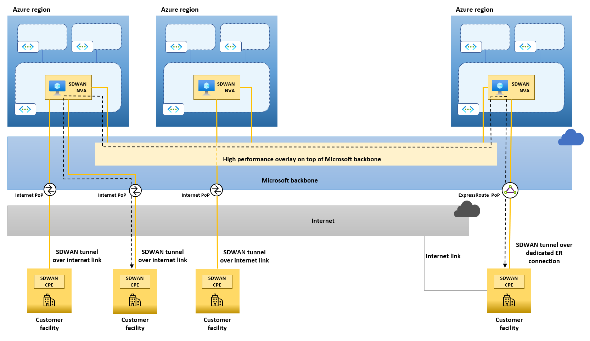
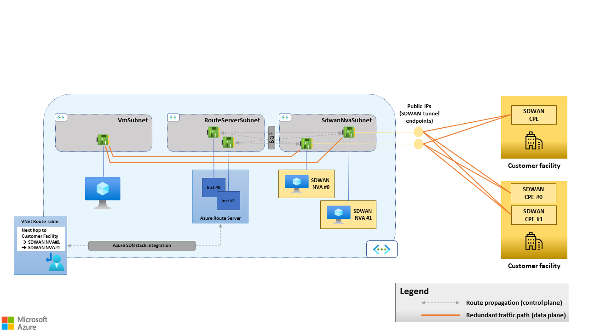
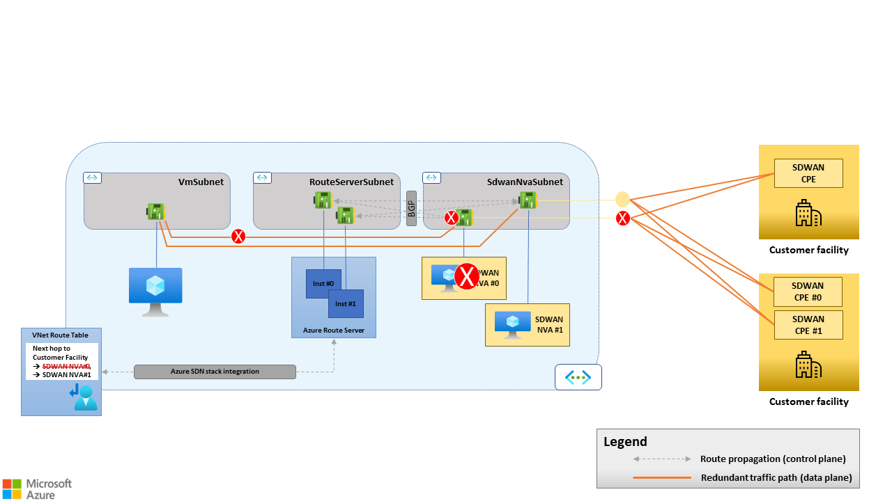
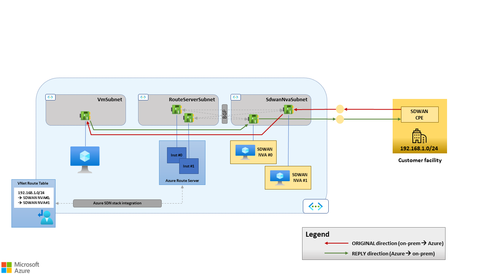
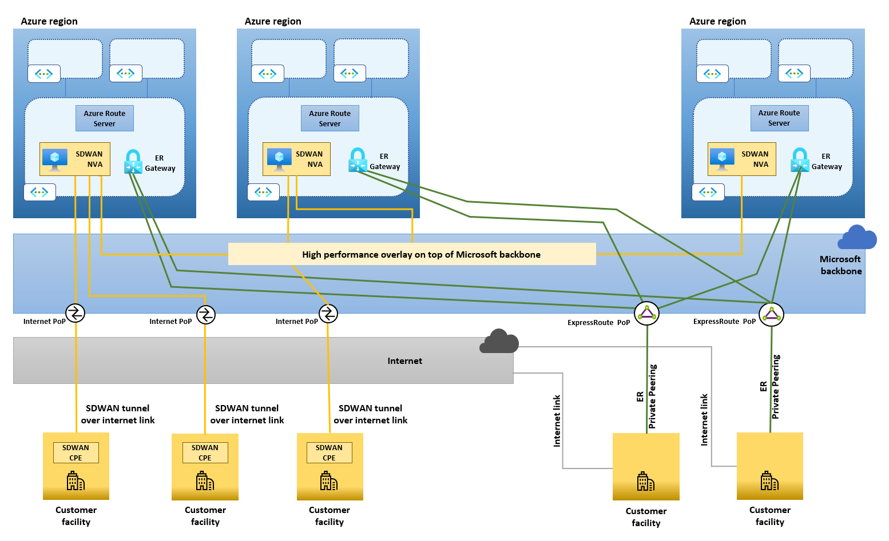
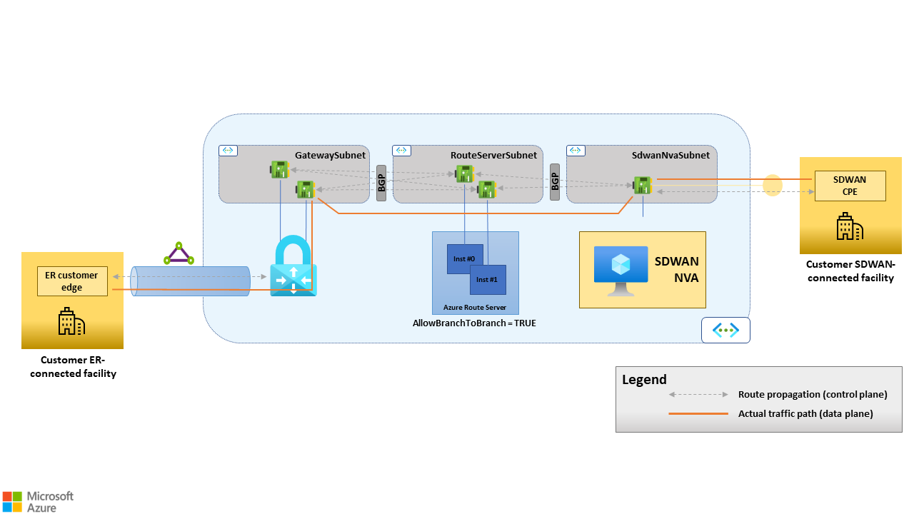
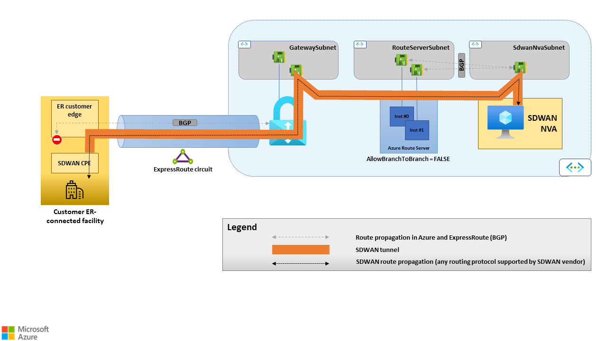
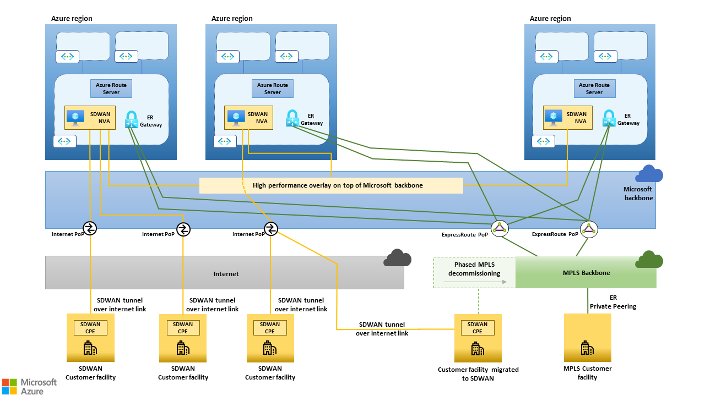
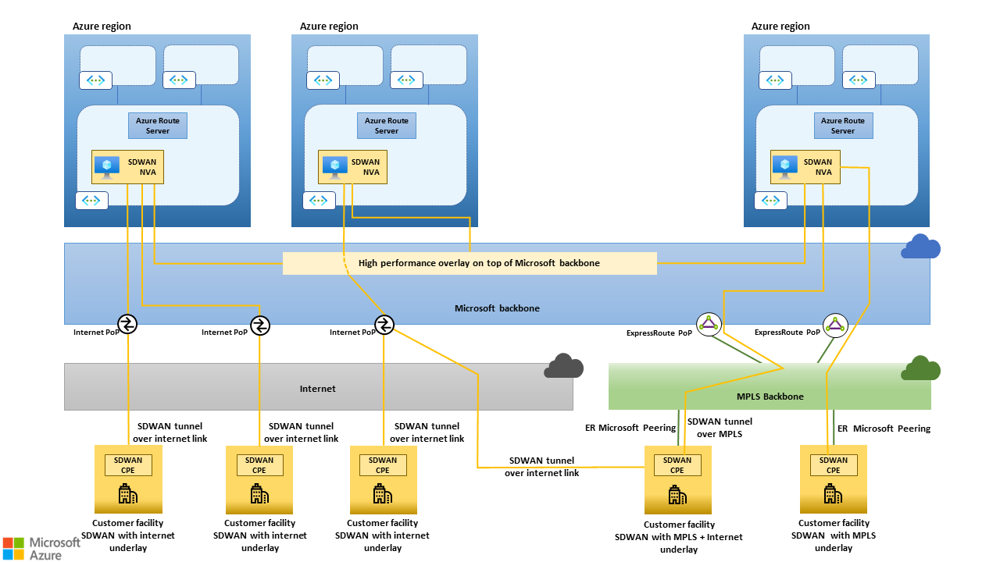

The article is intended for network architects that want to design Software-defined Wide Area Networks (SDWANs) to connect on-prem facilities with each other and with Azure. It describes an architecture that allows Azure customers to fully leverage their existing investments in the platform, by building efficient, global SDWAN overlays on top of the Microsoft backbone.

## Applicable scenarios

The recommendations in this article are vendor-agnostic and applicable to any 3rd party SDWAN technology that meets two basic prerequisites:
- Reliance on tunneling protocols that use Transmission Control Protocol (TCP) or User Datagram Protocol (UDP) as the underlying transport (an example being tunnel-mode IPSec ESP with NAT-Traversal).
- Border Gateway Protocol (BGP) v4 support for route exchange with external entities (no assumptions are made on the routing protocol used by the 3rd party SDWAN devices to exchange routing information between each other).

By adhering to these recommendations, customers can use their SDWAN technology of choice to achieve the following goals:
- Integrate SDWAN products in an existing Azure hub and spoke network, by automating route exchange between Azure Virtual Networks (VNets) and SDWAN devices.
- Optimize connectivity (both to Azure and on-premises datacenters) for branches with local internet breakouts. The [reach](https://azure.microsoft.com/blog/how-microsoft-builds-its-fast-and-reliable-global-network/) of the Microsoft backbone, combined with its capacity, resiliency and "[cold potato](https://en.wikipedia.org/wiki/Hot-potato_and_cold-potato_routing)" routing policy suggests that it can be used as a high-performance underlay for global SDWANs.
- Leverage the Microsoft backbone for all Azure-to-Azure traffic (cross region and cross geography).
- Leverage existing Multi-Protocol-Label-Switching (MPLS) networks as a high-performance underlays. It can also be used to replace an existing MPLS network in a phased approach that minimizes the impact on the business.

The following sections assume that the reader is familiar with the basics of the [SDWAN paradigm](https://en.wikipedia.org/wiki/SD-WAN) and with the architecture of the [Microsoft backbone](/azure/networking/microsoft-global-network), which interconnects Azure regions with each other and with the public internet.

## Architecture

Organizations with global presence and a multi-region Azure footprint typically use a combination of connectivity services to implement their corporate networks and to connect to the Microsoft backbone:
- Dedicated connectivity services, such as MPLS Internet-Protocol-Virtual-Private-Networks (IPVPNs), may be used at the largest sites, such as datacenters or headquarters.
- Large sites may have dedicated connectivity to the Microsoft backbone through ExpressRoute circuits, using one of the [supported connectivity models](/azure/expressroute/expressroute-connectivity-models). More specifically, a site may use dedicated point-to-point circuit(s) to connect to the nearest ExpressRoute peering location(s); Or it can leverage its MPLS IPVPN to access ExpressRoute circuits provided by the MPLS carrier.
- Branch offices with internet connectivity only may use IPSec VPNs to connect to the closest on-premises datacenter and leverage that datacenter’s ExpressRoute connection to access Azure resources.
- Branch offices with internet connectivity only may leverage IPSec VPNs to directly connect to Azure hub and spoke networks.

SDWAN projects may have very different scopes in terms of which traditional network services they intend to replace. Some organizations may want to stick to dedicated links or MPLS for large facilities and deploy an SDWAN only to replace legacy internet-based IPSec VPNs in small sites. Other organizations may want to extend their SDWAN to MPLS-connected sites and use the existing MPLS network as a high-performance underlay. Finally, some organizations may want to completely dismiss their MPLS IPVPNs (and in general any dedicated connectivity service) to fully embrace the SDWAN paradigm - and build their entire corporate network as a logical overlay on top of public/shared underlays (the public internet and the Microsoft backbone).

The architecture described in this article supports all the scopes listed above. It is based on the following principles:
- SDWAN devices are deployed as Network Virtual Appliances (NVAs) in each Azure region’s hub and spoke network and configured as SDWAN hubs that terminate tunnels from on-prem sites.
- SDWAN devices in Azure are configured to establish tunnels with each other, thus creating a fully meshed hub-to-hub overlay that can efficiently transport traffic among Azure regions, and relay traffic between geographically distant on-prem sites, on top of the Microsoft backbone.
- SDWAN devices are deployed in all on-prem sites covered by the SDWAN solution and configured to establish tunnels to the SDWAN NVAs in the closest Azure region(s). Different sites may leverage different transport services as an underlay for the tunnels (public internet, ExpressRoute connectivity, …).
- Traffic from a site to any destination (in an Azure or in another on-prem site) is routed to the SDWAN NVAs in the closest Azure region and then through the hub-to-hub overlay.

SDWAN products can use proprietary protocols/features to detect when/if dynamically established, direct tunnels between two sites can provide better performance than relaying traffic via SDWAN NVAs in Azure.

The high-level architecture of a global SDWAN that uses the Microsoft backbone, the public internet and dedicated ER connections as underlays is shown in the following picture.

*Figure 1: High-level architecture of a global SDWAN that uses the Microsoft backbone, the public internet and dedicated ER connections as underlays. The black dashed line shows how traffic between two on-prem sites can be routed through SDWAN NVAs deployed in Azure regions geographically close to the sites. The Microsoft backbone, due to its reach, capacity and "cold potato" routing policy may lead to substantially better/predicatable performance than the public internet, especially for long-haul connections.*

## SDWAN products in Azure hub-and-spoke networks

This section provides recommendations for deploying 3rd party SDWAN CPE devices as NVAs in an existing hub and spoke Azure network.

### SDWAN NVAs in the hub VNet

Hub and Spoke is the topology that Microsoft recommends for building scalable networks in an Azure region using customer-managed VNets. The hub VNet hosts shared components such as 3rd party NVAs and native services that provide network functions (firewalling, load balancing, connectivity to on-prem sites via site-2-site VPNs or ExpressRoute). The hub VNet is the natural location for SDWAN NVAs, which ultimately are 3rd party gateways providing access to remote networks.

SDWAN NVAs should be deployed in hub VNets as follows:

- One single NIC is used for all SDWAN traffic. Additional NICs, such as a management NIC, can be added to meet security/compliance requirements or to adhere to vendor guidelines for Azure deployments.
- The NIC used for SDWAN traffic must be attached to a dedicated subnet. The size of the subnet must be defined based on the number of SDWAN NVAs that will be deployed to meet HA and scale/throughput requirements (discussed below in this article).
- Network Security Groups (NSGs) must be associated to the SDWAN traffic NIC (either directly or at the subnet level) to allow connections from remote on-prem sites over the TCP/UDP ports used by the SDWAN solution.
-  IP Forwarding must be enabled on the NIC used for SDWAN traffic.

### Azure Route Server in the hub VNet

Azure Route Server automates route exchange between SDWAN NVAs and the Azure Software Defined Networking (SDN) stack. Azure Route Server supports BGP as a dynamic routing protocol. By establishing BGP adjacencies between Azure Route Server and the SDWAN NVA(s):
- Routes for all the on-prem sites connected to the SDWAN are injected in the Azure VNets' route tables and learned by all Azure VMs.
- Routes for all IP prefixes included in the address space of Azure VNets are propagated to all SDWAN-connected sites.

Azure Route Server should be configured as follows.

- It must be deployed in a dedicated subnet in the hub VNet as per [this article](/azure/route-server/quickstart-configure-route-server-portal).
- In order to enable automated route exchange for all spoke VNets, VNet peering must be configured to allow the spoke VNets to use the hub VNet's gateway and route server. Details available in the [public documentation](/azure/route-server/route-server-faq).
- As Route Server and the SDWAN NVAs are attached to different subnets, BGP sessions between Route Server and SDWAN NVAs must be configured with eBGP multihop support. Any number of hops between 2 and the maximum supported by the SDWAN NVA can be set. Details about configuring BGP adjacencies for Route Server are available in the [public documentation](/azure/route-server/quickstart-configure-route-server-portal).
- Two /32 static routes must be configured on the SDWAN NVA for the BGP endpoints exposed by Route Server. This ensures that the NVA's route table always contains routes for its multihop (i.e. not directly connected) BGP peers.

Azure Route Server is not in the data path: It is a control plane entity. It propagates routes between the SDWAN NVA and the Azure VNet SDN stack, but actual traffic forwarding between the SDWAN NVA and the Virtual Machines in the VNet is done by the Azure SDN stack, as shown in the figure below. To obtain this routing behavior, the Azure Route Server injects all the routes it learns from the SDWAN NVAs with next hop set to the NVA’s own address.

Azure Route Server does not support IPv6 as of now and hence this architecture is only for IPv4.

*Figure 2. Azure Route Server supports route propagation between the SDWAN CPE and the Azure VNet SDN stack, but it does not forward traffic between the SDWAN CPE and the Virtual Machines in the VNet.*

### High availability for SDWAN NVAs with Azure Route Server

Azure Route Server has built-in high availability (HA). A single instance of Azure Route Server is backed by two compute nodes deployed in different availability zones (for the regions that have availability zone support) or in the same availability set and exposes two BGP endpoints. HA for the SDWAN NVAs is achieved by deploying multiple instances in different availability zones (for regions that support them) or in the same availability set. Each SDWAN NVA establishes two BGP sessions with both endpoints exposed by Route Server.

The architecture described in this article does not rely on Azure Load Balancers. More specifically:

- No public load balancers are used to exposed SDWAN tunnel endpoints. Each SDWAN NVA exposes its own tunnel endpoint. Remote peers establish multiple tunnels, one for each SDWAN NVA in Azure.

- No internal load balancers are use to distribute to the SDWAN NVAs the traffic originated by Azure VMs. Route Server and the Azure SDN stack support Equal-cost-multi-path (ECMP) routing.  If multiple NVAs establish BGP adjacencies with Azure Route Server and announce routes for the same destinations (i.e., remote networks/sites connected to the SDWAN) with the same degree of preference, Route Server injects multiple routes for those destinations in the VNet’s route table, each one having a different NVA as the next hop. The SDN stack then distributes traffic to those destinations across all available next hops.

The resulting HA architecture is shown in Figure 3 below.

*Figure 3. Azure Route Server supports Equal-cost-multi-pathing (ECMP) routing. Azure Load Balancers are not needed when multiple SDWAN NVAs are used for availability and/or scalability purposes.*

##### N-Active vs. Active/Stand-By High Availability - Considerations

When multiple SDWAN NVAs are used and peered with Route Server, failover is driven by BGP: If an SDWAN NVA goes offline, it stops advertising routes to Azure Route Server, which in turn withdraws from the VNet’s route table the routes learned from the failed device. As a result, if an SDWAN NVA no longer provides connectivity to remote SDWAN sites because of a fault either in the device itself or in the underlay, it no longer shows up as a possible next hop toward the remote sites in the VNet’s route table. All the traffic goes to the remaining healthy device(s). See section “Maximum number of routes advertised by a BGP peer to Azure Route Server” for further details on route propagation between SDWAN NVAs and route Server.

*Figure 4. BGP-driven failover. If SDWAN NVA #0 goes offline, its BGP sessions with Route Server are closed. As a result, SDWAN NVA #0 is removed from the VNet's route table as a possible next hop for traffic going from Azure to on-prem site.*

BGP-driven failover and Equal-cost-multi-path (EMCP) routing naturally enable N-active HA architectures with N devices concurrently processing traffic. However, BGP can also be used to implement active/passive HA architectures: The passive device is configured to announce to Azure Route Server routes with a lower degree of preference than its active peer. Azure Route Server discards the routes received from the passive device as long as it receives from the active one routes for the same destinations with a higher degree of preference; and plumbs only the latter routes in the VNet’s route table. If the active device fails or withdraws some of its routes, the corresponding routes announced by the passive device get selected by Route Server and plumbed in the VNet’s route table. The only BGP attribute that SDWAN NVAs can use to express a degree of preference for the routes they announce to Route Server is AS Path.

N-active HA architectures are recommended because they enable optimal resource utilization (there are no stand-by SDWAN NVAs) and horizontal scalability (to increase throughput, multiple NVAs can run in parallel, up to the maximum number of BGP peers supported by Azure Route Server - see section “Maximum number of BGP peers” for details). However, the N-active HA model requires the SDWAN NVAs to act as stateless, layer 3 routers: When multiple tunnels towards a site exist, TCP connections may be routed asymmetrically (i.e. the “ORIGINAL” and “REPLY” flows of the same TCP connection may be routed through different tunnels and different NVAs). Figure 5 below shows an example of an asymmetrically routed TCP connection. Such routing asymmetries are possible for TCP connections initiated on either side (Azure VNet or on-prem site).

*Figure 5. Asymmetric routing in active/active HA architectures. SDWAN NVA #0 and SDWAN NVA #1 announce the same route for destination 192.168.1.0/24 (remote SDWAN site) with the same AS Path length to Route Server. The ORIGINAL flow (from SDWAN remote site to Azure, red path) is routed via the tunnel terminated, on the Azure side, by SDWAN NVA #1. This tunnel is selected by the on-prem SDWAN CPE. The REPLY flow (from Azure to remote SDWAN site, green path) is routed by the Azure SDN stack to SDWAN NVA #0, which is  one of the possible next hops for 192.168.1.0/24, according to the VNet’s route table. It is not possible to guarantee that the next hop chosen by the Azure SDN stack is always the same SDWAN CPE that received the ORIGINAL flow.*

Active/Passive HA architectures should only be considered when SDWAN NVAs in Azure perform additional network functions that require routing symmetry, such as stateful firewalling. This approach is strongly discouraged because of its implications on scalability. Running more network functions on SDWAN NVAs increases resource consumption; At the same time, the active/passive HA architecture allows having one single NVA processing traffic at any point in time (i.e. the whole SDWAN layer can only be scaled up to the maximum Azure VM size it supports, not scaled out). Stateful network functions that require routing symmetry should be run on separate NVA clusters that rely on Azure Load Balancer Standard for n-active HA.

## ExpressRoute connectivity considerations

While the architecture described in this article allows customers to fully embrace the SDWAN paradigm and build their corporate network as a logical overlay on top of the public internet and the Microsoft backbone, it also supports using dedicated Expressroute circuits to address specific scenarios, described below.

### Scenario #1: ExpressRoute and SDWAN coexistence

SDWAN solutions may coexist with ExpressRoute connectivity when SDWAN devices are deployed only in a subset of sites. For example, some organizations may deploy SDWAN solutions as a replacement for traditional IPSec VPNs in sites with internet connectivity only, while leveraging MPLS services and ExpressRoute circuits for large sites and datacenters, as shown in the picture below.

*Figure 6. SDWAN solutions may coexist with ExpressRoute connectivity when SDWAN CPE devices are deployed only in a subset of sites.*

This coexistence scenario requires SDWAN NVAs deployed in Azure to be capable of routing traffic between sites connected to the SDWAN and sites connected to ExpressRoute circuits. Azure Route Server can be configured to propagate routes between ExpressRoute virtual network gateways and SDWAN NVAs in Azure by enabling the "AllowBranchToBranch" feature, as documented [here](/azure/route-server/expressroute-vpn-support). Route propagation between the ExpressRoute virtual network gateway and the SDWAN NVA(s) happens over BGP. Azure Route Server establishes BGP sessions with both and propagates to each peer the routes learned from the other. It should be noted that the BGP sessions between Azure Route Server and the ExpressRoute virtual network gateway are managed by the platform. Users do not need to configure them explicitly, but only to enable the *“AllowBranchToBranch”* flag when deploying the Route Server.

*Figure 7. Route propagation between the ExpressRoute virtual network gateway and the SDWAN NVA(s) happens over BGP. Azure Route Server establishes BGP sessions with both and propagates routes in both directions when configured with “AllowBranchToBranch=TRUE”. Azure Route Server act as a route  reflector, i.e. it is not part of the data path.*

This SDWAN and ExpressRoute coexistence scenario enables migrations from MPLS networks to SDWAN. It offers a path between legacy MPLS sites and newly migrated SDWAN sites, eliminating the need to route traffic through on-premises datacenters. This pattern can be leveraged not only during migrations but also in scenarios arising from company mergers and acquisitions, providing a seamless interconnection of disparate networks.

### Scenario #2: Expressroute as an SDWAN underlay

In scenarios where some (or all) of an organization’s on-prem sites have ExpressRoute connectivity (either through point-to-point circuits or an MPLS network), SDWAN devices can be configured to establish tunnels to the SDWAN hub NVAs running in Azure on top of the ExpressRoute circuit(s). Both the Private Peering and the Microsoft peering can be used.

##### Private Peering

When the ExpressRoute Private Peering is used as the underlay, all on-prem SDWAN sites establish tunnels to the SDWAN hub NVAs in Azure. No route propagation between the SDWAN NVAs and the ExpressRoute virtual network gateway is needed in this scenario (i.e. Route Server must be configured with the the *“AllowBranchToBranch”* flag set to false). This approach requires proper BGP configuration on the customer- or provider-side routers that terminate the ExpressRoute connection. In fact, the Microsoft Enterprise Edge Routers (MSEEs) announce all the routes for the Azure VNets connected to the circuit (either directly or via [VNet peering](/azure/virtual-network/virtual-network-peering-overview)). However, in order to forward traffic destined to Azure VNets through an SDWAN tunnel, the on-prem site should learn those routes from the SDWAN device - not the ER circuit. Therefore, the customer- or provider-side routers that terminate the ExpressRoute connection must filter out the routes received from Azure. The only routes configured in the underlay should be those that allow the on-prem SDWAN devices to reach the SDWAN hub NVAs in Azure. Customers that want to use the ExpressRoute Private Peering as an SDWAN underlay should verify that they can configure their routing devices accordingly. This is especially relevant for customers that do not have direct control over their edge devices for ExpressRoute, as it is the case when the ExpressRoute circuit is provided by an MPLS carrier on top of an IPVPN service.

*Figure 8. ExpressRoute Private Peering as an SDWAN underlay. In this scenario, routes for the Azure VNet are received by both the customer/provider-side routers that terminate the ExpressRoute connection (in the ER private peering BGP sessions) and the SDWAN CPE. Only the SDWAN CPE should propagate the Azure routes into the site's LAN.*

##### Microsoft Peering

The ExpressRoute Microsoft peering can also be used as an underlay for SDWAN tunnels. In this scenario, the SDWAN hub NVAs in Azure only expose public tunnel endpoints, which are used by both SDWAN CPEs in internet-connected sites (if any) and by SDWAN CPEs in Expressroute-connected sites. Although the ExpressRoute Microsoft Peering has more complex prerequisites than the Private Peering, using it as an underlay is the recommended option, because of two significant advantages:

- It does not require Expressroute virtual network gateways in the hub VNet, which removes complexity, reduces cost and allows the SDWAN solution to scale beyond the bandwidth limits of the gateway itself (when [ExpressRoute FastPath](/azure/expressroute/about-fastpath) is not used).

- It provides a clean separation between overlay and underlay routes. The MSEEs only announce the Microsoft network’s public prefixes to the customer or provider edge. Those routes could be managed in a separate VRF and propagated only to a DMZ segment of the site’s LAN. The routes for the customer’s corporate network (including routes for Azure VNets) are propagated by SDWAN devices in the overlay. Customers considering this approach should verify that they can configure their routing devices accordingly or request the proper service(s) to their MPLS carrier.

## MPLS considerations

Migration from traditional MPLS corporate networks to more modern network architectures based on the SDWAN paradigm requires a significant effort and a considerable amount of time. The architecture described in this article enables phased SDWAN migrations. Two typical migration scenarios are discussed below.

### Phased MPLS decommissioning

Customers that want to build an SDWAN on top of the public internet and the Microsoft backbone, and completely decommission MPLS IPVPNs or other dedicated connectivity services, may leverage the “ExpressRoute and SDWAN coexistence” scenario described in the previous section during the migration. It enables SDWAN-connected sites to reach sites still connected to the legacy MPLS. As soon as a site is migrated to the SDWAN and CPE devices are deployed, its MPLS link can be decommissioned. The site can access the entire corporate network through its tunnel(s) SDWAN to the closest Azure region(s).

*Figure 9. The "ExpressRoute and SDWAN coexistence" scenario enables phased MPLS decommissioning.*

When all the sites have been migrated, the MPLS IPVPN can be decommissioned, along with the ExpressRoute circuits that connect it to the Microsoft backbone. ExpressRoute virtual network gateways are no longer needed and can be deprovisioned. The SDWAN hub NVAs in each region become the only entry point into that region’s hub and spoke network.

### MPLS integration

Organizations that do not trust public/shared networks to provide the desired performance/reliability may decide to leverage an existing MPLS network as an enterprise-class underlay, at least for a subset of sites (typically datacenters or large branch offices), or for a subset of connections (typically latency-sensitive or mission-critical traffic). The scenario “Expressroute as an SDWAN underlay” described in the previous section enables SDWAN and MPLS integration. The ExpressRoute Microsoft Peering should be preferred over the Private Peering for the reasons discussed above. Also, when the Microsoft Peering is used, the MPLS network and the public internet become functionally equivalent underlays that provide access to all of the SDWAN tunnel endpoints exposed by SDWAN hub NVAs in Azure.  An SDWAN CPE deployed in a site with both internet and MPLS connectivity can establish multiple tunnels to the SDWAN hubs in Azure on both underlays, and route different connections through different tunnels, based on application-level policies managed by the SDWAN control plane.

*Figure 10. The "ExpressRoute as an SDWAN underlay" scenario enables SDWAN and MPLS integration.*

### Azure Route Server routing preference
In both the MPLS scenarios covered in the two previous sections, some branch sites may be connected both to the MPLS IPVPN and to the SDWAN. As a result, the Route Server instances deployed in the hub VNets may learn the same routes from ExpressRoute Gateways and SDWAN NVAs.
Azure Route Server routing preference allows controlling which path should be preferred and plumbed into the Azure VNets' route tables. Routing preference is useful when AS Path prepending cannot be used, which may be the case for MPLS IPVPN services that do not support custom BGP configurations on the PEs that terminate ExpressRoute connections.

## Azure Route Server limits and design considerations

Azure Route Server is the cornerstone of the reference architecture described in this article. It propagates routes between SDWAN NVAs deployed in VNets and the underlying Azure SDN stack; it provides a BGP-based approach to running multiple SDWAN NVAs for high availability and horizontal scalability. When designing large SDWANs based on this reference architecture, the [scalability limits of Azure Route Server](/azure/route-server/route-server-faq) must be factored in.

The following sections provide guidance on scalability maximums and how to deal with each limit.

### Routes advertised by a BGP peer to Azure Route Server

Azure Route Server does not define an explicit limit for the number of routes that can be advertised to ExpressRoute Virtual Network Gateways when the “AllowBranchToBranch” flag is set. However, ExpressRoute Gateways further propagate the routes they learn from Route Server to the ExpressRoute circuits they are connected to. There is a limit to the number of routes that ExpressRoute Gateways can advertise to ExpressRoute circuits over the private peering, documented [here](azure/azure-resource-manager/management/azure-subscription-service-limits). When designing SDWAN solutions based on the guidance in this article, it is critical to ensure that SDWAN routes do not cause this limit to be hit. If it is hit, the BGP sessions between ExpressRoute Gateways and ExpressRoute circuits are dropped and connectivity between Azure VNets and remote networks connected via ExpressRoute is lost. It should be noted that the overall number of routes that ExpressRoute Gateways advertise to circuits is the sum of the number of routes learned from Route Server and the number of prefixes that comprise the Azure hub and spoke network's address space. In order to avoid outages due to dropped BGP sessions, it is strongly recommend to implement the following mitigations:

- Leverage native SDWAN devices' features to limit the number of routes announced to Route Server, if such a feature is available.
- Leverage [Azure Monitor Alerts](azure-monitor/alerts/alerts-overview) to proactively detect spikes in the number of routes announced by ExpressRoute Gateways. The metric to be monitored is named "Count of Routes Advertised to Peer", as documented [here](azure/expressroute/expressroute-monitoring-metrics-alerts).

### BGP peers

Azure Route Server can establish BGP sessions with up to a maximum number of BGP peers. This limit determines the maximum number of SDWAN NVAs that can establish BGP adjacencies with Route Server, and therefore the maximum aggregate throughput that can be supported across all the SDWAN tunnels. Only extremely large SDWANs are expected to hit this limit. No workarounds exist to overcome it, beyond creating multiple hub and spoke networks, each one with its own gateways and route servers.

### Participating VMs

Virtual Network Gateways and Route Server configure the routes they learn from their remote peers for all VMs in their own VNet and in directly peered VNets. To protect Route Server from excessive resource consumption due to routing updates to VMs, Azure defines a limit on the number of VMs that can exist in a single hub and spoke network. No workarounds exist to overcome this limit, beyond creating multiple hub and spoke networks, each one with own gateways and route servers, in the same region.

## Contributors

*This article is maintained by Microsoft. It was originally written by the following contributors.*

Principal authors:

 * [Federico Guerrini](https://www.linkedin.com/in/federico-guerrini-phd-8185954) | Senior Cloud Solution Architect
 * [Khush Kaviraj](https://www.linkedin.com/in/khushalkaviraj) | Cloud Solution Architect

*To see non-public LinkedIn profiles, sign in to LinkedIn.*

## Next steps

- [Microsoft Well-Architected Framework](/azure/architecture/framework)

## Related resources

- [Connect an on-premises network to Azure using ExpressRoute](/azure/architecture/reference-architectures/hybrid-networking/expressroute-vpn-failover)
- [Deploy highly available NVAs](/azure/architecture/reference-architectures/dmz/nva-ha)