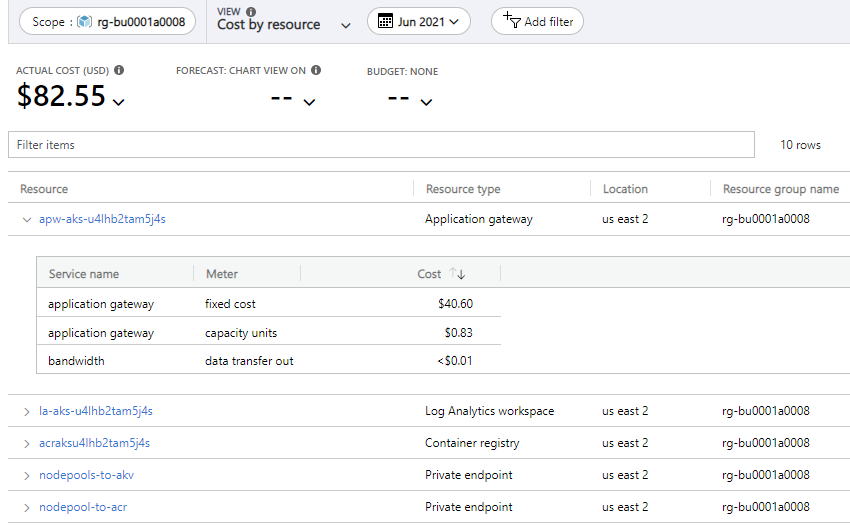

# Azure Well-Architected Framework review of Azure Application Gateway

This article provides architectural best practices for the Azure Application Gateway v2 family of SKUs. The guidance is based on the five pillars of architecture excellence: Cost Optimization, Operational Excellence, Performance Efficiency, Reliability, and Security.

We assume that you have working knowledge of Azure Application Gateway and are well versed with v2 SKU features. As a refresher, review the full set of [Azure Application Gateway features](/azure/application-gateway/features).

## Cost Optimization

Review and apply the [cost principles](/azure/architecture/framework/cost/overview) when making design choices. Here are some best practices.

#### Review Application Gateway pricing

Familiarize yourself with Application Gateway pricing to help you identify the right deployment configuration for your environment. Ensure that the options are adequately sized to meet the capacity demand and deliver expected performance without wasting resources.

For information about Application Gateway pricing, see [Understanding Pricing for Azure Application Gateway and Web Application Firewall](/azure/application-gateway/understanding-pricing).

Use these resources to estimate cost based on units of consumption.

- [Azure Application Gateway pricing](https://azure.microsoft.com/pricing/details/application-gateway/)
- [Pricing calculator](https://azure.microsoft.com/pricing/calculator/)

#### Review underutilized resources

Identify and delete Application Gateway instances with empty backend pools.

#### Stop Application Gateway instances when not in use

You aren't billed when Application Gateway is in the stopped state.

Continuously running Application Gateway instances can incur extraneous costs. Evaluate usage patterns and stop instances when you don't need them. For example, usage after business hours in Dev/Test environments is expected to be low.

See these articles for information about how to stop and start instances.

- [Stop-AzApplicationGateway](/powershell/module/az.network/stop-azapplicationgateway?view=azps-6.0.0&viewFallbackFrom=azps-5.2.0&preserve-view=true)
- [Start-AzApplicationGateway](/powershell/module/az.network/start-azapplicationgateway?view=azps-5.2.0&preserve-view=true)

#### Have a scale-in and scale-out policy

A scale-out policy ensures that there will be enough instances to handle incoming traffic and  spikes. Also, have a scale-in policy that makes sure the number of instances are reduced when demand drops. Consider the choice of instance size. The size can significantly impact the cost. Some considerations are described in the [Estimate the Application Gateway instance count](#estimate-the-application-gateway-instance-count).

For more information, see [Autoscaling and Zone-redundant Application Gateway v2](/azure/application-gateway/application-gateway-autoscaling-zone-redundant#pricing).

#### Review consumption metrics across different parameters

You're billed based on metered instances of Application Gateway based on the metrics tracked by Azure. Here's an example of cost incurred view in [Azure Cost Management + Billing](https://azure.microsoft.com/services/cost-management/).

> The example is based on the current price and is subject to change. This is shown for information purposes only.

Evaluate the various metrics and capacity units and determine the cost drivers.

These are key metrics for Application Gateway. This information can be used to validate that the provisioned instance count matches the amount of incoming traffic.

- **Estimated Billed Capacity Units**
- **Fixed Billable Capacity Units**
- **Current Capacity Units**

For more information, see [Application Gateway metrics](/azure/application-gateway/application-gateway-metrics#application-gateway-metrics).

Make sure you account for bandwidth costs. For details, see [Traffic across billing zones and regions](/azure/architecture/framework/cost/design-regions#traffic-across-billing-zones-and-regions).

## Performance Efficiency

### Take advantage features for autoscaling and performance benefits

The v2 SKU offers autoscaling to ensure that your Application Gateway can scale up as traffic increases. When compared to v1 SKU, v2 has capabilities that enhance the performance of the workload. For example, better TLS offload performance, quicker deployment and update times, zone redundancy, and more. For more information about autoscaling features, see [Autoscaling and Zone-redundant Application Gateway v2](/azure/application-gateway/application-gateway-autoscaling-zone-redundant).

If you are running v1 SKU gateways, consider migrating to v2 SKU. See  
[Migrate Azure Application Gateway and Web Application Firewall from v1 to v2](/azure/application-gateway/migrate-v1-v2).

General best practices related to Performance Efficiency are described in [Performance efficiency principles](/azure/architecture/framework/scalability/principles).

#### Estimate the Application Gateway instance count

Application Gateway v2 scales out based on many aspects, such as CPU, memory, network utilization, and more. To determine the approximate instance count, factor in these metrics:

- **Current compute units**&mdash;Indicates CPU utilization. 1 Application Gateway instance is approximately 10 compute units.
- **Throughput**&mdash;Application Gateway instance can serve 60-75 Mbps of throughput. This data depends on the type of payload.

Consider this equation when calculating instance counts.

After you've estimated the instance count, compare that value to the maximum instance count. This will indicate how close you are to the maximum available capacity.

#### Define the minimum instance count

For Application Gateway v2 SKU, autoscaling takes some time (approximately six to seven minutes) before the additional set of instances is ready to serve traffic. During that time, if there are short spikes in traffic, expect transient latency or loss of traffic.

We recommend that you set your minimum instance count to an optimal level. After you estimate the average instance count and determine your Application Gateway autoscaling trends, define the minimum instance count based on your application patterns. For information, see [Application Gateway high traffic support](/azure/application-gateway/high-traffic-support).

Check the **Current Compute Units** for the past one month. This metric represents the gateway's CPU utilization. To define the minimum instance count, divide the peak usage by 10. For example, if your average **Current Compute Units** in the past month is 50, set the minimum instance count to 5.

#### Define the maximum instance count

We recommend 125 as the maximum autoscale instance count. Make sure the subnet that has the Application Gateway has sufficient available IP addresses to support the scale-up set of instances.

Setting the maximum instance count to 125 has no cost implications because you're billed only for the consumed capacity.

#### Define Application Gateway subnet size

Application Gateway needs a dedicated subnet within a virtual network. The subnet can have multiple instances of the deployed Application Gateway resource. You can also deploy other Application Gateway resources in that subnet, v1 or v2 SKU.

Here are some considerations for defining the subnet size:

- Application Gateway uses one private IP address per instance and another private IP address if a private front-end IP is configured.
- Azure reserves five IP addresses in each subnet for internal use.
- Application Gateway (Standard or WAF SKU) can support up to 32 instances. Taking 32 instance IP addresses + 1 private front-end IP + 5 Azure reserved, a minimum subnet size of /26 is recommended. Because the Standard_v2 or WAF_v2 SKU can support up to 125 instances, using the same calculation, a subnet size of /24 is recommended.
- If you want to deploy additional Application Gateway resources in the same subnet, consider the additional IP addresses that will be required for their maximum instance count for both, Standard and Standard v2.

## Operational Excellence

Monitoring and diagnostics are crucial. Not only can you measure performance statistics but also use metrics troubleshoot and remediate issues quickly.

#### Monitor capacity metrics

Use these metrics as indicators of utilization of the provisioned Application Gateway capacity. We strongly recommend setting up alerts on capacity. For details, see [Application Gateway high traffic support](/azure/application-gateway/high-traffic-support).

|Metric|Description|Use case|
|---|---|---|
|**Current Compute Units**| CPU utilization of virtual machine running Application Gateway. One Application Gateway instance supports 10 Compute Units.|Helps detect issues when more traffic is sent than what Application Gateway instances can handle.|
|**Throughput**|Amount of traffic (in Bps) served by Application Gateway.    |This threshold is dependent on the payload size. For smaller payloads but more frequent connections, expect lower throughput limits and adjust alerts accordingly. |
|**Current Connections**| Active TCP connections on Application Gateway.| Helps detect issues where the connection count increases beyond the capacity of Application gateway. Look for a drop in capacity unit when the connection count increases, look for a simultaneous drop in capacity unit. This will indicate if Application Gateway is out of capacity.|

#### Troubleshoot using metrics

There are other metrics that can indicate issues either at Application Gateway or the backend. We recommend evaluating alerts as per the table below.

|Metric|Description|Use case|
|---|---|---|
|**Unhealthy Host Count** | Number of backends that Application Gateway is unable to probe successfully. |Application Gateway instances are unable to connect to the backend. For example, the  probe interval is 10 seconds and unhealthy host count threshold is 3 failed probes). A backend will turn unhealthy if Application Gateway instance isn't able to reach it for 30 seconds. Also depends on the configured timeout and interval in the custom probe. |
|**Response Status** (dimension 4xx and 5xx)| The HTTP response status returned to clients from Application Gateway. This status is usually same as the **Backend Response Status**, unless Application Gateway is unable to get a response from the backend or Application Gateway has an internal error in serving responses.|Issues with Application Gateway or the backend. Use this metric with **Backend Response Status** to identify whether Application Gateway or the backend is failing to serve requests.|
|**Backend Response Status** (dimension 4xx and 5xx)|The HTTP response status returned to Application Gateway from the backend. | Use to validate if the backend is successfully receiving requests and serving responses.|
|**Backend Last Byte Response Time**|Time interval between the start of a connection to backend server and receiving the last byte of the response body.| Increase in this latency implies that the backend is getting loaded and is taking longer to respond to requests. One way to resolve this issue is to scale up the backend.|
|**Application Gateway Total Time**|Time period from when Application Gateway receives the first byte of the HTTP request to when the last response byte has been sent to the client. This includes client RTT| Increase in this latency, without any accompanying application changes or access traffic pattern changes should be investigated. If this metric increases, monitor other the metrics and determine if they other metrics are also increasing, such as compute units, total throughput, or total request count.|

#### Enable diagnostics on Application Gateway and web application firewall (WAF)

Diagnostic logs allow you to view firewall logs, performance logs, and access logs. Use these logs to manage and troubleshoot issues with Application Gateway instances.

#### Use Azure Monitor Network Insights

Azure Monitor Network Insights provides a comprehensive view of health and metrics for network resources, including Application Gateway. For additional details and supported capabilities for Application Gateway, see [Azure Monitor Network insights](/azure/azure-monitor/insights/network-insights-overview).

#### Use advanced monitoring metrics

Consider monitoring and setting alerts on metrics such as **Unhealthy host count**, and metrics that indicate the latency and the number of connections and requests. Notice the difference between connections and requests for Application Gateway frontend connections. One connection represents the TCP connection (sockets pair), while a request represents a resource request, that is a GET, PUT, POST, and so on. One connection can serve multiple requests (on Application Gateway v2, up to 100).

#### SNAT port limitations

SNAT port limitations are important for backend connections on the Application Gateway. There are separate factors that affect how Application Gateway reaches the SNAT port limit. For example, if the backend is a public IP, it will require its own SNAT port. In order to avoid SNAT port limitations, you can increase the number of instances per Application Gateway, scale out the backends to have more IPs, or move your backends into the same virtual network and use private IP addresses for the backends.

#### Requests per second (RPS) considerations

Requests per second (RPS) on the Application Gateway will be affected if the SNAT port limit is reached. For example, if Application Gateway has reached the SNAT port limit, then Application Gateway won't be able to open a new connection to the backend and the request will fail.

#### Match timeout settings with the backend application

Ensure you have configured the **IdleTimeout** settings to match the listener and traffic characteristics of the backend application. The default value is set to 4 minutes and can be configured to a maximum of 30. For more information, see [Load Balancer TCP Reset and Idle Timeout](/azure/load-balancer/load-balancer-tcp-reset).

For workload considerations, see [Application Monitoring](/azure/architecture/framework/devops/monitoring#application-monitoring).

#### Monitoring Key Vault configuration issues through Azure Advisor

Azure Application Gateway checks for the renewed certificate version in the linked Key Vault at every 4-hour interval. If it is inaccessible due to any incorrectly modified Key Vault configurations, it logs that error and pushes a corresponding Advisor recommendation. You must configure Advisor alert to stay updated and fix such issues immediately to avoid any Control or Data plane related problems. To set an alert for this specific case, use the Recommendation Type as "Resolve Azure Key Vault issue for your Application Gateway".

## Reliability

Here are some best practices to minimize failed instances.

In addition, we recommend that you review the [Principles of the reliability pillar](/azure/architecture/framework/resiliency/principles).

#### Plan for rule updates

Plan enough time for updates before accessing Application Gateway or making further changes. For example, removing servers from backend pool might take some time because they have to drain existing connections.

#### Use health probes to detect backend unavailability

If Application Gateway is used to load balance incoming traffic over multiple backend instances, we recommend the use of health probes. These will ensure that traffic is not routed to backends that are unable to handle the traffic.

#### Review the impact of the interval and threshold settings on health probes

The health probe sends requests to the configured endpoint at a set *interval*. Also, there's a *threshold* of failed requests that will be tolerated before the backend is marked unhealthy. These numbers present a trade-off.

- Setting a higher interval puts a higher load on your service. Each Application Gateway instance sends its own health probes, so 100 instances every 30 seconds means 100 requests per 30 seconds.
- Setting a lower interval leaves more time before an outage is detected.
- Setting a low unhealthy threshold may mean that short, transient failures may take down a backend.
- Setting a high threshold it can take longer to take a backend out of rotation.

#### Verify downstream dependencies through health endpoints

Suppose each backend has its own dependencies to ensure failures are isolated. For example, an application hosted behind Application Gateway may have multiple backends, each connected to a different database (replica). When such a dependency fails, the application may be working but won't return valid results. For that reason, the health endpoint should ideally validate all dependencies. Keep in mind that if each call to the health endpoint has a direct dependency call, that database would receive 100 queries every 30 seconds instead of 1. To avoid this, the health endpoint should cache the state of the dependencies for a short period of time.

For more information, see these articles:

- [Health monitoring overview for Azure Application Gateway](/azure/application-gateway/application-gateway-probe-overview)
- [Azure Front Door - backend health monitoring](/azure/frontdoor/front-door-health-probes)
- [Health probes to scale and provide HA for your service](/azure/load-balancer/load-balancer-custom-probe-overview)

## Security

Security is one of the most important aspects of any architecture. Application Gateway provides features to employ both the principle of least privilege and defense-in-defense. We recommend you also review the [Security design principles](/azure/architecture/framework/security/security-principles).

#### Restrictions of Network Security Groups (NSGs)

NSGs are supported on Application Gateway, but there are some restrictions. For instance, some communication with certain port ranges is prohibited. Make sure you understand the implications of those restrictions. For details, see [Network security groups](/azure/application-gateway/configuration-infrastructure#network-security-groups).

#### User Defined Routes (UDR)-supported scenarios

Using User Defined Routes (UDR) on the Application Gateway subnet cause some issues. [Health status in the back-end](/azure/application-gateway/application-gateway-diagnostics#back-end-health) might be unknown. Application Gateway logs and metrics might not get generated. We recommend that you don't use UDRs on the Application Gateway subnet so that you can view the back-end health, logs, and metrics. If your organizations require to use UDR in the Application Gateway subnet, please ensure you review the supported scenarios. For details, see [Supported user-defined routes](/azure/application-gateway/configuration-infrastructure#supported-user-defined-routes).

#### DNS lookups on App Gateway subnet

When the backend pool contains a resolvable FQDN, the DNS resolution is based on a private DNS zone or custom DNS server (if configured on the VNet), or it uses the default Azure-provided DNS.

#### Set up a TLS policy for enhanced security

Set up a [TLS policy](/azure/application-gateway/application-gateway-ssl-policy-overview#appgwsslpolicy20170401s) for extra security. Ensure you're using the latest TLS policy version (AppGwSslPolicy20170401S). This enforces TLS 1.2 and stronger ciphers.

#### Use AppGateway for TLS termination

There are advantages of using Application Gateway for TLS termination:

- Performance improves because requests going to different backends to have to re-authenticate to each backend.
- Better utilization of backend servers because they don't have to perform TLS processing
- Intelligent routing by accessing the request content.
- Easier certificate management because the certificate only needs to be installed on Application Gateway.

#### Encrypting considerations

When re-encrypting backend traffic, ensure the backend server certificate contains both the root and intermediate Certificate Authorities (CAs). A TLS certificate of the backend server must be issued by a well-known CA. If the certificate was not issued by a trusted CA, the Application Gateway checks if the certificate of the issuing CA was issued by a trusted CA, and so on until either a trusted CA is found. Only then a secure connection is established. Otherwise, Application Gateway marks the backend as unhealthy.

#### Azure Key Vault for storing TLS certificates

[Application Gateway is integrated with Key Vault](/azure/application-gateway/key-vault-certs). This provides stronger security, easier separation of roles and responsibilities, support for managed certificates, and an easier certificate renewal and rotation process.

#### Enabling the Web Application Firewall (WAF)

When WAF is enabled, every request must be buffered by the Application Gateway until it fully arrives and check if the request matches with any rule violation in its core rule set and then forward the packet to the backend instances. For large file uploads (30MB+ in size), this can result in a significant latency. Because Application Gateway capacity requirements are different with WAF, we do not recommend enabling WAF on Application Gateway without proper testing and validation.

## Next steps

[Microsoft Azure Well-Architected Framework](/azure/architecture/framework/index)
