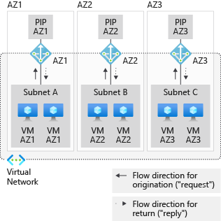
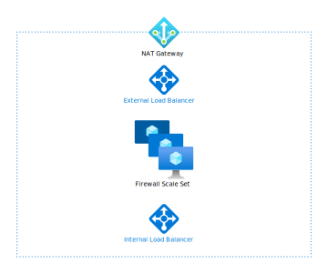

This article provides best practices for an Azure NAT gateway. The guidance is based on the five pillars of architecture excellence: Cost Optimization, Operational Excellence, Performance Efficiency, Reliability, and Security.

We assume that you have a working knowledge of Azure NAT Gateway) and that you are well-versed with the respective features. As a refresher, review the full set of [Azure NAT Gateway](/azure/virtual-network/nat-gateway) documentation.

NAT stands for *network address translation*. See [An introduction to Network Address Translation](/azure/rtos/netx-duo/netx-duo-nat/chapter1).

## Cost optimization

Access to PaaS services should be through Azure Private Link or service endpoints (including storage), to avoid using a NAT gateway. Private Link and service endpoints do not require traversal of the NAT gateway to access PaaS services. This approach will reduce the charge per GB of data processed, when comparing the costs of a NAT gateway to Private Link or to service endpoints. There are additional security benefits for using Private Link or service endpoints.

## Performance efficiency

Each NAT gateway resource provides up to 50 Gbps of throughput. You can split your deployments into multiple subnets, and then you can assign each subnet or groups of subnets a NAT gateway to scale out.

Each NAT gateway public IP address provides 64,512 SNAT ports. Up to 16 IP addresses can be assigned to a NAT gateway. The IP addresses can be individual Standard Public IP addresses, the Public IP prefix, or both. For connections going to the same destination endpoint, NAT gateway can support up to 50,000 concurrent flows for TCP and UDP respectively, per assigned outbound IP address. Review the following section on Source Network Address Translation (SNAT) for details. TCP stands for *Transmission Control Protocol*, and UDP stands for *User Datagram Protocol*.

### SNAT exhaustion

- NAT gateway resources have a default TCP idle timeout of 4 minutes that can be configured up to 120 minutes. If this setting is changed to a higher value than the default, NAT gateway will hold on to flows longer and can cause unnecessary pressure on SNAT port inventory.
- Atomic requests (one request per connection) are a poor design choice, because it limits scale, reduces performance, and reduces reliability. Instead, reuse HTTP/S connections, to reduce the numbers of connections and associated SNAT ports. Connection reuse will better allow the application to scale. Application performance will improve, due to reduced handshakes, overhead, and cryptographic operation costs when using TLS.
- DNS can introduce many individual flows at volume, when the client isn't caching the DNS resolvers result. Use DNS caching to reduce the volume of flows and reduce the number of SNAT ports. DNS typically stands for *Domain Name System*, the naming system for the resources that are connected to the Internet or to a private network.
- UDP flows, such as DNS lookups, use SNAT ports during the idle timeout. The UDP idle timeout timer is fixed at 4 minutes and cannot be changed.
- Use connection pools to shape your connection volume.
- Never silently abandon a TCP flow and rely on TCP timers to clean up flow. If you don't let TCP explicitly close the connection, the TCP connection remains open. Intermediate systems and endpoints will keep this connection in use, which in turn makes the SNAT port unavailable for other connections. This anti-pattern can trigger application failures and SNAT exhaustion.
- Don't change OS-level TCP-close related timer values, without expert knowledge of the implications. While the TCP stack will recover, your application performance can be negatively affected when the endpoints of a connection have mismatched expectations. Changing timer values is usually a sign of an underlying design problem. If the underlying application has other anti-patterns, SNAT exhaustion can also be amplified if the timer values are altered.

Review the following guidance to improve the scale and reliability of your service:

- Explore the effect of reducing the TCP idle timeout to lower values. A default idle timeout of 4 minutes can free up SNAT port inventory earlier.
- Consider asynchronous polling patterns for long-running operations, to free up your connection resources for other operations.
- Long-lived flows, such as reused TCP connections, should use TCP keepalives or application-layer keepalives to avoid intermediate systems timing out. You should only increase the idle timeout as a last resort, and it might not resolve the root cause. A long timeout can cause low rate failures, when the timeout expires, and it can introduce a delay and unnecessary failures. TCP keepalives can be enabled from one side of the connection in order to keep a connection alive from both sides.
- For long lived flows with UDP traffic, you can enable UDP keepalives to keep connections alive. Keep in mind that UDP keepalives enabled on one side of the connection only keep the connection active from one side. UDP keepalives must be enabled on both sides of a connection in order to keep a connection alive.
- Graceful retry patterns should be used to avoid aggressive retries/bursts during transient failure or failure recovery. An antipattern, called *atomic connections*, is when you create a new TCP connection for every HTTP operation. Atomic connections will prevent your application from scaling well and will waste resources. Always pipeline multiple operations into the same connection. Your application will benefit in transaction speed and resource costs. When your application uses transport layer encryption (for example, TLS), there's a significant cost associated with the processing of new connections. See [Azure Cloud Design Patterns](/azure/architecture/patterns) for more best-practice patterns.

## Operational excellence

Although NAT gateway can be used with Azure Kubernetes Service (AKS), it isn't managed as part of AKS. If you assign a NAT gateway to the CNI subnet, you will enable AKS pods to egress through the NAT gateway.

When using multiple NAT gateways across zones or across regions, keep the outbound IP estate manageable by using Azure Public IP prefixes or BYOIP prefixes. An IP prefix size that is larger than 16 IP addresses (/28 prefix size) cannot be assigned to NAT gateway. 

Use Azure Monitor alerts to monitor and alert on SNAT port usage, packets processed or dropped, and amount of data transmitted. Use NSG flow logs to monitor outbound traffic flow from virtual machine instances in a NAT gateway configured subnet.

When a subnet is configured with a NAT gateway, the NAT gateway will replace all other outbound connectivity to the public Internet for all the VMs on that subnet. NAT gateway will take precedence over a load balancer with or without outbound rules, and over public IP addresses assigned directly to VMs. Azure tracks the direction of a flow, and asymmetric routing will not occur. Inbound originated traffic will be translated correctly, such as a load balancer frontend IP, and it will be translated separately from outbound originated traffic through a NAT gateway. This separation allows inbound and outbound services to coexist seamlessly.

NAT gateway is recommended as the default for enabling outbound connectivity for virtual networks. NAT gateway is more efficient and less operationally complex than other outbound connectivity techniques in Azure. NAT gateways allocate SNAT ports on-demand and use a more efficient algorithm to prevent SNAT port reuse conflicts. Don't rely on *default outbound connectivity* (an anti-pattern) for your estate. Instead, explicitly define it with NAT gateway resources.

## Reliability

NAT gateway resources are highly available in one availability zone and span multiple fault domains. NAT gateway can be deployed to "no zone" in which Azure automatically selects a zone to place NAT gateway. NAT gateway can also be isolated to a specific zone by a user.

Availability zone isolation cannot be provided, unless each subnet only has resources within a specific zone. Instead, deploy a subnet for each of the availability zones where VMs are deployed, align the zonal VMs with matching zonal NAT gateways, and build separate zonal stacks.  For example, a virtual machine in availability zone 1 is on a subnet with other resources that are also only in availability zone 1. A NAT gateway is configured in availability zone 1 to serve that subnet. See the following diagram.

Virtual networks and subnets [span all availability zones in a region](/azure/virtual-network/virtual-networks-overview#virtual-networks-and-availability-zone). You don't need to divide them by availability zones to accommodate zonal resources.

## Security

With NAT gateway, individual virtual machines (or other compute resources) don't need public IP addresses and can remain fully private. Resources without a public IP address can still reach external sources outside the virtual network. You can associate a public IP prefix to ensure that a contiguous set of IPs will be used for outbound. Destination firewall rules can be configured based on this predictable IP list.

A common approach is to design an outbound-only network virtual appliance (NVA) scenario with third-party firewalls or with proxy servers. When a NAT gateway is deployed to a subnet with a virtual machine scale set of NVAs, those NVAs will use the NAT gateway address(es) for outbound connectivity, as opposed to the IP of a load balancer or the individual IPs. To employ this scenario with Azure Firewall, see [Integrate Azure Firewall with Azure Standard Load Balancer](/azure/firewall/integrate-lb).

Microsoft Defender for Cloud can monitor for any suspicious outbound connectivity through a NAT gateway. This is an alert feature in [Microsoft Defender for Cloud](/azure/security-center).

## Contributors

*This article is maintained by Microsoft. It was originally written by the following contributors.* 

Principal author:

 - [Ethan Haslett](https://www.linkedin.com/in/ethan-haslett-1502841/) | Senior Cloud Solution Architect
 
*To see non-public LinkedIn profiles, sign in to LinkedIn.*

## Next steps

- [Microsoft Well-Architected Framework](/azure/architecture/framework)
- [Tutorial: Create a NAT gateway using the Azure portal](/azure/virtual-network/nat-gateway/quickstart-create-nat-gateway-portal)

## Related resources

- [Azure Firewall architecture overview](/azure/architecture/example-scenario/firewalls)
- [Firewall and Application Gateway for virtual networks](/azure/architecture/example-scenario/gateway/firewall-application-gateway)
- [Multi-region load balancing with Traffic Manager and Application Gateway](/azure/architecture/high-availability/reference-architecture-traffic-manager-application-gateway)
- [Building solutions for high availability using availability zones](/azure/architecture/high-availability/building-solutions-for-high-availability)
