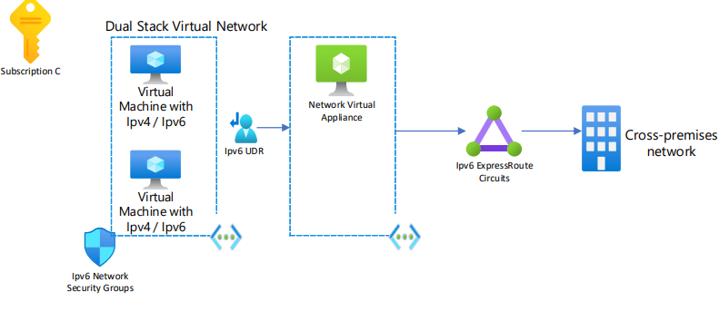

# Overview

IPv6 is part of Microsoft's Promise, a commitment we uphold to our customers. This Promise outlines the expected behaviors and capabilities of our cloud platforms. It signifies our top-level commitment and mirrors the key developments across our platform.

This reference architecture showcases an IPv6 hub-spoke network pattern with customer-managed hub infrastructure components. 
For a Hub-Spoke topology that doesn't use IPv6, see [Hub-spoke network topology in Azure](/azure/architecture/reference-architectures\hybrid-networking\hub-spoke-content).
For a Microsoft-managed hub infrastructure solution, see [Hub-spoke network topology with Azure Virtual WAN](/azure/architecture/networking/hub-spoke-vwan-architecture).

## Architecture

*Download a [Visio file](https://arch-center.azureedge.net/hub-spoke-network-topology-architecture.vsdx) of this architecture.*

## Azure Approach to IPv6

During Phase 1, Azure employs a Dual Stack approach, but plans to transition to an IPv6-Only model as the platform services mature.

## Scenario 1: Subscription A

### Hub and Spoke

This reference architecture implements a hub-spoke network pattern where the hub virtual network acts as a central point of connectivity to many spoke virtual networks. The spoke virtual networks connect with the hub and can be used to isolate workloads. The components required to enable IPv6 have been included. These components are User Defined Routes that must be set per subnet and optional Load Balancers.  You can also enable cross-premises scenarios by using the hub to connect to on-premises networks. 

### Connectivity Components

The components used in the scenario are:

- [Azure Virtual Network](https://azure.microsoft.com/products/virtual-network)
- [Network Interface](https://learn.microsoft.com/en-us/azure/virtual-network/virtual-network-network-interface?tabs=azure-portal)
- [Azure VPN Gateway](https://learn.microsoft.com/en-us/azure/vpn-gateway/vpn-gateway-about-vpngateways)
- [Azure Firewall](https://learn.microsoft.com/en-us/azure/firewall/overview)
- [Azure Bastion](https://learn.microsoft.com/en-us/azure/bastion/bastion-overview)
- [Route Table](https://learn.microsoft.com/en-us/azure/virtual-network/manage-route-table)
- [Load Balancer](https://azure.microsoft.com/en-us/products/load-balancer/)
- [Network Security Group](https://learn.microsoft.com/en-us/azure/virtual-network/network-security-groups-overview)
- [Virtual Machines](https://azure.microsoft.com/en-us/products/virtual-machines/)
- [Azure Monitor](https://learn.microsoft.com/en-us/azure/azure-monitor/overview)
- [Azure Subscription](https://learn.microsoft.com/en-us/azure/cloud-adoption-framework/ready/azure-best-practices/organize-subscriptions)

### Example

## Scenario 2: Subscription B

### Internet Connectivity

This diagram presents a view of internet connectivity via IPv6. It showcases the connectivity from the Internet whether it be a client or a browser that enters the Virtual Network by passing through an Azure Front Door. The subnets where the Virtual Machines are, have to be configured to be Dual Stack. To learn how to enable Dual-Stack to existing Virtual Machines and Virtual Networks see [Add a dual-stack network to an existing virtual machine using Azure PowerShell](https://learn.microsoft.com/en-us/azure/virtual-network/ip-services/add-dual-stack-ipv6-vm-powershell)

### Connectivity Components
The components used in the scenario are:
- [Azure Virtual Network](https://azure.microsoft.com/products/virtual-network)
- [Network Interface](https://learn.microsoft.com/en-us/azure/virtual-network/virtual-network-network-interface?tabs=azure-portal)
- [Route Table](https://learn.microsoft.com/en-us/azure/virtual-network/manage-route-table)
- [Load Balancer](https://azure.microsoft.com/en-us/products/load-balancer/)
- [Network Security Group](https://learn.microsoft.com/en-us/azure/virtual-network/network-security-groups-overview)
- [Virtual Machines](https://azure.microsoft.com/en-us/products/virtual-machines/)
- [Azure Subscription](https://learn.microsoft.com/en-us/azure/cloud-adoption-framework/ready/azure-best-practices/organize-subscriptions)

### Example

## Scenario 3: Subscription C

### Private Connectivity

This diagram offers a detailed illustration of establishing private network connectivity utilizing the capabilities of IPv6. It provides a visual representation of the secure and efficient linkage between private networks and external systems using IPv6. Key elements such as IPv6's unique addressing scheme, security protocols, and routing strategies are depicted to enhance understanding of private network configurations in a modern, IPv6-enabled environment.

### Connectivity Components

The components used in the scenario are:
- [ExpressRoute](https://azure.microsoft.com/products/expressroute/)
- [Azure Virtual Network](https://azure.microsoft.com/products/virtual-network)
- [Network Interface](https://learn.microsoft.com/en-us/azure/virtual-network/virtual-network-network-interface?tabs=azure-portal)
- [Azure VPN Gateway](https://learn.microsoft.com/en-us/azure/vpn-gateway/vpn-gateway-about-vpngateways)
- [Route Table](https://learn.microsoft.com/en-us/azure/virtual-network/manage-route-table)
- [Load Balancer](https://azure.microsoft.com/en-us/products/load-balancer/)
- [Virtual Machines](https://azure.microsoft.com/en-us/products/virtual-machines/)
- [Azure Subscription](https://learn.microsoft.com/en-us/azure/cloud-adoption-framework/ready/azure-best-practices/organize-subscriptions)

### Example

## Deploy an Example IPv6 Scenario

This reference architecture implements a Virtual Machine in a Virtual Network behind a Load Balancer to showcase how IPv6 can be used. 
The architecture described can be used with an existing Hub and Spoke implementation and more scenarios are added as they become available.

For more information, see [Hub-and-spoke network topology](/azure/cloud-adoption-framework/ready/azure-best-practices/hub-spoke-network-topology).

### Components

- [Azure Virtual Network](https://azure.microsoft.com/products/virtual-network) is the fundamental building block for private networks in Azure. Virtual Network enables many Azure resources, such as Azure VMs, to securely communicate with each other, cross-premises networks, and the internet.
- [Public IP Address](https://learn.microsoft.com/en-us/azure/virtual-network/ip-services/public-ip-addresses) is used respectively for incoming IPv4 and IPv6 connectivity to the Load Balancer. 
- [Load Balancer](https://azure.microsoft.com/en-us/products/load-balancer/) is used to send the incoming traffic to the backend Virtual Machines. 
- [Route Table](https://learn.microsoft.com/en-us/azure/virtual-network/manage-route-table) A Route Table in Azure is a set of user-defined routes that allow for custom path definitions for network traffic. Each route in the table specifies a destination CIDR block and the next hop, which could be a virtual appliance, a virtual network gateway, a network interface, or a peering.
- [Network Security Group](https://learn.microsoft.com/en-us/azure/virtual-network/network-security-groups-overview) is configured to accept or reject certain IPv6 ranges. A Network Security Group (NSG) in Azure is a feature that provides security for virtual networks by filtering and analyzing inbound and outbound traffic. NSGs contain a list of Access Control List (ACL) rules that allow or deny network traffic to your resources based on source and destination IP address, port, and protocol
- [Virtual Machines](https://azure.microsoft.com/en-us/products/virtual-machines/) is configured to receive IPv4 and IPv6 traffic. 

## Deploy the sample architecture

#### [Azure portal](#tab/portal)

Select the following button to deploy the reference architecture as an Azure Resource Manager (ARM) template in the Azure portal:

---

For detailed information and extra deployment options, see the [Hub and Spoke ARM and Bicep templates](/samples/mspnp/samples/hub-and-spoke-deployment-with-connected-groups/) that deploy this solution.

## IPv6 Generally Available and Ready

The below services are generally available for use with IPv6 in Azure:
- [Virtual Machines](https://azure.microsoft.com/services/virtual-machines)
- [Virtual Machine Scale Set](https://azure.microsoft.com/products/virtual-machine-scale-sets/)
- [Kubernetes Service](https://azure.microsoft.com/products/kubernetes-service/)
- [Azure Service Fabric](https://azure.microsoft.com/products/service-fabric/)
- [Azure Data Explorer (Kusto)](https://azure.microsoft.com/products/data-explorer/)
- [App Service Static Web Apps](https://azure.microsoft.com/products/app-service/static/)
- [Azure Media Services](https://azure.microsoft.com/products/media-services/)
- [Virtual Network](https://azure.microsoft.com/services/virtual-network)
- [Azure Load Balancer](https://azure.microsoft.com/solutions/load-balancing-with-azure/)
- [ExpressRoute](https://azure.microsoft.com/products/expressroute/)
- [Azure DNS Public Zones](https://azure.microsoft.com/products/dns/)
- [Azure Front Door](https://azure.microsoft.com/products/frontdoor/)
- [Azure CNI overlay for AKS](https://azure.microsoft.com/en-us/updates/public-preview-dualstack-networking-in-azure-cni-overlay-for-aks/)

## Contributors

*Microsoft maintains this article. The following contributors wrote it.*

Principal author:

- [Werner Rall](https://www.linkedin.com/in/werner-rall/) | Senior Cloud Solutions Architect Engineer

Other contributors:

- [Brandon Stephenson](https://www.linkedin.com/in/brandon-stephenson-3340219b/) | Senior Customer Engineer
- [Sherri Babylon](https://www.linkedin.com/in/sbabylon/) | Senior Technical Program Manager
- [Dawn Bedard](https://www.linkedin.com/in/dawnbedard/) | Principal Technical Program Manager

*To see nonpublic LinkedIn profiles, sign in to LinkedIn.*

## Next steps

- Learn more about [Create a VM with IPv6 Dual Stack](https://learn.microsoft.com/azure/virtual-network/ip-services/create-vm-dual-stack-ipv6-portal)
- Learn more about [managing IP Address ranges](/azure/virtual-network/manage-virtual-network#add-or-remove-an-address-range) on Virtual Networks.

## Related resources

Read more about IPv6:

- [Azure Public IPv6 offerings are free](https://azure.microsoft.com/updates/azure-public-ipv6-offerings-are-free-as-of-july-31)
- [Azure Virtual Networking IPv6](https://learn.microsoft.com/azure/virtual-network/ip-services/ipv6-overview)
- [ExpressRoute Support for IPv6](https://docs.microsoft.com/azure/expressroute/expressroute-howto-add-ipv6-portal)
- [Azure DNS IPv6 support](https://learn.microsoft.com/azure/dns/dns-reverse-dns-overview)
- [Azure Load Balancer IPv6 Support](https://learn.microsoft.com/azure/load-balancer/load-balancer-ipv6-overview)

Read more about virtual network architecture:

- [Choose between virtual network peering and VPN gateways](/azure/architecture/reference-architectures/hybrid-networking/vnet-peering)
- [Firewall and Application Gateway for virtual networks](/azure/architecture/example-scenario/gateway/firewall-application-gateway)
- [Virtual network integrated serverless microservices](/azure/architecture/example-scenario/integrated-multiservices/virtual-network-integration)
- [Deploy AD DS in an Azure virtual network](/azure/architecture/reference-architectures/identity/adds-extend-domain)
