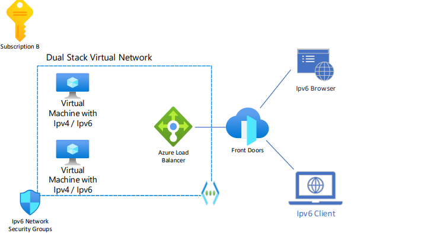

# Overview

IPv6 is part of Microsoft's Promise, a commitment we uphold to our customers. This Promise outlines the expected behaviors and capabilities of our cloud platforms. It signifies our top-level commitment and mirrors the key developments across our platform.

This reference architecture showcases an IPv6 hub-spoke network pattern with customer-managed hub infrastructure components. 
For a Hub-Spoke topology that doesn't use IPv6, see [Hub-spoke network topology in Azure](/azure/architecture/reference-architectures\hybrid-networking\hub-spoke-content).
For a Microsoft-managed hub infrastructure solution, see [Hub-spoke network topology with Azure Virtual WAN](/azure/architecture/networking/hub-spoke-vwan-architecture).

## Architecture

*Download a [Visio file](https://arch-center.azureedge.net/hub-spoke-network-topology-architecture.vsdx) of this architecture.*

### Worklow

This hub-spoke network configuration with dual stack uses the following architectural elements:

- **Hub virtual network.** The hub virtual network hosts shared Azure services. Workloads hosted in the spoke virtual networks can use these services. The hub virtual network is the central point of connectivity for cross-premises networks. 

- **Spoke virtual networks.** Spoke virtual networks isolate and manage workloads separately in each spoke. Each workload can include multiple tiers, with multiple subnets connected through Azure load balancers. Spokes can exist in different subscriptions and represent different environments, such as Production and Non-production.

- **Virtual network connectivity.** This architecture connects virtual networks by using [peering connections](/azure/virtual-network/virtual-network-peering-overview) or [connected groups](/azure/virtual-network-manager/concept-connectivity-configuration). Peering connections and connected groups are non-transitive, low-latency connections between virtual networks. Peered or connected virtual networks can exchange traffic over the Azure backbone without needing a router. [Azure Virtual Network Manager](/azure/virtual-network-manager/overview) creates and manages [network groups](/azure/virtual-network-manager/concept-network-groups) and their connections.

- **Azure Bastion host.** Azure Bastion provides secure connectivity from the Azure portal to virtual machines (VMs) by using your browser. An Azure Bastion host deployed inside an Azure virtual network can access VMs in that virtual network or in connected virtual networks.

- **Azure Firewall.** An Azure Firewall managed firewall instance exists in its own subnet. 

- **Azure VPN Gateway or Azure ExpressRoute gateway.** A virtual network gateway enables a virtual network to connect to a virtual private network (VPN) device or Azure ExpressRoute circuit. The gateway provides cross-premises network connectivity. For more information, see [Connect an on-premises network to a Microsoft Azure virtual network](/microsoft-365/enterprise/connect-an-on-premises-network-to-a-microsoft-azure-virtual-network?view=o365-worldwide) and [Extend an on-premises network using VPN](/azure/expressroute/expressroute-howto-coexist-resource-manager). To use IPv6 in Azure route table, you need to create or modify an ExpressRoute circuit and enable IPv6 Private Peering. You can either add IPv6 Private Peering to your existing IPv4 Private Peering configuration by selecting "Both" for Subnets, or only use IPv6 Private Peering by selecting "IPv6". You also need to provide a pair of /126 IPv6 subnets that you own for your primary and secondary links.

- **VPN device.** A VPN device or service provides external connectivity to the cross-premises network. The VPN device can be a hardware device or a software solution such as the Routing and Remote Access Service (RRAS) in Windows Server. For more information, see [Validated VPN devices and device configuration guides](/azure/vpn-gateway/vpn-gateway-about-vpn-devices#devicetable).

- **Load Balancer.** Load Balancers allow you to share traffic between multiple machines that have the same purpose. In this scenario the Load Balancers are used to allow traffic to be distributed between multiple subnets that have been configured in Dual Stack to support IPv6. Optional IPv6 health probe to determine which backend pool instances are health and thus can receive new flows. Optional IPv6 ports can be reused on backend instances using the Floating IP feature of load-balancing rules. Also see, [Deploy an IPv6 dual stack application using Standard Internal Load Balancer in Azure using PowerShell
](/azure/load-balancer/ipv6-dual-stack-standard-internal-load-balancer-powershell)

- **Route Tables.** Azure automatically creates system routes and assigns the routes to each subnet in a virtual network. You can't create system routes, nor can you remove system routes, but you can override some system routes with custom routes. You create custom routes by either creating user-defined routes, or by exchanging border gateway protocol (BGP) routes between your on-premises network gateway and an Azure virtual network gateway. You can create custom, or user-defined(static), routes in Azure to override Azure's default system routes, or to add more routes to a subnet's route table. In Azure, you create a route table, then associate the route table to zero or more virtual network subnets. Each subnet can have zero or one route table associated to it. Azure's original IPv6 connectivity makes it easy to provide dual stack (IPv4/IPv6) Internet connectivity for applications hosted in Azure. It allows for simple deployment of VMs with load balanced IPv6 connectivity for both inbound and outbound initiated connections. This feature is still available and more information is available here. IPv6 for Azure virtual network is much more full featured- enabling full IPv6 solution architectures to be deployed in Azure, see [What is IPv6 for Azure Virtual Network](/azure/virtual-network/ip-services/ipv6-overview)

- **Virtual Machines** Linux and Windows Virtual Machines can all use IPv6 for Azure Virtual Network, see [Add IPv6 configuration to virtual machine](/azure/virtual-network/ip-services/add-dual-stack-ipv6-vm-portal#add-ipv6-configuration-to-virtual-machine)

### Components

- [Azure Virtual Network](/products/virtual-network) is the fundamental building block for private networks in Azure. Virtual Network enables many Azure resources, such as Azure VMs, to securely communicate with each other, cross-premises networks, and the internet.
- [Public IP Address](/azure/virtual-network/ip-services/public-ip-addresses) is used respectively for incoming IPv4 and IPv6 connectivity to the Load Balancer. 
- [Load Balancer](/products/load-balancer/) is used to send the incoming traffic to the backend Virtual Machines. 
- [Route Table](/azure/virtual-network/manage-route-table) A Route Table in Azure is a set of user-defined routes that allow for custom path definitions for network traffic. Each route in the table specifies a destination CIDR block and the next hop, which could be a virtual appliance, a virtual network gateway, a network interface, or a peering.
- [Network Security Group](/azure/virtual-network/network-security-groups-overview) is configured to accept or reject certain IPv6 ranges. A Network Security Group (NSG) in Azure is a feature that provides security for virtual networks by filtering and analyzing inbound and outbound traffic. NSGs contain a list of Access Control List (ACL) rules that allow or deny network traffic to your resources based on source and destination IP address, port, and protocol
- [Virtual Machines](/products/virtual-machines/) is configured to receive IPv4 and IPv6 traffic. 
- [ExpressRoute](/products/expressroute/) ExpressRoute lets you extend your on-premises networks into the Microsoft cloud over a private connection with the help of a connectivity provider. With ExpressRoute, you can establish connections to Microsoft cloud services, such as Microsoft Azure and Microsoft 365. 
- [Network Interface](/azure/virtual-network/virtual-network-network-interface) Network Interfaces are required for Virtual Machine communication. Virtual Machines and other resources can be set up to have multiple network interfaces. This allows for Dual Stack (IPv4 and IPv6) configurations to be created. 
- [Azure VPN Gateway](/azure/vpn-gateway/vpn-gateway-about-vpngateways) Azure VPN Gateway is a service that uses a specific type of virtual network gateway to send encrypted traffic between an Azure virtual network and on-premises locations over the public Internet
- [Azure Subscription](/azure/cloud-adoption-framework/ready/azure-best-practices/organize-subscriptions) A logical container for your resources. Each Azure resource is associated with only one subscription. Creating a subscription is the first step in adopting Azure.
- [Azure Firewall](/azure/firewall/overview) Azure Firewall is a managed, cloud-based network security service that protects your Azure Virtual Network resources
- [Azure Bastion](/azure/bastion/bastion-overview) Azure Bastion is a fully managed Platform-as-a-Service (PaaS) offering provided and maintained by Microsoft. It is designed to provide secure and seamless Remote Desktop Protocol (RDP) and Secure Shell Protocol (SSH) access to virtual machines (VMs) without any exposure through public IP addresses.
- [Azure Monitor](/azure/azure-monitor/overview) Azure Monitor is a comprehensive monitoring solution for collecting, analyzing, and responding to monitoring data from your cloud and on-premises environments. You can use Azure Monitor to maximize the availability and performance of your applications and services.

### Alternatives

Instead of connecting to the cloud environment via a VPN Gateway or Express Route, you can also use Azure Front Door to connect over the internet. You can use a client or a browser that enters the Virtual Network by passing through an Azure Front Door. 

The Azure Front Door natively supports end-to-end IPv6 connectivity and the HTTP/2 protocol. Currently, HTTP/2 support is active for all Azure Front Door configurations. No further action is required from customers, see [HTTP/2 support in Azure Front Door](/azure/frontdoor/front-door-http2)

The subnets where the Virtual Machines are, have to be configured to be Dual Stack. To learn how to enable Dual-Stack to existing Virtual Machines and Virtual Networks see [Add a dual-stack network to an existing virtual machine using Azure PowerShell](/azure/virtual-network/ip-services/add-dual-stack-ipv6-vm-powershell)

## Changes to Reference Architecture to enable IPv6

This reference architecture implements a hub-spoke network pattern where the hub virtual network acts as a central point of connectivity to many spoke virtual networks. The spoke virtual networks connect with the hub and can be used to isolate workloads. The components required to enable IPv6 have been included. These components are User Defined Routes that must be set per subnet and optional Load Balancers. You can also enable cross-premises scenarios by using the hub to connect to on-premises networks. 

Follow the steps [Add IPv6 support for private peering using the Azure portal](/azure/expressroute/expressroute-howto-add-ipv6-portal)

## Deploy an Example IPv6 in Azure Virtual Network (VNET)

**This template demonstrates creation of a dual stack IPv4/IPv6 VNET with 2 dual stack VMs.**

The template creates the following Azure resources:

- a dual stack IP4/IPv6 Virtual Network (VNET) with a dual stack subnet
- a virtual network interface (NIC) for each VM with both IPv4 and IPv6 endpoints
- an Internet-facing Load Balancer with an IPv4 and an IPv6 Public IP addresses
- IPv6  Network Security Group rules (allow HTTP and RDP)
- an IPv6 User-Defined Route to a fictitious Network Virtual Appliance
- an IPv4 Public IP address for each VM to facilitate remote connection to the VM (RDP)
- two virtual machines with both IPv4 and IPv6 endpoints in the VNET/subnet

For a more information about this template, see [What is IPv6 for Azure Virtual Network?](/azure/virtual-network/ipv6-overview/)

## Contributors

*Microsoft maintains this article. The following contributors wrote it.*

Principal author:

- [Werner Rall](https://www.linkedin.com/in/werner-rall/) | Senior Cloud Solutions Architect Engineer

Other contributors:

- [Brandon Stephenson](https://www.linkedin.com/in/brandon-stephenson-3340219b/) | Senior Customer Engineer
- [Sherri Babylon](https://www.linkedin.com/in/sbabylon/) | Senior Technical Program Manager
- [Dawn Bedard](https://www.linkedin.com/in/dawnbedard/) | Principal Technical Program Manager
- [Stephen Sumner](https://www.linkedin.com/in/stephen-t-sumner/) | Senior Content Developer

*To see nonpublic LinkedIn profiles, sign in to LinkedIn.*

## Next steps

- Learn more about [Create a VM with IPv6 Dual Stack](/azure/virtual-network/ip-services/create-vm-dual-stack-ipv6-portal)
- Learn more about [managing IP Address ranges](/azure/virtual-network/manage-virtual-network#add-or-remove-an-address-range) on Virtual Networks.

## Related resources

Read more about IPv6:

- [Azure Public IPv6 offerings are free](/azure-public-ipv6-offerings-are-free-as-of-july-31)
- [Azure Virtual Networking IPv6](/azure/virtual-network/ip-services/ipv6-overview)
- [ExpressRoute Support for IPv6](/azure/expressroute/expressroute-howto-add-ipv6-portal)
- [Azure DNS IPv6 support](/azure/dns/dns-reverse-dns-overview)
- [Azure Load Balancer IPv6 Support](/azure/load-balancer/load-balancer-ipv6-overview)

Read more about virtual network architecture:

- [Choose between virtual network peering and VPN gateways](/azure/architecture/reference-architectures/hybrid-networking/vnet-peering)
- [Firewall and Application Gateway for virtual networks](/azure/architecture/example-scenario/gateway/firewall-application-gateway)
- [Virtual network integrated serverless microservices](/azure/architecture/example-scenario/integrated-multiservices/virtual-network-integration)
- [Deploy AD DS in an Azure virtual network](/azure/architecture/reference-architectures/identity/adds-extend-domain)
